# 刷题

>   刷simple保持手感，偶尔刷hard，主攻medium
>
>   人类的本质就是复读机，不要怕忘，建立错题集，专题型攻略
>
>   大厂喜欢靠一题多解
>
>   刷到什么程度呢？一道medium20分钟可以做完
>
>   找目标公司的10道题，刷十过七就稳了，最近一周没有做，种类繁多
>
>   刷题需要专注的时间

## 剑指offer

### - 排序

#### [剑指 Offer 21. 调整数组顺序使奇数位于偶数前面](https://leetcode-cn.com/problems/diao-zheng-shu-zu-shun-xu-shi-qi-shu-wei-yu-ou-shu-qian-mian-lcof/)

- 暴力解法: 复制数组，计算奇数的个数

  时间复杂度：O(n)，空间复杂度：O(n)

  ```java
  public int[] reOrderArray(int[] array){
          // 奇数个数
          int oddCnt = 0;
          for (int x : array)
              if (!isEven(x))
                  oddCnt++;
          
          int[] help = array.clone();
          int i = 0;
          for (int num : help) {
              if (!isEven(num))
                  //奇数
                  array[i++] = num;
              else
                  //偶数
                  array[oddCnt++] = num;
          }
          return array;
      }
  ```

- 冒泡法:利用冒泡排序的想法，为偶数则向后冒

  时间复杂度：O(n^2)，空间复杂度：O(1)
  
  ```java
  public class Solution {
      //利用冒泡排序的想法，为偶数则向后冒
      public int[] reOrderArray (int[] array) {
          // write code here
          if(array==null || array.length<2){
              return array;
          }
          
          for(int i = 0;i < array.length;i++){
              for(int j = 1;j<array.length-i;j++){
                  if(isEven(array[j-1])&&!isEven(array[j])){
                      swap(array,j-1,j);
                  }
              }
          }
          return array;
      }
      
      public static void swap(int[] arr,int i,int j){
          int tmp = arr[i];
          arr[i] = arr[j];
          arr[j] = tmp;
      }
      
  //     public static boolean isEven(int num){
  //         if( num % 2 == 0){
  //             return true;
  //         }
  //         else
  //             return false;
  //     }
      public static boolean isEven(int num){
          return num % 2 == 0;
      }
  }
  ```
  
  

- 双指针

  ```java
      public int[] exchange(int[] nums) {
          if(nums==null || nums.length < 2){
              return nums;
          }
  
          int i = 0,j = nums.length-1;
          while(i < j){
              //i和j发生变化时，需要在控制条件里也限制一下
              while(i<j && nums[i]%2==1) i++; //前面是奇数++
              while(i<j && nums[j]%2==0) j--;//后面是偶数--
              int tmp = nums[i];
              nums[i] = nums[j];
              nums[j] = tmp;
          }
  
          return nums;
      }
  ```


-   partition

    ```java
        public void swap(int[] nums,int i,int j){
            // System.out.println("i:"+i+"\tj:"+j);
            int t = nums[i];
            nums[i] = nums[j];
            nums[j] = t;
        }
    
        //partition
        public int[] exchange(int[] nums){
            int odd = -1;
            int idx = 0;
            while(idx < nums.length){
                if(odd<nums.length-1 && nums[idx]%2!=0){
                    swap(nums,idx,++odd);
                }
                idx++;    
            }
            return nums;
        }
    ```

    

#### [剑指 Offer 45. 把数组排成最小的数](https://leetcode-cn.com/problems/ba-shu-zu-pai-cheng-zui-xiao-de-shu-lcof/)

- 快排+利用比较器

```java
//利用快排的思想,划分成左右两个部分
    //找一个基准，左边放拼接起来小的数，右边放拼接起来大的数
    public String PrintMinNumber(int [] numbers) {
        if(numbers==null ||numbers.length<1)
            return "";
        //转为字符串数组
        String [] stringArr = new String[numbers.length];
        for(int i=0;i<numbers.length;i++){
            stringArr[i] = String.valueOf(numbers[i]);
        }
        
        //利用快排
        quickSort(stringArr,0,stringArr.length-1);
        
        //转为字符串，StringBuilder比String更通用，可变，快速且节省空间
        StringBuilder res = new StringBuilder();
        for(String s:stringArr){
            res.append(s);
        }
        
        return res.toString();
    }
    
    public void quickSort(String [] numbers,int L,int R) {
        //递归停止条件
        if(L>=R){
            return;
        }
        int mid = partition(numbers,L,R);
        quickSort(numbers, L , mid-1);
        quickSort(numbers, mid + 1 ,R);
        
    } 
    
    public static int partition(String []numbers,int L,int R){
        if(L>R)
            return -1;
        if(L==R)
            return L;
        int less = L-1;
        int i = L;
        
        String p = numbers[R];
        while(i < R){
            if((numbers[i]+p).compareTo(p+numbers[i]) < 0){
                swap(numbers,i,++less);
            }
            i++;
        }
        swap(numbers,R,++less);
        return less;
    }
   
    public static void swap(String[] numbers,int i,int j){
        String tmp = numbers[i];
        numbers[i] = numbers[j];
        numbers[j] = tmp;
    }
```

- 调用

```java
public String PrintMinNumber(int [] numbers) {
        if(numbers==null || numbers.length<1 ){
            return "";
        }
        
        //转为字符串
        String[] strs =  new String[numbers.length];
        for(int i = 0;i<numbers.length;i++){
            strs[i] = numbers[i] + "";
        }
        
        //定义字符串排序,比较器
        Arrays.sort(strs,(s1,s2)->(s1+s2).compareTo(s2+s1));
        String res = "";
        for(String str:strs){
            res = res + str;
        }
        return res;
    }
```

#### [剑指 Offer 51. 数组中的逆序对](https://leetcode-cn.com/problems/shu-zu-zhong-de-ni-xu-dui-lcof/)

利用归并排序，遍历一次知道所有数据状况

- 正着来：nums[i] > nums[j]，说明 nums[i...mid] 都大于 nums[j]

```java
    
// nums[i] > nums[j]，说明 nums[i...mid] 都大于 nums[j]
	int cnt=0;
    public int InversePairs(int [] array) {
        if(array.length != 0){
            divide(array,0,array.length-1);
        }
        return cnt;
    }
    public void divide(int[] array,int start,int end){
        //递归终止条件
        if(start >= end)   return;
        //取中
        int mid=start+(end-start)/2;
        //分
        divide(array,start,mid);
        divide(array,mid+1,end);
        //治
        merge(array,start,mid,end);
    }
    public void merge(int[] array,int start,int mid,int end){
        //临时数组
        int[] tmp=new int[end-start+1];
        //i和j表示两个分数组的左下标，k表示临时数组的当前下标
        int i=start,j=mid+1,k=0;
        while(i<=mid && j<= end){
            //如果前小于后，则存前，前右移
            if(array[i]<=array[j]){
                tmp[k++]=array[i++];
            }
            //如果前大于后，则存后，后右移-------***此时存在逆序对，要进行比较
            else{
                tmp[k++]=array[j++];
                //如果此时前大于后，那么现有前到最后的元素都会大于后
                cnt=(cnt+mid-i+1)%1000000007;
            }
        }
        //未遍历完的直接放在右侧
        while(i<=mid){
            //这块不用加，前面的情况已经包含进去了
            tmp[k++]=array[i++];
        }
        while(j<=end){
            tmp[k++]=array[j++];
        }
        //将临时数组的值覆盖原来数组
        for( k=0;k<tmp.length;k++){
            array[start+k]=tmp[k];
        }
    }
```

- 反着来：

  nums[i] > nums[j]，说明 nums[mid...j] 都小于 nums[j]

  ```java
  int count = 0;
  public int InversePairs(int [] array) {
          if(array != null)
              mergeSort(array,0,array.length-1);
          return count;
      }
      
  public void mergeSort(int []array,int L,int R){
      if(L>=R)
          return;
      int mid = L + ((R-L)>>1);
      mergeSort(array,L,mid);
      mergeSort(array,mid+1,R);
      merge(array,L,mid,R);
  }
  
  public void merge(int [] array,int L,int mid,int R){
      //要反着来，因为选择的是比当前值小的数，从大到小排，最后下标好减
      // nums[i] > nums[j]，说明 nums[mid...j] 都小于 nums[j]
      int p1 = mid,p2 = R ;
      int[] help = new int[R-L+1];
      int index = help.length-1;
      while(p1>=L && p2 >= mid+1){
          if(array[p1] > array[p2]){
              help[index--] = array[p1--];
             //不能写在最后的返回，会出错
              count = (count + p2-mid)%1000000007;
          }else{
              help[index--] = array[p2--];
          }
          
      }
      
      while(p1>=L){
          help[index--] = array[p1--];
      }
      
      while(p2>=mid+1){
          help[index--] = array[p2--];
      }
      
      for(int i=0;i < help.length;i++){
          array[L+i] = help[i];
      }
  }
  ```

- 都刷了多少次了，突然想到快排了....

  但是这种方法不可以

  ```java
      //不可以利用快排！！！
      int res = 0;
      public int InversePairs(int [] array) {
          InversePairs(array,0,array.length-1);
  //         System.out.println(Arrays.toString(array));
          return res;
      }
      
      public void InversePairs(int[] array,int low,int high){
          if(low >= high) return;
          
          int mid = partition(array, low, high);
          System.out.println("mid:"+mid);
          InversePairs(array,low,mid-1);
          //由于到这里本来是 [1,2,3,4,5,6,7,0]
          //变成了[0,2,3,4,5,6,7,1]
          //更改了位置，导致了逆序数变多，所以说不可以用快排去统计逆序对
          InversePairs(array,mid+1,high);
  //         System.out.println(Arrays.toString(array));
      }
      
      public int partition(int[] array,int low,int high){
          int pivot = array[high];
          int less = -1;
          int idx = 0;
          while(idx < high){
              if(array[idx] < pivot){
                  swap(array,++less,idx++);
              }else{
                  idx++;
                  res++;
              }
          }
          swap(array,++less, idx);
          return less;
      }
      
      public void swap(int[] array,int i,int j ){
          int tmp = array[i];
          array[i] = array[j];
          array[j] = tmp;
      }
      
  ```

- 我真的会谢，细心点好吗

  ```java
  import java.util.*;
  
  public class Solution {
      //归并排序
  
      public int InversePairs(int [] array) {
          return mergeSort(array,0,array.length-1);
      }
      
      //[]
      public int mergeSort(int[] array,int low,int high){
          if(low >= high) return 0;
          
          int mid = low + (high-low)/2;
          
          int left = mergeSort(array,low,mid);
  //         System.out.println("array left:"+"low:"+low+"\thigh"+high+"\tarray:"+Arrays.toString(array)+"res:"+left);
          int right = mergeSort(array, mid + 1,high);
  //         System.out.println("array right:"+"low:"+(int)(mid + 1)+"\thigh"+high+"\tarray:"+Arrays.toString(array)+"res:"+right);
          int c = merge(array,low,mid,high);
  //         System.out.println("array cnt:"+"low:"+ low +"\thigh"+high+"\tarray:"+Arrays.toString(array)+"res:"+cnt);
          return (left + right + c)%1000000007;
      } 
      
      public int merge(int[] array,int low,int mid, int high){
          
          int[] res = new int[high-low+1];
          int idx1 = low, idx2 = mid + 1,idx = 0;
          int cnt = 0;
          while(idx1 <= mid && idx2 <=high){
              if(array[idx1] <= array[idx2]){
                  res[idx++] = array[idx1++];
              }else{
                  res[idx++] = array[idx2++];
  //                 cnt += mid-idx1+1;
  //                 cc += mid - idx1 + 1;
                  cnt=(cnt+mid-idx1+1)%1000000007;
              }
          }
          
          while(idx1<=mid){
              res[idx++] = array[idx1++];
          }
          
          while(idx2<=high){
              res[idx++] = array[idx2++];
          }
          
          
          for(int i = 0;i < res.length;i++){
              array[low + i] = res[i];
          }
          
          return cnt;
      }
  }
  ```

  

#### [剑指 Offer 03. 数组中重复的数字](https://leetcode-cn.com/problems/shu-zu-zhong-zhong-fu-de-shu-zi-lcof/)

- 数组

```java
public int duplicate (int[] numbers) {
        // write code here
        int[] res = new int[numbers.length];
        //由于所有数字在0-n-1内，可将原数组中每一个数组当做新数组的下标
        //新数组存次数
        for(int num:numbers){
            res[num]++;
            if(res[num]==2)
                return num;
        }
        return -1;
    }
```

- HashSet

```java
//利用hashSet
    public int duplicate (int[] numbers) {
        // write code here
        HashSet<Integer> hashset = new HashSet<>();
        for(int num:numbers){
            if(hashset.contains(num))
                return num;
            else
                hashset.add(num);
        }
        return -1;
    }

```

-   排序+比较

```java
    //排序+比较
    public int findRepeatNumber(int[] nums) {
        Arrays.sort(nums);
        for(int i = 0;i < nums.length-1;i++){
            if(nums[i]==nums[i+1]){
                return nums[i];
            }
        }
        return nums[0];
    }
```


#### [剑指 Offer 04. 二维数组中的查找](https://leetcode-cn.com/problems/er-wei-shu-zu-zhong-de-cha-zhao-lcof/)

```java
public static boolean findNumberIn2DArray(int[][] matrix, int target) {
        if (matrix==null || matrix.length < 1)
            return false;
        //行
        int hlength  = matrix.length;
        //列
        int llength = matrix[0].length;

        int i = 0,j = llength-1;
        while(i < hlength && j>=0){
            if (j >=0 && matrix[i][j] < target){
                i++;
            }
            if (i < hlength && matrix[i][j] > target){
                j--;
            }
            if (j >=0 && i < hlength && matrix[i][j] == target){
                return true;
            }
        }
        return false;
    }
```

#### [剑指 Offer 05. 替换空格](https://leetcode-cn.com/problems/ti-huan-kong-ge-lcof/)

- StringBuilder遍历添加

```java
public String replaceSpace(String s) {
        StringBuilder tmp = new StringBuilder();
        char[] cs = s.toCharArray();
        for(int i = 0; i < cs.length; i++ ){
            if(!Character.isSpace(cs[i])){
                tmp.append(cs[i]);
            }else{
                tmp.append("%20");
            }
        }
        return tmp.toString();
    }
```

```java
    public String replaceSpace(String s) {
        StringBuilder res = new StringBuilder();
        for(int i = 0;i < s.length();i++){
            char c = s.charAt(i);
            if(c==' '){
                res.append("%20");
            }else{
                res.append(c);
            }
        }
        return res.toString();
    }
```


- 剑指的做法：

```java
    public String replaceSpace(String s) {
        char[] strs = s.toCharArray();
		
        //计算空格
        int cnt = 0;
        for(int i = 0;i < strs.length;i++){
            if(strs[i]==' ') cnt++;
        }
        // System.out.println("cnt:"+cnt);
        // System.out.println(Arrays.toString(strs));
		
        //定义新旧指针
        char[] res = new char[strs.length + cnt*2];
        int p1 = strs.length-1;
        int p2 = res.length-1;
		
        //赋值
        while(p1 >=0 ){
            if(strs[p1]!=' '){
                // System.out.println("p1 "+p1+" ");
                res[p2--] = strs[p1--];
            }else{
                // System.out.println("p1==== "+p1+" ");
                p1--;
                res[p2--] = '0';
                res[p2--] = '2';
                res[p2--] = '%';
            }
        }

        String newStr = new String(res, 0, res.length);

        return newStr;
    }
```


#### [剑指 Offer 39. 数组中出现次数超过一半的数字](https://leetcode-cn.com/problems/shu-zu-zhong-chu-xian-ci-shu-chao-guo-yi-ban-de-shu-zi-lcof/)

 - 哈希表

   ```java
       public int majorityElement(int[] nums) {
           if(nums==null || nums.length < 1)
               return 0;
   
   
           int cnt = nums.length / 2;
           Map<Integer,Integer> hashmap = new HashMap<Integer,Integer>();
           for(int num:nums){
               if(hashmap.containsKey(num)){
                   if(hashmap.get(num)==cnt){
                       return num;
                   }else{
                       hashmap.put(num,hashmap.get(num) + 1);
                   }
               }
               else{
                   hashmap.put(num,1);
               }
           }
           return nums[cnt];
       }
   ```

   

 - 众数算法

   ```java
   public int majorityElement(int[] nums) {
           if(nums==null || nums.length < 1)
               return 0;
           Arrays.sort(nums);
           return nums[nums.length/2];
       }
   ```

- 摩尔投票法

      设输入数组 nums 的众数为 x ，数组长度为 n。

  推论一： 若记 众数 的票数为 +1 ，非众数 的票数为 −1 ，则一定有所有数字的 票数和 >0 。

  推论二： 若数组的前 a个数字的 票数和 =0，则 数组剩余 (n−a)个数字的 票数和一定仍 >0，即后 (n−a)个数字的 众数仍为 x 。（发生 **票数和 =0时，**剩余数组的众数一定不变）

  算法流程:

      初始化： 票数统计 votes = 0 ， 众数 x；
      循环： 遍历数组 nums 中的每个数字 num ；
          当 票数 votes 等于 0 ，则假设当前数字 num 是众数；
          当 num = x 时，票数 votes 自增 1 ；当 num != x 时，票数 votes 自减 1 ；
      返回值： 返回 x 即可；

  ```java
  //摩尔投票
      public int majorityElement(int[] nums) {
          int cnt = 0;
          int pivot = nums[0];
          for(int i = 0;i<nums.length;i++){
              // System.out.println("i:"+i+"\tpivot:"+pivot+"\tcnt:"+cnt);
              if(cnt==0){
                  pivot = nums[i];
              }
              if(nums[i]!=pivot){
                  cnt--;
              }else{
                  cnt++;
              }
          }
          return pivot;
      }
  ```

  
  
  

#### [剑指 Offer 40. 最小的k个数](https://leetcode-cn.com/problems/zui-xiao-de-kge-shu-lcof/)

为什么是大根堆：用一个大根堆实时维护数组的前 k 小值。首先将前 k 个数插入大根堆中，随后从第 k+1个数开始遍历

```java
    public static int[] getLeastNumbers(int[] arr, int k) {
        if (k == 0 || arr.length <1) {
            return new int[0];
        }

        //创建大根堆
        PriorityQueue<Integer> q = new PriorityQueue<Integer>(new Comparator<Integer>(){
            public int compare(Integer a, Integer b){
                return b - a;
            }
        });

        //维护k个大小的大根堆
        for(int num:arr){
            if(q.size() < k){
                q.offer(num);
            }else if(num < q.peek()){
                q.poll();
                q.offer(num);
            }
        }

        //返回堆元素
        int[] res = new int[q.size()];
        int idx = 0;
        for(int num: q) {
            res[idx++] = num;
        }
        return res;
    }
```

- 堆排：自己写的，居然还快诶

  >   注意堆排的heapsize, 就是长度，不是下标
  
  ```java
      public int[] getLeastNumbers(int[] arr, int k) {
          //最小的K个数
          // HeapSort(arr,arr.length);
          if(k==0) return new int[0];
          int[] tmp = Arrays.copyOf(arr,k);
          buildHeap(tmp);
          // System.out.println(Arrays.toString(tmp));
          for(int i = k;i < arr.length;i++){
              // System.out.println(arr[i]);
              if(arr[i] < tmp[0]){
                  // System.out.println(arr[i]);
                  tmp[0] = arr[i];
                  heapify(tmp,0,k);
              }
          }
  
          return tmp;
  
      }
  
      public void HeapSort(int[] arr,int heapSize){
          buildHeap(arr);
  
          while(heapSize > 0){
              swap(arr,0,--heapSize);
              heapify(arr,0,heapSize);
          } 
      }
  
      public void buildHeap(int[] arr){
          for(int i = arr.length-1;i >=0 ;i--){
              heapify(arr,i,arr.length);
          }
      }
  
      //从上往下沉
      public void heapify(int[] arr,int i,int heapSize){
          int left = 2*i+1,right = left+1;
          int max = i;
          while(left < heapSize){
              if(left < heapSize && arr[max] < arr[left]) max = left;
              if(right < heapSize && arr[max] < arr[right]) max = right;
              if(max == i) break;
  
              swap(arr,max,i);
              i = max;
              left = 2*i+1;
              right = left+1;
          }
      }
  
      public void swap(int[] arr,int i,int j){
          // System.out.println("before:"+Arrays.toString(arr));
          int tmp = arr[i];
          arr[i] = arr[j];
          arr[j] = tmp;
          // System.out.println("after:"+Arrays.toString(arr));
      }
  ```
  
  
  
- **快速选择**：绝妙的思路

  ```java
  public int[] getLeastNumbers(int[] arr, int k) {
          if (k == 0 || arr.length == 0) {
              return new int[0];
          }
          // 最后一个参数表示我们要找的是下标为k-1的数，也就是前k个数，因为下标从0开始
          return quickSearch(arr, 0, arr.length - 1, k - 1);
      }
  
      //[L,R]
      public int[] quickSearch(int[] arr, int L, int R, int k) {      
          //快速选择
          int res = partition(arr,L,R);
  
          if(res==k) return Arrays.copyOf(arr,res+1);
  
          if(res < k){
              //k一定在res的右边
              return quickSearch(arr,res+1,R,k);
          }else{
              return quickSearch(arr,L,res-1,k);
          }
      }
  
      //[L,R]
      public int partition(int[] arr,int L,int R){
          //随机交换
          swap(arr,L+(int)Math.random()*(R-L+1),R);
  
          int pivot = arr[R];
          int less = L-1;
          for(int i = L;i <= R;i++){
              if(arr[i] < pivot){
                  swap(arr,++less,i);
              }
          }
          swap(arr,++less,R);
          return less;
      }
  
      public void swap(int[] arr, int i, int j){
          int tmp = arr[i];
          arr[i] = arr[j];
          arr[j] = tmp;
      }
  ```

  

#### [剑指 Offer 61. 扑克牌中的顺子](https://leetcode-cn.com/problems/bu-ke-pai-zhong-de-shun-zi-lcof/)

- 排序 + 规则

  ```java
      public boolean isStraight(int[] nums) {
          if(nums==null || nums.length < 5){
              return false;
          }
          Arrays.sort(nums);
          int zeroCnt = 0;
          int diff = 0;
          int i = 0;
          while(i < nums.length-1){
              if (nums[i]==0) {
                  zeroCnt++;
                  i++;
              }else if(nums[i]==nums[i+1] + 1){
                  i++;
              }else if(nums[i] != nums[i+1] +1){
                  diff = nums[i+1]-(nums[i]+1);
                  if(diff==-1 || diff > zeroCnt){
                      return false;
                  }else{
                      i++;
                      zeroCnt = zeroCnt - diff;
                  }
              }
          }
          return true;
      }
  ```

  

- 优化（排序 + 规则）

  优化原则：存在顺子的条件：1.除零外没有任何重复的数字；2.最大值-最小值<5（除0外）

  ```java
      //排序 + 除零外<5
      public boolean isStraight(int[] nums){
          if(nums==null || nums.length < 5){
              return false;
          }
          Arrays.sort(nums);
          int min = 0;
          int i = 0;
          while(i < nums.length-1){
              //
              if(nums[i]==0)
                  min++;
              //注意此处是else if 不是if 
              else if(nums[i]==nums[i+1])
                  return false;
              i++;
          }
          return nums[nums.length-1]-nums[min]<5;
      }
  ```

  

- set + 遍历

  ```java
      //set + 遍历
      //原则：存在顺子的条件：1.除零外没有任何重复的数字；2.最大值-最下值<5（除0外）
      public boolean isStraight(int[] nums) {
          if(nums==null || nums.length < 5){
              return false;
          }
          //min的初始值要注意，不能仅初始化为0，如果数组中没有0就出错了
          int max = 0,min = 14;
          Set<Integer> set = new HashSet<Integer>();
          for(int num:nums){
              if(num==0)
                  continue;
              if(set.contains(num))
                  return false;
              max = Math.max(num,max);
              min = Math.min(num,min);
              set.add(num);
          }
          return max-min < 5;
      }
  ```

#### [剑指 Offer 45. 把数组排成最小的数](https://leetcode-cn.com/problems/ba-shu-zu-pai-cheng-zui-xiao-de-shu-lcof/)

- 字符串构造器

```java
 //原则：利用字符串构造器，和系统排序
    public String minNumber(int[] nums) {
        if(nums ==null || nums.length < 1){
            return "";
        }

        String[] s = new String[nums.length];
        //将数据转为字符串
        for(int i = 0;i < nums.length; i++){
            s[i] = nums[i] +"";
        }
        
        //字符串compareTo的比较器
        Arrays.sort(s,(s1,s2)->(s1+s2).compareTo(s2+s1));

            StringBuilder确实会快一点
        StringBuilder res = new StringBuilder();
        for(String str:s){
            res.append(str);
        }

        // String res = "";
        // for(String str:s){
        //     res += str;
        // }

        return res.toString();
        // return res;
    }
```

- 快排

```java
public String minNumber(int[] nums) {
        if(nums ==null || nums.length < 1){
            return "";
        }

        String[] str = new String[nums.length];
        //将数据转为字符串
        for(int i = 0;i < nums.length; i++){
            str[i] = nums[i] +"";
        }
        quickSort(str,0,nums.length-1);

        StringBuilder res = new StringBuilder();
        for(String s:str){
            res.append(s);
        }

        return res.toString();
    }

    public void quickSort(String[] nums, int L,int R){
        if(L>=R)
            return;
        int mid = partition(nums,L,R);
        quickSort(nums,L,mid);
        quickSort(nums,mid+1,R);
    }

    public int partition(String[] nums,int L,int R){
        swap(nums,(int)(Math.random()*(R-L+1)+L),R);
        String pivot = nums[R];
        int less = L-1;
        int index =L;
        while(index < R){
            //注意字符串的比较的写法
            if((nums[index]+pivot).compareTo(pivot+nums[index]) < 0){
                swap(nums,++less,index++);
            }else{
                index++;
            }
        }
        swap(nums,++less,R);
        return less;
    }

    public void swap(String[] nums,int i,int j){
        String tmp = nums[i];
        nums[i] = nums[j];
        nums[j] = tmp;
    }
```

#### [剑指 Offer 41. 数据流中的中位数](https://leetcode-cn.com/problems/shu-ju-liu-zhong-de-zhong-wei-shu-lcof/)

- 构建两个堆，一个大根堆，一个小根堆

  

  ```java
  class MedianFinder {
  
      /** initialize your data structure here. */
  
      //建两个堆
      Queue<Integer> A, B;
  
      //算法：
      public MedianFinder() {
          A = new PriorityQueue<>(); // 小顶堆，保存较大的一半，保存较多的一般，A
          B = new PriorityQueue<>((x, y) -> (y - x)); // 大顶堆，保存较小的一半,B
      }
      
      public void addNum(int num) {
          //说明是奇数，向B添加元素
          //先插入A，再向B中添加A的堆顶
          if(A.size()!=B.size()){
              A.add(num);
              B.add(A.poll());
          //说明是偶数，向A添加元素
          //先插入B，再向A中添加B的堆顶
          }else{
              B.add(num);
              A.add(B.poll());
          }
      }
      
      public double findMedian() {
  //注意写成2.0
          return A.size()!=B.size()? A.peek():(A.peek()+B.peek())/2.0;
      }
  }
  ```

#### [148.排序链表](https://leetcode-cn.com/problems/sort-list/submissions/)

先找中点，断成两个链

归并排序

时间复杂度：NlogN

```java
class Solution {
    public ListNode sortList(ListNode head) {
        //注意处理特殊情况
        if(head==null || head.next == null)
            return head;

        //定义快慢指针，慢指针走1，快指针走2，快指针指向最后一个node，慢指针走到中点
        ListNode slow = head;
        ListNode fast = head.next;
        
        //找中点
        while(fast!=null && fast.next!=null){  //因为要保证fast和fast.next不会访问出错
            slow = slow.next;
            fast = fast.next.next;
        }

        // ListNode mid = slow;
        ListNode mid = slow.next;

        //断成两个链
        slow.next = null;

        //递归分
        ListNode l1 = sortList(head);
        ListNode l2 = sortList(mid);

        //合并
        //新建一个链表
        ListNode mergeList = new ListNode();
        //定义头结点
        ListNode cur = mergeList;

        while(l1!=null && l2!=null){
            if(l1.val<l2.val){
                cur.next = l1;
                l1= l1.next;
            }else{
                cur.next = l2;
                l2 = l2.next;
            }
            //cur指针的更新
            cur = cur.next;
        }
        if(l1!=null){
            cur.next = l1;
        }else{
            cur.next = l2;
        }
    //链表是链，只用链头就可以
    //     while(l1!=null){
    //         cur.next = l1;
    //         l1 = l1.next;
    //     }

    //     while(l2!=null){
    //         cur.next = l2;
    //         l2 = l2.next;
    //     }

        return mergeList.next;

    }
```

-   分开写，逻辑清晰

```java
    //利用归并排序
    public ListNode sortList(ListNode head) {
        if(head==null) return head;

        return mergeSort(head);
    }

    public ListNode mergeSort(ListNode head){
        if(head.next==null){
            return head;
        }

        ListNode slow = head, fast = head.next;
        while(fast!=null && fast.next!=null){
            slow = slow.next;
            fast = fast.next.next;
        }

        //断成两个链
        ListNode p1,p2;
        p1 = head;
        p2 = slow.next;
        slow.next = null;

        ListNode l1 = mergeSort(p1);
        ListNode l2 = mergeSort(p2);
        return merge(l1,l2);
        
    }

    public ListNode merge(ListNode l1, ListNode l2){
        //这是假头
        ListNode mergeList = new ListNode(-1);
        ListNode cur = mergeList;

        ListNode p1 = l1,p2 = l2;
        while(p1!=null && p2!=null){
            if(p1.val <= p2.val){
                cur.next = p1;
                p1 = p1.next;
                cur.next.next = null; 
            }else{
                cur.next = p2;
                p2 = p2.next;
                cur.next.next = null; 
            }
            cur = cur.next;
        }

        if(p1!=null){
            cur.next = p1;
        }

        if(p2!=null){
            cur.next = p2;
        }

        //返回值为假头的.next
        return mergeList.next;
    }
```


#### *[56.合并区间](https://leetcode-cn.com/problems/merge-intervals/)

```java
public int[][] merge(int[][] intervals) {
        if(intervals==null || intervals.length < 2)
            return intervals;

        //将intervals用升序进行排序,定义比较器
        Arrays.sort(intervals,new Comparator<int[]>(){
            public int compare(int[] intervals0,int[] intervals1){
                return intervals0[0]-intervals1[0];
            }
        });

        //定义可变数组
        // List list = new ArrayList();这句创建了一个ArrayList实现类的对象后把它上溯到了List接口。此时它就是一个List对
        // 象了，它有些ArrayList类具有的，但是List接口没有的属性和方法，它就不能再用了。 
        // ArrayList list=newArrayList();
        // 创建一对象则保留了ArrayList的所有属性和方法。 
        List <int[]> merged = new ArrayList<int[]>();

        //解法：判断merge[1]和当前cur[0]的大小，决定是更新还是添加
        //更新则选merge[1]intervals[1]的最大值
        for(int i = 0; i < intervals.length;  ++i){
            int L = intervals[i][0],R = intervals[i][1];
            if(merged.size()==0 || merged.get(merged.size()-1)[1] < L){
                merged.add(intervals[i]);
            }else{
                merged.get(merged.size()-1)[1] = Math.max(merged.get(merged.size()-1)[1],R);
            }
        }

        //将可变数组变为普通数组
        return merged.toArray(new int[merged.size()][]);   
    }
```

-   自己写

```java
    public int[][] merge(int[][] intervals) {
        if(intervals==null || intervals.length < 2) return intervals;
        ArrayList<int[]> res = new ArrayList<>();

        Arrays.sort(intervals,new Comparator<int[]>(){
            public int compare(int[] a,int[] b){
                return a[0]-b[0];
            }
        });

        for(int i =0;i < intervals.length-1;i = i + 2){
            int[] cur = intervals[i];
            int[] next = intervals[i+1];
            int[] tmp = new int[2];
            if(next[0] <= cur[1]){
                tmp[0] = cur[0];
                tmp[1] = Math.max(cur[1],next[1]);
                res.add(tmp);
            }else{
                res.add(cur);
                res.add(next);
            }
        }

        return res.toArray(new int[res.size()][]);
    }
```


#### [215. 数组中的第K个最大元素](https://leetcode-cn.com/problems/kth-largest-element-in-an-array/)

- 快速选择

**快速选择**一般用于求解 k-th Element 问题，可以在 *O*(*n*) 时间复杂度，*O*(1) 空间复杂度完成求解工作。快速选择的实现和快速排序相似，不过只需要找到第 *k* 大的枢（pivot）即可，不需要对其左右再进行排序。与快速排序一样，快速选择一般需要先打乱数组。

由此可以发现每次经过「划分」操作后，我们一定可以确定一个元素的最终位置

所以只要某次划分的 q 为倒数第 k个下标的时候，我们就已经找到了答案

分解的过程当中，我们会对子数组进行划分，如果划分得到的 q正好就是我们需要的下标，就直接返回 a[q]；否则，如果 q 比目标下标小，就递归右子区间，否则递归左子区间。

```java
//利用快速选择
    public int findKthLargest(int[] nums, int k){
        return quickSelect(nums,0,nums.length-1,nums.length-k);
    }

    public int quickSelect(int[] nums, int L, int R, int index){
        //随机交换值，保证最快的速度
        swap(nums,(int)(L + Math.random()*(R-L+1)),R);
        int res = partition(nums,L,R);
        if(res==index){
            return nums[index];
        }else if (res < index) {
            return quickSelect(nums,res+1,R,index);
        }else{
            return quickSelect(nums,L,res-1,index);
        }
    }

    public int partition(int[] nums, int L , int R){
        int less = L-1;
        int pivot = nums[R];
        int index = L;
        while(index < R){
            if(nums[index] < pivot){
                swap(nums,++less,index);
            }
            index++;
            //注意如果写成这样，务必把index++
            //if(nums[index] < pivot){
            //    swap(nums,++less,index++);
            //}else{
            //    index++;
            //}
            
        }
        swap(nums,++less,R);
        return less;
    }

    public void swap(int[] nums,int i,int j){
        int tmp = nums[i];
        nums[i] = nums[j];
        nums[j] = tmp;
    }
```

- 堆排序：做k次堆调整就可以

  ```java
  public void swap(int[] nums,int i,int j){
          int tmp = nums[i];
          nums[i] = nums[j];
          nums[j] = tmp;
      }
  
      //堆排
      public int findKthLargest(int[] nums, int k){
          int heapSize = nums.length;
          //建堆，建成完全二叉树
          buildHeap(nums,heapSize);
  
          //调整堆,排序
          for (int i = nums.length - 1; i >= nums.length - k + 1; --i) {
              swap(nums, 0, i);
              --heapSize;
              heapify(nums, 0, heapSize);
          }
          return nums[0];
      }
  
      //根节点,向下,选出最大得数
  	//循环的写法
      public void heapify(int[] nums,int i,int heapSize){
          int L = 2*i + 1,R = L + 1;
          int largest = i;
          //当下方还有孩子的时候
          while(i < heapSize){
              if (L < heapSize && nums[L] > nums[largest]){
                  largest = L;
               }
               if (R < heapSize && nums[R] > nums[largest]){
                   largest = R;
               }
  
              if(largest==i)  //如果本来就是自己大，就停止
                  break;
              //不断向下的过程
              swap(nums,largest,i);
              i = largest;
              L = 2*i+1;
              R = L + 1;
          }
      }
  	
  	//递归的写法
      // public void heapify(int[] a, int i, int heapSize) {
      //     int l = i * 2 + 1, r = i * 2 + 2, largest = i;
      //     if (l < heapSize && a[l] > a[largest]) {
      //         largest = l;
      //     } 
      //     if (r < heapSize && a[r] > a[largest]) {
      //         largest = r;
      //     }
      //     if (largest != i) {
      //         swap(a, i, largest);
      //         heapify(a, largest, heapSize);
      //     }
      // }
  
  
      //建堆，下沉的方法
      public void buildHeap(int[] nums,int heapSize){
          for (int i = heapSize - 1; i >= 0; i--) {
  			heapify(nums, i, heapSize);
  		}
      }
  ```

#### [347. 前 K 个高频元素](https://leetcode-cn.com/problems/top-k-frequent-elements/)

- 维护k值的最小堆

```java
public int[] topKFrequent(int[] nums, int k) {
        // 使用字典，统计每个元素出现的次数，元素为键，元素出现的次数为值
        HashMap<Integer,Integer> map = new HashMap();
        for(int num: nums){
            if(map.containsKey(num)){
                map.put(num,map.get(num) + 1);
            }else{
                map.put(num,1);
            }
        }

         //最大的k个数
        //小根堆
        //存元素，不存次数，次数只用于排序
        PriorityQueue<Integer> heap = new PriorityQueue<>(new Comparator<Integer>(){
            public int compare(Integer a, Integer b){
                return map.get(a)- map.get(b);
            }
        });

        //维护k大小的小根堆
        //获取哈希表中的所有key值
        for(Integer key:map.keySet()){
            if (heap.size() < k){
                heap.add(key);
            //更新最小值，确保是频数最高的k个
            //不要忘记map.get()
            }else if (map.get(key) > map.get(heap.peek())){
                heap.remove();
                heap.add(key);
            }
        }

        //取出最小堆的元素
        List<Integer> res = new ArrayList<>();
        while(!heap.isEmpty())
        {
            res.add(heap.remove());
        }

        int[] array = new int[res.size()];

        //使用for循环得到数组
        for(int i = 0; i < res.size();i++){
            array[i] = res.get(i);
        }

        return array;
    }
```

- 桶排序

  

  ```java
      //桶排序的方法
      public int[] topKFrequent(int[] nums, int k) {
          //创建哈希表
          HashMap<Integer,Integer> map = new HashMap();
          for (int num : nums){
              if(map.containsKey(num)){
                  map.put(num,map.get(num)+1);
              }else{
                  map.put(num,1);
              }
          }
  
          //桶排序
          //将频率作为数组下标，对于出现频率不同的数字集合，存入对应的数组下标
          List<Integer>[] bucket = new List[nums.length + 1];
          for(int key: map.keySet()){
              int i = map.get(key);
              //要申请空间
              if(bucket[i]==null){
                  //因为可能存在频数一样多的数字，要用数组存放
                  bucket[i] = new ArrayList();
              }
              bucket[i].add(key);
          }
  
          List<Integer> res = new ArrayList();
          //使用for循环得到数组
          for(int i = bucket.length-1; i >=0 && res.size() < k ;i--){
              if(bucket[i] == null) continue;
              res.addAll(bucket[i]);
          }
  
          int[] array = new int[res.size()];
  
          //使用for循环得到数组
          for(int i = 0; i < res.size();i++){
              array[i] = res.get(i);
          }
          return array;
      }
  ```

#### [451. 根据字符出现频率排序](https://leetcode-cn.com/problems/sort-characters-by-frequency/)

- 桶排序

  ```java
  //桶排序
      public String frequencySort(String s) {
          //创建哈希表
          Map<Character,Integer> map = new HashMap<Character,Integer>();
          char[] cs = s.toCharArray();
          //记录最大频数，以确定桶的数量
          int max = 0;
          for(char c:cs){
              map.put(c,map.getOrDefault(c,0) + 1);
              max = Math.max(map.getOrDefault(c,0) + 1,max);
          }   
  
          //创建桶
          StringBuilder[] bucket = new StringBuilder[max + 1];
          for(int i = 0; i <= max ; i++){
              bucket[i] = new StringBuilder();
          }
          //遍历哈希表，并进桶
          for(Map.Entry<Character,Integer> entry: map.entrySet()){
              char c = entry.getKey();
              int frequency = entry.getValue();
              bucket[frequency].append(c);
          }
  
          //创建字符串
          StringBuilder res = new StringBuilder();
          for(int i = max; i> 0 ;i--){
              StringBuilder b = bucket[i];
              int size = b.length();
              for(int j = 0; j< size; j++){
                  for(int k = 0; k < i;k++)
                      res.append(b.charAt(j));
              }
          }
  
          return res.toString();
  
      }
  ```

  

- 哈希+优先队列

  ```java
      //定义存入优先队列的数据结构
      class Node{
          char c;
          int v;
          Node (char _c,int _v){
              c = _c;
              v = _v;
          }
      }
      //按照出现频率排序
      public String frequencySort(String s) {
  
          //创建哈希表
          Map<Character,Integer> map = new HashMap<Character,Integer>();
          char[] cs = s.toCharArray();
          for(char c: cs){
              // if(map.containsKey(c)){
              //     map.put(c,map.get(c) + 1);
              // }else{
              //     map.put(c,1);
              // }
              map.put(c, map.getOrDefault(c, 0) + 1);
          }
  
          //存入优先级队列，并构造排序规则
          PriorityQueue<Node> q = new PriorityQueue<>(new Comparator<Node>(){
              public int compare(Node a, Node b){
                  //分词频
                  if (a.v != b.v)
                      return b.v-a.v;
                  return a.v- b.c;
              }
          });
  
          //将hashmap存入优先级队列
          for(char c:map.keySet()){
              q.add(new Node(c,map.get(c)));
          }
  
          //打印
          StringBuilder sb = new StringBuilder();
          while(!q.isEmpty()){
              Node poll = q.poll();
              int count = poll.v;
              while(count > 0){
                  sb.append(poll.c);
                  count--;
              }
          }
          return sb.toString();
  
      }
  ```

-   不用定义Node

    ```java
        //哈希 + 堆
        public String frequencySort(String s) {
            char[] cs = s.toCharArray();
            HashMap<Character,Integer> map = new HashMap<>();
    
            for(int i = 0;i < cs.length;i++){
                map.put(cs[i],map.getOrDefault(cs[i],0) + 1);
            }
    
            //大根堆
            //按照频数进行排序
            //但里面存的还是字符
            PriorityQueue<Character> heap = new PriorityQueue<>(new Comparator<Character>(){
                public int compare(Character a, Character b){
                    return map.get(b)-map.get(a);
                }
            });
    
    
            //加入堆
            for(char key : map.keySet()){
                heap.offer(key);
            }
    
    
            StringBuilder res = new StringBuilder();
    
            //堆顶是最大的，此处不能迭代遍历，应该使用poll，从而进行堆调整
            while(!heap.isEmpty()){
                char c = heap.poll();
                for(int i = 0;i < map.get(c);i++){
                    res.append(c);
                }
            }
     
            return res.toString();
        
    ```


#### *[75. 颜色分类](https://leetcode-cn.com/problems/sort-colors/)

- 一次partition

  ```java
  //一次快排的partition
      public void sortColors(int[] nums) {
          //记录less和more的界限
  
          if(nums.length < 2) return;
  
          int less = -1;
          int more = nums.length;
          int idx = 0;
  
          while(idx < more){
              if(nums[idx]==0){
                  swap(nums,++less,idx++);
              }else if(nums[idx]==1){
                  idx++;
              }else{
                  //注意此处i不能++，否则就会跳过一个数据
                  swap(nums,--more,idx);
              }
          }
  
      }
  
      public void swap(int[] nums,int i, int j){
          int tmp = nums[i];
          nums[i] = nums[j];
          nums[j] = tmp;
      }
  ```
  
  


### -哈希表

#### [面试题50. 第一个只出现一次的字符](https://leetcode-cn.com/problems/di-yi-ge-zhi-chu-xian-yi-ci-de-zi-fu-lcof/)

- 暴力：两次遍历

  ```java
  public char firstUniqChar(String s) {
          //进入hashmap
          HashMap<Character,Integer> map = new HashMap<Character,Integer>();
          char[] cs = s.toCharArray();
          for(char str:cs){
              map.put(str,map.getOrDefault(str,0)+1);
          }
  
          //遍历，确定第一个
          for(char str:cs){
              if(map.get(str)==1){
                  return str;
              }
          }
          //注意单空格（char），单引号
          return ' ';
      }
  ```

- 优化上一种方法

  ```java
      //优化方法一
      //键表示一个字符，值表示它的首次出现的索引（如果该字符只出现一次）或者 -1−1（如果该字符出现多次）
      public char firstUniqChar(String s) {
          HashMap<Character,Integer> map = new HashMap<Character,Integer>();
          for(int i = 0;i < s.length();i++){
              if(map.containsKey(s.charAt(i))){
                  map.put(s.charAt(i),-1);
              }else{
                  map.put(s.charAt(i),i);
              }
          }
  
          //找出其中不为 -1−1 的最小值，即为第一个不重复字符的索引，然后返回该索引对应的字符
          
          //注意哈希表示无序的，遍历哈希表也无序
          int min = s.length();
          for(Map.Entry<Character,Integer> entry:map.entrySet()){
              int v = entry.getValue();
              if(v!=-1 && v < min){
                  min = v;
              }
          }
  
          return min==s.length()? ' ':s.charAt(min);
      }
  ```

- 有序哈希表

  ```java
  public char firstUniqChar(String s) {
          Map<Character,Boolean> dic = new LinkedHashMap<>();
          char[] cs = s.toCharArray();
          for (char c :cs){
              dic.put(c,!dic.containsKey(c));
          }
  
          for(Map.Entry<Character,Boolean> entry:dic.entrySet()){
              if(entry.getValue())
                  return entry.getKey();
          }
  
          return ' ';
      }
  ```
  
  ```java
      public char firstUniqChar(String s) {
          LinkedHashMap<Character,Integer> map = new LinkedHashMap<>();
          for(int i = 0;i < s.length();i++){
              char c = s.charAt(i);
              if(map.containsKey(c)){
                  map.put(c,map.get(c)+1);
              }else{
                  map.put(c,1);
              }
          }
  
          // System.out.println(map);
  
          for(char key: map.keySet()){
              if(map.get(key)==1) return key;
          }
  
          return ' ';
      }
  ```
  
  

### - 二分

​	[剑指 Offer 53 - II. 0～n-1中缺失的数字](https://leetcode-cn.com/problems/que-shi-de-shu-zi-lcof/)

```java
public int missingNumber(int[] nums) {
        //思路：利用二分+值和下标对应关系
        //不缺失：nums[i]=i
        //缺失：nums[i]!=i
        int p1 = 0;
        int p2 = nums.length-1;
        int mid;
        while(p1 <= p2){
            mid = (p1 + p2)/2;
            //说明缺失的在后半段
            if (nums[mid]==mid){
                p1 = mid + 1;
            //说明缺失的在前半段
            }else{
                p2 = mid - 1;
            }
        }
        return p1;

    }
```

#### [剑指 Offer 57. 和为s的两个数字](https://leetcode-cn.com/problems/he-wei-sde-liang-ge-shu-zi-lcof/)

```java
    public int[] twoSum(int[] nums, int target) {
        //对撞双指针（理论性证明）
        int p1 = 0,p2 = nums.length-1;
        int[] res = new int[2];
        //对撞 所以不能相等
        while(p1 < p2){
            if(nums[p1]+nums[p2] == target){
                return  new int[] { nums[p1], nums[p2] };
            }else if(nums[p1]+nums[p2] < target){
                p1++;
            }else{
                p2--;
            }
        }
        return new int[0];
    }
```

```java
    public int[] twoSum(int[] nums, int target) {
        int[] res = new int[2];
        
        if(nums.length < 2) return res;
        
        int low = 0,high = nums.length-1;
        while(low < high){
            int sum = nums[low] + nums[high];
            if(sum > target){
                high--;
            }else if(sum < target){
                low++;
            }else{
                res[0] = nums[low];
                res[1] = nums[high];
                break;
            }
        }
        return res;
    }
```


#### *[剑指 Offer 53 - I. 在排序数组中查找数字 I](https://leetcode-cn.com/problems/zai-pai-xu-shu-zu-zhong-cha-zhao-shu-zi-lcof/)

- ```java
  //使用二分法分别找到 左边界 left和 右边界 right
      //清晰一些，确认边界条件或者返回值，自己走一个例子
      public int search(int[] nums,int target){
          int L = 0,R  = nums.length-1;
          int right ,left;
          //查找右边界
          while(L<=R){
              int mid = L+(R-L)/2;
              //考虑相等时，右边界应该在[mid+1,R]
              if(nums[mid] <= target){
                  L = mid + 1; 
              }
              else{
                  R = mid - 1;
              }
          }
          right  =  L;
  
          //优化提前返回,如果右边界在最左边，则该数不存在
          if(R >= 0 && nums[R] != target) return 0;
  
          L = 0;
          R  = nums.length-1;
          //查找左边界
          while(L<=R){
              int mid = L+(R-L)/2;
              //考虑相等时，做边界应该在[L,mid-1]
              if(nums[mid] < target){
                  L = mid + 1; 
              }
              else{
                  R = mid - 1;
              }
          }
          left = R;
  
          return right-left-1;
  
      }
  ```

- 优化

  ```java
      //使用二分法分别找到 左边界 left和 右边界 right
      public int search(int[] nums, int target) {
          int R = helper(nums,target);
          int L = helper(nums,target-1);
          return R-L;
  
      }
  
      //二分查找
      public int helper(int[]nums, int target){
          int L = 0;
          int R = nums.length-1;
          while(L<=R){
              int mid = L + (R-L)/2;
              if(nums[mid] <= target){
                  L = mid +1;
              }else{
                  R = mid -1;
              }
          }
          //此数大1
          return L;
      }
  ```

-   暴力+剪枝

    ```java
    //笑死 还不如暴力    
    public int search(int[] nums, int target) {
            
            int cnt = 0; 
            int s = 0,e =0;
            boolean flag = false;
            for(int i = 0;i < nums.length;i++){
                if(nums[i]==target){
                    if(flag==false){
                        s = i;
                    }
                    flag=true;
                }
                if(flag==true && (nums[i]!=target || i==nums.length-1)){
                    if(nums[i]!=target) e = i;
                    else e = i + 1;
                    break;
                }
    
            }
    
            //处理数组长度为1的情况
            if(flag==true && (e-s)==0) return 1;
    
            return e-s;
        }
    ```

-   纯暴力

    ```java
        public int search(int[] nums, int target) {
            
            int cnt = 0; 
        
            for(int i = 0;i < nums.length;i++){
                if(nums[i]==target){
                    cnt++;
                }
            }
    
            return cnt;
        }
    ```

-   清晰：二分！左右边界！

    ```java
    //找target的左右边界
        //这个左右边界是闭包的
        public int search(int[] nums, int target) {
            if(nums.length==0) return 0;
            int left = left_bound(nums,0,nums.length-1,target);
            int right = right_bound(nums,0,nums.length-1,target);
    //        System.out.println("left:"+left+"" +"\tright:"+right);
            //排除掉-1 -1的情况，也就是不包含元素
            //0 0 表示还有一个元素
            return right==-1 && right==left?0 : right-left+1;
        }
    
        //闭区间[low,high]
        public int left_bound(int[] nums,int low,int high, int target){
            while(low <= high){
                int mid = low + (high-low)/2;
                if(nums[mid] < target){
                    low = mid + 1;
                }else if(nums[mid] > target){
                    high = mid-1;
                }else{
                    high = mid-1;
                }
            }
            //越界
            //low >= nums.length: [1,2,2,2,4] 5
            //nums[left] != target : [5,7,7,8,8,10] 6
            if(low >= nums.length || nums[low] != target) return -1;
    
            return low;
        }
    
        //闭区间[low,high]
        public int right_bound(int[] nums,int low,int high, int target){
            while(low <= high){
                int mid = low + (high-low)/2;
                if(nums[mid] < target){
                    low = mid + 1;
                }else if(nums[mid] > target){
                    high = mid-1;
                }else{
                    low = mid + 1;
                }
            }
            
            //越界：
            //high < 0: [1,2,2,2,4] 0
            //nums[high]!=target:[2,2] 3
            if(high < 0 || nums[high]!=target) return -1;
    
            return high;
        }
    ```

    直接这样也可以
    
    ```java
        public int search(int[] nums, int target) {
            //二分法寻找左右边界
            int left = left_bound(nums,target);
            int right = right_bound(nums,target);
            return right-left+1;
        }
    
        //寻找左边界[]
        public int left_bound(int[] nums,int target){
            int low = 0,high = nums.length-1;
            while(low <= high){
                int mid = low + (high-low)/2;
                if(nums[mid] < target) low = mid + 1;
                else if(nums[mid] > target) high = mid - 1;
                else high = mid - 1;
            }
            // if(low > nums.length || nums[low]1=target) return -1;
            return low;
        }
    
        //寻找右边界[]
        public int right_bound(int[] nums,int target){
            int low = 0,high = nums.length-1;
            while(low <= high){
                int mid = low + (high-low)/2;
                if(nums[mid] < target) low = mid + 1;
                else if(nums[mid] > target) high = mid - 1;
                else low = mid + 1;
            }
            // if(high < 0 || nums[high]!=target) return -1;
            return high;
        }
    ```
    
    

#### [剑指 Offer 11. 旋转数组的最小数字](https://leetcode-cn.com/problems/xuan-zhuan-shu-zu-de-zui-xiao-shu-zi-lcof/)

- 暴力

  ```java
  
      // 暴力
      public int minArray(int[] numbers) {
          int i = 0;
          while(i < numbers.length-1){
              if(numbers[i]<=numbers[i+1] ) i++;
              else return numbers[i + 1];
          }
          return numbers[0];
      }
  ```

- 双指针

  ```java
      // 双指针
      public int minArray(int[] numbers) {
          int i = 0,j = numbers.length-1;
          while(i < j && i<numbers.length &&j>=0){
              if(numbers[i]<=numbers[i+1] ) i++;
              else return numbers[i + 1];
              if(numbers[j]>=numbers[j-1]) j--;
              else return numbers[j];
          }
          return numbers[0];
      }
  ```

- 二分

  ```java
      //二分
      //思路：旋转数组旋转点左侧比大于右侧
      //旋转点一定在右侧，一定会比最右侧值小
      //i = 0,j = length-1
      //mid < j :旋转点在左
      //mid > j :旋转点在右
      //mid = j :无法判断，但根据性质可以顺序查找
      public int minArray(int[] numbers){
          if(numbers==null ||numbers.length < 1){
              return -1;
          }
  
          int i = 0,j = numbers.length-1;
          while(i<j){
              int mid = i + ((j-i)>>1);
              if(numbers[mid] < numbers[j]){
                  //注意：4,5,1,2,3
                  j = mid;
              }else if(numbers[mid] > numbers[j]){
                  i = mid + 1;
              }else{
                  j--;
              }
          }
          return numbers[i];
      }
  ```

	```java
    public int minArray(int[] numbers) {
        int low = 0,high = numbers.length-1;
        while(low < high){
            int mid = low + (high-low)/2;
            if(numbers[mid] < numbers[high]){
                high = mid;
            }else if(numbers[mid] > numbers[high]){
                low = mid + 1;
            }else{//相等的情况下
                high--;
            }
        }
	
        return numbers[low];
    }
	```


####  [392. 判断子序列](https://leetcode-cn.com/problems/is-subsequence/)

-   双指针

    ```java
        public boolean isSubsequence(String s, String t) {
            int i=0,j=0;
            while(i < s.length() && j < t.length()){
                if(s.charAt(i)==t.charAt(j)){
                    i++;
                }
                j++;
            }
            return i==s.length();
        }
    ```

    

-   二分

    分思路主要是对 `t` 进行预处理，用一个字典 `index` 将每个字符出现的索引位置按顺序存储下来

    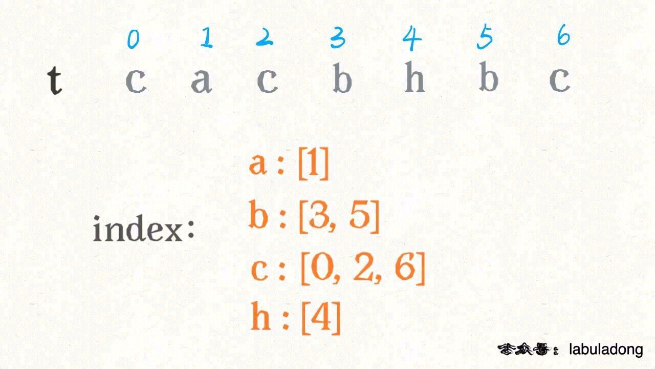

    按照之前的解法，我们需要 `j` 线性前进扫描字符 “c”，但借助 `index` 中记录的信息，**可以二分搜索 `index[c]` 中比 j 大的那个索引**，在上图的例子中，就是在 `[0,2,6]` 中搜索比 4 大的那个索引。

    如何用二分查找计算那个恰好比 4 大的索引呢？答案是，寻找左侧边界的二分搜索就可以做到。

​		对于搜索**左侧边界**的二分查找，有一个特殊性质：

​		当 `val` 不存在时，得到的索引恰好是比 `val` 大的最小元素索引

```java
    //二分法
    public boolean isSubsequence(String s, String t) {
        int m = s.length(),n = t.length();
        ArrayList<Integer>[] index = new ArrayList[256];
        //对t进行处理
        //按256个序列，将对应字符的索引按顺序依次加入
        for(int i=0;i<n;i++){
            char c = t.charAt(i);
            if(index[c]==null){
                index[c] = new ArrayList<>();
            }
            index[c].add(i);
        }

        //t的指针
        //当 val 不存在时，得到的索引恰好是比 val 大的最小元素索引。
        int j = 0;
        for(int i = 0;i < m;i++){
            char c = s.charAt(i);
            //就没有字符
            if(index[c]==null) return false;
            //pos是index[c]区间中的位置
            int pos = left_bound(index[c],j);
            //二分区间上没有字符c 比如[0,1,3]上找4
            if(pos==index[c].size()) return false;
            //在t中的位置
            j = index[c].get(pos) + 1;
        }

        return true;
    }

    //返回左边tar
    public int left_bound(ArrayList<Integer> arr,int tar){
        int low = 0,high = arr.size();
        int idx = 0;
        while(low < high){
            int mid = low + (high-low)/2;
            if(arr.get(mid) < tar) low = mid + 1;
            else high = mid;
        }
        return low;
    }
```

-   自己写的更好理解的方式（HashMap + 二分）

```java
    public boolean isSubsequence(String s, String t) {
        if(s.length()==0 ) return true;
        if(t.length()==0 ) return false;


        HashMap<Character,ArrayList<Integer>> map = new HashMap<>();

        //把t对应的入map
        for(int i = 0;i < t.length();i++){
            char c = t.charAt(i);
            if(map.containsKey(c)){
                map.get(c).add(i);
            }else{
                ArrayList<Integer> tmp = new ArrayList<>();
                tmp.add(i);
                map.put(c,tmp);
            }
        }

        System.out.println(map);

        //开始二分查找
        int pre = -1;
        for(int i = 0;i < s.length();i++){
            char c = s.charAt(i);
            if(!map.containsKey(c)) return false;

            pre = left_bound(map.get(c), pre);

            System.out.println("pre:" + pre);

            if(pre==-1) return false;

        }
        return true;
    }

    public int left_bound(ArrayList<Integer> idx, int target){
        int low = 0,high = idx.size()-1;

        while(low<=high){
            int mid = low + (high-low)/2;
            if(idx.get(mid) < target){
                low = mid + 1;
            }else if(idx.get(mid) > target){
                high = mid - 1;
            }else{
                //在左边界的基础上进行了修改
                //当相等的时候，更新low
                //"aaaaaa"
                //"bbaaaa"
                low = mid + 1;
            }
        }

        if(low >= idx.size()) return -1;

        return idx.get(low);
    }
```


### -双指针

#### [剑指 Offer 58 - I. 翻转单词顺序](https://leetcode-cn.com/problems/fan-zhuan-dan-ci-shun-xu-lcof/)

- 倒着遍历字符串，确认每个单词的左右边界（双指针），加入Res

  还要注意多个空格的问题

  ```java
      public String reverseWords(String s) {
          //先去掉多余的空格
          s = s.trim();
          int L = s.length()-1,R = L;
          StringBuilder res = new StringBuilder();
          while(L >= 0){
              //找左边界
              while(L>=0 && s.charAt(L)!=' '){
                  L--;
              }
              //添加单词
              res.append(s.substring(L+1,R+1)+" ");
              //跳过空格
              while(L>=0 && s.charAt(L)==' '){
                  L--;
              }
              R= L;// R 指向下个单词的尾字符
          }
          return res.toString().trim();
      }
  
  ```

- 利用系统库

  ```java
  //利用系统库
      public String reverseWords(String s) {
          String[] s1 = s.trim().split(" ");
          StringBuilder res = new StringBuilder();
          for(int i = s1.length-1; i>=0 ;i--){
              //查看是否是空格
              //因为会有多个空格！
              if(s1[i].equals("")) continue;
              res.append(s1[i]+" ");
          }
          return res.toString().trim();
      }
  ```

#### **[剑指 Offer 58 - II. 左旋转字符串](https://leetcode-cn.com/problems/zuo-xuan-zhuan-zi-fu-chuan-lcof/)

>   取余操作给忘了
>
>   //访问顺序依次赋值到答案中，利用取余实现

```java
    //暴力
    public String reverseLeftWords(String s, int n) {
        StringBuilder tmp = new StringBuilder();
        StringBuilder res = new StringBuilder();
        char[] cs = s.toCharArray();
        for(int i = 0;i < cs.length; i++){
            if(i < n){
                tmp.append(cs[i]);
            }
            else{
                res.append(cs[i]);
            }
        }
        res.append(tmp);
        return res.toString();

    }

    //字符串切片
    public String reverseLeftWords(String s, int n) {
        return s.substring(n,s.length())+ s.substring(0,n);
    }

    //空间优化
    public String reverseLeftWords(String s, int n) {
        StringBuilder res = new StringBuilder();
        for(int i = n; i < s.length(); i++)
            res.append(s.charAt(i));
        for(int i = 0; i < n; i++)
            res.append(s.charAt(i));
        return res.toString();
    }

    //取余操作简化代码
	////访问顺序依次赋值到答案中，利用取余实现
    public String reverseLeftWords(String s, int n) {
        StringBuilder res = new StringBuilder();
        for(int i = n; i < n + s.length(); i++)
            res.append(s.charAt(i % s.length()));
        return res.toString();
    }
```

#### [剑指 Offer 57 - II. 和为s的连续正数序列](https://leetcode-cn.com/problems/he-wei-sde-lian-xu-zheng-shu-xu-lie-lcof/)

- 求和公式+求根公式

  

  ```java
      //求和公式法
      //i<j 且j为整数
      public int[][] findContinuousSequence(int target) {
           int i = 1;
           //j为数组中最大的数,要保留小数
           double j = 2.0;
           List<int []> res = new ArrayList<>();
           //注意条件，不是i < target
           while(i < j){
               j = (-1 + Math.sqrt(1+4*(2*target + (long)i*i-i)))/2;
               if(i < j && j == (int)j){
                   int[] ans = new int[(int)j-i+1];
                   //注意此处的写法
                   for(int k = i;k <= (int)j;k++){
                       ans[k-i] = k;
                   }
                   res.add(ans);
               }
               i++;
           }
           return res.toArray(new int[0][]);
      }
  ```

- 滑动窗口：最大的特点是只能向右滑（双指针）

  ```java
      //滑动窗口
      //左边界，右边界，只往右边滑，而不是来回滑
      //滑动窗口只有 右边界向右移动（扩大窗口） 和 左边界向右移动（缩小窗口）
      //时间复杂度：只向右滑，O(N)
      public int[][] findContinuousSequence(int target) {
          int l = 1,r = 2;
          int sum = l + r;
          List<int []> res = new ArrayList<>();
          while(l < r){
              if(sum==target){
                  int[] ans = new int[r-l+1];
                  for(int k = l;k <= r;k++){
                      ans[k-l] = k;
                  }
                  res.add(ans);
              }
              if(sum >= target){
                  sum = sum - l;
                  l++;
              }else{
                  r++;
                  sum = sum + r;
              }
          } 
          return res.toArray(new int[0][]);
      }
  ```

  ```java
      public int[][] findContinuousSequence(int target) {
          List<int[]> res = new ArrayList<>();
          int left = 1,right = 1;
          int sum = 0;
  
          while(left <= target/2){
              int c = right;
              right++;
  
              sum+=c;
  
              while(sum >= target){
                  if(sum==target){
                      int[] ans = new int[c-left+1];
                      for(int k = left;k <= c;k++){
                          ans[k-left] = k;
                  }
                  res.add(ans);
                  }
                  int d = left;
                  left++;
                  sum = sum-d;
              }
          }
  
          return res.toArray(new int[0][]);
      }
  ```
  
  自己写的，更容易理解吧~
  
  ```java
      public int[][] findContinuousSequence(int target) {
          //滑动窗口
          int low = 1,high = 1;
          int sum = 1;
          ArrayList<int[]> res = new ArrayList<>();
  
          while(high <= (target/2 + 1) ){
              if(sum < target){
                  high++;
                  sum = sum + high;
              }else if(sum > target){
                  sum = sum -low;
                  low++;
              }else{
                  int[] tmp = new int[high-low+1];
                  for(int i = low;i<=high;i++) {
                      tmp[i - low] = i;
                  }
                  res.add(tmp);
                  high++;
                  sum = sum + high;
              }
          }
  
          return res.toArray(new int[res.size()][]);
      }
  ```
  
  


### - 链表

总结：栈，双指针，递归

#### **[剑指 Offer 24. 反转链表](https://leetcode-cn.com/problems/fan-zhuan-lian-biao-lcof/)

**注意迭代的非递归的方式！**还有非递归的方式(要明确递归函数的定义 + 按base case往回推一个通常的情况)

- 双指针（迭代）

  断成两个链，插入排序，链1是反转好的，链2的头要插入链1

  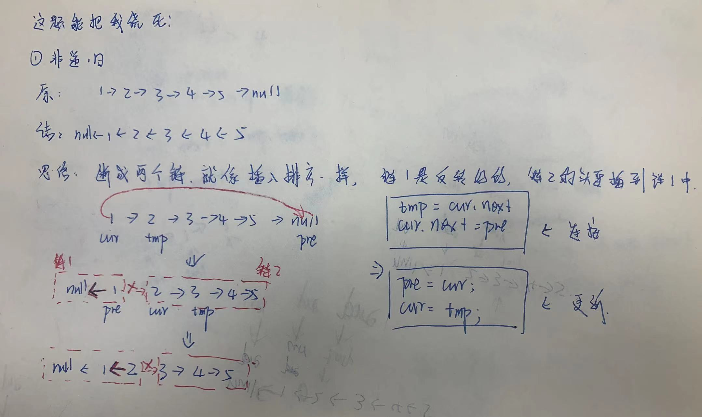

  ```java
  class Solution {
      //非递归
      public ListNode reverseList(ListNode head) {
          ListNode pre = null, cur = head, tmp = null;
          while(cur!=null){
              tmp = cur.next;
              //无需加这个判断，否则1还是指向了2,1应该指向为null
              // if(pre!=null){
              cur.next = pre;
              // }
              pre = cur;
              cur = tmp;
          }
  
          return pre;
      }
  }
  ```

- **递归**

  1） 如果一个问题 A 可以分解为若干子问题 B、C、D，**你可以假设子问题 B、C、D 已经解决，在此基础上思考如何解决问题 A*

  2） 所有的递归问题都可以用递推公式来表示

  

  **example**1

  - 问题：逆序打印一个数组
  - 递推公式：

  ```reasonml
  假设令F(n)=逆序遍历长度为n的数组
  那么F(n)= 打印数组中下标为n的元素 + F(n-1)
  ```

  - 终止条件：

  ```kotlin
  if (n <0) return ;
  ```

  - 递归代码：

  ```reasonml
  public void Print(int[] nums,int n){
      if(n<0) return;
      System.out.println(nums[n]);
      Print(nums,n-1);
  }
  ```

  **example2**

  - 问题：二叉树的先序遍历
  - 递推公式：

  ```reasonml
  令F(Root)为问题:遍历以Root为根节点的二叉树，
  令F(Root.left)为问题:遍历以F(Root.left)为根节点的二叉树
  令F(Root.right)为问题:遍历以F(Root.right)为根节点的二叉树
  那么其递推公式为：
  F(Root)=遍历Root节点+F(Root.left)+F(Root.right)
  ```

  - 递归代码：

  ```reasonml
  public void preOrder(TreeNode node){
      if(node==null) return;
      System.out.println(node.val);
      preOrder(node.left);
      preOrder(node.righr);
  }
  ```

  **example3**(此题)

  - 问题：单向链表的反转
  - 递推公式：

  ```reasonml
  令F(node)为问题:反转以node为头节点的单向链表；
  一般，我们需要考虑F(n)和F(n-1)的关系，那么这里，如果n代表以node为头节点的单向链表，那么n-1就代表以node.next为头节点的单向链表.
  所以，我们令F(node.next)为问题：反转以node.next为头节点的单向链表；
  那么，F(node)和F(node.next)之间的关系是？这里我们来简单画个图，假设我们反转3个节点的链表：
  1 -> 2 -> 3
  那么，F(node=1)=F(node=2)+?
  
  这里假设子问题F(node=2)已经解决，那么我们如何解决F(node=1)
  
  很明显，我们需要反转node=2和node=1， 即 node.next.next=node; 同时 node.next=null;
  所以，这个问题就可以是：F(node=1)=F(node=2)+ 反转node=2和node=1
  ```

  - 递归代码：

      明确递归函数的定义：反转一个以head为头的链表，返回值是反转后的链表的头
  
      思考一个中间过程：
  
      ```tex
      起始：
      1->2->3->4->5->null
      base case:
      1->2->3 ->4<-5
      中间状态：
      1->2-> 3<-4<-5
      则head = 2, head.next.next = head, head.next = null;
      => 1-> 2<-3<-4<-5
      
      注意：改变链接，返回的是node而不是head
      ```
  
      
      
      
  
  ```java
  //递归
  //1. 返回值：反转后链表的头
  //2. 递推关系：head是当前节点，node是除head以外反转好的子链的头（不再是head.next），试着1->2->3->4走下就明白了
  //head.next.next = head,head.next=null
  //3. base case: head==null || head.next==null(没有办法链接了)
      public ListNode reverseList(ListNode head){
          //base case
          if(head==null || head.next==null){
              return head;
          }
  
          //递推关系
          ListNode node = reverseList(head.next);
  
          //反转操作
          head.next.next = head;
          head.next = null;
  		
          //返回值
          return node;
      }
  ```

#### [剑指 Offer 06. 从尾到头打印链表](https://leetcode-cn.com/problems/cong-wei-dao-tou-da-yin-lian-biao-lcof/)

- 先反转链表 再打印（太麻烦了）

  ```java
      //先反转链表，再打印
      public int[] reversePrint(ListNode head) {
          List<Integer> list = new ArrayList<Integer>();
          ListNode res = reverseList(head);
          for(ListNode cur = res;cur!=null;cur = cur.next){
              list.add(cur.val);
          }
  
          //可变数组转数组
          int[] arrs = new int[list.size()];
          for(int i = 0;i < list.size();i++){
              arrs[i] = list.get(i);
          }
          return arrs;
  
      }
  
      public ListNode reverseList(ListNode head){
          if(head ==null ||head.next==null)
              return head;
          
          ListNode node = reverseList(head.next);
          head.next.next = head;
          head.next = null;
  
          return node;
      }
  ```

- 直接递归打印(分解问题，注意递归条件)

  ```java
      //递归
      List<Integer> tmp = new ArrayList<Integer>();
      public int[] reversePrint(ListNode head) {
          recur(head);
          int[] arrs = new int[tmp.size()];
          for(int i = 0;i < tmp.size();i++){
              arrs[i] = tmp.get(i);
          }
          return arrs;
      }
  
      public void recur(ListNode head){
          if(head==null)
              return;
          recur(head.next);
          tmp.add(head.val);
      }
  ```

- 辅助栈

  ```java
  //链表特点： 只能从前至后访问每个节点。
  //题目要求： 倒序输出节点值。
  //这种 先入后出 的需求可以借助 栈 来实现。
  ```

  ```java
      public int[] reversePrint(ListNode head){
          LinkedList<Integer> stack = new LinkedList<Integer>();
          ListNode cur = head;
          while(cur!=null){
              stack.addLast(cur.val);
              cur = cur.next;
          }
  
          int[] res = new int[stack.size()];
          for(int i=0;i<res.length;i++){
              res[i] = stack.removeLast();
          }
          return res;
      }
  ```

#### [剑指 Offer 22. 链表中倒数第k个节点](https://leetcode-cn.com/problems/lian-biao-zhong-dao-shu-di-kge-jie-dian-lcof/)

- 辅助栈

  ```java
  //辅助栈
      public ListNode getKthFromEnd(ListNode head, int k) {
          LinkedList<ListNode> stack = new LinkedList<ListNode>();
          while(head!=null){
              stack.addLast(head);
              head = head.next;
          }
  
          ListNode newhead = head;
          //因为长度会变,所以该值要放在外面
          int length = stack.size();
          for(int i = stack.size()-1; i >= 0;i--){
              int index = length-i;
              // System.out.println("i"+i);
              // System.out.println("index"+index);
              if(length-i==k){
                  return stack.removeLast();
              }else{
                  stack.removeLast();
              }
          }
  
          return new ListNode();
      }
  ```

- 快慢指针

  ```java
      //双指针
      public ListNode getKthFromEnd(ListNode head, int k) {
          ListNode slow = head,fast = head;
          //快指针先走K步
          for(int i = 0; i<k;i++){
              fast = fast.next;
          }
          //快慢指针一起走，直到快指针为NULL
          while(fast!=null){
              slow = slow.next;
              fast = fast.next;
          }
          return slow;
      }
  ```

#### [剑指 Offer 25. 合并两个排序的链表](https://leetcode-cn.com/problems/he-bing-liang-ge-pai-xu-de-lian-biao-lcof/)

- 迭代，伪链头

  ```java
  
     public ListNode mergeTwoLists(ListNode l1, ListNode l2) {
          //创建伪代码头,否则无法用next
          ListNode dum = new ListNode(0);
          ListNode cur = dum;
          while(l1!=null && l2!=null){
              if(l1.val <= l2.val){
                  cur.next = l1;
                  l1 = l1.next;
              }else{
                  cur.next = l2;
                  l2 = l2.next;
              }
              //注意新链表的当前指针也要移动
              cur = cur.next;
          }
          if(l1!=null){
              cur.next = l1;
          }
  
          if(l2!=null){
              cur.next = l2;
          }
  
          return dum.next;
      }
  ```

- 递归(不是特别好理解)

  ```java
      //递归,不是很好理解
  // 特判：如果有一个链表为空，返回另一个链表
  // 如果l1节点值比l2小，下一个节点应该是l1，应该return l1，在return之前，指定l1的下一个节点应该是l1.next和l2俩链表的合并后的头结点
  // 如果l1节点值比l2大，下一个节点应该是l2，应该return l2，在return之前，指定l2的下一个节点应该是l1和l2.next俩链表的合并后的头结点
  
  //递归
  //1. 返回值：合并后的链的尾
  //2. 递推关系：
  //- p1 < p2: 返回p1; p1.next = p1.next和p2的合并的头
  //- p2 < p1: 返回p2; p2.next = p2.next和p1的合并的头
  //3. base case: 
  //- p1==null return p2
  //- p2==null return p1
      public ListNode mergeTwoLists(ListNode l1, ListNode l2) {
          if(l1==null ||l2==null){
              return l1!=null?l1:l2;
          }
  
          if(l1.val <= l2.val){
              l1.next = mergeTwoLists(l1.next,l2);
              return l1;
          }else{
              l2.next = mergeTwoLists(l2.next,l1);
              return l2;
          }
  
      }
  ```

#### [剑指 Offer 18. 删除链表的节点](https://leetcode-cn.com/problems/shan-chu-lian-biao-de-jie-dian-lcof/)

```java
    public ListNode deleteNode(ListNode head, int val) {
        //考虑可能会删除第一个节点，所以用了伪头
        ListNode dum = new ListNode(0);
        dum.next = head;
        ListNode cur = head,parent = dum;
        while(cur!=null){
            if(cur.val!=val){
                parent.next = cur;
                cur = cur.next;
                parent = parent.next;
            }else{
                parent.next = cur.next;
                cur = null;
                break;
            }
        }
        return dum.next;
    }
```

#### [剑指 Offer 52. 两个链表的第一个公共节点](https://leetcode-cn.com/problems/liang-ge-lian-biao-de-di-yi-ge-gong-gong-jie-dian-lcof/)

- 哈希表法

  ```java
      // 哈希集合法
      // 首先遍历链表 \textit{headA}headA，并将链表 \textit{headA}headA 中的每个节点加入哈希集合中。然后遍历链表 \textit{headB}headB，对于遍历到的每个节点，判断该节点是否在哈希集合中
      public ListNode getIntersectionNode(ListNode headA, ListNode headB) {
          Set<ListNode> tmp = new HashSet<ListNode>();
          ListNode p1 = headA, p2 = headB;
          while(p1!=null){
              tmp.add(p1);
              p1 = p1.next;
          }
          while(p2!=null){
              if(tmp.contains(p2)){
                  return p2;
              }else{
                  p2 = p2.next;
              }
          }
          return null;
      }
  ```

- 双指针相遇法

  ```java
  //双指针浪漫相遇法
      //两个链表长度分别为L1+C、L2+C， C为公共部分的长度
      // 第一个人走了L1+C步后，回到第二个人起点走L2步；
      // 第2个人走了L2+C步后，回到第一个人起点走L1步。 
      // 当两个人走的步数都为L1+L2+C时就两个人就相爱了
      public ListNode getIntersectionNode(ListNode headA,ListNode headB){
          //处理特殊情况
          if(headA==null || headB==null){
              return null;
          }
  
          ListNode p1 = headA, p2 = headB;
          while(p1!=p2){
              //注意条件，如果是 p1.next!=null，就相当于跳了一步
              if(p1!=null){
                  p1 = p1.next;
              }else{
                  p1 = headB;
              }
  
              if(p2!=null){
                  p2 = p2.next;
              }else{
                  p2 = headA;
              }
  
          }
  
          return p1;
          
      }
  ```

#### [剑指 Offer 35. 复杂链表的复制](https://leetcode-cn.com/problems/fu-za-lian-biao-de-fu-zhi-lcof/)

- 普通链表的复制,同时说明问题难度

  ```java
      //普通链表的复制
      public Node copyList(Node head) {
          Node dum = new Node(0);
          Node pre = dum;
          Node cur = head;
          while(cur!=null){
              Node node = new Node(cur.val);
              pre.next = node;
              //random? 存在问题
              pre = node;
              cur = cur.next;
          }
  
          return dum.next;
      }
  ```

- 哈希表法

  ```java
  //利用哈希表
      //思路：先利用哈希表创建新节点 + 保留old,new之间的关系
      //遍历old的关系，同时赋值给new
      时间复杂度：O(N)
      空间复杂度：O(N)，哈希表
      public Node copyRandomList(Node head) {
          if(head==null)
              return null;
  
          Map<Node,Node> nodeMap = new HashMap<Node,Node>();
          Node cur = head;
  
          //先利用哈希表创建新节点 + 保留old,new之间的关系
          while(cur!=null){
              Node node = new Node(cur.val);
              nodeMap.put(cur, node);
              cur = cur.next;
          }
  
          //遍历old
          cur = head;
          Node newHead =  nodeMap.get(head);
          while(cur!=null){
              Node newCur = nodeMap.get(cur);
              //注意此处是nodeMap.get(cur.next),链向的是新空间，而不是原来的引用
              newCur.next = nodeMap.get(cur.next);
              newCur.random  = nodeMap.get(cur.random);
              cur = cur.next;
          }
          return newHead;
      }
  ```

-   自己写的更好理解的hashmap解法

    ```java
        public Node copyRandomList(Node head) {
            Node p1 = head;
            //(old,new)
            HashMap<Node,Node> map = new HashMap<>(); 
    
            while(p1!=null){
                Node cur = new Node(p1.val);
                map.put(p1,cur);
                p1 = p1.next;
            }
    
            p1 = head;
            while(p1!=null){
                map.get(p1).next = map.get(p1.next);
                map.get(p1).random = map.get(p1.random);
                p1 = p1.next;
            }
    
            return map.get(head);
        }
    ```

    

- 混合链表

  ```java
  //链接链表的方式
      //思路：分三个阶段，第一阶段，创建空间，并让新节点跟着老节点后面，形成合成链表
      //第二阶段，链接新节点的random
      //第三阶段，分割新老链
      //时间复杂度：O(N)
      //空间复杂度：O(1)
      public Node copyRandomList(Node head) {
          if(head==null)
              return null;
  
          //创建空间，形成合成链表
          Node cur = head;
          while(cur!=null){
              Node tmp = new Node(cur.val);
              tmp.next = cur.next;
              cur.next = tmp;
              cur = tmp.next;
          }
  
          //链接random
          cur = head;
          while(cur!=null){
              //注意条件的设置
              if(cur.random!=null){
                  cur.next.random = cur.random.next;
              }
              cur = cur.next.next;
          }
  
          //拆分链表
          cur = head.next;
          Node pre = head, res = head.next;
          while(cur.next!=null){
              pre.next = pre.next.next;
              cur.next = cur.next.next;
              pre = pre.next;
              cur = cur.next;
          }
          //单独处理原链表尾节点
          pre.next = null;
          return res;
      }
  ```

#### * [24. 两两交换链表中的节点](https://leetcode-cn.com/problems/swap-nodes-in-pairs/)

//只是因为这是先序

**注意递归：链表的递归多为自下往上，所以在想base case和模拟中间场景的时候需要从下面拿的返回值**

>   递归处要注意，两两交换，当1->2->4->3的时候，考虑1，而不是2

- 递归（典型的递归）

  

  ```java
      //递归解法:
      //1. 返回值：交换完成后子链表的头
      //2. 递推关系：p1(head),p2(head.next)。p1连p2后面交换完成的链表的值，p2连p1
      //3. base case : 当p1或者p2为空的时候停止递归（也就是head、head.next）
      public ListNode swapPairs(ListNode head) {
          if(head==null || head.next==null){
              return head;
          }
  
          ListNode next = head.next;
          head.next = swapPairs(next.next);
          next.next = head;
  
          return next;
          
      }
  ```

- 非递归

  注意：

  在迭代的时候，每次处理两个节点，于是第一轮 a 指向 1，b 指向 2。
  第二轮的时候 a 指向 3，b 指向 4。第三轮的时候 a 指向 5，b 指向 6。

  我们通过 a.next = b.next，以及b.next=a就把两个指针的位置反转了，于是1->2就变成2->1。

  但这里有一个细节需要处理，当我们第二轮迭代的时候，a 指向 3，b 指向 4。按照题目要求，最终应该是2->1->4->3。**也就是节点 1 需要跟节点 4 串起来**，只有两个指针就没法弄了，所以需要第三个指针 tmp，用来记录上一轮 a 的位置，然后下一轮迭代的时候，将原先的 a(也就是节点 1)指向 4。

  ```java
      public ListNode swapPairs(ListNode head) {
          if(head==null) return null;
  
          if(head.next==null) return head;
  
          //假头
          ListNode dummy = new ListNode(-1);
          dummy.next = head;
          
          ListNode tmp = dummy;
  
          while(tmp.next!=null && tmp.next.next!=null){
              ListNode start = tmp.next;
              ListNode end = tmp.next.next;
  
              //链接上一轮的a和这一轮的最终的头
              tmp.next = end;
  
              //交换
              start.next = end.next;
              end.next = start;
  
              //tmp记录a的上一轮的位置
              tmp = start;
          }
          return dummy.next;
      }
  ```

-   自己写了一遍非递归

    ```java
        public ListNode swapPairs(ListNode head) {
            if(head==null) return head;
            ListNode cur = head;
            ListNode tmp = null,pre = null;
            ListNode x = head.next;
    
            while(cur!=null && cur.next!=null){
                if(pre!=null){
                    pre.next = cur.next;
                }
                
                tmp = cur.next.next;
                cur.next.next = cur;
                cur.next = tmp;
                pre = cur; 
                cur = cur.next;
            }
    
            return x==null? head:x;
        }
    ```


-   后序的做法

    ```java
    public ListNode swapPairs(ListNode head) {
            if(head == null || head.next == null) return head;
            ListNode tail = head.next.next;
            ListNode cur = head;
            ListNode pre = null;
            while(cur!=tail){
                ListNode tmp = cur.next;
                cur.next = pre;
                pre = cur;
                cur = tmp;
            }
            head.next = swapPairs(tail);
            return pre;
        }
    ```

    


#### *[234. 回文链表](https://leetcode-cn.com/problems/palindrome-linked-list/)

注意优化后的方式。先找到中点，在把链表切成两半；再把后半部分反转；比较是否相等。

得保证形成的是单链表，且考虑奇数和偶数，并明确逆转的头。应该是mid.next

- 好麻烦,但好得是自己写的

    就是对比反转前后的序列化字符是否相同

    ```java
        public boolean isPalindrome(ListNode head) {
            StringBuilder data1 = new StringBuilder();
            StringBuilder data2 = new StringBuilder();
    
            travel(head,data1);
            ListNode newHead = reserve(head);
            travel(newHead,data2);
    
            System.out.println(data1);
            System.out.println(data2);
    
            if(data1.toString().equals(data2.toString())) return true;
            else return false;
        }
    
        //返回逆转以后的头
        public ListNode reserve(ListNode head){
            if(head==null || head.next==null){
                return head;
            }
    
            ListNode node = reserve(head.next);
            head.next.next = head;
            head.next = null;
            return node;
    
        }
    
        public void travel(ListNode head,StringBuilder str){
            if(head==null) return;
    
            str.append(head.val);
            travel(head.next,str);
            // while(head!=null){
            //     str.append(head.val);
            //     head = head.next;
            // }
        }
    ```


emmmm，笑死了，怎么又写了一遍

```java
    public boolean isPalindrome(ListNode head) {
        if(head==null || head.next==null) return true;
        StringBuilder s1 = new StringBuilder();
        StringBuilder s2 = new StringBuilder();
        int cnt = 0;

        ListNode slow = head, high = head;
        while(high!=null && high.next!=null){
            s1.append(slow.val+"");
            slow = slow.next;
            high = high.next.next;
            cnt++;
        }

        // slow = slow.next;
        // cnt++;
        while(slow!=null){
            s2.append(slow.val+"");
            slow = slow.next;
            cnt++;
        }

        // System.out.println(cnt);
        // System.out.println("s1:"+s1);
        // System.out.println("s2:"+s2);
        // System.out.println(s2.reverse().toString().substring(0,s2.length()-1));
        if(cnt%2==0){
            return s1.toString().equals(s2.reverse().toString());
        }

        else{
            return s1.toString().equals(s2.reverse().toString().substring(0,s2.length()-1));
        }
    }
```


- 迭代

```java
    public boolean isPalindrome(ListNode head) {
        //先找到中点，在把链表切成两半；再把后半部分反转；比较是否相等

        //base case
        if(head==null || head.next==null) return true;

        //找中点
        ListNode slow = head, fast = head;
        while(fast.next!=null && fast.next.next!=null){
            slow = slow.next;
            fast = fast.next.next;
        }

        //反转
        //得保证形成的是单链表，不然中间就得断开
        slow.next = reverse(slow.next);

        //比较
        //1. 当为奇数的时候
        // 前半段长为3，后半段长为2，比较到2的时候，完全相等就可以确定是回文了，不用管前半段的最后一个
        //2. 当为偶数的时候
        // 前半段长为2，后半段长为2，比较就可以
        slow = slow.next;
        while(slow!=null){
            if(head.val!=slow.val){
                return false;
            }
            head = head.next;
            slow = slow.next;
        }
        return true;
    }

    //反转链表函数
    public ListNode reverse(ListNode head){
        if(head==null ||head.next==null){
            return head;
        }

        ListNode node = reverse(head.next);

        head.next.next = head;
        head.next = null;

        return node;
    }
```

- 递归

```java
//模拟双指针实现回文
//实际上就是把链表节点放入一个栈，然后再拿出来，这时候元素顺序就是反的，只不过我们利用的是递归函数的堆栈而已
//左侧
//1. 返回值：该串的左右指针是否相等
//2. 递推：res = 之前的结果res & 当前左右指针是否相等；left = left.next;
//3. base case：right==null

ListNode left;

boolean isPalindrome(ListNode head){
	left = head;
    return traverse(head);
}

boolean traverse(ListNode right){
	if(right==null) return true;
    
    boolean res = traverse(right.next);
    //后序
    res = res && (left.val==right.val);
    left = left.next;
    
    return res;
}
```

```java
    
//执行效率很慢
ListNode left;
    boolean res = true;
    public boolean isPalindrome(ListNode head) {
        left = head;
        help(head);
        return res;
    }

    public void help(ListNode right){
        if(right == null) return;

        help(right.next);

        System.out.println(left.val+"\t"+right.val);
        if(right.val!=left.val){
            res = false;
            return;
        }
        left = left.next;
    }
```


### -二叉树

#### [剑指 Offer 27. 二叉树的镜像](https://leetcode-cn.com/problems/er-cha-shu-de-jing-xiang-lcof/)

- 递归

  ```java
      public TreeNode mirrorTree(TreeNode root) {
          if(root==null) return null;
  
          //处理当前
          TreeNode tmp = mirrorTree(root.left);
          root.left = mirrorTree(root.right);
          root.right = tmp;
  
          return root;
      }
  ```

- 非递归（栈）

  ```java
      public TreeNode mirrorTree(TreeNode root) {
          //非递归，利用栈，中左右入栈
          //然后交换了左右孩子
  
          if(root==null) return null;
          Stack<TreeNode> stack = new Stack<TreeNode>();
          stack.add(root);
  
          while(!stack.isEmpty()){
              TreeNode cur = stack.pop();
              if(cur.left!=null) stack.add(cur.left);
              if(cur.right!=null) stack.add(cur.right);
  
              TreeNode tmp = cur.left;
              cur.left = cur.right;
              cur.right = tmp;
          }
  
          return root;
          
      }
  ```

#### [剑指 Offer 55 - I. 二叉树的深度](https://leetcode-cn.com/problems/er-cha-shu-de-shen-du-lcof/)

- 根据后序遍历

  ```java
      //根据后序遍历
      public int maxDepth(TreeNode root) {
          if(root==null) return 0;
  
          int left = maxDepth(root.left);
          int right = maxDepth(root.right);
          return Math.max(left,right) + 1;
      }
  ```

- 回溯

  ```java
      //1，遍历二叉树 + 变量=》回溯
      //先序遍历
      int depth;
      int res;
      public int maxDepth(TreeNode root) {
          depth = 0;
          res = 0;
          if(root==null) return 0;
          
          recur(root);
          return res;
      }
  
      public void recur(TreeNode root){
          //base case 叶子节点
          if(root==null){
              res = Math.max(res,depth);
              return;
          }
  
          //当前节点
          depth++;
          recur(root.left);
          recur(root.right);
          depth--;
      }
  ```

  -   三刷写的

  ```java
      //回溯法
      int max = Integer.MIN_VALUE;
      int high = 0;
      public int maxDepth(TreeNode root) {
          recur(root);
          return max;
      }
  
      public void recur(TreeNode root){
          if(root==null){
              if(max < high){
                  max = high;
              }
              return;
          }
  
          high++;
          recur(root.left);
          recur(root.right);
          high--;
      }
  ```

  

- 根据找信息

  ```java
      // 找信息的方式
      // 左右两树的层数
      public static int max;  //在此初始化无用
      public int maxDepth(TreeNode root) {
          if(root==null) return 0;
          //注意使用前对全局变量的初始化
          max = 0;
          return maxDepthRecur(root,1) + 1;
      }
      
      public int maxDepthRecur(TreeNode root, int height){
          int left = 0;
          if(root.left!=null){
              left = maxDepthRecur(root.left,height + 1);
              max = Math.max(left, height);
          }
          int right = 0;
          if(root.right!=null){
              right = maxDepthRecur(root.right,height + 1);
              max = Math.max(right ,height);
          }
          return max;
      }
  ```

- 根据层次遍历(队列)

  ```java
      //根据层次遍历
      public int maxDepth(TreeNode root) {
          if(root==null) return 0;
          List<TreeNode> parent = new LinkedList<>(); //存当前层的节点
          List<TreeNode> child; //存上一层节点的所有的孩子
          int res = 0;
          parent.add(root);
          //控制有多少层，从上到下
          while(!parent.isEmpty()){
              //child初始化的位置很重要...，每一层都是一个新的队列
              child = new LinkedList<>();
              //控制当前层的每个节点，从左往右
              for(TreeNode cur : parent){
                  if(cur.left!=null) child.add(cur.left);
                  if(cur.right!=null) child.add(cur.right);
                  
              }
              //巧妙
              parent = child;
              res ++;
          }
          return res;
      
  ```

  -   三刷写的

  ```java
      //层序遍历
      public int maxDepth(TreeNode root) {
          Deque<TreeNode> q = new LinkedList<>();
          if(root!=null) q.offer(root);
          int high = 0;
          while(!q.isEmpty()){
              int len = q.size();
              for(int i = 0;i < len;i++){
                  TreeNode cur = q.poll();
                  if(cur.left!=null) q.offer(cur.left);
                  if(cur.right!=null) q.offer(cur.right);
              }
              high++;
          }
          return high;
      }
  ```

  

- 错误遍历

  ```java
  
      //错误代码
      public int maxDepthRecur(TreeNode root, int height){
          //实际max的值从来都没有变化过，只会返回0，应该在后序进行比较，因为max写在这一句会递归进行
          //max没有+1，当前节点的高度应该等于max(left+right) + 1,且只加一次
          if(root.left!=null){
              left = maxDepthRecur(root.left,height + 1);
              max = Math.max(left, max);
          }
          if(root.right!=null){
              right = maxDepthRecur(root.right,height + 1);
              max = Math.max(right ,max);
          }
          return max;
      }
  ```

#### [剑指 Offer 28. 对称的二叉树](https://leetcode-cn.com/problems/dui-cheng-de-er-cha-shu-lcof/)


- 递归

  **(注意传递到是 L, R)**

  ```java
      // 递归方法二
      // 罗列：
      //         L.val=R.val ：即此两对称节点值相等。
      //         L.left.val = R.right.valL.left.val=R.right.val
      //         L.right.val = R.left.valL.right.val=R.left.val 
      // 信息：
      //         L,R 其实和递归方法一一样
  
  
      //递归方法一
      public boolean isSymmetric(TreeNode root) {
          if(root==null) return true;
          return recur(root.left,root.right);
      }
  
      public boolean recur(TreeNode L,TreeNode R){
          //黑盒判断当前左右节点，并处理特殊情况
          if(L==null && R == null) return true;
          
          //剪枝
          if(L==null || R==null || L.val!=R.val) return false;
  
          //返回最基础的类型
          return recur(L.left,R.right) && recur(L.right,R.left); 
      }
  ```

  - 复杂度分析

    

- 镜像：但要注意只能比较先序和后序，中序不可以

  ```java
  //先镜像，再对比先序或者后序，中序不可以
      //[1,2,2,2,null,2]中序镜像前后一致
      public static List<Integer> pre1,pre2;
  
      public boolean isSymmetric(TreeNode root) {
          if(root==null) return true;
          //初始化
          pre1 = new ArrayList<>();
          pre2 = new ArrayList<>();
  
          preOrderRecur(root,pre1);
          preOrderRecur(mirrorTree(root),pre2);
          System.out.println("pre1: " + pre1);
          System.out.println("pre2: " + pre2);
          if(pre1.equals(pre2)){
              return true;
          }
          return false;   
      }
  
      public void preOrderRecur(TreeNode root,List<Integer> list){
          if(root==null){
              list.add(-1);
              return;
          }
  
          list.add(root.val);
          preOrderRecur(root.left,list);
          preOrderRecur(root.right,list);
          
      }
  
      public TreeNode mirrorTree(TreeNode root) {
          if(root==null) return null;
  
          //处理当前
          TreeNode tmp = mirrorTree(root.left);
          root.left = mirrorTree(root.right);
          root.right = tmp;
  
          return root;
      }
  ```
  
  
  
- 错误解法：左根右 = 右根左的遍历

  ```java
     //左根右 = 右根左的遍历
      //[1,2,2,2,null,2] 过不了,除了根节点，所有节点的val都一一样
  	//插入特殊值的情况下也不可以
      public static List<Integer> in1,in2;
  
      public boolean isSymmetric(TreeNode root) {
          if(root==null) return true;
          //初始化
          in1 = new ArrayList<>();
          in2 = new ArrayList<>();
  
          inOrder1Recur(root);
          inOrder2Recur(root);
          System.out.println("in1: " + in1);
          System.out.println("in2: " + in2);
          if(in1.equals(in2)){
              return true;
          }
          return false;
      }
  
      public void inOrder1Recur(TreeNode root){
          if(root==null) return;
          inOrder1Recur(root.left);
          in1.add(root.val);
          inOrder1Recur(root.right);
          
      }
  
      public void inOrder2Recur(TreeNode root){
          if(root==null) return;
          inOrder2Recur(root.right);
          in2.add(root.val);
          inOrder2Recur(root.left);
      }
  ```

#### [剑指 Offer 32 - II. 从上到下打印二叉树 II](https://leetcode-cn.com/problems/cong-shang-dao-xia-da-yin-er-cha-shu-ii-lcof/)

- 层次遍历

  ```java
      public List<List<Integer>> levelOrder(TreeNode root) {
          //层次遍历
          //可变二维数组
          List<List<Integer>> res = new ArrayList<>();
          //队列,存储某一层的所有节点
          LinkedList<TreeNode> queue = new LinkedList<>();  
          
          //先添加头结点
          if(root!=null) queue.add(root);
  
          //处理
          while(!queue.isEmpty()){
              //新建一个当前层的打印结果
              List<Integer> tmp = new ArrayList<>();
              //遍历当前层的节点
              for(int i = queue.size();i > 0;i--){
                  //先出队列
                  TreeNode node  = queue.poll();
                  tmp.add(node.val);
  
                  if(node.left!=null) queue.add(node.left);
                  if(node.right!=null) queue.add(node.right);
              }
              res.add(tmp);
          }
          return res;
      }
  ```

#### [面试题32 - I. 从上到下打印二叉树](https://leetcode-cn.com/problems/cong-shang-dao-xia-da-yin-er-cha-shu-lcof/)

```java
    public int[] levelOrder(TreeNode root) {
        List<Integer> res = new ArrayList<>();
        LinkedList<TreeNode> queue = new LinkedList<>();

        if(root!=null) queue.add(root);

        while(!queue.isEmpty()){
            for(int i = queue.size();i > 0;i--){
                TreeNode cur = queue.poll();
                res.add(cur.val);
                if(cur.left!=null) queue.add(cur.left);
                if(cur.right!=null) queue.add(cur.right);
            }
        }

        int[] res1 = new int[res.size()];
        for(int i=0;i<res.size();i++){
            res1[i] = res.get(i);
        }

        return res1;
    }
```

#### [剑指 Offer 32 - III. 从上到下打印二叉树 III](https://leetcode-cn.com/problems/cong-shang-dao-xia-da-yin-er-cha-shu-iii-lcof/)

- 错误解法

  ```java
      // 单队列会出错，因为队列，先进的会先处理，那么这一层和下一层的顺序就一样了
  	//所以要么queue变成双端队列，要么tmp变成双端队列（这个方便）
      public List<List<Integer>> levelOrder(TreeNode root) {
          List<List<Integer>> res = new ArrayList<>();
          //定义队列
          LinkedList<TreeNode> queue = new LinkedList<>();
          if(root!=null) queue.add(root);
  
          int level = 0;
          //while控制从上往下，for控制同一层从左往右
          while(!queue.isEmpty()){
              List<Integer> tmp = new ArrayList<>();  //存当前层的节点
              for(int i = queue.size();i>0;i--){
                  TreeNode cur = queue.poll();
                  tmp.add(cur.val);
                  //如果当前层是奇数，那么下一层的顺序是偶数的
                  if((level % 2)==1){
                      if(cur.left!=null) queue.add(cur.left);
                      if(cur.right!=null) queue.add(cur.right);
                  }else{
                      if(cur.right!=null) queue.add(cur.right);
                      if(cur.left!=null) queue.add(cur.left);
                  } 
              }
              level++;
              res.add(tmp);
          }
          return res;
      }
  ```

- 按照层数逆转列表

  ```java
      //tmp倒序
      public List<List<Integer>> levelOrder(TreeNode root) {
          List<List<Integer>> res = new ArrayList<>();
          //定义队列
          LinkedList<TreeNode> queue = new LinkedList<>();
          if(root!=null) queue.add(root);
  
          //while控制从上往下，for控制同一层从左往右
          while(!queue.isEmpty()){
              List<Integer> tmp = new ArrayList<>();  //存当前层的节点
              for(int i = queue.size();i>0;i--){
                  TreeNode cur = queue.poll();
                  tmp.add(cur.val);
                  if(cur.left!=null) queue.add(cur.left);
                  if(cur.right!=null) queue.add(cur.right);
              }
              //逆转列表
              if(res.size()%2==1) Collections.reverse(tmp);
              res.add(tmp);
          }
          return res;
      }
  ```

- 按照层数改变入队顺序

  ```java
       public List<List<Integer>> levelOrder(TreeNode root) {
          Queue<TreeNode> queue = new LinkedList<>();
          List<List<Integer>> res = new ArrayList<>();
          if(root != null) queue.add(root);
          while(!queue.isEmpty()) {
              LinkedList<Integer> tmp = new LinkedList<>();
              for(int i = queue.size(); i > 0; i--) {
                  TreeNode node = queue.poll();
                  if(res.size() % 2 == 0) tmp.add(node.val); // 偶数层 -> 队列尾部，正常
                  else tmp.addFirst(node.val); // 奇数层 -> 队列头部
                  if(node.left != null) queue.add(node.left);
                  if(node.right != null) queue.add(node.right);
              }
              res.add(tmp);
          }
          return res;
      }
  ```

#### *[剑指 Offer 55 - II. 平衡二叉树](https://leetcode-cn.com/problems/ping-heng-er-cha-shu-lcof/)

 **此树的深度** 等于 **左子树的深度** 与 **右子树的深度** 中的 **最大值** +1+1

后序遍历就不用递归套递归了

- 套路（罗列 + 信息）【后序？】

  ```java
      //平衡二叉树：针对每个子树，左右高度差不超过1
      //罗列：左树是平，右树是平，|左高-右高|<=1
      //信息：（递归，信息一致）（process收信息）
      // ​	左树：平？高？
      // ​	右树：平？高？
  
      public static class ReturnType{
          public boolean is;
          public int height;
  
          public ReturnType(boolean is, int height){
              this.is = is;
              this.height = height;
          }
      }
  
      public static ReturnType process(TreeNode node) {
  		if (node == null) {//base
  			return new ReturnType(true, 0);
  		}
  
          //黑盒
          ReturnType left = process(node.left);
          ReturnType right = process(node.right);
  
          int h = Math.max(left.height,right.height) + 1;
          boolean isB = left.is && right.is && Math.abs(left.height-right.height) <=1;
          return new ReturnType(isB, h);
      }
  
      public boolean isBalanced(TreeNode root) {
          return process(root).is;
      }
  ```

- 【先序遍历 + 判断深度 （从顶至底）】（递归套递归了）

  和判断子树一样都是递归套递归

  ```java
  //简写
  //为什么是先序：
  //abs(self.depth(root.left) - self.depth(root.right)) <= 1 ：判断 当前子树 是否是平衡树；
  //self.isBalanced(root.left) ：先序遍历递归，判断 当前子树的左子树 是否是平衡树；
  //self.isBalanced(root.right) ：先序遍历递归，判断 当前子树的右子树 是否是平衡树；
  
      public boolean isBalanced(TreeNode root) {
          if (root == null) return true;
          return Math.abs(depth(root.left) - depth(root.right)) <= 1 && isBalanced(root.left) && isBalanced(root.right);
      }
  
      private int depth(TreeNode root) {
          if(root==null) return 0;
          return Math.max(depth(root.left),depth(root.right)) + 1;
      }
  ```

  - 复杂度分析

    

- 【后序遍历 + 剪枝 （从底至顶）】（后序遍历的好处就是可以带着子节点的信息返回）

  ```java
      //后序遍历+减枝
      public boolean isBalanced(TreeNode root) {
          return recur(root)!= -1;
      }
  
      private int recur(TreeNode root) {
          if(root==null) return 0;
          int left = recur(root.left);
          if(left==-1) return -1;
          int right = recur(root.right);
          if(right==-1) return -1;
          return Math.abs(left-right) < 2? Math.max(left,right) + 1 : -1;
      }
  ```

  ```java
      boolean res = true;
      public boolean isBalanced(TreeNode root) {
          //利用高度进行判断
          help(root);
          return res;
      }
  
      public int help(TreeNode root){
          if(root==null) return 0;
          int left = help(root.left);
          if(left==-1) return -1;
  
          int right = help(root.right);
          if(right==-1) return -1;
  
          if(Math.abs(left-right) >= 2) {
              res = false;
              return -1;
          }
  
          return Math.max(left,right)+1;
      }
  ```
  
  
  
  - 复杂度分析
  
    时间复杂度 O(N)： N为树的节点数；最差情况下，需要递归遍历树的所有节点。
    空间复杂度 O(N)： 最差情况下（树退化为链表时），系统递归需要使用O(N) 的栈空间。

#### [剑指 Offer 54. 二叉搜索树的第k大节点](https://leetcode-cn.com/problems/er-cha-sou-suo-shu-de-di-kda-jie-dian-lcof/)

基于二叉搜索树的中序遍历递增，则逆中序递减

- 浪费空间

  ```java
      //直接利用逆中序遍历，用数组存储，返回结果
      List<Integer> res;
      public int kthLargest(TreeNode root, int k) {
          res  = new ArrayList<>();
          inOrderReverse(root);
          return res.get(k-1);
      }
      
      public void inOrderReverse(TreeNode root){
          if(root==null) return;
  
          inOrderReverse(root.right);
          res.add(root.val);
          inOrderReverse(root.left);
  
      
  ```

- 提前返回, 想将参数设为全局变量就这么写

  ```java
      //提前返回
      //k变全局
      int res,k;
      public int kthLargest(TreeNode root, int k) {
          this.k = k;
          inOrderReverse(root);
          return res;
      }
  
      public void inOrderReverse(TreeNode root){
          if(root==null) return;
  
          inOrderReverse(root.right);
          k--;
          if(k==0) {
              res = root.val;
              return;
          }
          inOrderReverse(root.left);
      }
  ```

-   错误K参数解法

    k放参数和全局有什么区别

    >   参数传进去的K,是生效的，但是你的k = k-1以后是在当前层的K-1，并没有返回值，所以不影响
    >
    >   如图所示:
    >
    >   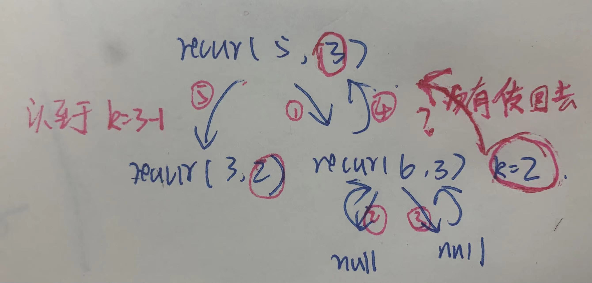
    >
    >   

    ```java
        int max = Integer.MIN_VALUE;
        public int kthLargest(TreeNode root, int k) {
            max = 0;
            recur(root,k);
            return max;
        }
    
        public void recur(TreeNode root,int k){
            if(root==null) return;
            
            recur(root.right,k);
            System.out.println("k:"+ k +"\troot.val:"+root.val);
            k = k-1;
            if(k==0) {
                max = Math.max(root.val,max);
                return;
            }
            recur(root.left,k);
        }
    ```

    


#### [剑指 Offer 68 - II. 二叉树的最近公共祖先](https://leetcode-cn.com/problems/er-cha-shu-de-zui-jin-gong-gong-zu-xian-lcof/)

- 哈希表，哈希set，从下往上生成链

  ```java
      //哈希表，哈希set
      public TreeNode lowestCommonAncestor(TreeNode root, TreeNode p, TreeNode q) {
          if(root==null) return null;
  
          //建哈希表
          HashMap<TreeNode,TreeNode> parentMap =  new HashMap<>();
          parentMap.put(root,null);
          buildParentMap(root,parentMap);
  
          //找p的链，向上，存入hashset
          HashSet<TreeNode> pSet = new HashSet<>();
          TreeNode cur = p;
          while(parentMap.get(cur)!=null){
              pSet.add(cur);
              cur = parentMap.get(cur);
              //System.out.println(cur.val);
          }
  
          //System.out.println();
          cur = q;
          while( cur!=null &&!pSet.contains(cur)){
              cur = parentMap.get(cur);
              //System.out.println(cur.val);
          }
          if(cur==null) return root;
          return cur;
      }
  
      public static void buildParentMap(TreeNode root,HashMap<TreeNode,TreeNode> parentMap){
  
          if(root.left!=null) {
              parentMap.put(root.left,root);
              buildParentMap(root.left,parentMap);
          }
  
          if(root.right!=null) {
              parentMap.put(root.right,root);
              buildParentMap(root.right,parentMap);
          }
      }
  ```

  

- 分析情况(先序遍历)

  ```java
      //先序从上向下进行遍历，最近公共祖先，注意判断所有情况
      public TreeNode lowestCommonAncestor(TreeNode root, TreeNode p, TreeNode q) {
          //处理特殊
          if(root==null) return null;
  
          //先序
          if(root==p || root==q) return root;
  
          TreeNode left = lowestCommonAncestor(root.left,p,q);
          TreeNode right = lowestCommonAncestor(root.right,p,q);
  
          if(left==null) return right;
          if(right==null) return left;
          return root;
      }
  ```
  
- 三刷

  ```java
      public TreeNode lowestCommonAncestor(TreeNode root, TreeNode p, TreeNode q) {
          if(root==null) return root;
  
          if(root==p || root==q) return root;
          
          TreeNode left = lowestCommonAncestor(root.left,p,q);
          TreeNode right = lowestCommonAncestor(root.right,p,q);
  
          // if(left!=null && right!=null) return root;
          // if(left!=null) return left;
          // if(right!=null) return right;
          // return null;
  
          //可以优化为如下：
          if(left==null) return right;
          if(right==null) return left;
          return root;
      }
  ```

  

#### [剑指 Offer 68 - I. 二叉搜索树的最近公共祖先](https://leetcode-cn.com/problems/er-cha-sou-suo-shu-de-zui-jin-gong-gong-zu-xian-lcof/)

若 root.val < p.va ，则 p在 root右子树 中；
若 root.val > p.val ，则 pp 在 root左子树 中；
若 root.val = p.val，则 p和 root指向 同一节点 

- 递归

  ```java
      public TreeNode lowestCommonAncestor(TreeNode root, TreeNode p, TreeNode q) {
          if(root==null || root==p || root==q) return root;  //base 先序
  
          if(p.val<root.val && q.val<root.val) return lowestCommonAncestor(root.left,p,q);
          if(p.val>root.val && q.val>root.val) return lowestCommonAncestor(root.right,p,q);
  
          return root;
      }
  ```

  - 时间复杂度 O(N) ： 其中 N 为二叉树节点数；每循环一轮排除一层，二叉搜索树的层数最小为 logN （满二叉树），最大为 N （退化为链表）。
    空间复杂度 O(N) ： 最差情况下，即树退化为链表时，递归深度达到树的层数 NN 。

    

- 迭代

  ```java
  public TreeNode lowestCommonAncestor(TreeNode root, TreeNode p, TreeNode q) {
          //迭代
          while(root!=null){
              if(p.val < root.val && q.val< root.val){
                  root = root.left;
              }
              else if(p.val > root.val && q.val > root.val){
                  root = root.right;
              }
              else{
                  break;
              }
          }
          return root;
  
      }
  ```

  - 时间复杂度 O(N)O(N) ： 其中 NN 为二叉树节点数；每循环一轮排除一层，二叉搜索树的层数最小为 \log NlogN （满二叉树），最大为 NN （退化为链表）。
    空间复杂度 O(1)O(1) ： 使用常数大小的额外空间。

#### [剑指 Offer 07. 重建二叉树](https://leetcode-cn.com/problems/zhong-jian-er-cha-shu-lcof/)（先序和中序）

太难了（分治）

- 基于以下原理

  ```java
  // 前序遍历的首元素 为 树的根节点 node 的值
  // 在中序遍历中搜索根节点 node 的索引 ，可将 中序遍历 划分为 [ 左子树 | 根节点 | 右子树 ] 
  // 根据中序遍历中的左（右）子树的节点数量，可将 前序遍历 划分为 [ 根节点 | 左子树 | 右子树 ]
  
  // 分治算法解析：
  // 递推参数： 根节点在前序遍历的索引 root 、子树在中序遍历的左边界 left 、子树在中序遍历的右边界 right ；
  // 终止条件： 当 left > right ，代表已经越过叶节点，此时返回 null ；
  // 递推工作：
  //     1. 建立根节点 node ： 节点值为 preorder[root] ；
  //     2. 划分左右子树： 查找根节点在中序遍历 inorder 中的索引 i ；
  //         为了提升效率，本文使用哈希表 dic 存储中序遍历的值与索引的映射，查找操作的时间复杂度为 O(1)；
  //     3. 构建左右子树： 开启左右子树递归；
  // =》推出
  // 中序遍历中左子树的边界[left,i-1]，先序遍历中root位置：root+1 
  // 中序遍历中右子树的边界[i+1,right],先序遍历中root位置：i-left+1+root
  
      int[] preorder; //先序序列
      HashMap<Integer,Integer> inoderMap = new HashMap<>();  //中序序列
      public TreeNode buildTree(int[] preorder, int[] inorder) {
          this.preorder = preorder;
  
          //为中序构建map
          for(int i = 0;i < inorder.length;i++){
              inoderMap.put(inorder[i],i);
          }
          return recur(0,0,inorder.length-1);
      }
  
      public TreeNode recur(int root,int left, int right){
          if(left > right) return null; //遇到空节点,递归终止
  
          TreeNode node = new TreeNode(preorder[root]);  //创建根节点
          int i = inoderMap.get(preorder[root]); //划分根节点，左子树，右子树
          node.left = recur(root+1,left,i-1); //递归构建左子树
          node.right = recur(i-left+1+root,i+1,right); //递归构建右子树
          return node;    //分治返回给根节点
      }
  ```

#### [106. 从中序与后序遍历序列构造二叉树](https://leetcode-cn.com/problems/construct-binary-tree-from-inorder-and-postorder-traversal/)

```java

    int[] postorder; //先序序列
    HashMap<Integer,Integer> inoderMap = new HashMap<>();  //中序序列
    public TreeNode buildTree(int[] inorder, int[] postorder) {
        this.postorder = postorder;

        //为中序构建map
        for(int i = 0;i < inorder.length;i++){
            inoderMap.put(inorder[i],i);
        }
        return recur(postorder.length-1,0,inorder.length-1);
    }

    public TreeNode recur(int root, int left, int right){
        if(left > right ||  root < 0) return null;
        // System.out.print(root + " ");
        TreeNode node = new TreeNode(postorder[root]);
        int i = inoderMap.get(postorder[root]);

        node.left = recur(root-right+i-1,left,i-1);
        node.right = recur(root-1,i+1,right);
    
        return node;
    }
```

#### *[剑指 Offer 33. 二叉搜索树的后序遍历序列](https://leetcode-cn.com/problems/er-cha-sou-suo-shu-de-hou-xu-bian-li-xu-lie-lcof/)

>   划分节点

- 假设是二叉搜索树，利用中序是升序求出升序
  - 相当于利用中序和后序建树，但是不建，只是进行判断
  - 如果是，则代码没有问题，但是当不是二叉搜索树时，会出现重复遍历节点，可以依据这个进行判断

```java
    public class TreeNode {
        int val;
        TreeNode left;
        TreeNode right;

        TreeNode(int x) { val = x; }
    }

    int[] postorder;
    int[] inorder;
    ArrayList<Integer> inorder1;
    HashMap<Integer,Integer> inorderMap = new HashMap<>();

    public boolean verifyPostorder(int[] postorder) {
        this.postorder = postorder;

        //得到中序遍历的列表
        int[] inorder = new int[postorder.length];
        for(int i=0;i<postorder.length;i++){
            inorder[i] = postorder[i];
        }
        Arrays.sort(inorder);
        this.inorder = inorder;
        // for(int i=0;i<inorder.length;i++){
        //     System.out.print(inorder[i]+" ");
        // }
        

        //将中序列表放入hashMap
        for(int i =0;i < inorder.length;i++){
            inorderMap.put(inorder[i],i);
        }

        //利用中序和后序建二叉树 改
        return recur(postorder.length-1,0,inorder.length-1);
    }

    HashSet<Integer> tmp = new HashSet<>();
    public boolean recur(int root, int left, int right){
        if(left > right ||  root < 0) return true; //处理叶节点

        //如果不是二叉树则会重复陷入死循环
        if(tmp.contains(postorder[root])) return false;
        // System.out.print(root+" ");
        TreeNode node = new TreeNode(postorder[root]);
        tmp.add(node.val);
        int i = inorderMap.get(postorder[root]);
        
        if(recur(root-right+i-1,left,i-1) && recur(root-1,i+1,right))
            return true;
        return false;
    }

    public void inorderRecur(TreeNode root){
        if(root==null) return;

        inorderRecur(root.left);
        inorder1.add(root.val);
        inorderRecur(root.right);
    }
```

- 标准：找出左右子树的分割点,则左树都小于根，右树都大于根，然后判断

  ```java
      // 方法二
      public boolean verifyPostorder(int[] postorder) {
          return recur(postorder, 0, postorder.length - 1);
      }
      //利用先序遍历，先判断当前子树序列是否合适，再判断左子序列，再判断右子序列
      //后序遍历，postorder[e]为根
      boolean recur(int[] postorder, int i, int j) {
          //base case 叶子节点及空节点返回true,有等于号
          if(i >= j) return true;
          int p = i;
  
          //1.划分左右子树
          //从左到右找到第一个比根大的节点，作为左右子树的分界线
          while(postorder[p] < postorder[j]) p++;
          
          //2. 判断当前节点是否合适
          //r之后都为右子树，看能否走到底
          int m = p;
          while(postorder[p] > postorder[j]) p++;
  
          //3. 返回
          return p == j && recur(postorder, i, m - 1) && recur(postorder, m, j - 1);
      }
  ```

- 单调栈的方法

  后续遍历，逆过来。在遍历树的时候，维持一个单调递增的栈，这样出栈的顺序是右根左，降序序列，只要最后栈空的时候，出栈的顺序是降序则是
  
  如果这题改成先序遍历。维持一个单调递减的栈，这样出栈的顺序是左根右，升序序列，只要最后栈空的时候，出栈的顺序是升序则是
  
  ```java
      public boolean verifyPostorder(int[] postorder) {
          //辅助栈，维护一个单调递增的栈，也就是只让根和右孩子入栈，当前节点作为别人的右孩子的时候入栈
          
          //倒过来，根右左
          //维持单调递增，所以只有根右入栈，当遇到左就出栈了
          //所以出栈顺序是降序
          Stack<Integer> s = new Stack<>();
  
          //
          int pre = Integer.MAX_VALUE;
          for(int i = postorder.length-1;i>=0;i--){
              //判断当前序列是否是递减的，如果不是则为false
              ////无论当前遇到的是根还是右，都应该比左大，所以条件判断放到这也可以
              if(postorder[i] > root) return false;
  
              //维护单调递减的栈
              while(!s.isEmpty() && s.peek() > postorder[i]){
                  pre = s.pop();
              }
  
              s.add(postorder[i]);
          }
  
          return true;
      }
  ```
  
  
  
- 假设是二叉搜索树，利用中序是升序求出升序【**好好研磨一下，感谢室友大腿帮我调了两个小时bug**】

  - 相当于利用中序和后序建树，但是不建，只是进行判断
  - 利用先序遍历 + 二叉搜索树左小右大的性质进行判断
  - 递归终止条件是左右子树都是空，而左右子树单独存在是子问题的情况之一，既然分不清就不要ran一起
  - 记得判空

  ```java
  
     	int[] postorder;
      int[] inorder;
      HashMap<Integer,Integer> inorderMap = new HashMap<>();
      public boolean verifyPostorder(int[] postorder) {
          if(postorder.length==0) return true;
          this.postorder = postorder;
  
          //得到中序遍历的列表
          inorder = new int[postorder.length];
          this.inorder = inorder;
          for(int i=0;i < postorder.length;i++){
              inorder[i] = postorder[i];
          }
  
          Arrays.sort(inorder);
  
          //把信息放入hashmap
          for(int i =0; i < inorder.length; i++){
              inorderMap.put(inorder[i],i);
          }
  
          return recur(postorder.length-1,0,inorder.length-1);
      }
  
      public boolean recur(int root,int left,int right){
          //左右节点都不存在的时候，可以直接返回true
          //建树的时候没有等是因为要给叶子节点创建空间
           if(left >= right || root < 0) return true;
          int inindex  = inorderMap.get(postorder[root]);
          // for(int i=left;i<=right;i++){
          //     System.out.print(inorder[i] + " ");
          // }
          // System.out.println("end arr");
          //  System.out.println("root: "+ root  + "left" + left + "right" + right);
  
          //left>=right 表示只有根节点，或者左右子树不存在
          //root-1 < 0 表示右子树不存在，但这个条件不全（有问题），因为在后序遍历【左右根】中存在，有左无右，root-1>0但没有右子树
          //right - inindex < 1 表示右子树不存在（上个条件的替换）
          //root-right+inindex-1 < 0 表示左子树不存在
          //if(left >= right || root < 1 || root-right+inindex-1 < 0 || right - inindex < 1) return true;
          //但是此处逻辑不对，没有右子树就返回true，不管有没有左 [4, 6, 7, 5]
          //没有左子树就返回true，不管有无右  [3,10,6,9,2]
          //应该分开判断
          int rootval = postorder[root];
          // System.out.println("root: "+ root +   " "   + postorder[root]);
          // System.out.println("inindex: "+ inindex);
          // int leftval = postorder[root-right+inindex-1];
          // System.out.println("leftindex: "+ (int)(root-right+inindex-1));
          // int rightval = postorder[root-1];
          // System.out.println("rigthindex: "+ (int)(root-1));
          // System.out.print(rootval + " "+ leftval + " "+ rightval);
          // System.out.println();
          
          //设置一个初始值，如果存在左子树，进行判断
          boolean f1 = true;
          if(root-right+inindex-1 >= 0){
              int leftval = postorder[root-right+inindex-1];
              if(leftval > rootval) f1 = false;
          }
          //设置一个初始值，如果存在右子树，进行判断
          boolean f2 = true;
          if(right - inindex >= 1){
              int rightval = postorder[root-1];
              if(rightval < rootval) f2 = false;
          }
  
          //剪枝
          // if(leftval > rootval || rightval < rootval) return false;
          if(!f1||!f2) return false;
  
          return recur(root-right+inindex-1,left,inindex-1)&&recur(root-1,inindex+1,right);
      }
  
  ```

  

#### *[剑指 Offer 2. 树的子结构](https://leetcode-cn.com/problems/shu-de-zi-jie-gou-lcof/)

>   要注意递归终止条件

平衡二叉树也有递归套递归

- 递归套递归，其实就是遍历A的每个节点x, 判断以x为根的子树是否包含B

  ```java
      //先序遍历树A的每个节点
      public boolean isSubStructure(TreeNode A, TreeNode B) {
          if(A==null || B==null) return false;
  
          return recur(A,B) || isSubStructure(A.left,B) || isSubStructure(A.right,B);   
      }
  
      //判断以A为节点的子树是否包含B
      public boolean recur(TreeNode A,TreeNode B){
          //B树遍历完了，说明是
          if(B==null) return true;
          //两个节点不相等
          //A==null说明isSubStructure函数遍历到最后了
          if(A==null || A.val!=B.val) return false;
      
          return recur(A.left,B.left) && recur(A.right,B.right);
  
      }
  ```
  
-   本来想用序列化的方式，但是通过率是47/48，有一个测试用例是这样

    [10,12,6,8,3,11]
    [10,12,6,8]

    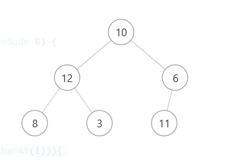

    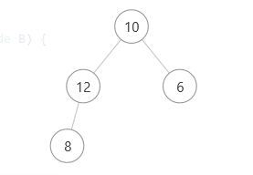

    序列化的结果为：

    10,12,8,#,#,3,#,#,6,11,#,#,#, 

    10,12,8,#,#,#,6,#,#,

    但结果仍未true，所以不能采用这种办法，因为此题是子结构而不是子树

    ```java
    /**
     * Definition for a binary tree node.
     * public class TreeNode {
     *     int val;
     *     TreeNode left;
     *     TreeNode right;
     *     TreeNode(int x) { val = x; }
     * }
     */
    class Solution {
        //序列化的方式,不可以
        public boolean isSubStructure(TreeNode A, TreeNode B) {
            String str1 = recur(A);
            System.out.println(str1);
            String str2 = recur(B);
    
            //筛选
            int i = str2.length()-1;
            
            // while(i >= 0 && !Character.isDigit(str2.charAt(i))){
            //     str2 = str2.substring(0,i--);
            // }
            System.out.println(str2);
            if(str2.length()==0) return false;
    
            return str1.indexOf(str2)!=-1;
        }
    
        public String recur(TreeNode head){
            StringBuilder res = new StringBuilder();
    
            if(head==null){
                return "#,";
            }
    
            res.append(head.val+",");
            res.append(recur(head.left));
            res.append(recur(head.right));
            return res.toString();
        }
    }
    ```

    ```java
        //遍历
        //仅遍历A
    
        public boolean isSubStructure(TreeNode A, TreeNode B) {
            if(A==null || B==null) return false;
    
            //先序遍历判断
            boolean res = travel(A,B);
    
            boolean left = isSubStructure(A.left,B);
            boolean right = isSubStructure(A.right,B);
        
            return res || left || right;
        }   
    
        //就是判断当前B是否是A的子结构，A不遍历,遍历B
        public boolean travel(TreeNode A, TreeNode B){
            if(B==null) return true;
    
            if(A==null || A.val!=B.val) return false;
    
            boolean left = travel(A.left,B.left);
            boolean right = travel(A.right,B.right);
    
            //是&&不是||
            return left && right;
    
        }
    ```

    

#### ** [剑指 Offer 36. 二叉搜索树与双向链表](https://leetcode-cn.com/problems/er-cha-sou-suo-shu-yu-shuang-xiang-lian-biao-lcof/)

>   三刷：真的难啊这个题，
>
>   关键点在于要怎么记录这个pre,head
>
>   每次链接的是 两个节点之间的两个指向，而不是三个节点！！

- 利用中序遍历，维护全局的pre和head

  **第二次做勉强理解**
  
  ```java
      Node pre,head;
      public Node treeToDoublyList(Node root) {
          if(root==null) return null;
          dfs(root);
          //链接头尾
          head.left = pre;
          pre.right = head;
          return head;
      }
  
      //利用中序遍历
      public void dfs(Node cur){
          if(cur==null) return;
  
          dfs(cur.left);
          //用一个判断确定是否是头
          if(pre!=null){
              pre.right = cur;
          }else{
              head = cur;
          }
          cur.left = pre;
          pre = cur;
  
          dfs(cur.right);
      }
  
  ```
  
  ```java
      Node pre = null,head;
      //注意root是树的根节点，head是单链表的头结点
      public Node treeToDoublyList(Node root) {
          if(root==null) return null;
          recur(root);
          head.left = pre;
          pre.right = head;
          return head;
      }
  
      public void recur(Node root){
          //中序遍历
          if(root==null) return;
  
          recur(root.left);
  
          if(pre!=null) {
              pre.right = root;
          }else{
              head = root;
          }
          root.left = pre;
          pre = root;
          
          recur(root.right);
      }
  ```
  
  


#### * [剑指 Offer 34. 二叉树中和为某一值的路径](https://leetcode-cn.com/problems/er-cha-shu-zhong-he-wei-mou-yi-zhi-de-lu-jing-lcof/)

>   需要注意添加答案的位置，如果null会添加两次，那就再叶子节点添加
>
>   并且注意回溯的状态重置问题

- 先序遍历+记录path，遍历还是一样的遍历（递归终止条件没变），回溯指维护path中的节点

  **注意：变量放在参数里，每个节点都是可以记录的，所以不用回溯，一般回溯的是是影响全局的变量**
  
  ```java
      //先序遍历 + 记录
      LinkedList<List<Integer>> res = new LinkedList<>();
      LinkedList<Integer> path = new LinkedList<>(); 
      public List<List<Integer>> pathSum(TreeNode root, int target) {
          recur(root, target);
          return res;
      }
  
      void recur(TreeNode root,int target){
          //放在这会加两次
          // if(target==0) res.add(new LinkedList(path));
          if(root==null) return;
  
          path.add(root.val);
          target -= root.val;
  
          //和为target, 且当前节点为叶子节点
          if(target==0 && root.left==null && root.right==null){
              //因为path是全局，如果这样加入，后面改变则都改变了
              //res.add(path);
              //所以需要创建一个新的空间加入
              res.add(new LinkedList(path));
          }
  
          recur(root.left,target);
          recur(root.right,target);
  
          path.removeLast();  //path回溯返回上一层
  
      }
  ```

-   三刷

    

    ```java
    List<List<Integer>> res = new LinkedList<>();
        LinkedList<Integer> path = new LinkedList<>();
        int sum = 0;
        int target;
    
        public List<List<Integer>> pathSum(TreeNode root, int target) {
            this.target = target;
            help(root);
            return res;
        }
    
        public void help(TreeNode root){
            // //放在这里左子树会加一次
            // //右子树会加一次
            // if(root==null){
            //     if(sum==target){
            //         res.add(new LinkedList<Integer>(path));
            //     }
               
            //     return;
            // }
    
            if(root==null) return;
            sum = sum + root.val;
            path.add(root.val);
            // System.out.print("\troot:"+root.val + "\tsum:"+sum+"\ttmp:"+path);
    
            // if(sum==target && root.left==null && root.right==null){
            //     res.add(new LinkedList<Integer>(path));
            // }
    
            //回溯的所有return前 都需要注意状态是否在此前发生了改变，如果发生了改变，在return前一定要进行重置
            if(sum==target && root.left==null && root.right==null){
                res.add(new LinkedList<Integer>(path));
                sum = sum - root.val;
                path.removeLast();
                return;
            }
    
            help(root.left);
            help(root.right);
            sum = sum - root.val;
            path.removeLast();
        }
    ```


-   再刷

    ```java
        List<List<Integer>> res = new LinkedList<>();
        LinkedList<Integer> path = new LinkedList<>();
    
        int sum = 0;
        public List<List<Integer>> pathSum(TreeNode root, int target) {
            dfs(root,target);
            return res;
        }
    
        public void dfs(TreeNode root,int target){
            if(root==null) return;
    
            sum += root.val;
            path.add(root.val);
    
            if(root.left==null && root.right==null){
                if(sum==target){
                    res.add(new LinkedList<Integer>(path));
                }
                sum -= root.val;
                path.removeLast();
                return;
            }
    
            dfs(root.left,target);
            dfs(root.right,target);
    
            sum -= root.val;
            path.removeLast();
        }
    ```

    


#### [剑指 Offer 37. 序列化二叉树  LCOF](https://leetcode-cn.com/problems/xu-lie-hua-er-cha-shu-lcof/)

>   三刷：要注意序列化的分隔符不能选择"-"，遇到负数会有问题
>
>   不能选择“.”，也会有问题

分治

```java
    // Encodes a tree to a single string.
    public String serialize(TreeNode root) {
        if(root==null){
            return "#!";
        }
        StringBuilder res = new StringBuilder();
        //以“！”做分割，以防止分不清是1和3还是13
        res.append(root.val + "!");
        res.append(serialize(root.left));
        res.append(serialize(root.right));
        // System.out.println(res);
        return res.toString();
    }

    // Decodes your encoded data to tree.
    Queue<String> queue;
    public TreeNode deserialize(String data) {
        String[] numbers = data.split("!");
        queue = new LinkedList<String>();

        //添加到队列
        for(int i=0; i<numbers.length;i++){
            queue.offer(numbers[i]);
        }

        return recur();
    }
    
    //先序遍历 + 分治
    public TreeNode recur(){
        //当头结点为空的时候，poll()选择返回null，pop()选择抛出异常
        //空不了
        String value = queue.poll();
		if (value.equals("#")) {
			return null;
		}
		TreeNode head = new TreeNode(Integer.valueOf(value));
        // System.out.println("b" + value);
		head.left = recur();
		head.right = recur();
		return head;
    }
```

### - 递归

#### [剑指 Offer 64. 求1+2+…+n](https://leetcode-cn.com/problems/qiu-12n-lcof/)

> 还差一点，条件句构建基本成功，但是根据返回值，应该构造一个和，于是(n = n + sum(n-1)) > 0

- 正常递归

  ```java
      //正常递归
      public int sumNums(int n) {
          if(n==1) return 1;
  
          return n + sumNums(n-1);
      }
  ```

  

- 利用短路构成语句代替if条件

  if(A && B)  // 若 A 为 false ，则 B 的判断不会执行（即短路），直接判定 A && B 为 false

  if(A || B) // 若 A 为 true ，则 B 的判断不会执行（即短路），直接判定 A || B 为 true

  ```java
      //利用短路代替if条件判断
      public int sumNums(int n) {
          boolean x = n > 1 && (n += sumNums(n-1)) > 0;
  
          return n;
      }
  
  // Java 中，为构成语句，需加一个辅助布尔量 xxx ，否则会报错；
  // Java 中，开启递归函数需改写为 sumNums(n - 1) > 0 ，此整体作为一个布尔量输出，否则会报错；
  // 初始化变量 resresres 记录结果。（ Java 可使用上面的简洁写法，不用借助变量 resresres ）。
  
      int res = 0;
      public int sumNums(int n) {
          boolean x = n > 1 && sumNums(n-1) > 0;
  
          res += n;
  
          return res;
      }
  ```

#### **[剑指 Offer 16. 数值的整数次方](https://leetcode-cn.com/problems/shu-zhi-de-zheng-shu-ci-fang-lcof/)

> 三刷都记不住这个题：在二进制级别进行运算。base = base * base; power = power>>1

//快速幂算法
        //1. 注意：int类型是：-2^31-(2^31-1),所以当n= -2147483648,执行n = -n的时候，就会造成越界，需要转到long类型
        //2. 注意：普通的递归会爆栈，所以需要采用快速幂的方式
        //         快速幂：利用把n转为2进制，右移，最后一位和1与，如果是1则res = res*base，如果是0对res不操作，每次base都要左移，power都要右移

- 错误做法

  ```java
      //是因为栈溢出递归调用太多次而不是因为整型的取值范围，也不是因为算法错了
      //0.00001  2147483647
      public double myPow(double x, int n) {
          //base case
          long b = n;
          if(x == 0) return 1;
          if(n < 0 ) {
              x = 1/x;
              b = -b;
          }
  
          return help(x,b);        
      }
  
      public double help(double x,long b){
          if(b==0) return 1;
  
          return x*help(x,b-1);
      }
  ```

  

- 递归+快速幂

  ```java
      public double myPow(double x, int n) {
          long b = n;
          if (n < 0) {
              b = -b;
              x = 1 / x;
          }
          return culc(x, b);
      }
  
      public double culc(double base, long power) {
          if (power == 0) {
              return 1;
          }
  
          double t = culc(base, power >> 1);
  
          if ((power & 1) == 1) {
              return t * t * base;
          }
  
          return t * t;
      }
  ```

  

- 快速幂、二分、位运算、迭代

  其实就是二进制的运算，注意右移和左移，和&1的含义
  
  
  
  ```java
      public double myPow(double x, int n) {
  
          //快速幂算法
          //1. 注意：int类型是：-2^31-(2^31-1),所以当n= -2147483648,执行n = -n的时候，就会造成越界，需要转到long类型
          //2. 注意：普通的递归会爆栈，所以需要采用快速幂的方式
          //         快速幂：利用把n转为2进制，右移，最后一位和1与，如果是1则res = res*base，如果是0对res不操作，每次base都要左移，power都要右移
          if(x==0) return x;
          long b = n;
          if(n<0){
              b = -b;
              x = 1/x;
          }
  
          return help(x,b);
  
      }
  
      public double help(double base, long power){
          double res = 1;
          while(power>0){
              if((power & 1)==1) res *= base; 
            base = base * base;
              power = power>>1;
          }
  
        return res;
      }
  ```
```
  


- 另一种除法的理解

向下整除 n//2 等价于 右移一位n>>1 ；
取余数 n%2 等价于 判断二进制最右一位值 n&1 ；

​```java
    public double myPow(double x, int n) {
        if(x == 0) return 0;
        long b = n;
        double res = 1.0;
        if(b < 0) {
            x = 1 / x;
            b = -b;
        }
        while(b > 0){
            if((b&1)==1) res = res*x;  //如果为奇数,多乘一个x
            x *= x; //x*x
            b >>= 1;  // b//=2;
        }
        return res;
    }
```

注意：

```java
Java 代码中 int32 变量 n∈[-2147483648, 2147483647]，因此当 n=−2147483648时执行 n=−n 会因越界而赋值出错。解决方法是先将 n 存入 long 变量b ，后面用 b 操作即可。
```

二进制获取每一位：

获取二进制各位 b1,b2,b3,...,bm 的值： 循环执行以下操作即可。

```
n&n （与操作）： 判断 n 二进制最右一位是否为 111 ；
n>>1 （移位操作）： n右移一位（可理解为删除最后一位）。
```


深度优先搜索类型的题可以分为主函数和辅函数，主函数用于遍历所有的搜索位置，判断是否可以开始搜索，如果可以即在辅函数进行搜索。辅函数则负责深度优先搜索的递归调用。

base: 最后在边界的时候才返回

治：最后return 

#### [695. 岛屿的最大面积](https://leetcode-cn.com/problems/max-area-of-island/)

- 深搜 + 递归
  - 技巧：控制搜索方向的数组，di和dj相对应着
  - 注意边界，以及已经搜过了的节点要进行标记

```java
    //该题不是回溯，是深搜，遍历最大的相邻为1的和
    //主函数：遍历所有搜索位置
    public int maxAreaOfIsland(int[][] grid) {
        int ans = 0;
        for(int i = 0;i < grid.length; i++){
            for(int j=0;j<grid[0].length;j++){
                ans = Math.max(ans,dfs(grid,i,j));
            }
        }
        return ans;
    }

    //辅函数：用于做深搜
    //当前的头节点位置
    public int dfs(int[][] grid,int i,int j){
        if(i < 0 || j < 0 || i==grid.length || j==grid[0].length){  //base:边界
            return 0;
        }
        //只有当前位置为1才进行搜索
        if(grid[i][j]==0){
            return 0;
        }

        //代表当前节点已经被搜索过了，之后不再进行搜索了
        grid[i][j] = 0;
        //由di和dj分别对应控制上下左右（往四个地方去做搜索）
        int[] di = {0,0,-1,1};
        int[] dj = {1,-1,0,0};

        int ans = 1;
        for(int index = 0;index < 4;index++){
            int next_i = i + di[index];
            int next_j = j + dj[index];
            //进行深搜
            ans += dfs(grid,next_i,next_j);
        }
        return ans;
    }
```

- 三刷

```java
    int[] dx = {1,-1,0,0};
    int[] dy = {0,0,1,-1};
    boolean[][] visited;
    int sum = 0;

    public int maxAreaOfIsland(int[][] grid) {
        visited = new boolean[grid.length][grid[0].length];
        int max = 0;
        for(int i = 0;i < grid.length;i++){
            for(int j=0;j < grid[0].length;j++){
                sum = 0;
                if(grid[i][j]==1) max = Math.max(recur(grid,i,j),max);
            }
        }
        return max;
    }

    //从i,j出发的点的面积
    public int recur(int[][] grid,int i,int j){
        if(i < 0 || i >= grid.length || j < 0 ||j >= grid[0].length){
            return 0;
        }

        if(visited[i][j] || grid[i][j]==0) return 0;

        visited[i][j]=true;
        sum = sum + 1;

        for(int k = 0;k < 4;k++){
            int x = i + dx[k];
            int y = j + dy[k];
            recur(grid,x,y);
        }

        return sum;
    }
```


#### *[剑指 Offer 12. 矩阵中的路径](https://leetcode-cn.com/problems/ju-zhen-zhong-de-lu-jing-lcof/)

**上下左右会形成环的时候一定要用used,否则在当前路径会遍历同一个节点两次**

边界条件一定要想清楚

- 深度优先遍历+剪枝

  ```java
      public boolean exist(char[][] board, String word) {
  
          for(int i = 0;i < board.length;i++){
              for(int j=0;j < board[0].length;j++){
                  boolean[][] used = new boolean[board.length][board[0].length];
                  boolean res = dfs(board,i,j,word,0,used);
                  if(res){
                      return true;
                  }
              }
          }
          return false;
      }
  
      //二维数组，以当前（i,j）节点为头开始递归，word所求词，idx为遍历到word的第几个词,判断当前节点有无被访问过
      public boolean dfs(char[][]board, int i, int j, String word,int idx,boolean[][]used){
          //如果当前字符也不相等，则直接返回（剪枝）+ 边界
          //边界条件没有想清楚
          if(i < 0 || j < 0 || i == board.length || j==board[0].length || board[i][j]!=word.charAt(idx)){
              return false;
          }
          
          //排除遍历过的节点
          if(used[i][j]) return false;
  
          if(idx == word.length()-1 ) return true;
  
          //将当前节点标记为已访问
          used[i][j] = true;
  
          //定义上下左右四个方向 
          int[] di ={0,0,-1,1};
          int[] dj = {1,-1,0,0};
          
          //开始递归
          boolean res = false;
          for(int k = 0; k<4 ;k++){
              res |= dfs(board,i+di[k],j+dj[k],word,idx+1,used);
          } 
  
          //回溯
          // 因为只代表此次搜索过程中，该元素已访问过，当初始i j变化时，又开始了另一次搜索过程
          used[i][j] = false;
          return res;
  
      }
  ```

  

- 省时间省空间的做法

  ```java
      //省空间的做法，更改当前已访问过的元素，在结束此次搜索后还原
      public boolean exist(char[][] board, String word) {
          char[] words = word.toCharArray();
          for(int i = 0;i < board.length;i++){
              for(int j=0;j < board[0].length;j++){
                  boolean res = dfs(board,i,j,words,0);
                  if(res){
                      return true;
                  }
              }
          }
          return false;
      }
  
      //二维数组，以当前（i,j）节点为头开始递归，word所求词，idx为遍历到word的第几个词,
      public boolean dfs(char[][]board, int i, int j, char[] word,int idx){
          //如果当前字符也不相等，则直接返回（剪枝）+ 边界
          //边界条件没有想清楚
          if(i >= board.length || i < 0 || j>=board[0].length || j < 0 || board[i][j]!=word[idx]){
              return false;
          }
          
          //排除遍历过的节点
          // if(board[i][j]=='\0') return false;
  
          if(idx == word.length-1 ) return true;
  
          //将当前节点标记为已访问
          // char tmp = board[i][j];
          board[i][j]='\0';
  
          //定义上下左右四个方向 
          int[] di ={0,0,-1,1};
          int[] dj = {1,-1,0,0};
          
          //开使递归
          //只是针对此次搜索的res
          // boolean res = false;
          for(int k = 0; k<4 ;k++){
              if(dfs(board,i+di[k],j+dj[k],word,idx+1)) return true;  //再进行一次剪枝，直接返回
          } 
  
          //回溯
          // 因为只代表此次搜索过程中，该元素已访问过，当初始i j变化时，又开始了另一次搜索过程
          // board[i][j] = tmp;
          board[i][j] = word[idx];
          return false;
  
      }
  ```

- 三刷

  没有什么是画图解决不了的，如果有就是没画好

  ```java
      boolean[][] used;
      public boolean exist(char[][] board, String word) {
          char[] cs = word.toCharArray();
          // used = new boolean[board.length][board[0].length];
          for(int i=0;i<board.length;i++){
              for(int j=0;j<board[0].length;j++){
                  // used = new boolean[board.length][board[0].length];
                  //必须回溯，每次重新建的时候，当下一个节点超过1个可以走，则会导致状态错误
                  //[["A","B","C","E"],["S","F","E","S"],["A","D","E","E"]] "ABCESEEEFS"
                  boolean res = dfs(board,i,j,cs,0);
                  if(res) return true;
              }
          }
  
          return false;
      }
  
  
      public boolean dfs(char[][] board,int i,int j,char[] cs,int idx){
          int[] dx = {-1,1,0,0};
          int[] dy = {0,0,-1,1};
  
          //base case
          if(i<0 || i>= board.length || j<0 || j>=board[0].length || cs[idx]!=board[i][j] || used[i][j]){
              return false;
          }
  
          //出口
          if(idx==cs.length-1){
              return true;
          }
  
          used[i][j] = true;
  
          for(int k=0;k<4;k++){
              int x = i + dx[k];
              int y = j + dy[k];
              if(dfs(board,x,y,cs,idx+1)) return true;
          }
  
          used[i][j] = false;
  
          return false;
      }
  ```

- 太牛逼了 就改了一句话 直接超过百分之97%

  返回值能不或就别或

  ```java
      int[] dx = {1,-1,0,0};
      int[] dy = {0,0,1,-1};
      // boolean[][] visited;
      // LinkedList<Character> path = new LinkedList<>();
      public boolean exist(char[][] board, String word) {
          int m = board.length;
          int n = board[0].length;
          char[] cs = word.toCharArray();
  
          for(int i=0;i < m;i++){
              for(int j = 0;j < n;j++){
                  if(board[i][j]==cs[0] && recur(board,i,j,cs,0)) {
                          return true;
                  }
              }
          }
          return false;
      }
  
      public boolean recur(char[][] board,int i,int j, char[] cs,int idx){
          if(i < 0 || i >= board.length || j < 0 || j >= board[0].length){
              return false;
          }
  
          if(cs[idx]!=board[i][j] || board[i][j]=='\0') return false;
          if(idx==cs.length-1) return true;
  
          char tmp = board[i][j];
          board[i][j] = '\0';
  
          for(int k = 0;k < 4;k++){
              int x = i + dx[k];
              int y = j + dy[k];
              //这块不要放或，直接返回true，其他情况返回false
              if(recur(board,x,y,cs,idx+1)) return true;
          }
  
          board[i][j] = tmp;
          // return res;
          return false;
      }
  ```

  

#### * [剑指 Offer 13. 机器人的运动范围](https://leetcode-cn.com/problems/ji-qi-ren-de-yun-dong-fan-wei-lcof/)

**上下左右会在一个路径形成环的时候必须要used**

不需要path，因为这个求得是范围

- 暴力dfs + 剪枝 ，这个不用回溯，因为每个节点访问一次就可得出结论，并不是要路径什么的

  ```java
      public int movingCount(int m, int n, int k) {
          if(k==0) return 1;
  
          boolean[][] used = new boolean[m][n];
  
          return dfs(m,n,k,0,0,used);
          // return bitSum(k);
      }
  
      //i表示当前在i行，j列,标志位
      public int dfs(int m,int n,int k,int i,int j,boolean[][]used){
          if(i<0 || j<0 || i==m || j==n || bitSum(i)+bitSum(j) > k || used[i][j]){
              return 0;
          }
  
          used[i][j] = true;
  
          int[] di = {0,0,-1,1};
          int[] dj = {1,-1,0,0};
          int res = 0;
  
          res++;
          for(int idx = 0; idx < 4;idx++){
              res += dfs(m,n,k,i+di[idx],j+dj[idx],used); 
          }
  
          //不用回溯，每个节点遍历一遍即可
          // used[i][j] = false;
          return res;
      }
  
  
      public int bitSum(int num){
          int k = num;
          int res = 0;
          while(k!=0){
              res += k%10;
              k = k/10;
          }
          // int res = num%10 + num/10;
          return res;
      }
  ```

  ```java
  int sum = 0;
      int[] dx = {1,-1,0,0};
      int[] dy = {0,0,1,-1};
      public int movingCount(int m, int n, int k) {
          boolean[][] data = new boolean[m][n];
          recur(data,0,0,k);
          return sum;
      }
  
      public void recur(boolean[][] data,int i,int j,int k){
          if(i < 0 || i >= data.length || j < 0 || j >= data[0].length){
              return;
          }
  
          int s = digitSum(i) + digitSum(j);
          if(data[i][j] || s > k) return;
  
          data[i][j] = true;
          sum++;
  
          for(int m = 0; m < 4;m++ ){
              int x = i + dx[m];
              int y = j + dy[m];
  
              recur(data,x,y,k);
          }
      }
  
      public int digitSum(int m){
          int sum = 0;
          while(m!=0){
              sum = sum + m%10;
              m = m/10;
          }
          return sum;
      }
  ```
  
  ```java
      int m,n,k;
      boolean[][] used;
      int[] dx = {-1,1,0,0};
      int[] dy = {0,0,-1,1};
      // int sum = 0;
      public int movingCount(int m, int n, int k) {
          this.m = m;
          this.n = n;
          this.k = k;
          used = new boolean[m][n];
  
          return dfs(0,0);
          // return sum;
      }
  
      public int dfs(int i,int j){
          if( i < 0 || j < 0 || i >= m || j >= n || sum(i) + sum(j) > k || used[i][j]){
              return 0;
          }
  
          int sum = 0;
  
          used[i][j] = true;
          if(i==m-1 && j==n-1) return 1;
          
          sum = sum + 1;
  
          for(int cnt = 0;cnt < 4;cnt++){
              int x = i + dx[cnt];
              int y = j + dy[cnt];
              sum += dfs(x,y);
          }
      
          return sum;
      }
      
      //没有问题
      public int sum(int num){
          int s = 0; 
          while(num!=0){
              s += num % 10;
              num = num / 10;
          }
          return s;
      }
  ```
  
  


### - 回溯

感觉一部分用于优化深搜，免除浪费很多中间变量

#### ***[46. 全排列](https://leetcode-cn.com/problems/permutations/)

> used数组
>
> 想清楚循环条件和减枝条件

- 优化前(太复杂了)

  ```java
      public List<List<Integer>> permute(int[] nums) {
          int len = nums.length;
          // 使用一个动态数组保存所有可能的全排列
          List<List<Integer>> res = new ArrayList<>();
          if (len == 0) {
              return res;
          }
  
          boolean[] used = new boolean[len];
          Deque<Integer> path = new ArrayDeque<>(len);
  
          dfs(nums, len, 0, path, used, res);
          return res;
      }
  
      private void dfs(int[] nums, int len, int depth,
                       Deque<Integer> path, boolean[] used,
                       List<List<Integer>> res) {
          if (depth == len) {
              //变量 path 所指向的列表 在深度优先遍历的过程中只有一份 ，深度优先遍历完成以后，回到了根结点，成为空列表,会使res为空
              res.add(new ArrayList<>(path));
              return;
          }
  
          for (int i = 0; i < len; i++) {
              if (!used[i]) {
                  path.addLast(nums[i]);
                  used[i] = true;
  
                  System.out.println("  递归之前 => " + path);
                  dfs(nums, len, depth + 1, path, used, res);
  
                  used[i] = false;
                  path.removeLast();
                  System.out.println("递归之后 => " + path);
              }
          }
      }
  ```

- 好理解的上个版本

  ```java
      public List<List<Integer>> permute(int[] nums) {
          List<List<Integer>> res = new ArrayList<>();
          List<Integer> path = new ArrayList<>();
          dfs(nums,path,res);
          return res;
      }
  
      public void dfs(int[] nums,List<Integer> path,List<List<Integer>> res){
          //叶子结点返回
          if(path.size()==nums.length){
              res.add(new ArrayList(path));
              return;
          }
  
          //控制分支，宽度
          for(int i=0;i <nums.length; i++){
              //操作
              if(path.contains(nums[i])){
                  continue;
              }
              path.add(nums[i]);
  
              //递归
              dfs(nums,path,res);
  
              //状态重置
              path.remove(path.size()-1);
          }
      }
  ```

- 创建新的中间变量则无需回溯

  每一次尝试都「复制」，则不需要回溯

  如果在每一个 非叶子结点 分支的尝试，都创建 新的变量 表示状态，那么
      在回到上一层结点的时候不需要「回溯」；
      在递归终止的时候也不需要做拷贝。
      这样的做法虽然可以得到解，但也会创建很多中间变量，这些中间变量很多时候是我们不需要的，会有一定空间和时间上的消耗。

  ```java
  public List<List<Integer>> permute(int[] nums) {
          // 首先是特判
          int len = nums.length;
          // 使用一个动态数组保存所有可能的全排列
          List<List<Integer>> res = new ArrayList<>();
  
          if (len == 0) {
              return res;
          }
  
          boolean[] used = new boolean[len];
          List<Integer> path = new ArrayList<>();
  
          dfs(nums, len, 0, path, used, res);
          return res;
      }
  
      private void dfs(int[] nums, int len, int depth,
                       List<Integer> path, boolean[] used,
                       List<List<Integer>> res) {
          if (depth == len) {
              // 3、不用拷贝，因为每一层传递下来的 path 变量都是新建的
              res.add(path);
              return;
          }
  
          for (int i = 0; i < len; i++) {
              if (!used[i]) {
                  // 1、每一次尝试都创建新的变量表示当前的"状态"
                  List<Integer> newPath = new ArrayList<>(path);
                  newPath.add(nums[i]);
  				
                  // 1、每一次尝试都创建新的变量表示当前的"状态"
                  boolean[] newUsed = new boolean[len];
                  System.arraycopy(used, 0, newUsed, 0, len);
                  newUsed[i] = true;
  
                  dfs(nums, len, depth + 1, newPath, newUsed, res);
                  // 2、无需回溯
              }
          }
      }
  ```

这就好比我们在实验室里做「对比实验」，每一个步骤的尝试都要保证使用的材料是一样的。我们有两种办法：

【全局】每做完一种尝试，都把实验材料恢复成做上一个实验之前的样子，只有这样做出的对比才有意义；

【局部】每一次尝试都使用同样的新的材料做实验

- 优化后(交换)

  ```java
      //相当于填nums.length长的数，不重不漏
      //注意刚开始为空
  
      //调用函数
      List<List<Integer>> res;
      public List<List<Integer>> permute(int[] nums) {
          res = new ArrayList<List<Integer>>();
          List<Integer> tmp = new ArrayList<>();
          for(int num:nums){
              tmp.add(num);
          }
          dfs(nums.length,0,tmp);
          return res;
      }
  
      //总共要填的数的数目，当前填到哪个数的下标，这一次的结果
      public void dfs(int length,int index, List<Integer> tmp){
          if(index == length){
              res.add(new ArrayList<Integer>(tmp));
              return;
          }
          //在非叶子结点处，产生不同的分支，这一操作的语义是：在还未选择的数中依次选择一个元素作为下一个位置的元素，这显然得通过一个循环实现
          //在当前位置，前面的数都排列好了，后面的数没有排列
          //在当前位置下，选定下一个数有多少种可能，就和二叉树一样，需要遍历左右孩子一样
          for(int i = index;i < length;i++){
              Collections.swap(tmp, index,i);
              dfs(length,index+1,tmp); //继续递归填下一个数
              Collections.swap(tmp, index,i); //状态重置
          }
      }
  ```

- 套路

  ```java
   LinkedList<Integer> path = new LinkedList<>();
      List<List<Integer>> res = new LinkedList<>();
      boolean[] visited;
  
      public List<List<Integer>> permute(int[] nums) {
          visited = new boolean[nums.length];
          
          dfs(nums,0);
          return res;    
      }
  
      public void dfs(int[]nums,int s){
          if(path.size()==nums.length){
              res.add(new LinkedList(path));
              return;
          }
  
          for(int i=0;i<nums.length;i++){
              if(visited[i]) continue;
  
              visited[i] = true; //标准此条路径中不能再有i
              path.addLast(nums[i]);
  
              dfs(nums,i+1);
  
              path.removeLast();
              visited[i] = false;
          }
      }
  ```


-   四刷 ：存在一些问题

    问题一：要注意path进res的位置，在循环外

    ```java
        List<List<Integer>> res = new LinkedList<>();
        LinkedList<Integer> path = new LinkedList<>();
        boolean[] used;
        public List<List<Integer>> permute(int[] nums) {
            used = new boolean[nums.length];
            dfs(nums);
            return res;
        }
    
        public void dfs(int[] nums){
    
            if(path.size() == nums.length) {
                res.add(new LinkedList<Integer>(path));
                return;
            }
            
            for(int idx = 0;idx < nums.length;idx++){
                if(used[idx]) continue;
    
                path.add(nums[idx]);
                used[idx] = true;
    
                System.out.println("before===path:" + path + "\tused:"+ Arrays.toString(used));
    
    
                //// 为什么不能放在这呢
                // if(idx == nums.length-1){
                //     res.add(new LinkedList<Integer>(path));
                //     return;
                // }
                //因为idx在遍历完第一个[1,2,3]就会idx==nums.length-1，那就意味着不会再向下走了
                //而path在每一次的情况下，可以多次idx==nums.length-1
    
                dfs(nums);
    
                path.removeLast();
                used[idx] = false;
    
                System.out.println("after===path:" + path + "\tused:"+ Arrays.toString(used));
            }
        }
    
    ```

    问题2：

    ```java
    before===path:[1]	used:[true, false, false]
    before===path:[1, 2]	used:[true, true, false]
    before===path:[1, 2, 3]	used:[true, true, true]
    after===path:[1, 2]	used:[true, true, false]
    after===path:[1]	used:[true, false, false]
    //为什么到这不会再选2了呢
    before===path:[1, 3]	used:[true, false, true]
    before===path:[1, 3, 2]	used:[true, true, true]
    after===path:[1, 3]	used:[true, false, true]
    after===path:[1]	used:[true, false, false]
    after===path:[]	used:[false, false, false]
    before===path:[2]	used:[false, true, false]
    before===path:[2, 1]	used:[true, true, false]
    before===path:[2, 1, 3]	used:[true, true, true]
    after===path:[2, 1]	used:[true, true, false]
    after===path:[2]	used:[false, true, false]
    before===path:[2, 3]	used:[false, true, true]
    before===path:[2, 3, 1]	used:[true, true, true]
    after===path:[2, 3]	used:[false, true, true]
    after===path:[2]	used:[false, true, false]
    after===path:[]	used:[false, false, false]
    before===path:[3]	used:[false, false, true]
    before===path:[3, 1]	used:[true, false, true]
    before===path:[3, 1, 2]	used:[true, true, true]
    after===path:[3, 1]	used:[true, false, true]
    after===path:[3]	used:[false, false, true]
    before===path:[3, 2]	used:[false, true, true]
    before===path:[3, 2, 1]	used:[true, true, true]
    after===path:[3, 2]	used:[false, true, true]
    after===path:[3]	used:[false, false, true]
    after===path:[]	used:[false, false, false]
    ```

    因为循环保证的，2走完了，只能继续往下走了

    所以说递归是保证了从上到下，而循环保证了从左向右

    ```java
        List<List<Integer>> res = new LinkedList<>();
        LinkedList<Integer> path = new LinkedList<>();
        boolean[] used;
        public List<List<Integer>> permute(int[] nums) {
            used = new boolean[nums.length];
            dfs(nums);
            return res;
        }
    
        public void dfs(int[] nums){
    
            if(path.size() == nums.length) {
                res.add(new LinkedList<Integer>(path));
                return;
            }
            
            for(int idx = 0;idx < nums.length;idx++){
                if(used[idx]) continue;
    
                path.add(nums[idx]);
                used[idx] = true;
    
                System.out.println("before===path:" + path + "\tused:"+ Arrays.toString(used));
    
    
                //// 为什么不能放在这呢
                // if(idx == nums.length-1){
                //     res.add(new LinkedList<Integer>(path));
                //     return;
                // }
                //因为idx在遍历完第一个[1,2,3]就会idx==nums.length-1，那就意味着不会再向下走了
                //而path在每一次的情况下，可以多次idx==nums.length-1
    
                dfs(nums);
    
                path.removeLast();
                used[idx] = false;
    
                System.out.println("after===path:" + path + "\tused:"+ Arrays.toString(used));
            }
        }
    ```

    如果想节省used数组和每次添加元素到path的操作，则采用交换法

    ```java
        List<List<Integer>> res = new LinkedList<>();
        LinkedList<Integer> path = new LinkedList<>();
        public List<List<Integer>> permute(int[] nums) {
            for(int num: nums){
                path.add(num);
            }
            dfs(path,0);
            return res;
        }
    
        public void dfs(LinkedList<Integer> path,int idx){
    
            if(path.size() == idx) {
                res.add(new LinkedList<Integer>(path));
                return;
            }
            
            //idx之前的都默认排好序了，依次往进填充
            //省掉了used数组和每次添加元素到path中的操作
            for(int i = idx;i < path.size();i++){
                Collections.swap(path,i,idx);
                dfs(path,idx+1);
                Collections.swap(path,i,idx);
            }
        }
    ```

    


#### **[剑指 Offer 38. 字符串的排列](https://leetcode-cn.com/problems/zi-fu-chuan-de-pai-lie-lcof/)（注意是包含可重复的字符）

> 去重要保持相对位置不变
>
> if(used[i] || (i>0 &&cs[i-1]==cs[i] && !used[i-1])) continue;
>
> 记得必须先排序
>
> StringBuilder的删除操作是s.deleteCharAt(i)

平时used数组的作用是代表当前节点我是否选择过了，防止对同一位置上的节点重复选择

并不表示不同位置相同节点上的重复，当含有重复字符时，需要对结果去重

- 费空间的做法

```java
public String[] permutation(String s) {
        if (s==null) return new String[0];
        char[] cs = s.toCharArray();
        StringBuilder path = new StringBuilder();
        // List<String> res = new ArrayList<>();
        HashSet<String> res = new HashSet<>(); //最后结果去重
        boolean[] flag = new boolean[cs.length];  //代表当前节点我是否选择过了，防止对同一位置上的节点重复选择
        //重复，boolean类型的变量，默认是false
        //并不表示不同位置相同节点上的重复
        
        dfs(cs,path,res,flag);

        String[] ans = new String[res.size()];
        int idx = 0;
        for (String str : res) ans[idx++] = str;
        return ans;
    }

    public void dfs(char[]cs, StringBuilder path,HashSet<String> res,boolean[] flag){
        if(path.length()==cs.length){
            res.add(new String(path.toString()));
            return;
        }

        for(int i=0;i < cs.length;i++){
            //不能这么判断，如果里面有重复的字符的就会报错，且会使path.length()==cs.length长度永不相等
            //题目要求可以重复
            //path.toString().contains((String.valueOf(cs[i])))
            if(flag[i])
                continue;
            path.append(cs[i]);
            flag[i] = true;
            dfs(cs,path,res,flag);
            path.deleteCharAt(path.length()-1);
            flag[i] = false;
        }
    }

```

- 交换不费空间

```java
    //采用交换的方式
    public String[] permutation(String s) {
        if (s==null) return new String[0];
        char[] cs = s.toCharArray();
        HashSet<String> res = new HashSet<>(); //最后结果去重
        
        dfs(cs,0,res);

        String[] ans = new String[res.size()];
        int idx = 0;
        for (String str : res) ans[idx++] = str;
        return ans;
    }

    public void dfs(char[]cs, int index, HashSet<String> res){
        //注意此处length要减一
        if(index == cs.length-1){
            res.add(String.valueOf(cs));
            return;
        }

        for(int i = index;i < cs.length;i++){
            swap(cs,i,index);
            dfs(cs,index+1,res);
            swap(cs,i,index);
        }
    }

    public void swap(char[]cs,int i,int j){
        char tmp = cs[i];
        cs[i] = cs[j];
        cs[j] = tmp;
    }
```

- 如果是不包含重复字符可以这么写

```java
    // 感觉此题只能对结果去重了！不是
    //采用交换的方式+去重，不可行，如遇到重复，index无法到达
    public String[] permutation(String s) {
        if (s==null) return new String[0];
        char[] cs = s.toCharArray();
        List<String> res = new ArrayList<>(); 
        //保证没有重复的字符
        //如果只有小写的字母可以写成，boolean[] used =new boolean[26];
        HashSet<Character> used = new HashSet<>(); 
        
        dfs(cs,0,res,used);

        String[] ans = new String[res.size()];
        int idx = 0;
        for (String str : res) ans[idx++] = str;
        return ans;
    }

    public void dfs(char[]cs, int index, List<String> res,HashSet<Character> used){
        if(index == cs.length){
            res.add(String.valueOf(cs));
            return;
        }

        for(int i = index;i < cs.length;i++){
            if(used.contains(cs[i])){
                continue;
            }
            swap(cs,i,index);
            used.add(cs[i]);
            dfs(cs,index+1,res,used);
            swap(cs,i,index);
            used.remove(cs[i]);
        }
    }

    public void swap(char[]cs,int i,int j){
        char tmp = cs[i];
        cs[i] = cs[j];
        cs[j] = tmp;
    }
```

- 最优解：去重

   //交换是为了保证对当前位置index进行选择，不否空间
   

  //加hashset，是为了保证有重复字符是不进行多余的分支

```java

    //修改下剪枝条件
    //交换是为了保证对当前位置index，不重复
    //加hashset，是为了保证有重复字符是不进行多余的分支
    public String[] permutation(String s) {
        if (s==null) return new String[0];
        char[] cs = s.toCharArray();
        List<String> res = new ArrayList<>(); 
        //保证没有重复的字符
        //如果只有小写的字母可以写成，boolean[] used =new boolean[26];
        
        dfs(cs,0,res);

        String[] ans = new String[res.size()];
        int idx = 0;
        for (String str : res) ans[idx++] = str;
        return ans;
    }

    public void dfs(char[]cs, int index, List<String> res){
        if(index == cs.length-1){
            res.add(String.valueOf(cs));
            return;
        }

        //在此层时，需要判断重复，重复则不给分支（不交换）
        HashSet<Character> used = new HashSet<>();
        for(int i = index;i < cs.length;i++){
            if(used.contains(cs[i])){
                continue;
            }
            used.add(cs[i]);
            swap(cs,i,index);
            dfs(cs,index+1,res);
            swap(cs,i,index);
            // used.remove(cs[i]);
        }
    }

    public void swap(char[]cs,int i,int j){
        char tmp = cs[i];
        cs[i] = cs[j];
        cs[j] = tmp;
    }
```

- 套路

  path:记录当前路径的序列

  used：记录当前路径的节点不会重复选择，比如是1，则不会再在当前路径选1
  
  

```java
    LinkedList<String> res = new LinkedList<>();
    StringBuilder path = new StringBuilder();
    boolean[] used;
    public String[] permutation(String s) {
        used = new boolean[s.length()];
        char[] cs = s.toCharArray();
        Arrays.sort(cs);
        dfs(cs,0);

        String[] ans = new String[res.size()];
        for(int i = 0;i<res.size();i++){
            ans[i] = res.get(i);
        }

        return ans;
        
    }

    public void dfs(char[] cs,int s){
        if(path.length()==cs.length){
            res.add(new String(path.toString()));
            return;
        }

        for(int i=0;i < cs.length;i++){
            //做选择，可能会有重复字符
            if(used[i] || (i>0 && cs[i-1]==cs[i] && used[i-1])) continue;

            used[i]=true;
            path.append(cs[i]);

            dfs(cs,i+1);

            used[i]=false;
            path.deleteCharAt(path.length()-1);
        }
    }
```

#### *[494. 目标和](https://leetcode-cn.com/problems/target-sum/)

>   //这里每次只对应两种选择，不用for循环
>           //用for循环是因为之前全排列或者组合后的分枝数不是固定不变的

```java
    int res;
    int sum;
    public int findTargetSumWays(int[] nums, int target) {
        if(nums.length==0) return 0;
        res = 0;
        sum = 0;
        dfs(nums,target,0,sum);
        return res;
    }

    public void dfs(int[] nums, int target,int i,int sum){
        //base case
        if(nums.length==i){
            if(target==sum){
                res++;
            }
            return;
        }
        //这里每次只对应两种选择，不用for循环
        //用for循环是因为之前全排列或者组合后的分枝数不是固定不变的
        sum += nums[i];
        dfs(nums,target,i+1,sum);
        sum -= nums[i];
        sum -= nums[i];
        dfs(nums,target,i+1,sum);
        sum += nums[i];
    }
```


### - 动态规划

【选择套状态！！！！】

不是所有都是，比如航班信息，其依赖于k的规律

#### [剑指 Offer 10- I. 斐波那契数列](https://leetcode-cn.com/problems/fei-bo-na-qi-shu-lie-lcof/)

- 递归法：
  原理： 把 f(n)问题的计算拆分成 f(n-1)和 f(n-2)两个子问题的计算，并递归，以f(0) 和 f(1)为终止条件。
  缺点： 大量重复的递归计算，例如 f(n) 和 f(n - 1)两者向下递归需要 各自计算 f(n - 2)的值。

  ```java
      public int fib(int n) {
          if(n<=1) return n;
          return fib(n-1)+fib(n-2);
      }
  ```

  

- 记忆化递归法：
  原理： 在递归法的基础上，新建一个长度为 n 的数组，用于在递归时存储 f(0)至 f(n)的数字值，重复遇到某数字则直接从数组取用，避免了重复的递归计算。
  缺点： 记忆化存储需要使用 O(N) 的额外空间。

- 动态规划：
  原理： 以斐波那契数列性质 f(n + 1) = f(n) + f(n - 1) 为转移方程。
  从计算效率、空间复杂度上看，动态规划是本题的最佳解法。

  ```java
      //动态优化
      public int fib(int n){
          if(n < 2) return n;
  
          int a = 0;
          int b = 1;
          int sum = 0;
          for(int i=2; i<=n; i++){
              sum = (a + b)%1000000007;
              a = b ;
              b = sum;
          }
          return sum;
      }
  ```

#### [剑指 Offer 10- II. 青蛙跳台阶问题](https://leetcode-cn.com/problems/qing-wa-tiao-tai-jie-wen-ti-lcof/)

- 动态规划（未优化）

  ```java
      public int numWays(int n) {
          if(n==0) return 1;
          int[] dp = new int[n+1];
          dp[0] = 1;
          dp[1] = 1;
          for(int i=2;i<=n;i++){
              dp[i] = (dp[i-1] + dp[i-2])%1000000007;
          }
          System.out.println(Arrays.toString(dp));
          return dp[n];
      }
  ```
  
  
  
- 动态规划（优化）

  ```java
      //动态优化
      public int numWays(int n){
          if(n == 0 || n == 1) {
              return 1;
          }
  
          int a = 1;
          int b = 1;
          int sum = 0;
          for(int i=2; i <= n; i++){
              sum = (a + b)%1000000007;
              a = b;
              b = sum;
          }
  
          return sum;
      }
  ```

- 深搜

  ```java
  
      int count;
      public int numWays(int n) {
          count = 0;
          dfs(n);
          return count % 1000000007;
      }
      
      public void dfs(int n){
          if(n == 0 || n==1) {
              count += 1;
              return;
          }
          if(n == 2) {
              count += 2;
              return;
          } 
  
          dfs(n-1);
          dfs(n-2);
      }
  ```

- 递归

  ```java
      //和数列一样   
      public int numWays(int n){
          if(n == 0 || n==1) {
              return 1;
          }
          if(n == 2) {
              return 2;
          } 
  
          return (numWays(n-1) + numWays(n-2))%1000000007;
      }
  ```

#### **[剑指 Offer 62. 圆圈中最后剩下的数字](https://leetcode-cn.com/problems/yuan-quan-zhong-zui-hou-sheng-xia-de-shu-zi-lcof/)

-   过程

    ```java
    n:1	m:3	num:0
    n:2	m:3	num:1
    n:3	m:3	num:1
    n:4	m:3	num:0
    n:5	m:3	num:3
    ```

    ```java
        //当前递归函数的含义是：
        //一共有n个元素，每次删除第m个数后，返回剩余的最后一个数的数
        public int lastRemaining(int n, int m) {
            if(n==1){
                System.out.println("n:" + n + "\tm:" + m + "\tnum:" + 0);
                return 0;
            } 
            
            int num = lastRemaining(n-1,m);
            System.out.println("n:" + n + "\tm:" + m + "\tnum:" + (num + m)% n);
            return (num + m)% n;
        }
    ```

    

- 暴力模拟

  ```java
      //方法一，模拟
      //LinkedList会超时,ArrayList勉强可以通过
      public int lastRemaining(int n, int m) {
          ArrayList<Integer> list =  new ArrayList<>();
          for(int i=0; i<n ;i++){
              list.add(i);
          }
  
          int idx = 0;
          while(n > 1){
              idx = (idx + m - 1)%n;
              list.remove(idx);
              n--;
          }
          return list.get(0);
      }
  ```

  

- 递归

  ```java
  
      public int lastRemaining(int n, int m) {
          //当n==1时，规模只有1，那么数字必然是最初始的0
          if(n==1) return 0;
  
          int x  = lastRemaining(n-1,m);
          
          return (x + m) % n;
      }
  ```
  
  
  
  ```java
      //约瑟夫环
      //递归
      public int lastRemaining(int n, int m) {
          if(n==1) return 0; //base
  
          //考虑x已知的情况的下,n-1个环所留下的数
          int x = lastRemaining(n-1,m);
  
          return (x + m)%n;
  
      }
  ```
  
  
  
- 动态规划

  

状态转移


```java
    //迭代
    //动态优化
    public int lastRemaining(int n, int m) {
        int x = 0;
        for (int i = 2; i <= n; i++) {
            x = (x + m) % i;
        }
        return x;
    }
```

#### [剑指 Offer 42. 连续子数组的最大和](https://leetcode-cn.com/problems/lian-xu-zi-shu-zu-de-zui-da-he-lcof/)

- 暴力解法

  ```java
  //计算以0为开头的最大和
  //计算以....i为开头的最大和【从i到j】
  //最后求这些和里的最大和
  public int maxSubArray(int[] nums) {
          int max = Integer.MIN_VALUE;
          for(int i=0;i<nums.length;i++){
              int sum = 0;
              for(int j = i;j<nums.length;j++){
                  sum += nums[j];
                  if(sum > max){
                      max = sum;
                  } 
              }
          }
          return max;
      }
  ```

- 动态规划1:

  如果我们每次能在最右侧得到该行的最大值，然后再求这么多最大值的最大值，岂不就能在O(n)内计算出结果？		
  sum(0,0) 																 dp[0]
  sum(0,1) 	sum(1,1) 											 dp[1]
  sum(0,2) 	sum(1,2) 	sum(2,2) 						dp[2]
  sum(0,3) 	sum(1,3) 	sum(2,3) 	sum(3,3) 	dp[3]
  ..... 	... 	... 	.... 												   dp[j]

  表格每一行的子数组都是以某一值结尾，所以我们设dp[j]为以j结尾的子数组的最大值，如上面表格所示。dp[j]的最大值就是我们要的结果。

  （以某个数作为结尾，意思就是这个数一定会加上去，那么要看的就是这个数前面的部分要不要加上去。大于零就加，小于零就舍弃。）

  

  ```java
      //动态优化
      public int maxSubArray(int[] nums) {
          if(nums.length==0) return Integer.MIN_VALUE;
          if(nums.length==1) return nums[0];
  
          int[] dp = new int[nums.length];
          dp[0] = nums[0];
          int max = dp[0];  //此处要设成dp[0],否则会没有检查到dp[0]
          for(int i=1; i< nums.length;i++){
              dp[i] = Math.max(dp[i-1],0) + nums[i];
              max = Math.max(dp[i],max);
          }
          return max;
      }
  ```

- 优化动态规划（原地存储）

  将dp的值存入原数组

  ```java
      //优化使用空间，原地存储
      public int maxSubArray(int[] nums) {
          if(nums.length==0) return Integer.MIN_VALUE;
          if(nums.length==1) return nums[0];
          
          int res = nums[0];
          //将当前dp的值存入原数组
          for(int i=1;i<nums.length;i++){
              nums[i] = Math.max(nums[i-1],0) + nums[i];
              res = Math.max(res,nums[i]);
          }
          return res;
      }
  ```

- 优化动态规划空间（滑动数组）

  ```java
      //使用滑动数组
      public int maxSubArray(int[] nums) {
          if(nums.length==0) return Integer.MIN_VALUE;
          if(nums.length==1) return nums[0];
  
          int dp = nums[0];
          int max = nums[0];
          for(int i=1;i<nums.length;i++){
              //以某个数作为结尾，意思就是这个数一定会加上去，那么要看的就是这个数前面的部分要不要加上去。
              dp = Math.max(dp + nums[i],nums[i]);
              max = Math.max(max,dp);
          }
  
          return max;
      }
  ```

#### [剑指 Offer 63. 股票的最大利润](https://leetcode-cn.com/problems/gu-piao-de-zui-da-li-run-lcof/)

- 动态规划

  ```java
      //动态规划
      //状态定义：dp[i],前i日能获得的最大利润，隐含是在第i天卖掉获得的利润和之前的利润的大小关系
      //状态转移方程：dp[i] = max(dp[i-1],prices[i]-min(prices[0:i-1]))
      //初始状态：dp[0] = 0
      //结果：dp[len-1]
      //多开辟了一个空间
      public int maxProfit(int[] prices) {
          if(prices==null || prices.length < 2) return 0;
          
          int len = prices.length;
          int[] dp = new int[len+1];
          dp[0] = 0;
          int cost = Integer.MAX_VALUE;
          for(int i = 1;i <= len;i++ ){
              dp[i] = Math.max(dp[i-1],prices[i-1]-cost);
              cost = Math.min(cost,prices[i-1]);
          } 
  
          return dp[len];
      }
  ```

  

- 动态规划空间优化

  ```java
  
      //优化空间
      // 由于 dp[i]dp[i]dp[i] 只与 dp[i−1] , prices[i] , cost相关，因此可使用一个变量（记为利润 profit ）代替dp列表
      public int maxProfit(int[] prices) {
          if(prices==null || prices.length < 2) return 0;
          
          int profit = 0;
          int cost = Integer.MAX_VALUE;
          for(int price:prices){
              profit = Math.max(profit,price-cost);
              cost = Math.min(cost,price);
          }
          return profit;
      }
  ```

#### [剑指 Offer 49. 丑数](https://leetcode-cn.com/problems/chou-shu-lcof/)

丑数只包含因子 2,3,5，因此有 “丑数 = 某较小丑数 × 某因子” ！！！（注意是只包含）

- 错误解法：不理解丑数的性质

  ```java
      public int nthUglyNumber(int n) {
          if(n==0) return 0;
  
          int count  = 1;
          int i = 2;
          for(; count <= n-1 ; i++ ){
              //质因数不能这么判断 14不是丑数 他的质因数除了2还有7
              if( i%2==0 || i%3==0 || i%5==0){
                  count++;
                  // System.out.println("i:" + i +"\tcount:"+count);
              }
          }
          return i-1;
      }
  ```

- 动态优化:

  n2，n3, n5设计的比较巧妙

  ```java
      //利用丑数的性质
      //丑数只包含因子 2,3,5，因此有 “丑数 = 某较小丑数 × 某因子” 
      //状态：dp[i]，代表第i+1个丑数，因为1为丑数
      //状态转移方程：
          // dp[i] = min(dp[a]*2,dp[b]*3,dp[c]*5)
          // 其中，a,b,c满足以下条件
          // dp[a]×2>dp[i−1]≥dp[a−1]×2
          // dp[b]×3>dp[i−1]≥dp[b−1]×3
          // dp[c]×5>dp[i−1]≥dp[c−1]×5
          // a,b,c可以理解为，分别对应的2,3,5的某较小丑数的最新的位置
      //初始值：dp[0]  = 1;
      //结果：dp[n-1]
      public int nthUglyNumber(int n) {
          if(n==0) return 0;
  
          int[] dp = new int[n];
          dp[0] = 1;
          int n2 = 0,n3 = 0, n5=0;
          for(int i = 1;i < n;i++){
              dp[i] = Math.min(Math.min(dp[n2]*2,dp[n3]*3),dp[n5]*5);
              if(dp[i]==dp[n2]*2) n2++;
              if(dp[i]==dp[n3]*3) n3++;
              if(dp[i]==dp[n5]*5) n5++;
          }
          return dp[n-1];
      }
  ```

-   三刷

    ```java
        //dp[i]表示，第i个丑数
        //dp[i] = Math.min(Math.min(2*dp[i2],3*dp[i3]),5*dp[i5]);
        //序列中的数组求，而不是在自然数序列中求
        //结果dp[n-1]
    
        public int nthUglyNumber(int n) {
            int[] dp = new int[n];
            dp[0] = 1;
            int i2 = 0,i3 = 0,i5 = 0;
            for(int i = 1;i < n;i++){
                dp[i] = Math.min(Math.min(2*dp[i2],3*dp[i3]),5*dp[i5]);
                System.out.print(dp[i]+" ");
                if(dp[i]==2*dp[i2]) i2++;
                if(dp[i]==3*dp[i3]) i3++;
                if(dp[i]==5*dp[i5]) i5++;
            }
            return dp[n-1];
        }
    ```

    


#### **[剑指 Offer 14- I. 剪绳子](https://leetcode-cn.com/problems/jian-sheng-zi-lcof/)

- 状态要想清楚，最后dp[n]一般就是答案，可以从这推

  明确状态：绳长i

  明确选择：1~i

  ```java
      //动态规划，数学推导和贪心还是暂时放弃吧
      //状态：dp[i]表示，长度为i的绳子剪成m段的最大长度
      //状态转移方程：
          //不剪：dp[i]
          //剪：
              //剪第一段，剪掉j的长度，j*dp[i-j]  (其中j要大于2,否则没有意义)
              //剪完第一段后不剪了，j*(i-j)
      //初始值：dp[2] = 1，j =2;
      //结果：dp[n]
      public int cuttingRope(int n) {
          //初始值
          int[] dp  = new int[n+1];
          dp[2] = 1;
  
          //表示绳子的长度
          for(int i = 3;i <= n; i++){
              //剪第一段的长度
              for(int j = 2; j < i ;j++){
                  dp[i] = Math.max(Math.max(j*dp[i-j],j*(i-j)),dp[i]);
              }
          }
  
          return dp[n];
      }
  ```

- 小优化

  ```java
      //动态规划，数学推导和贪心还是暂时放弃吧
      //状态：dp[i]表示，长度为i的绳子剪成m段的最大长度
      //状态转移方程：
          //不剪：dp[i]
          //剪：
              //剪第一段，剪掉j的长度，j*dp[i-j]  (其中j要大于2,否则没有意义)
              //剪完第一段后不剪了，j*(i-j)
      // 初始值：dp[2] = 1，j =2;
      // 结果：dp[n]
      public int cuttingRope(int n) {
          //初始值
          int[] dp  = new int[n+1];
          dp[2] = 1;
  
          for(int i = 3;i <= n;i++){
              
              for(int j = 1;j<=i/2;j++){
                  dp[i] = Math.max(Math.max(j*(i-j),j*dp[i-j]),dp[i]);
              }
          }
          return dp[n];
      }
  ```


-   还存在不减的情况

    ```java
        //定义：dp[i]表示长度为i的绳子被分成多段后的最大乘积
        //状态转移：
        //dp[i] = Math.max(dp[i-j]*j,j*(i-j))
        //还存在不剪的情况
        //初始化：dp[2]=1
        public int cuttingRope(int n) {
            int[] dp = new int[n + 1];
            dp[2] = 1;
            for(int i = 3;i <= n;i++){
                for(int j = 1;i-j >= 2; j++){
                    int tmp = Math.max(dp[i-j]*j,j*(i-j));
                    dp[i] = Math.max(dp[i],tmp); 
                }
            }
            return dp[n];
        }
    ```

    

#### [剑指 Offer 14- II. 剪绳子 II](https://leetcode-cn.com/problems/jian-sheng-zi-ii-lcof/)

- 这题要考虑大数

  使用java的BigInteger类

  >   import java.math.BigInteger;
  >
  >   //将整形转为数字
  >
  >   BigInteger.valueOf(1)
  >
  >   //求两者中的最大值
  >
  >   BigInteger.valueOf(j * (i - j)).max(x)
  >
  >   //求两者的乘积
  >
  >   BigInteger.valueOf(j * (i - j)).multiply(x)
  >
  >   //求余
  >
  >   dp[n].mod(BigInteger.valueOf(1000000007))
  >
  >   //bigInteger转为int
  >
  >   dp[n].mod(BigInteger.valueOf(1000000007)).intValue()
  
  ```java
  
  import java.math.BigInteger;
  class Solution {
      //动态规划，数学推导和贪心还是暂时放弃吧
      //状态：dp[i]表示，长度为i的绳子剪成m段的最大长度
      //状态转移方程：
          //不剪：dp[i]
          //剪：
              //剪第一段，剪掉j的长度，j*dp[i-j]  (其中j要大于2,否则没有意义)
              //剪完第一段后不剪了，j*(i-j)
      //初始值：dp[2] = 1，j =2;
      //结果：dp[n]
  
      //大数越界： 剪绳子问题（不考虑取余）最终的结果是以3^a指数级别增长，可能超出 int32 甚至 int64 的取值范围，导致返回值错误。
      public int cuttingRope(int n) {
          //初始值
          BigInteger[] dp = new BigInteger[n+1];
          //都得填充，否则不给计算
          Arrays.fill(dp, BigInteger.valueOf(1));
          // dp[2] = BigInteger.valueOf(1);
          //是dp[i]会越界，而不是仅仅答案会越界，所以不能只对答案进行处理
  
          //表示绳子的长度
          for(int i = 3;i <= n; i++){
              //剪第一段的长度
              for(int j = 2; j < i ;j++){
                  dp[i] = dp[i].max(BigInteger.valueOf(j * (i - j))).max(dp[i - j].multiply(BigInteger.valueOf(j)));
              }
          }
  
          return dp[n].mod(BigInteger.valueOf(1000000007)).intValue();
          }
  }
  ```

#### **[剑指 Offer 60. n个骰子的点数](https://leetcode-cn.com/problems/nge-tou-zi-de-dian-shu-lcof/)

>   dp空间的和的大小写错了
>
>   dp的初始化写错了，应该是1-6
>
>   且要注意使得j-k有效，则要大于等于i-1个骰子的最小值
>
>   最后的结果是n个筛子，所以不求和，答案是dp[n]/6^n
>
>   
>
>   状态和选择：
>
>   状态是和
>
>   选择是每个筛子的点数

- 思考状态和选择

  ```java
      //动态规划
      //p(k) = k出现的次数/总次数，总次数 = 6^n,所以现在要求k（和）出现的次数
      //考虑最终情况：dp[n][j],掷完n个骰子后，各个点数和出现的次数
          //假设已知 n−1个骰子的解 f(n−1) ，此时添加一枚骰子，求 n 个骰子的点数和为 x的概率 f(n,x) 
      //状态：dp[i][j],掷完i个骰子后，各个点数和j出现的次数
      //状态转移方程：
          // dp[n][j]:
          // for(int i = 1;i <= 6;i++){
          //     dp[n][j] += dp[n-1][j-i]
          // }
      //初始状态：
          // dp[1][j]:
          // for(int j = 1;i <= 6;i++){
          //     dp[1][j] = 1;
          // }
      //结果：dp[n]/6^n
      public double[] dicesProbability(int n) {
          //申请dp空间
          int[][] dp = new int[n+1][6*n+1];
          //初始化
          for(int i = 1;i <= 6; i++ ){
              dp[1][i] = 1;
          }
  
          //从掷两个骰子开始
          for(int i=2;i <= n;i++){
              //可能的和,最小为i,最大为i*6
              for(int j=i;j<=i*6;j++){
                  //掷完i个骰子后，各个点数和j出现的次数，把规模放小
                  //且要注意使得j-k有效，则要大于等于i-1个骰子的最小值
                  ////当和大于i-1个筛子的最小值，而不是i个筛子的最小值
                  for(int k = 1;k<=6 && j >= i+k-1;k++){
                      dp[i][j] += dp[i-1][j-k];
                  }
              }
          }
  
          //这个长度是：最大值减最小值+1得到的
          double[] ans = new double[6*n-n+1];
          for(int i = n;i<=6*n;i++){
              ans[i-n] = (double)dp[n][i]/(Math.pow(6,n));
          }
          return ans;
      }
  ```

#### [198. 打家劫舍](https://leetcode-cn.com/problems/house-robber/)

- 动态规划（不优化空间）

  ```java
      // 状态：dp[i]表示偷到i家时能获取的最大数现金
      // 状态转移方程：dp[i] = Math.max(dp[i-1],dp[i-2]+nums[i])
      // 初始值：dp[0] = nums[0],dp[1] = Math.max(nums[0],num[1])
      // 结果：dp[n-1]
      //不优化空间的普通做法
      public int rob(int[] nums) {
          if(nums.length < 2) return nums[0];
  
          int[] dp = new int[nums.length];
          dp[0] = nums[0];
          dp[1] = Math.max(nums[0],nums[1]);
          for(int i = 2;i < nums.length;i++){
              dp[i] = Math.max(dp[i-1],dp[i-2]+nums[i]);
          }
          return dp[nums.length-1];
      }
  ```

  

- 优化空间

  ```java
      //优化空间的普通做法
      public int rob(int[] nums) {
          if(nums.length < 2) return nums[0];
  
          int a = nums[0];
          int b = Math.max(nums[0],nums[1]);
          int c = Math.max(a,b);
          for(int i = 2;i < nums.length;i++){
              c = Math.max(b,a+nums[i]);
              a = b;
              b = c;
              // System.out.println("b:"+ b+" \tc:"+ c);
          }
          // return b;
          return c;
      }
  
  //
  public int rob(int[] nums) {
          if(nums.length==0) return 0;
          if(nums.length==1) return nums[0];
          if(nums.length <3) return Math.max(nums[0],nums[1]);
          
          //状态：偷到i家时最大金额
          //初始化
          int a = nums[0];
          int b = Math.max(nums[0],nums[1]);
          int max = 0;
          for(int i=2;i<nums.length;i++){
              max = Math.max(a+nums[i],b);
              a = b;
              b = max;
          }
          return max;
  
      }
  ```

#### [413. 等差数列划分](https://leetcode-cn.com/problems/arithmetic-slices/)

>   注意结果是sum(dp)，因为状态是：以当前i为结尾的子序列的 数目

- 动态规划

  
  
  ```java
      // 状态：dp[i] 表示当前到i的子序列的数目
      // 状态转移方程：
      //     if(nums[i]-nums[i-1]==nums[i-1]-num[i-2])
      //         dp[i] = dp[i-1] + 1;
      // 初始值：
      //     dp[0] = 0, dp[1] = 0
      // 结果：sum (dp[i])
      public int numberOfArithmeticSlices(int[] nums) {
          if(nums.length < 3) return 0;
          int[] dp = new int[nums.length];
          dp[0] = 0;
          dp[1] = 0;
  
          for(int i = 2;i < nums.length;i++){
              if(nums[i]-nums[i-1]==nums[i-1]-nums[i-2])
              dp[i] = dp[i-1] + 1;
          }
  
          return Arrays.stream(dp).sum();
      }
  ```


#### * [剑指 Offer 47. 礼物的最大价值](https://leetcode-cn.com/problems/li-wu-de-zui-da-jie-zhi-lcof/)

- 递归(后序)：错误解法，尽管答案没错

  ```java
      public int maxValue(int[][] grid) {
  
          return dfs(grid,0,0);
      }
  
      public int dfs(int[][] grid,int i,int j){
          if(i == grid.length || j == grid[0].length){
              return 0;
          }
          
          //此处少了边界条件的判断
          //因为此处返回值是0，即使在其他边界出来了，最后结果也只会加0，对结果不产生影响,因为求得最大值
          //如果求最小值，则应return Integer.MAX_VALUE,加到结果里就会产生影响
  
          int r = dfs(grid,i,j+1);
          int b = dfs(grid,i+1,j);
  
          return Math.max(r,b) + grid[i][j];
      }
  ```

- 正确的递归

  ```java
      //正常的递归应该是
      //递归会超时（不是回溯）(后序遍历)
      public int maxValue(int[][] grid) {
          return dfs(grid,0,0);
      }
  
      public int dfs(int[][] grid,int i,int j){
          if(i == grid.length || j == grid[0].length){
              return 0;
          }
  
          //base case, 最右下角又是边界，又是要拿出来单独判
          if(i == grid.length-1 && j == grid[0].length-1){
              return grid[i][j];
          }
  
          int r = dfs(grid,i,j+1);
          int b = dfs(grid,i+1,j);
  
          return Math.max(r,b) + grid[i][j];
      }
  ```

- 在后序递归的基础上+记忆会比dp还快

  ```java
      //剪枝+状态记录
      private int m;
      private int n;
      private int[][]memo;
  
      public int maxValue(int[][] grid) {
          this.m = grid.length;
          this.n = grid[0].length;
          this.memo = new int[m][n];
          for(int i= 0;i < m;i++){
              Arrays.fill(memo[i],-1);
          }
  
          return dfs_me(grid,0,0);
      }
  
      public int dfs_me(int[][] grid,int i, int j){
          if(i==m || j==n ) return 0;
  
          //剪枝+状态记录
          if(memo[i][j] > -1) return memo[i][j];
  
          if(i==m-1 && j==n-1) return grid[i][j];
          
          int r = dfs_me(grid,i,j+1);
          int b = dfs_me(grid,i+1,j);
  
          memo[i][j] = Math.max(r,b) + grid[i][j];
          return memo[i][j];
      }
  ```

- 深搜

  ```java
      //暴力递归（dfs）
      private int[][] grid;
      private int m;
      private int n;
      private int max = Integer.MIN_VALUE;
  
      public int maxValue (int[][] grid) {
          if (grid == null) return 0;
          if (grid.length == 0) return 0;
          this.grid = grid;
          this.m = grid.length;
          this.n = grid[0].length;
          int sum = 0;
          dfs(0,0,sum);
          return max;
      }
  
      public void dfs (int i,int j,int sum) {
          //base case:已到达
          if (i == m - 1 && j == n - 1) {
              sum += grid[i][j];
              max = Math.max(max,sum);
              return;
          }
          //越界
          if (i == m || j == n) {
              return;
          }
          sum += grid[i][j];
          dfs (i + 1,j,sum);
          dfs (i,j + 1,sum);
      }
  ```

- 暴力递归

  ```java
      //暴力递归
      public int maxValue (int[][] grid) {
          return path(grid,0,0);
      }
  
      //参数和返回值代表：当前i,j位置上的礼物最大值，向更大的位置看（更进一步）
      public int path(int[][]grid, int i,int j){
          if(i==grid.length-1 && j==grid[0].length-1) return grid[i][j];
          else if(i==grid.length-1) return grid[i][j] + path(grid,i,j+1);
          else if(j==grid[0].length-1) return grid[i][j] + path(grid,i+1,j);
  
          return grid[i][j] + Math.max(path(grid,i,j+1),path(grid,i+1,j));
      }
  ```

  

- 动态规划

  

  为了弱化边界条件，可以多增一行和一列

  空间可以使用原地

  ```java
      //动态规划
      //状态：dp[i][j]表示0~i-1,0~j-1,的最大礼物数
      //状态转移方程：dp[i][j] = Math.max(dp[i-1][j],dp[i][j-1]) + grid[i-1][j-1]
      //注意此处是多开了一行一列空间，弱化边界条件，使转移方程更加简洁
      //初始状态：dp[1][1]= grid[0][0]
      //结果返回dp[n][m]
      public int maxValue(int[][] grid) {
          int n = grid.length;
          int m = grid[0].length;
  
          int[][] dp = new int[n+1][m+1];
  
          for(int i=1;i <= n;i++){
              for(int j=1;j<=m;j++){
                  dp[i][j] = Math.max(dp[i-1][j],dp[i][j-1]) + grid[i-1][j-1];
              }
          }
          return dp[n][m];
      }
  ```

- 不开辟空间

  ```java
  //不开辟空间
      public int maxValue(int[][] grid) {
          //开辟空间，弱化边界条件
          //dp[i][j]表示，0-i，0-j的礼物最大值
          int[][] dp = new int[grid.length][grid[0].length];
          dp[0][0] = grid[0][0];
          for(int i=0;i<grid.length;i++){
              for(int j = 0;j<grid[0].length;j++){
                  if(i==0 && j>0){
                      dp[i][j] = dp[i][j-1] + grid[i][j];
                  }
                  else if(j==0 && i>0){
                      dp[i][j] = dp[i-1][j] + grid[i][j];
                  }
                  else if(i!=0 && j!=0){
                      dp[i][j] = Math.max(dp[i-1][j],dp[i][j-1])+grid[i][j];
                  }
                  // for(int[] x:dp){
                  //     System.out.println(Arrays.toString(x));
                  // }
                  // System.out.println();
              }
          }
          return dp[grid.length-1][grid[0].length-1];
      }
  ```
  
  
  
- 递归（dfs）

  **因为此题只能往下和往右走，所以必然不会走回头路，形成环，所以不用used数组**

  **因为此题没有求路径，只是路径和，所以可以直接通过返回值就可以记录当前节点由下自上的和，同时也可以memo进行优化**

  **如果求路径，则需要path，并进行回溯**

  ```java
      int max = 0;
      int sum = 0;
      boolean[][] used;
      LinkedList<Integer> path = new LinkedList<>();
      public int maxValue(int[][] grid) {
          used = new boolean[grid.length][grid[0].length];
          dfs(grid,0,0);
          return max;
      }
  
      public void dfs(int[][] grid,int i,int j){
            //base case
          if(i>=grid.length || j>=grid[0].length ){
              return;
          }
          sum += grid[i][j];
          path.add(grid[i][j]);
          System.out.println("grid[i][j]"+grid[i][j]+"i:"+i+"j:"+j);
          //到达终点
          if(i==grid.length-1 &&j==grid[0].length-1){
              //sum += grid[i][j];
              for(int num:path){
                  System.out.print(num+" ");
              }
              System.out.println();
              System.out.println("last"+path.getLast());
              path.removeLast();     
              max = Math.max(max,sum);
              sum -= grid[i][j];
              return;
          }
          //选择
          //sum += grid[i][j];
          dfs(grid,i+1,j);
          dfs(grid,i,j+1); 
         // used[i][j] = false;
          path.removeLast();
          sum -= grid[i][j];
      }
  ```

=========================================================================================================

详细讲解：


- 暴力dfs，不带path

  ```java
      //1. 直接利用返回值
      //会超时
      public int maxValue(int[][] grid) {
          return dfs(grid,0,0);
      }
  
      public int dfs(int[][] grid,int i,int j){
          //base case
          if(i>=grid.length || j>= grid[0].length){
              return 0;
          }
  
          //前序的时候判断：是否到达终点，是的话就不进去递归了
          if(i==grid.length-1 && j==grid[0].length-1){
              return grid[i][j];
          }
  
          return Math.max(dfs(grid,i+1,j),dfs(grid,i,j+1)) + grid[i][j];
      }
  ```

- 带memo进行优化

  ```java
  //2. 看递归树的情况下，我们知道节点会有重复，情况其实完全一样，所以可以用memo记录
      int[][] memo;
      public int maxValue(int[][] grid) {
          //定义memo，进行初始化
          memo = new int[grid.length][grid[0].length];
          for(int i= 0;i < grid.length ;i++){
              Arrays.fill(memo[i],-1);
          }
          return dfs(grid,0,0);
      }
  
      public int dfs(int[][] grid,int i,int j){
          //base case
          if(i>=grid.length || j>= grid[0].length){
              return 0;
          }
  
          //前序的时候判断：是否到达终点，是的话就不进去递归了
          if(i==grid.length-1 && j==grid[0].length-1){
              return grid[i][j];
          }
  
          //利用memo减枝
          if(memo[i][j]!=-1) return memo[i][j];
  
          memo[i][j] = Math.max(dfs(grid,i+1,j),dfs(grid,i,j+1)) + grid[i][j];
  
          return memo[i][j];
      }
  ```

- 暴力递归，利用dfs

  - 坑，错误做法示例

  ```java
      //3. 利用path，回溯的方法
      LinkedList<Integer> path = new LinkedList<>();
      int sum = 0;
      int max = 0;
      public int maxValue(int[][] grid) {
          dfs(grid,0,0);
          return max;
      }
  
      public void dfs(int[][] grid,int i,int j){
          //base case
          if(i>=grid.length || j>= grid[0].length){
              return;
          }
  
          //前序的时候判断：是否到达终点，是的话就不进去递归了
          if(i==grid.length-1 && j==grid[0].length-1){
              sum += grid[i][j];
              max = Math.max(sum,max);
              return;
          }
  
          sum += grid[i][j];
          path.add(grid[i][j]);
  
          dfs(grid,i+1,j);
          dfs(grid,i,j+1);
  
          path.removeLast();
          sum -= grid[i][j];
      }
  ```

  为什么不对呢？分析一波发现，打印path

  ```java
  //前序的时候判断：是否到达终点，是的话就不进去递归了
          if(i==grid.length-1 && j==grid[0].length-1){
              max = Math.max(sum,max);
              for(int x:path){
                  System.out.print("x: "+x);
              }
              System.out.println();
              return;
          }
  ```

  

  1 1 4 5 2 1，怎么来的呢，本来是 1,1,4,2,1，但是当到达叶子节点的时候，没有removeLast操作，导致了节点往上返回时，减少了一次removeLast，所以变成了1 1 4(本来应该是1 1)，然后就递归到5了，结果就变成了1 1 4 5 2 1。正确的代码如下：

  ```java
      //3. 利用path，回溯的方法
      LinkedList<Integer> path = new LinkedList<>();
      int sum = 0;
      int max = 0;
      public int maxValue(int[][] grid) {
          dfs(grid,0,0);
          return max;
      }
  
      public void dfs(int[][] grid,int i,int j){
          //base case
          if(i>=grid.length || j>= grid[0].length){
              return;
          }
  
          sum += grid[i][j];
          path.add(grid[i][j]);
  
          //前序的时候判断：是否到达终点，是的话就不进去递归了
          if(i==grid.length-1 && j==grid[0].length-1){
              max = Math.max(sum,max);
              for(int x:path){
                  System.out.print("x: "+x);
              }
              System.out.println();
              ///切记,当然不返回也可以
              path.removeLast();
              sum -= grid[i][j];
              return;
          }
  
          
  
          dfs(grid,i+1,j);
          dfs(grid,i,j+1);
  
          path.removeLast();
          sum -= grid[i][j];
      }
  ```


#### 求把第一次最大路径值置空后的第二次最大路径

- 暴力

```java
int max;
    int sum;
    LinkedList<Integer> value;
    LinkedList<int[]> path;
    LinkedList<int[]> maxPath;

    public int maxValue(int[][] grid) {
        //第一次dfs，找最大路径
        max = Integer.MIN_VALUE;
        value  =  new LinkedList<>();
        path  =  new LinkedList<>();
        maxPath  =  new LinkedList<>();
        sum = 0;
        dfs(0,0,grid);

        // for(int i=0;i < maxPath.size();i++){
        //     System.out.println(Arrays.toString(maxPath.get(i)));
        // }
        
        //把第一条路径值为空
        for(int i=0;i<maxPath.size();i++){
            int[] cur = maxPath.get(i);
            grid[cur[0]][cur[1]] = 0;
        }

        //第二次dfs
        max = Integer.MIN_VALUE;
        value  =  new LinkedList<>();
        path  =  new LinkedList<>();
        maxPath  =  new LinkedList<>();
        sum = 0;
        dfs(0,0,grid);
        // System.out.println();

        // for(int i=0;i < grid.length;i++){
        //     System.out.println(Arrays.toString(grid[i]));
        // }
        
        // for(int i=0;i < maxPath.size();i++){
        //     System.out.println(Arrays.toString(maxPath.get(i)));
        // }

        return max;
    }

    public void dfs(int i,int j,int[][] grid){
        //base case
        if(i>=grid.length || j>=grid[0].length){
            return;
        }

        sum += grid[i][j];
        value.add(grid[i][j]);
        path.add(new int[]{i,j});

        //终点
        if(i==grid.length-1 && j==grid[0].length-1){
            if(max < sum){
                max = sum;

                LinkedList<int[]> tmp = new LinkedList<>();
                for(int k=0;k<path.size();k++){
                    tmp.add(path.get(k));
                }
                maxPath = tmp;
            }
        }

        dfs(i+1,j,grid);
        dfs(i,j+1,grid);

        sum -= grid[i][j];
        value.removeLast();
        path.removeLast();
    }
```

- dp

```java
//dp
    public int maxValue(int[][] grid) {
        int[][] dp = new int[grid.length+1][grid[0].length+1];
        // for(int i = 1;i < dp.length;i++){
        //     for(int j = 1;j < dp[0].length;j++){
        //         dp[i][j] = Math.max(dp[i-1][j],dp[i][j-1]) + grid[i-1][j-1]; 
        //     }
        // }
        dpHelp(grid,dp);

        //找对应的值值为空
        int i = dp.length-1;
        int j = dp[0].length-1;
        //开始的放在外面
        grid[0][0] = 0;
        grid[grid.length-1][grid[0].length-1] = 0;
        while(i>=2 && j>=2){
            if(dp[i-1][j] > dp[i][j-1]){
                grid[i-2][j-1] = 0;
                i = i-1;
            }else{
                grid[i-1][j-2] = 0;
                j = j-1;
            }
        }

        for(int k=0;k < grid.length;k++){
            System.out.println(Arrays.toString(grid[k]));
        }

        //开始第二次dp
        int[][] dp1 = new int[grid.length+1][grid[0].length+1];
        dpHelp(grid,dp1);
        
        return dp1[grid.length][grid[0].length];

    }

    public void dpHelp(int[][] grid,int[][] dp){

        for(int i = 1;i < dp.length;i++){
            for(int j = 1;j < dp[0].length;j++){
                dp[i][j] = Math.max(dp[i-1][j],dp[i][j-1]) + grid[i-1][j-1]; 
            }
        }
    }
```

- dfs+memo

```java
    //dfs+memo
    HashMap<String,List<int[]>> memo = new HashMap();
    public int maxValue(int[][] grid) {
        List<int[]> res = dfs(0,0,grid);
        for(int i=0;i<res.size();i++){
            System.out.print(Arrays.toString(res.get(i)));
        }
        return 0;
    }

    public int sum(List<int[]> tmp,int[][] grid){
        int res = 0;
        for(int i = 0;i<tmp.size();i++){
            int[] cur = tmp.get(i);
            res +=  grid[cur[0]][cur[1]];
        }
        return res;
    }
    

    public List<int[]> dfs(int i,int j,int[][]grid){
        //base case
        if(i>=grid.length || j>=grid[0].length){
            return new LinkedList<>();
        }
        //m
        String key = i + "*" + j;
        if(memo.containsKey(key)){
            return memo.get(key);
        }

        List<int[]> left = dfs(i+1,j,grid);
        List<int[]> right = dfs(i,j+1,grid);

        int l = sum(left,grid);
        int r = sum(right,grid);

        List<int[]> path;

        if(l>r){
            path = new LinkedList<>(left);
        }else{
            path = new LinkedList<>(right);
        }

        path.add(new int[]{i,j});
        memo.put(key,path);

        return memo.get(key);
    }
```

- 错误

path是自定向下

memo是自底向上

不一致

```java
    //返回价值
    public int dfs(int i,int j,int[][] grid){
        //base case
        if(i>=grid.length || j>=grid[0].length){
            return 0;
        }

        // if(memo[i][j]!=0) return memo[i][j];

        path.add(grid[i][j]);

        memo[i][j] = Math.max(dfs(i+1,j,grid),dfs(i,j+1,grid)) + grid[i][j];

        //此处是memo的起点，因为memo是返回值，自底向上的
        //但是是path的终点，path在先序的时候添加
        //所以两者不一致
        if(i==grid.length-1 && j==grid[0].length-1){

            LinkedList<Integer> tmp = new LinkedList<>(path);
            System.out.println(Arrays.toString(tmp.toArray()));
            path.removeLast();
            System.out.println(memo[i][j]+" "+ memo[0][0]);
            return grid[i][j];
        }
         System.out.println("wai"+memo[i][j]+" "+ memo[0][0]);
        
        // System.out.println(Arrays.toString(path.toArray()));
        path.removeLast();
        return memo[i][j];
        
    }
```


#### [64. 最小路径和](https://leetcode-cn.com/problems/minimum-path-sum/)（重要）

可以和最大礼物和的题一起对比着看

- 动态规划1:错误解法

  ```java
      // 动态规划：（错误方式）
      // 增加一行一列(不能用这种方式，因为求的是最小值，新增加的行和列最小值都为0，在求取运算的时候会影响当前值（因为当前值总大于0）)
      // 状态：dp[i][j]表示当前i-1,j-1位置的最小和
      // 转移方程：
      //     dp[i][j] =  Math.min(dp[i-1][j],dp[i][j-1]) + grid[i-1][j-1];
      // 初始条件：
      //     dp[0][0] = grid[0][0]
      // 结果：
      //     dp[n][n] 
      public int minPathSum(int[][] grid) {
          int m = grid.length;
          int n = grid[0].length;
  
          int[][] dp = new int[m+1][n+1];
          dp[1][1] = grid[0][0];
          for(int i=1; i<=m;i++){
              for(int j=1;j<=n;j++){
                  dp[i][j] = Math.min(dp[i-1][j],dp[i][j-1]) + grid[i-1][j-1];
              }
          }
  
          return dp[m][n];
      }
  ```

- 动态规划：正确解法

  ```java
      // 动态规划：
      // 状态：dp[i][j]表示当前i,j位置的最小和
      // 转移方程：
      //      if(i==0 && j==0) dp[i][j] = grid[i][j];
      //      if(i==0) dp[i][j] = dp[i][j-1] + grid[i][j]
      //      if(j==0) dp[i][j] = dp[i-1][j] + grid[i][j]
      //      else: Math.min(dp[i-1][j],dp[i][j-1]) + grid[i][j];
      // 初始条件：
      //     dp[0][0] = grid[0][0]
      // 结果：
      //     dp[m-1][n-1] 
      public int minPathSum(int[][] grid) {
          int m = grid.length;
          int n = grid[0].length;
  
          int[][] dp = new int[m][n];
          for(int i=0; i<m;i++){
              for(int j=0;j<n;j++){
                  if(i==0 && j==0) dp[i][j] = grid[i][j];
                  else if(i==0) dp[i][j] = dp[i][j-1] + grid[i][j];
                  else if(j==0) dp[i][j] = dp[i-1][j] + grid[i][j];
                  else dp[i][j] = Math.min(dp[i-1][j],dp[i][j-1]) + grid[i][j];
              }
          }
  
          return dp[m-1][n-1];
      }
  ```

- 动态规划，可用原地空间

  ```java
      // 可用原地空间
      // Math.min(dp[i-1][j],dp[i][j-1]) + grid[i][j];
      // 因为grid[i][j]与之前的grid值无关
      public int minPathSum(int[][] grid) {
          for(int i = 0; i < grid.length; i++) {
              for(int j = 0; j < grid[0].length; j++) {
                  if(i == 0 && j == 0) grid[i][j]=grid[i][j];
                  else if(i == 0)  grid[i][j] = grid[i][j - 1] + grid[i][j];
                  else if(j == 0)  grid[i][j] = grid[i - 1][j] + grid[i][j];
                  else grid[i][j] = Math.min(grid[i - 1][j], grid[i][j - 1]) + grid[i][j];
              }
          }
          return grid[grid.length - 1][grid[0].length - 1];
      }
  ```

- 暴力递归（深搜）(先序)

  ```java
      //暴力递归（dfs）
      private int m;
      private int n;
      private int min;
  
      public int minPathSum(int[][] grid) {
          this.m = grid.length;
          this.n = grid[0].length;
          this.min = Integer.MAX_VALUE;
  
          int sum = 0;
          dfs(grid,0,0,sum);
          return min;
      }
  
      public void dfs(int[][]grid,int i,int j,int sum){
          if(i==m-1 &&j==n-1) {
              sum += grid[i][j];
              min = Math.min(sum,min);
              return;
          }
  
          if(i==m || j==n) return;
  
          sum += grid[i][j];
          dfs(grid,i+1,j,sum);
          dfs(grid,i,j+1,sum);
      }
  ```

- 暴力递归（后序）

  ```java
      // 暴力递归 后序遍历
      public int minPathSum(int[][] grid) {
          return recur(grid,0,0);
      }
  
      public int recur(int[][] grid,int i,int j){
          //因为求最小值，所以没用的要写最大值才不会影响
          if(i == grid.length || j == grid[0].length) return Integer.MAX_VALUE;
          //之前少了个条件判断
          if(i==grid.length-1 && j==grid[0].length-1) return grid[i][j];
      
          int r = recur(grid,i,j+1);
          int b = recur(grid,i+1,j);
  
          return Math.min(r,b) + grid[i][j];
      }
  ```

- 递归后序 + 剪枝记忆

  ```java
      // 递归 + 记忆 后序遍历
      private int[][]memo;
      public int minPathSum(int[][] grid) {
          memo = new int[grid.length][grid[0].length];
          for(int i= 0;i < grid.length;i++){
              Arrays.fill(memo[i],-1);
          }
          return recur(grid,0,0);
      }
  
      public int recur(int[][] grid,int i,int j){
          //因为求最小值，所以没用的要写最大值才不会影响
          if(i == grid.length || j == grid[0].length) return Integer.MAX_VALUE;
          //之前少了个base case条件
          //自底向上，此时的值就是当前位置的最小路径和，因为在最低了
          if(i==grid.length-1 && j==grid[0].length-1) return grid[i][j];
  
          //剪枝，记忆状态
          if(memo[i][j]>-1) return memo[i][j];
  
          int r = recur(grid,i,j+1);
          int b = recur(grid,i+1,j);
  
          memo[i][j] = Math.min(r,b) + grid[i][j];
          return memo[i][j];
      }
  ```

- 另一种递归

  ```java
      //递归
      private int m;
      private int n;
      private int min;
      public int minPathSum(int[][] grid) {
          this.m = grid.length;
          this.n = grid[0].length;
          return recur(grid,0,0);
      }
  
      public int recur(int[][] grid, int i, int j) {
          if(i==m-1 && j==n-1) return grid[i][j];
          else if(i==m-1) return grid[i][j] + recur(grid,i,j+1);
          else if(j==n-1) return grid[i][j] + recur(grid,i+1,j);
  
          return grid[i][j] + Math.min(recur(grid,i,j+1),recur(grid,i+1,j));
      }
  ```

**由47和64题可得，其后序递归可以加状态保存，以空间换时间，速度会比dp还快**

> 压缩空间的时候的技巧：
>
> 0-1背包对物品的迭代放在里层，外层的体积或价值正向遍历;（零钱兑换1）
>
> ```java
> for(int i=1;i<=amount;i++){
>    for(int coin:coins){
> ```
>
> 完全背包对体积或价值放在里层正向遍历，外层的物品的迭代（零钱兑换2）
>
> ```java
>for (int i = 0; i < coins.length; i++)
>  for (int j = 1; j <= amount; j++)	
> ```

#### ** [322. 零钱兑换](https://leetcode-cn.com/problems/coin-change/)

>   完全背包的问题：
>
>   -   明确状态：零钱的和
>
>   -   明确选择：conis数组
>
>   -   明确表示意义（也就是结果）：最小硬币数
>
>   嵌套：
>
>   -   选择套状态，也就是coins在外，amount在内
>
>   优化的dp定义：
>
>   -   以状态定义 dp[amount]

初始值的问题


```java
//     状态：dp[i]表示，凑成i的金额的最小硬币数
// 转移方程：
// 	i>0:dp[i] = min(dp[i-2],dp[i-3],dp[i-5])..+1
// 	i<0:无效 
// 初始：dp[0] = 0
// 结果：dp[amount]
    public int coinChange(int[] coins, int amount) {
        int[] dp = new int[amount+1];
        //需要填充一个大数，因为要取最小值，不然初始值为0的情况下，最小值都为0
        Arrays.fill(dp,amount+1);

        dp[0] = 0;
        for(int i=1;i<=amount;i++){
            for(int coin:coins){
                if(i >= coin ) {
                    dp[i] = Math.min(dp[i-coin]+1,dp[i]);
                }
            }
        }
        // System.out.println(Arrays.toString(dp));
        //因为<0的dp值为amount+1
        if(dp[amount] > amount){
            return -1;
        }else{
            return dp[amount];
        }
        
    }
```

- 完全背包解法（dp中表示最少硬币数）

```java
// 状态：dp[i][j]表示，在前i(0-i-1)个硬币里，凑成j的金额的最小硬币数
// 转移方程：取最小 
// 	选：dp[i][j] = dp[i][j-coins[i]] + 1
// 	不选：dp[i][j] = dp[i-1][j]
// 初始：dp[0][0] = 0,其他值为最大
// 结果：dp[amount]
    public int coinChange(int[] coins, int amount) {
        int[][] dp = new int[coins.length+1][amount+1];
        //需要填充一个大数，因为要取最小值，不然初始值为0的情况下，最小值都为0
        for(int i =0;i<=coins.length;i++){
            Arrays.fill(dp[i],amount+1);
        }
        
        //表示从前 0种硬币中选出若干个组成金额 0所对应的最小硬币数目为 0，即「空集合」不选任何硬币即可得到金额 0
        dp[0][0] = 0;
        for(int i=1;i<=coins.length;i++){
            for(int j=0;j<=amount;j++){
                if(j-coins[i-1] < 0) {
                    dp[i][j] = dp[i-1][j];
                }else{
                    dp[i][j] = Math.min(dp[i][j-coins[i-1]] + 1,dp[i-1][j]);
                }
            }
        }

        // for(int i = 0;i<dp.length;i++){
        //     System.out.println(Arrays.toString(dp[i]));
        // }
        
        //因为<0的dp值为amount+1
        if(dp[coins.length][amount] == amount + 1){
            return -1;
        }else{
            return dp[coins.length][amount];
        }
        
    }
```

-   完全背包压缩空间

```java
    public int coinChange(int[] coins, int amount) {
        int[] dp = new int[amount + 1];

        Arrays.fill(dp,amount+1);
        dp[0] = 0;
        for(int i=0; i < coins.length;i++){
            for(int j = 1;j <= amount;j++){
                if(j-coins[i]>=0){
                    dp[j] = Math.min(dp[j],dp[j-coins[i]]+1);
                }
            }
        }    

        return dp[amount]==amount+1?-1:dp[amount];
    }
```


#### *[518. 零钱兑换 II](https://leetcode-cn.com/problems/coin-change-2/)

>   完全背包的问题：
>
>   -   明确状态：零钱的和
>
>   -   明确选择：conis数组
>
>   -   明确表示意义（也就是结果）：组合数
>
>   嵌套：
>
>   -   选择套状态，也就是coins在外，amount在内
>
>   优化的dp定义：
>
>   -   以状态定义 dp[amount]

- 完全背包（dp中表示组合数）

```java
    //dp
    //状态：选的硬币，总金额
    //  dp[i][j]：选择前i-1个硬币里，和为j的组合数
    //初始值：
    //  dp[0][i] =0,dp[i][0] = 1（无为而治）
    //状态转移：（第i-1个硬币装还是不装）,两者相加
    //  选择：选 dp[i][j] = dp[i][j-coins[i-1]](可以重复)
    //  选择：不选 dp[i][j] = dp[i-1][j]
    public int change(int amount, int[] coins) {
        int[][] dp = new int[coins.length+1][amount+1];

        // 初始化
        for(int i = 1;i <= coins.length;i++){
            dp[i][0] = 1;
        }

        for(int i=1;i<=coins.length;i++){
            for(int j = 1;j<=amount;j++){
                if(j-coins[i-1] < 0){
                    dp[i][j] = dp[i-1][j];
                }else{
                    dp[i][j] = dp[i-1][j] + dp[i][j-coins[i-1]];
                }
            }
        }

        return dp[coins.length][amount];

    }
```

- 压缩空间

```java
int change(int amount, int[] coins) {
    int n = coins.length;
    int[] dp = new int[amount + 1];
    dp[0] = 1; // base case
    for (int i = 0; i < n; i++)
        for (int j = 1; j <= amount; j++)
            ////包括=的情况
            if (j - coins[i] >= 0)
                dp[j] = dp[j] + dp[j-coins[i]];
    
    return dp[amount];
}
```

-   四刷

```java
    //状态:dp[i]表示和为i所有的方法数
    //转移方程：
        //dp[i] = sum(dp[i-1],dp[i-2],dp[i-5]);
    //初始化：dp[0] = 1;
    //结果：dp[amount];
    public int change(int amount, int[] coins) {
        int[] dp = new int[amount+1];
        dp[0] = 1;
        //这样套循环是
        //dp[3] = dp[2] + dp[1] = 3
        //但其实dp[3] = 2，因为dp[2] 包含了dp[1]的情况
        // for(int i = 1;i <= amount; i++){
        //     for(int coin:coins){
        //         if(i-coin >= 0){
        //             dp[i] += dp[i-coin];
        //         }
        //     }
        // }


        //这样套就不会，原因是...

        for(int coin:coins){
            for(int i = 1;i <= amount; i++){
                if(i-coin >= 0){
                    dp[i] += dp[i-coin];
                }
            }
        }

        // System.out.println(Arrays.toString(dp));
        return dp[amount];
    }
```


#### [279. 完全平方数](https://leetcode-cn.com/problems/perfect-squares/)

>   //注意：没有被初始化的值一定要算进去，j=0而不是1

完全背包问题

- 最优

```java
    //转成完全背包问题
    //dp[i]：现在和为i的最小的个数
    //状态转移：当前的数的平方选还是不选
    //  dp[i] = Math.min(f(n-1^2),f(n-2^2)...)+1
    //初始值：
    //  dp[0]=0,其他都是最大值
    //结果：
    //  dp[n]

    
    public int numSquares(int n) {
        int[] dp = new int[n+1];
        Arrays.fill(dp,Integer.MAX_VALUE);
        dp[0] = 0;

        for(int i =1;i <= n;i++){
            for(int j=1; j*j<= i;j++){
                dp[i] = Math.min(dp[i],dp[i-j*j]+1);
            }
        }

        return dp[n];
    }
```

- 服了

```java
    //转成完全背包问题
    //状态：所选的数，价值
    //dp[i][j]：可以选择0-i-1的数的平方，现在和为j的最小的个数
    //状态转移：当前的数的平方选还是不选
    //  dp[i][j] = Math.min(dp[i-1][j],dp[i][j-i^2] + 1)
    //初始值：
    //  dp[0][0]=0,其他都是最大值
    //结果：
    //  dp[m][n]
    public int numSquares(int n) {
        List<Integer> list = new ArrayList<>();
        int t=1;
        while(t*t<=n){
            list.add(t*t);
            t++;
        }

        int m = list.size();
        int[][] dp = new int[m+1][n+1];

        for(int i = 0;i <= m;i++){
            Arrays.fill(dp[i],Integer.MAX_VALUE/2);
        }

        for(int i=1;i<=m;i++){
            dp[i][0] = 0;
        }

//        for(int i =0;i<=m;i++){
//            System.out.println(Arrays.toString(dp[i]));
//        }

        // dp[0][0] = 0;
        for(int i=1;i<=m;i++){
            for(int j=1;j<=n;j++){
                if(j-list.get(i-1) < 0){
                    dp[i][j] = dp[i-1][j];
                }else{
                    dp[i][j] = Math.min(dp[i-1][j],(int)(dp[i][j-list.get(i-1)])+1);

//                    System.out.println("dp[i-1][j]: "+(i-1)+","+ j +"  :" + dp[i-1][j]);
//                    System.out.println("dp[i][j-list.get(i-1)]: "+i+", "+(j-list.get(i-1))+ "  :"+ (int)(dp[i][j-list.get(i-1)])+1);
//                    System.out.println("dp[i][j]: "+(i)+","+ j +"  :" + dp[i][j]);
//                    System.out.println();
                }
            }
        }

//        System.out.println();
//        for(int i =0;i<=m;i++){
//            System.out.println(Arrays.toString(dp[i]));
//        }

        return dp[m][n];
    }
```

-   完全背包标准写法和优化

```java
    public int numSquares(int n) {
        int m = (int)Math.sqrt(n) + 1;
        int[][] dp = new int[m+1][n+1];

        for(int i = 0;i <= m;i++){
            Arrays.fill(dp[i],n+1);
        }

        dp[0][0] = 0;

        for(int i = 1;i <= m; i++){
            //注意：没有被初始化的值一定要算进去，j=0而不是1
            for(int j = 0;j <= n;j++){
                if(j-Math.pow(i-1,2) < 0){
                    dp[i][j] = dp[i-1][j];
                }else{
                    dp[i][j] = Math.min(dp[i-1][j],dp[i][j-(int)Math.pow(i-1,2)]+1);
                }
            }
        } 

        if(dp[m][n]==n+1){
            return 0;
        }else{
            return dp[m][n];
        }
    }
```

```java
    public int numSquares(int n) {
        int m = (int)Math.sqrt(n) + 1;
        int[] dp = new int[n+1];


        Arrays.fill(dp,n+1);
       
        dp[0] = 0;

        for(int i = 1;i <= m; i++){
            //注意：没有被初始化的值一定要算进去，j=0而不是1
            for(int j = 0;j <= n;j++){
                if(j-Math.pow(i-1,2) >= 0){
                    dp[j] = Math.min(dp[j],dp[j-(int)Math.pow(i-1,2)]+1);
                }
            }
        } 

        if(dp[n]==n+1){
            return 0;
        }else{
            return dp[n];
        }
    }
```


#### *** [300. 最长递增子序列](https://leetcode-cn.com/problems/longest-increasing-subsequence/)

>   二刷：转移方程：比nums[i]小的那些j的dp的最大值+1

初始值的问题

```java
    //注意：该问题中的子序列不要求连续
    //dp[i]：表示以nums[i]结尾的递增子序列的最大长度,下标
    //转移方程：比nums[i]小的那些j的dp的最大值+1
    //初始值：dp[i] = 1,因为子序列必然包含它本身
    //结果：max(dp[i])
    public int lengthOfLIS(int[] nums) {
        int max = 0;
        int[] dp = new int[nums.length];
        Arrays.fill(dp,1);
        for(int i = 0;i<nums.length;i++){
            for(int j = 0;j < i;j++){
                if(nums[j]<nums[i]) {
                    dp[i] = Math.max(dp[j]+1,dp[i]);
                }
            }
            max = Math.max(max,dp[i]);
        }
        // System.out.println(Arrays.toString(dp));

        return max;
    }
```

```java
    public int lengthOfLIS(int[] nums) {
        int[] dp = new int[nums.length];

        //初始化
        Arrays.fill(dp,1);
        //初始的max = 1 
        int max = 1;

        for(int i = 0;i < nums.length;i++){
            for(int j = 0;j < i;j++){
                if(nums[j] < nums[i]){
                    dp[i] = Math.max(dp[j]+1,dp[i]);
                }
                max = Math.max(dp[i],max);
            }
        }

        return max; 
    }
```

-   四刷

```java
        //状态：dp[i]表示以i为结尾的最长递增子序列的长度
        //转移方程：比i小的最大的数的dp+1,依次边比较边进行赋值
        //初始：dp[i] = 1;
        //结果max dp[]
    public int lengthOfLIS(int[] nums) {
        int[] dp = new int[nums.length];
        // dp[0] = 1;
        Arrays.fill(dp,1);
        int max = Integer.MIN_VALUE;
        int minidx = 0;
        for(int i = 0;i < nums.length; i++){
            //先找到比i小的最大值
            for(int j = 0;j < i;j++){
                if(nums[j] < nums[i]){
                    dp[i] = Math.max(dp[j]+1,dp[i]);
                }
            }
            max = Math.max(dp[i],max);
        }

        // System.out.println(Arrays.toString(dp));

        return max==Integer.MIN_VALUE?1:max;
    }
```


#### [53. 最大子数组和](https://leetcode-cn.com/problems/maximum-subarray/)

>   注意初始值

```java
    //状态：dp[i]表示前i个里最大的序列和，nums[i]我必要
    //初始值： dp[0] = nums[0]
    //转移方程：dp[i] = Math.max(dp[i-1]+nums[i],nums[i]);
    //结果：max(dp[])
    public int maxSubArray(int[] nums) {
        int[] dp = new int[nums.length];
        int max = Integer.MIN_VALUE;
        dp[0] = nums[0];

        for(int i = 1;i<nums.length;i++){
            dp[i] = Math.max(dp[i-1]+nums[i],nums[i]);
            max = Math.max(dp[i],max);
        }

        return dp[0]<max?max:dp[0];
    }
```


#### *[931. 下降路径最小和](https://leetcode-cn.com/problems/minimum-falling-path-sum/)

>   要明确返回值，也就是程序的出口，以及程序的入口...都是一行

- 暴力dfs

  ```java
      //暴力dfs
      public int minFallingPathSum(int[][] matrix) {
          //dfs
          int min = Integer.MAX_VALUE;
          for(int i =0;i<matrix.length;i++){
              min = Math.min(min,dfs(matrix,0,i));
          }
  
          return min;
      }
  
      public int dfs(int[][] matrix,int i,int j){
          if(i>=matrix.length || j<0 ||j>=matrix[0].length){
              return Integer.MAX_VALUE;
          }
  
          if(i==matrix.length-1){
              return matrix[i][j];
          }
  
          return Math.min(Math.min(dfs(matrix,i+1,j-1),dfs(matrix,i+1,j)),dfs(matrix,i+1,j+1)) + matrix[i][j];
      }
  ```

  

- 带memo的dfs

  ```java
  //带备忘录
      int[][] memo;
      public int minFallingPathSum(int[][] matrix) {
          //dfs
          int min = Integer.MAX_VALUE;
          memo = new int[matrix.length][matrix[0].length];
          for(int i = 0;i<memo.length;i++){
              Arrays.fill(memo[i],-101);
          }
  
          for(int i =0;i<matrix.length;i++){
              min = Math.min(min,dfs(matrix,0,i));
          }
  
          return min;
      }
  
      public int dfs(int[][] matrix,int i,int j){
          if(i>=matrix.length || j<0 ||j>=matrix[0].length){
              return Integer.MAX_VALUE;
          }
  
          if(memo[i][j]!=-101){
              return memo[i][j];
          }
          
          if(i==matrix.length-1){
              return matrix[i][j];
          }
  
          memo[i][j] = Math.min(Math.min(dfs(matrix,i+1,j-1),dfs(matrix,i+1,j)),dfs(matrix,i+1,j+1)) + matrix[i][j];
          return memo[i][j];
      }
  ```

  

- 动态规划

  ```java
    //dp
     //dp[i][j]：表示到（i,j）的最小和
     //转移方程：dp[i][j] = Math.min(dp[])，边界问题
     //初始值：第一行为自己本身
     //结果：min(dp[i][j]) 最后一行
      public int minFallingPathSum(int[][] matrix) {
          int min = Integer.MAX_VALUE;
          //
          int[][] dp = new int[matrix.length][matrix[0].length];
          for(int i=0;i<matrix[0].length;i++){
              dp[0][i] = matrix[0][i];
          }
  
          for(int i=1;i<matrix.length;i++){
              for(int j=0;j<matrix[0].length;j++){
                  dp[i][j] = Integer.MAX_VALUE;
              }
          }
  
          //
          for(int i = 1;i<matrix.length;i++){
              for(int j =0;j<matrix[0].length;j++){
                  if(i-1>=0 && j-1>=0){
                      dp[i][j] = Math.min(dp[i][j],dp[i-1][j-1]+matrix[i][j]);
                  }
                  if(i-1 >=0){
                      dp[i][j] = Math.min(dp[i][j],dp[i-1][j]+matrix[i][j]);
                  }
                  if(i-1 >=0 && j+1 < matrix[0].length){
                      dp[i][j] = Math.min(dp[i][j],dp[i-1][j+1]+matrix[i][j]);
                  }
                  
                  
              }
              // System.out.println(Arrays.toString(dp[i]));
              
          }
  
          //因为会有的只有一行，只能拉出来看
          for(int i = 0;i<matrix.length;i++){
              min = Math.min(min,dp[matrix.length-1][i]);
          }
  
          return min;
      
  ```
  
  ```java
  //三刷    
  public int minFallingPathSum(int[][] matrix) {
          int m = matrix.length;
          int n = matrix[0].length;
          int min = Integer.MAX_VALUE;
  
          int[][] dp = new int[m][n];
  
          for(int i = 0;i < m;i++){
              for(int j = 0;j < n ;j++){
                  if(i==0 && j==0) dp[i][j] = matrix[i][j];
                  else if(i==0) dp[i][j] = matrix[i][j];
                  else if(j==0) dp[i][j] = Math.min(dp[i-1][j],dp[i-1][j+1]) + matrix[i][j];
                  else if(j==n-1) dp[i][j] = Math.min(dp[i-1][j],dp[i-1][j-1]) + matrix[i][j];
                  else dp[i][j] = Math.min(Math.min(dp[i-1][j],dp[i-1][j-1]),dp[i-1][j+1]) + matrix[i][j];
                  
              }
              
          }
  
          for(int i = 0;i < n;i++){
              min = Math.min(min,dp[m-1][i]);
          }
          return min;
      }
  ```
  
  

#### **[72. 编辑距离](https://leetcode-cn.com/problems/edit-distance/)

>   【动态规划和dfs都要再好好梳理一下！注意初始值，以及递归出口，也就是为空串的情况】
>
>   -   只在在字符串末尾做编辑，代替任何位置的编辑，简化问题。这个其实不需要复杂的解释，因为这样最多+1个编辑，自然就是最小的。（递归dfs从后往前）
>
>   -   固定b，让a编辑成b！

给你两个单词 word1 和 word2， 请返回将 word1 转换成 word2 所使用的最少操作数  。

你可以对一个单词进行如下三种操作：

    插入一个字符
    删除一个字符
    替换一个字符

- 暴力dfs

  ```java
      //暴力解法dfs，会超时
      public int minDistance(String word1, String word2) {
          int m = word1.length(), n = word2.length();
          // i，j 初始化指向最后一个索引
          return dfs(word1, m - 1, word2, n - 1);
      }
  
      // 定义：返回 s1[0..i] 和 s2[0..j] 的最小操作数
      int dfs(String word1,int i,String word2,int j){
          //base case
          //当两个序列走完了
          if(i==-1) return j+1; //插入操作
          if(j==-1) return i+1; //删除操作
  
          //返回
          if(word1.charAt(i)==word2.charAt(j)){
              return dfs(word1,i-1,word2,j-1);
          }
  
          //增，删，改
          return Math.min(Math.min(dfs(word1,i,word2,j-1),dfs(word1,i-1,word2,j)),
                  dfs(word1,i-1,word2,j-1)) + 1;
      }   
  ```

  

- 带memo的dfs

  ```java
  //备忘录优化
      int[][] memo;
      public int minDistance(String word1, String word2) {
          int m = word1.length(), n = word2.length();
          memo = new int[m][n];
          for(int i = 0;i<m;i++){
              Arrays.fill(memo[i],-1);
          }
          // i，j 初始化指向最后一个索引
          return dfs(word1, m - 1, word2, n - 1);
      }
  
      // 定义：返回 s1[0..i] 和 s2[0..j] 的最小操作数
      int dfs(String word1,int i,String word2,int j){
          //base case
          //当两个序列走完了
          if(i==-1) return j+1;
          if(j==-1) return i+1;
  
          //剪枝
          if(memo[i][j]!=-1){
              return memo[i][j];
          }
  
          //返回
          if(word1.charAt(i)==word2.charAt(j)){
              return dfs(word1,i-1,word2,j-1);
          }
  
          //增，删，改
          memo[i][j] = Math.min(Math.min(dfs(word1,i,word2,j-1),dfs(word1,i-1,word2,j)),
                  dfs(word1,i-1,word2,j-1)) + 1;
          return memo[i][j];
      }    
  ```

  

- 动态规划

  >   一定要注意初始值，
  >
  >   //第一行，是 word1 为空变成 word2 最少步数，就是插入操作
  >   //第一列，是 word2 为空，需要的最少步数，就是删除操作
  >
  >   以及增删改对应的三个操作
  >
  >   //改，删，增
  >   //当word1[i] != word2[j]，dp[i][j] = min(dp[i-1][j-1], dp[i-1][j], dp[i][j-1]) + 1
  
  ```java
  //dp
  //状态：
  // dp[i][j] 代表 word1 到 i-1 位置转换成 word2 到 j-1 位置需要最少步数
  //转移方程：
  //当word1[i] == word2[j]，dp[i][j] = dp[i-1][j-1]；
  //改，删，增
  //当word1[i] != word2[j]，dp[i][j] = min(dp[i-1][j-1], dp[i-1][j], dp[i][j-1]) + 1
  //初始值 base case
  //第一行，是 word1 为空变成 word2 最少步数，就是插入操作
  //第一列，是 word2 为空，需要的最少步数，就是删除操作
  //结果：dp[m][n]
      public int minDistance(String word1, String word2) {
          int m = word1.length(), n = word2.length();
          int[][] dp = new int[m+1][n+1];
          //base case
          // 第一行
          for (int j = 1; j <= n; j++) dp[0][j] = dp[0][j - 1] + 1;
          // 第一列
          for (int i = 1; i <= m; i++) dp[i][0] = dp[i - 1][0] + 1;
  
          for(int i = 1;i <= m;i++){
              for(int j = 1;j <= n;j++){
                  if(word1.charAt(i-1)==word2.charAt(j-1)){
                      dp[i][j] = dp[i-1][j-1];
                  }else{
                      dp[i][j] = Math.min(Math.min(dp[i - 1][j - 1], dp[i][j - 1]), dp[i - 1][j]) + 1;
                  }
              }
          }
          return dp[m][n];
      }
  ```

#### *[1143. 最长公共子序列](https://leetcode-cn.com/problems/longest-common-subsequence/)

>   如果实在想不来，可以根据结果进行初始化，把矩阵画出来，对动态规划的过程就会明白很多

```java
    //动态规划
    //dp[i][j]：表text1[0:i-1]，text2[0:j-1]之间的最长公共子序列
    //状态转移方程：
    //  text1[i-1]==text2[j-1]时 :dp[i][j] = dp[i-1][j-1]+1
    //  text1[i-1]!=text2[j-1]时 :dp[i][j] = Math.max(dp[i-1][j],dp[i][j-1])
    //初始值：
    //  i = 0 : dp[0][j] = 0
    //  j = 0 : dp[j][0] = 0
    //结果：
    //  dp[m][n]
    public int longestCommonSubsequence(String text1, String text2) {
        int m = text1.length();
        int n = text2.length();
        int[][] dp = new int[m+1][n+1];

        //初始化
        for(int i = 1;i <=m ;i++){
            dp[i][0] = 0;
        }

        for(int j = 1;j<=n;j++){
            dp[0][j] = 0;
        }

        //状态转移
        for(int i = 1;i<=m;i++){
            for(int j =1;j<=n;j++){
                if(text1.charAt(i-1)==text2.charAt(j-1)) dp[i][j] = dp[i-1][j-1] + 1;
                else dp[i][j] = Math.max(dp[i-1][j],dp[i][j-1]);
            }
        }

        return dp[m][n];

    }
```


#### ** [416. 分割等和子集](https://leetcode-cn.com/problems/partition-equal-subset-sum/)

转为01背包的问题

初始条件

```java
    //状态：
    //	dp[i][j] = x，表示选择第i-1个物品，当前背包的容量是j，如果x=true表示可以装满
    //状态转移：
    //	选择：不装和装（是否刚好装满）
    //	dp[i][j] = dp[i-1][j] || d[i-1][j-nums[i-1]]
    //初始值：dp[0][i] = false,dp[i][0] = true
    //结果：dp[nums.length][sum/2]
    public boolean canPartition(int[] nums) {
        int sum = 0;
        for(int num:nums){
            sum +=num;
        }
        
        if (sum % 2 != 0) {
            return false;
        }
        sum = sum/2;

        boolean[][] dp = new boolean[nums.length][sum+1];

        // // 初始化
        for (int i = 0; i < nums.length; i++)
            dp[i][0] = true;

        if (nums[0] <= sum) {
            dp[0][nums[0]] = true;
        }
        
        //选择套状态
        for(int i = 1;i < nums.length;i++){
            //选择当前容量
            for(int j = 0;j<=sum;j++){
                if(j-nums[i] < 0){
                    dp[i][j] = dp[i-1][j];
                }else{
                    dp[i][j] = dp[i-1][j] || dp[i-1][j-nums[i]];
                }
            }
        }

        return dp[nums.length-1][sum];
    }
```

-   01背包二刷

```java
    public boolean canPartition(int[] nums) {
        int len = nums.length;
        int sum = 0;
        for(int i = 0;i<nums.length;i++){
            sum += nums[i];
        }

        if(sum%2!=0) return false;
        sum = sum/2;

        boolean[][] dp = new boolean[len+1][sum+1];

        for (int i = 0; i <= len; i++)
            dp[i][0] = true;

        for(int i = 1; i <= len;i++){
            for(int j = 0;j <= sum;j++){
                if(j-nums[i-1] < 0){
                    dp[i][j] = dp[i-1][j];
                }else{
                    dp[i][j] = dp[i-1][j] || dp[i-1][j-nums[i-1]];
                }
            }
        }

        return dp[len][sum];
    }
```

-   三刷

>   存在问题，没懂

```java
    public boolean canPartition(int[] nums) {
        int m = nums.length;
        int sum = 0;
        for(int num:nums){
            sum += num;
        }
        if(sum%2!=0) return false;
        sum = sum /2;

        // 0 1背包问题，不可重复
        boolean[] dp = new boolean[sum+1];
        dp[0] = true;


        //需要注意的是第二层的循环我们需要从大到小计算，因为如果我们从小到大更新 dp\textit{dp}dp 值，那么在计算 dp[j]\textit{dp}[j]dp[j] 值的时候，dp[j−nums[i]]\textit{dp}[j-\textit{nums}[i]]dp[j−nums[i]] 已经是被更新过的状态，不再是上一行的 dp\textit{dp}dp 值。

        for(int num:nums){
            for (int j = sum; j >= num; --j) {
                dp[j] |= dp[j - num];
            }
        }
      

        // System.out.println(Arrays.toString(dp));

        return dp[sum];
    }
}
```


#### *[787. K 站中转内最便宜的航班](https://leetcode-cn.com/problems/cheapest-flights-within-k-stops/)

>   k表示经过的节点，我们转换为边数，（步数），初始也就是k+1
>
>   递归：
>
>   想清楚dfs，自顶向下递归，自下往上返回
>
>   memo是k和src可以决定的，注意memo的定义
>
>   dp：
>
>           //根据递推关系的依赖发现，遍历顺序，其实节点的大小遍历是没有要求和规律的
>           //但是k是有规律的，按从小到大的顺序
>           //所以嵌套要改一下,状态放在外，选择放在内，所以从此题也看出不是一成不变的

```java
    //从前向后dfs
    //
    int INF = 1000007;

    public int findCheapestPrice(int n, int[][] flights, int src, int dst, int k) {
        // k表示经过的节点，我们转成边数（步数），这样好计算一些
        int[][] memo = new int[n][k+2];
        for(int i = 0;i<n;i++){
            Arrays.fill(memo[i],-1);
        }
        int ans = dfs(flights, src, dst, k + 1, memo);
        return ans >= INF ? -1 : ans;
    }

    //从src到dst(固定)的走k步的最小价格
    //无环 不用visit数组
    private int dfs(int[][] flights, int src, int dst, int k,int[][] memo){
        //base case
        if(k < 0){
            return INF;
        }

        if(src==dst){
            return 0;
        }

        if(memo[src][k]!=-1){
            return memo[src][k];
        } 

        int min = INF;
        for(int[] flight:flights){
            if(flight[0]==src){
                min = Math.min(min,dfs(flights,flight[1],dst,k-1,memo)+flight[2]);
            }
        }

        memo[src][k] = min;
        return min;
    }
```

```java
// 从前向后dp
    //状态：目的节点，步数
    //	dp[i][k]:表示从i到dst经历了k步的最小代价
    //转移方程：
    //	dp[i][k] = Math.min(dp[j][k-1]+w[i])
    //初始值：
    //	dp[dst][x] = 0,其他无穷大
    //返回值：
    //	dp[src][k]

    int INF = 1000007;

    public int findCheapestPrice(int n, int[][] flights, int src, int dst, int k) {
        int len = flights.length;
        // dp[i][k]表示从i点到dst走k步的最少价格
        //初始值应该是n而不是len
        int[][] dp = new int[n][k+2];
        
        for(int i = 0; i < n;i++){
            Arrays.fill(dp[i],INF);
        }

        for(int i = 0;i < k+2;i++){
            dp[dst][i] = 0;
        }
        
        //根据递推关系的依赖发现，遍历顺序，其实节点的大小遍历是没有要求和gui        }

        for(int i = 0;i < k+2;i++){
            dp[dst][i] = 0;
        }
        
        //根据递推关系的依赖发现，遍历顺序，其实节点的大小遍历是没有要求和规律的
        //但是k是有规律的，按从小到大的顺序
        //所以嵌套要改一下


        //dp[2,1]=min(dp[4,0],dp[2,1])
        // dp[2,2]=min(dp[4,1],dp[2,2])
        // dp[3,1]=min(dp[1,0],dp[3,1])
        // for(int i = len-1;i >=0;i--){
        //     for(int j = 1;j <= k+1;j++){
        //         System.out.println("dp["+flights[i][0]+","+j+"]=min(dp["+flights[i][1]+","+(int)(j-1)+"],dp["+flights[i][0]+","+j+"])");
        //         dp[flights[i][0]][j] = Math.min(dp[flights[i][0]][j],dp[flights[i][1]][j-1] + flights[i][2] );
        //     }
        // }

        for (int i = 1; i <= k + 1; i++) {
            for (int[] flight : flights) {
                dp[flight[0]][i] = Math.min(dp[flight[0]][i], dp[flight[1]][i - 1] + flight[2]);
            }
        }
        
        // for(int i=0;i<len;i++){
        //     System.out.println(Arrays.toString(dp[i]));
        // }

        return dp[src][k+1] >=INF? -1:dp[src][k+1];
    }
```


#### *[877. 石子游戏](https://leetcode-cn.com/problems/stone-game/)

>   有一些感悟：
>
>   动态规划不知道怎么设置初始值的时候，根据状态转移方程，在矩阵中算出，状态转移的顺序；
>
>   比如此题就是从j左向右，i从下向上，并且定义的dp来说，i < j，于是就是从矩阵的最右下开始进行计算，从而看初始值的定义，也就是对对角线进行初始化；
>
>   除此以外要为每一个对象数组中的对象申请空间！

动态规划图

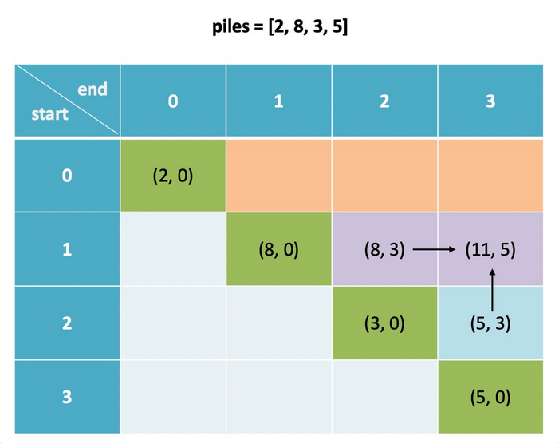

```java
    //定义先手和后手
    class Pair{
        int fir,sec;

        Pair(int fir,int sec){
            this.fir = fir;
            this.sec = sec;
        }
    }

    // 动态规划
    // 状态：
    // Pair[][] dp
    // dp[i][j].fir表示在i-j区间，先手可以拿到的最多的石子数
    // dp[i][j].sec表示在i-j区间，后手可以拿到的最多的石子数
    // 状态转移：选左边，选右边
    // dp[i][j].fir = Math.max(piles[i] + dp[i+1][j].sec,piles[j] + dp[i][j-1].sec)
    // dp[i][j].sec = 
    //     if(dp[i][j].fir==piles[i] + dp[i+1][j].sec) dp[i][j].sec = dp[i+1][j].fir
    //     if(dp[i][j].fir==piles[j] + dp[i][j-1].sec) dp[i][j].sec = dp[i][j-1].fir
    // 初始化：
    // dp[x][x].fir = piles[x]
    // dp[x][x].sec = 0
    // 其他位置为0,0
    // 结果：
    // dp[0][len-1].fir-dp[0][len-1].sec

    public boolean stoneGame(int[] piles) {
        int n = piles.length;
        Pair[][] dp= new Pair[n][n];

        //申请空间
        for (int i = 0; i < n; i++) 
            for (int j = i; j < n; j++)
                dp[i][j] = new Pair(0, 0);
    	
        //初始化,对角线上的值
        //也就是算出的第一个dp所需要的值
        for (int i = 0; i < n; i++) {
            dp[i][i].fir = piles[i];
            dp[i][i].sec = 0;
        }
        
        //开始状态转移
        //由于状态本身，从下往上，从左向右
        //初始值n-1已经计算过了，从n-2开始
        for(int i = n-2;i>=0;i--){
            for(int j = i + 1;j<n;j++){ //j < i没有意义
                int left = piles[i] + dp[i+1][j].sec;
                int right = piles[j] + dp[i][j-1].sec;
                if(left > right){
                    dp[i][j].fir = left;
                    dp[i][j].sec = dp[i+1][j].fir;
                }else{
                    dp[i][j].fir = right;
                    dp[i][j].sec = dp[i][j-1].fir;
                }
            }
        }

        Pair res = dp[0][n-1];
        return res.fir > res.sec;
    }
```

#### 651.[四键键盘](https://labuladong.gitee.io/algo/3/26/94/)

假设你有一个特殊的键盘，上面只有四个键，它们分别是：

1、`A` 键：在屏幕上打印一个 `A`。

2、`Ctrl-A` 键：选中整个屏幕。

3、`Ctrl-C` 键：复制选中的区域到缓冲区。

4、`Ctrl-V` 键：将缓冲区的内容输入到光标所在的屏幕上。

```java
public int maxA(int N) {
    //状态：dp[i]表示按了i-1个操作后，屏幕上a的最大数量
    //转移：
    //j为第一个开始ctrl+v的位置，前面必伴随ctrl+a ctrl+c两个操作，需要计算ctrl+a前一个操作时的a的数量则为dp[j-2]
    //dp[i] = Math.max(dp[i-1]+1,dp[j-2]*(i-j+1))
    //初始化：dp[0] = 0
    //结果：dp[N]
    int[] dp = new int[N + 1];
    dp[0] = 0;
    for (int i = 1; i <= N; i++) {
        // 按 A 键
        dp[i] = dp[i - 1] + 1;
        for (int j = 2; j < i; j++) {
            // 全选 & 复制 dp[j-2]，连续粘贴 i - j 次
            // 屏幕上共 dp[j - 2] * (i - j + 1) 个 A
            dp[i] = Math.max(dp[i], dp[j - 2] * (i - j + 1));
        }
    }
    // N 次按键之后最多有几个 A？
    return dp[N];
}
```


 ### -找规律

#### [剑指 Offer 44. 数字序列中某一位的数字](https://leetcode-cn.com/problems/shu-zi-xu-lie-zhong-mou-yi-wei-de-shu-zi-lcof/)

思路：(有点难受)

根据以上分析，可将求解分为三步：

    确定n所在数字的位数 ，记为digit；
    确定n所在的数字，记为num；
    确定n是num中的哪一数位，并返回结果。


```java
    public int findNthDigit(int n) {
        //1.求位数
        int digit = 1; //位数
        long start = 1; //首位数
        long count = 9; //digit有多少位数
        while (n > count) { // 1.
            n -= count;
            //下一轮的
            digit += 1;
            start *= 10;
            count = digit * start * 9;
        }

        //2.求是哪个数字
        long num = start + (n - 1) / digit; // 2.

        //3.求数字中的第几位
        return Long.toString(num).charAt((n - 1) % digit) - '0'; // 3.
    }
```

#### [剑指 Offer 66. 构建乘积数组](https://leetcode-cn.com/problems/gou-jian-cheng-ji-shu-zu-lcof/)

- 步骤：

  - 不能用除法的情况下，将乘积分为两个部分，当前数之前（左），当前数之后（右），当前数看为1

  - 先将所求空间列出，发现，左半部分是下三角区，右半部分是上三角区，分别计算进行累乘

  - 计算下三角区：b[i] = b[i-1]*a[i-1]

    计算上三角区（从下向上计算，可以将小数的结果复用）：tmp *= a[i+1]; b[i]*= tmp;

  ```java
      //分组进行计算
      //当前下标i的值当做为1
      //分为上下两个三角，分别进行计算，再累乘
      public int[] constructArr(int[] a) {
          if(a==null || a.length < 2) return new int[0];
  
          int[] b = new int[a.length];
          b[0] = 1;
          int index = 1;
          //累乘计算下三角，这循环写得太牛了
          for(int i = 1;i < a.length;i++ ){
              b[i] = b[i-1] * a[i-1];  
          }
          //累乘计算上三角
          //从下往上累乘可以复用结果
          int tmp = 1;
          for(int i=a.length-2;i>=0;i--){
              tmp *= a[i+1];
              b[i] *= tmp;
          }
          return b;
      }
  ```

  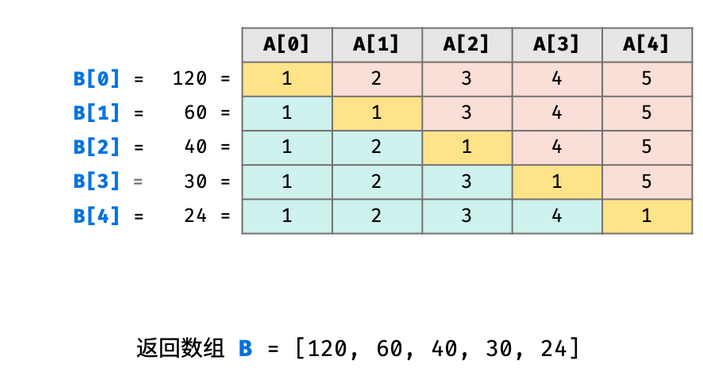
  
  ```java
      //暴力会超时
      // public int[] constructArr(int[] a) {
      //     int[] b = new int[a.length];
      //     Arrays.fill(b,1);
      //     for(int i = 0;i < a.length;i++){
      //         for(int j = 0;j < i;j++){
      //             b[i] *= a[j];
      //         }
      //         for(int j = i+1;j < a.length;j++){
      //             b[i] *= a[j];
      //         }
      //     }
      //     return b;
      // }
  
      //非暴力算法
      //分为上下两个三角
      public int[] constructArr(int[] a) {
          if(a.length==0) return new int[0];
  
          int[] b = new int[a.length];
          b[0] = 1;
  
          //计算下三角
          for(int i = 1;i < a.length;i++){
              b[i] = b[i-1]*a[i-1];
          }
          //计算上三角
          int tmp =1;
          for(int i = a.length-2;i >=0 ;i--){
              tmp = tmp * a[i+1];
              b[i] = b[i] * tmp;
          }
          return b;
      }
  ```
  
  


### - 栈、队列

#### [剑指 Offer 09. 用两个栈实现队列](https://leetcode-cn.com/problems/yong-liang-ge-zhan-shi-xian-dui-lie-lcof/)

```java
 LinkedList<Integer> s1, s2;
    public CQueue() {
        s1 = new LinkedList<Integer>();
        s2 = new LinkedList<Integer>();

    }
    
    public void appendTail(int value) {
        s1.addLast(value);
    }
    
    public int deleteHead() {
        if(!s2.isEmpty()){
            return s2.removeLast();
        }else if(s1.isEmpty()&&s2.isEmpty()){
            return -1;
        }else if(!s1.isEmpty()&&s2.isEmpty(){
            while(!s1.isEmpty()){
                s2.addLast(s1.removeLast());
            }
            return s2.removeLast();
        }
    }
```

-   最垃圾的算法，s1->s2->s1

```java
    Stack<Integer> s1;
    Stack<Integer> s2;

    public CQueue() {
        s1 = new Stack<>();
        s2 = new Stack<>();
    }
    
    public void appendTail(int value) {
        s1.push(value);
    }
    
    public int deleteHead() {
        int res = -1;
        while(!s1.isEmpty()){
            s2.push(s1.pop());
        }
        if(!s2.isEmpty()){
            res = s2.pop();
        }
        while(!s2.isEmpty()){
            s1.push(s2.pop());
        }
        return res;
    }
```

-   优化上一步,s1->s2

```java
    Stack<Integer> s1;
    Stack<Integer> s2;

    public CQueue() {
        s1 = new Stack<>();
        s2 = new Stack<>();
    }
    
    public void appendTail(int value) {
        s1.push(value);
    }

    public int deleteHead() {
        int res = -1;
        while(!s2.isEmpty()){
            return s2.pop();
        }
        //s2为空，s1不为空
        while(!s1.isEmpty()){
            s2.push(s1.pop());
        }
        if(!s2.isEmpty()){
            res = s2.pop();
        }
        return res;
    }
```


#### [剑指 Offer 30. 包含min函数的栈](https://leetcode-cn.com/problems/bao-han-minhan-shu-de-zhan-lcof/)

```java
    Stack<Integer> s1;
    Stack<Integer> s2;
    public MinStack() {
        s1 = new Stack<>(); //正常栈
        s2 = new Stack<>(); //辅助栈，要求最小值在栈顶,不用所有元素都进辅助栈，找到最小就好

    }
    
    public void push(int x) {
        s1.add(x);
        if(s2.empty() || x <= s2.peek()){
            s2.add(x);
        }
    }
    
    public void pop() {
        //注意此处stack里放的是Integer，
        int x = s1.pop();
        if(!s2.empty() && x==s2.peek()){
            s2.pop();
        }
    }
    
    public int top() {
        return s1.peek();
    }
    
    public int min() {
        return s2.peek();
    }
```

```java

    Stack<Integer> s1;
    Stack<Integer> s2;

    /** initialize your data structure here. */
    public MinStack() {
        s1 = new Stack<>();
        s2 = new Stack<>();
    }
    
    public void push(int x) {
        s1.push(x);
        if(!s2.isEmpty() && s2.peek() < x) return;
        s2.push(x);
    }
    
    public void pop() {
        int x = s1.pop();
        if(!s2.isEmpty() && x==s2.peek()){
            s2.pop();
        }
    }
    
    public int top() {
        if(!s1.isEmpty()){
            return s1.peek();
        }else{
            return -1;
        }
    }
    
    public int min() {
        // System.out.print(s2);
        if(!s2.isEmpty()){
            return s2.peek();
        }else{
            return -1;
        }
    }
```


#### *[剑指 Offer 31. 栈的压入、弹出序列](https://leetcode-cn.com/problems/zhan-de-ya-ru-dan-chu-xu-lie-lcof/)

- 遍历popped数组，快

  ```java
          Stack<Integer> s = new Stack<>();
          int index = 0; //控制pushed
          int i = 0; //控制popped
          while(i < popped.length){
              if(s.empty() || (!s.empty() && s.peek()!=popped[i])){
                  while(index < pushed.length && pushed[index]!=popped[i] ){
                      s.push(pushed[index]);
                      index++;
                  }
              }
              if(index < pushed.length && pushed[index]==popped[i]){
                  s.push(pushed[index]);
                  index++;
              }
              if(popped[i]==s.peek()){
                  s.pop();
                  i++;
              }else{
                  return false;
              }
          }
          return true;
      }
  ```

- 遍历pushed数组,慢

  ```java
      public boolean validateStackSequences(int[] pushed, int[] popped) {
          Stack<Integer> s = new Stack<>();
          int i = 0;//控制popped的下标
          for(int num:pushed){
              s.push(num);
              while(!s.empty() && s.peek() == popped[i]){
                  s.pop();
                  i++;
              }
          }
          return s.empty();
      }
  ```

-   要注意遍历push数组的时候，先让数据入栈，再看是否出栈，不要ran在一起

    ```java
        public boolean validateStackSequences(int[] pushed, int[] popped) {
            Stack<Integer> s = new Stack<>();
    
            int pop = 0;
            for(int num:pushed){
                s.push(num);
                while(!s.isEmpty() && s.peek()==popped[pop]){
                    s.pop();
                    pop++;
                }
                //不要写成这样，s为空的时候，pop就越界了
                while(!s.isEmpty() && s.peek()==popped[pop++]){
                    s.pop();
                }
            }
            return s.isEmpty();
        }
    ```

    


#### *[剑指 Offer 59 - II. 队列的最大值](https://leetcode-cn.com/problems/dui-lie-de-zui-da-zhi-lcof/)

>   //维持队列单调递减

- 双端队列，保持辅助队列中，队头为最大

  ```java
      LinkedList<Integer> q1;
      LinkedList<Integer> q2;
      public MaxQueue() {
          q1 = new LinkedList<>(); //队列，队尾为最大值getLast()，从队头出
          q2 = new LinkedList<>(); //正常队列
      }
      
      public int max_value() {
          if(q2.isEmpty()){
              return -1;
          }else{
              return q2.getLast();
          }
      }
      
      public void push_back(int value) {
          q2.add(value);
          if(!q1.isEmpty() && value > q1.getLast()){
              q1.add(value);
          }else if(q1.isEmpty()){
              q1.add(value);
          }
      }
      
      public int pop_front() {
          if(q2.isEmpty()){
              return -1;
          }
          int cur = q2.removeFirst();
          if(!q1.isEmpty() && cur==q1.getFirst()){
              q1.removeFirst();
          }
          return cur; 
      }
  ```

-   思路是对的，代码实现太粗心了，栈和队列的操作要记熟

    尤其是双端队列

    队列是offer poll

    栈是push pop

    ```java
        LinkedList<Integer> q1;
        LinkedList<Integer> q2;
    
        public MaxQueue() {
            q1 = new LinkedList<>(); //正常队列
            q2 = new LinkedList<>(); //只存比当前头小的，大的都删了
        }
        
        public int max_value() {
            if(!q2.isEmpty()){
                return q2.peek();
            }else{
                return -1;
            }
        }
        
        public void push_back(int value) {
            q1.offer(value);
            //注意脑袋里想的是对的，代码实现错了
            //和队列的尾比较
            while(!q2.isEmpty() && q2.peekLast() < value){
                q2.pollLast();
            }
            q2.offer(value);
        }
        
        public int pop_front() {
            if(q1.isEmpty()) return -1;
            int res = q1.poll();
            if(!q2.isEmpty() && q2.peek()==res){
                q2.poll();
            }
            return res;
        }
    ```

    

#### **[剑指 Offer 59 - I. 滑动窗口的最大值](https://leetcode-cn.com/problems/hua-dong-chuang-kou-de-zui-da-zhi-lcof/)

>   //维持队列的单调递减

一点也想不起来单调队列的方法...

还是注意双端队列的使用...

- 暴力

  ```java
      public int[] maxSlidingWindow(int[] nums, int k) {
          if(nums==null||nums.length < 1 ) return new int[0];
          int[] res = new int[nums.length-k+1];
          int start = 0, end = k-1;
          while(start <= nums.length-k){
              //数组copy
              int tmp[] = Arrays.copyOfRange(nums, start, end+1);
              //数组求最大
              res[start] = Arrays.stream(tmp).max().getAsInt();
              start++;
              end++;
          }
          return res;
      }
  ```

- 单调队列

  其使用 单调栈 实现了随意入栈、出栈情况下的 O(1)时间获取 “栈内最小值” 。本题同理，不同点在于 “出栈操作” 删除的是 “列表尾部元素” ，而 “窗口滑动” 删除的是 “列表首部元素” 。

  窗口对应的数据结构为 双端队列 ，本题使用 单调队列 即可解决以上问题。遍历数组时，每轮保证单调队列 deque ：

  - deque内 仅包含窗口内的元素 
  - deque内的元素 非严格递减 

  ```java
      public int[] maxSlidingWindow(int[] nums, int k) {
          if(nums.length == 0 || k == 0) return new int[0];
          LinkedList<Integer> q = new LinkedList<>(); //定义一个双端队列，维护非严格递减序列（队头为最大）
          int[] res = new int[nums.length - k + 1];
  
          //当没有形成窗口前
          for(int i=0;i < k;i++){
              while(!q.isEmpty() && q.getLast() < nums[i]){
                  q.removeLast();
              }
              q.addLast(nums[i]);
          }
  
          //形成窗口后
          res[0] = q.getFirst();
          for(int i = k;i < nums.length;i++){
              if(q.getFirst()==nums[i-k]){ //第一个被移除的元素
                  q.removeFirst();
              }
              while(!q.isEmpty() && q.getLast() < nums[i]){
                  q.removeLast();
              }
              q.addLast(nums[i]);
              res[i-k+1] = q.getFirst();
          }
          return res;
      }
  ```

- 时间复杂度分析

  **暴力：** O((n−k+1)k)≈O(nk) 。

  设数组 nums的长度为 n，则共有 (n-k+1)个窗口；
  获取每个窗口最大值需线性遍历，时间复杂度为 O(k) 。

  **单调双端队列：**O(2n) 

  其中 n为数组 nums长度；线性遍历 nums 占用 O(n；每个元素最多仅入队和出队一次，因此单调队列 deque 占用 O(2n) 

  


### - 其他

#### [剑指 Offer 43. 1～n 整数中 1 出现的次数](https://leetcode-cn.com/problems/1nzheng-shu-zhong-1chu-xian-de-ci-shu-lcof/)

分析：


```java
    public int countDigitOne(int n) {
        int res = 0, digit = 1;//digit表示位数，1为个数，10为十位，100为百位
        int low = 0;
        int cur = n%10; //求n的个位
        int high = n/10; //求n的十位
        //计算当前位为1的可能性
        while(high!=0 || cur!=0 ){   //high 和 cur 同时为 0 时，说明已经越过最高位，因此跳出
            if(cur > 1){
                res += (high + 1)*digit;  //每种情况进行分析
            }else if(cur == 1){
                res += high*digit + low+1;
            }else{
                res += high*digit;
            }

            //下一轮变量的值
            low = cur * digit + low;
            cur = high % 10; //目前高位的个位
            high /= 10; //求目前高位的十位
            digit *= 10;
        }
        return res;
    }
```

#### [剑指 Offer 15. 二进制中1的个数](https://leetcode-cn.com/problems/er-jin-zhi-zhong-1de-ge-shu-lcof/)

- 无符号右移

  ```java
      public int hammingWeight(int n) {
          int res = 0;
          while(n!=0){
              res += n&1;
              n>>>=1;  //无符号右移
          }
          return res;
      }
  ```

  >   右移>> ：该数对应的二进制码整体右移，左边的用原有标志位补充，右边超出的部分舍弃。
  >
  >   无符号右移>>> ：不管正负标志位为0还是1，将该数的二进制码整体右移，左边部分总是以0填充，右边部分舍弃。

- 消除最右边的1

  ```java
      public int hammingWeight(int n) {
          int res = 0;
          while(n!=0){    //每一次循环都能消除最右边的1
              res++;
              n = n&(n-1);  //消除最右边的1
          }
          return res;
      }
  ```

#### *[剑指 Offer 17. 打印从1到最大的n位数](https://leetcode-cn.com/problems/da-yin-cong-1dao-zui-da-de-nwei-shu-lcof/)

>   如果没有规定n最大多大，则需要考虑大数问题
>
>   第一种是用字符串模拟加法以及打印
>
>   第二种是考虑利用全排列的方式以及打印

- 不考虑大数

  ```java
   public int[] printNumbers(int n) {
          int i = 0;
          int len = (int)Math.pow(10,n)-1;
          int[] res = new int[len];
          
          while(i < len){
              res[i] = i + 1;
              i++;
          }
  
          return res;
          
      }
  ```

- 考虑大数,全排列，递归回溯问题

  ```java
      //大数，要当做字符串处理，全排列问题
      //利用了额外空间，不用回溯
      int res[];
      int count = 0; //控制res
      char[] num;
      int n;
      public int[] printNumbers(int n) {
          this.n = n;
          res = new int[(int)Math.pow(10,n)-1];
          num = new char[n];
          dfs(0);
          return res;
      }
  
      //x表示当前位置
      public void dfs(int x){  //x表示当前位置
          if(x == n){
              String s = String.valueOf(num);
              int curNum = Integer.parseInt(s); //会自动把字符串前面无效的0去掉
              if(curNum!=0) res[count++] = curNum;
              return;
          }
  
          for(char i='0';i <='9';i++){
              num[x] = i;
              dfs(x+1);
          }
      }
  ```

-   注意在哪回溯的问题

    ```java
        int[] res;
        int k = 0;
        int n;
        LinkedList<Character> path=new LinkedList<Character>();
        public int[] printNumbers(int n) {
            //全排列
            this.n = n;
            res = new int[(int)Math.pow(10,n)-1];
            dfs(n);
            return res;
        }
    
        public int prepare(LinkedList<Character> num){
            boolean flag = false;
            int ans = 0;
            for(int i = 0;i < num.size();i++){
    
                if(flag==false && num.get(i)!='0'){
                    flag=true;
                }
                if(flag){
                    ans = ans * 10 + Integer.valueOf(num.get(i)-'0');
                }
            }
            return ans;
        }
    
        public void dfs(int n){
            System.out.println("0path:" + path);
            if(path.size()==n){
                int ans = prepare(path);
                // System.out.println("path:" + path + "\tans:" + ans);
                if(ans!=0) res[k++] = ans;
                // path.removeLast();
                System.out.println("return：path:" + path);
                return;
            }      
            
            for(char i = '0';i <= '9';i++){
                path.add(i);
                dfs(n);
                //什么时候回溯呢，肯定是0-9都遍历完了才回溯，而不是说return就要回溯
                path.removeLast();
            }
            System.out.println("=====:path:" + path);
        }
    ```

    


### - 位运算

#### *[剑指 Offer 65. 不用加减乘除做加法](https://leetcode-cn.com/problems/bu-yong-jia-jian-cheng-chu-zuo-jia-fa-lcof/)

利用位运算：将问题分解为【无进位加法+进位】

无进位加法：异或【这部分用什么位运算可以通过结果进行考虑】

进位：与运算后左移1（只是进位）

（和 s ）=（非进位和 n ）+（进位 c）。即可将 s=a+b转化为：s=a+b⇒s=n+c

循环求 n和 c ，直至进位 c=0；此时 s=n，返回 n 即可

不用考虑负数，负数是一样的

>   异或运算：相同为0，相异为1
>
>   注意：10001 ^ 101 = 10100 (嗯对着呢)
>
>   进位：10001 & 101 = 00001 左移：00010
>
>   相加：10110

- 递归

  ```java
      public int add(int a, int b) {
          
          if(b==0) return a;
          
          //无进位加法
          int num1 = a ^ b ;
          //进位
          int num2 = (a & b) << 1;
               
          //此处无进位和进位也是相加的关系，所以递归调用
          return add(num1,num2);
  
      }
  ```

- 迭代

  ```java
      //迭代
      public int add(int a, int b) {
          while(b != 0) { // 当进位为 0 时跳出
              int c = (a & b) << 1;  // c = 进位
              a ^= b; // a = 非进位和
              b = c; // b = 进位
          }
          //b==0了
          return a;
      }
  ```

#### *[剑指 Offer 56 - I. 数组中数字出现的次数](https://leetcode-cn.com/problems/shu-zu-zhong-shu-zi-chu-xian-de-ci-shu-lcof/)

- 寻找最右侧的1进行分组

  注意避坑：只是用了位运算但没有位移操作，得出的结果不是0或1

  ```java
      public int[] singleNumbers(int[] nums) {
          int n = 0; 
          int m = 1; //寻找最右侧的1
          int a = 0,b=0; //表示那两个数
          //1. n = a^b
          for(int num:nums){
              n ^= num;
          }
               
          //2. 从右向左，找到第一个a和b中第一个不一样的数，进行分组
          //由于a!=b!=0（等于0是必须每一位都为0），则必然有一位是1，我们可以先找到最右侧的1，将a和b进行分组
          //(a=1&&b=0)  || (a=0&&b=1)
  
          //m为找到最右侧的1的位置（a或者b中
          while((n&m)==0){
              m <<= 1;
          }
  		
          //3. 利用m进行分组
          for(int num:nums){
              if((num&m)!=0){   
              // 没有位移操作，不能直接比1
              // 此处判断的两种情况相当于 num&m==m 和 num&m==0 而不是0和1
              // if((num&m)==1){
                  a ^= num; 
              }else{
                  b^=num;
              }
          }
  
          return new int[]{a,b};
      }
  ```

#### *[剑指 Offer 56 - II. 数组中数字出现的次数 II](https://leetcode-cn.com/problems/shu-zu-zhong-shu-zi-chu-xian-de-ci-shu-ii-lcof/)

- 遍历：统计每个位上1的个数count[]，对count模3，剩下的数即为所求

  

  ```java
      public int singleNumber(int[] nums) {
          int[] count = new int[32];
          //统计好每一位为1的数量
          for(int num:nums){
              for(int i=0;i<32;i++){
                  count[i] += num&1;
                  //num右移
                  num >>>=1; //此时在最低位,为了判断下一个高位，需要右移
              }
          }
  
          int res = 0,m=3;
          for(int i= 0;i<32;i++){
              res <<= 1;   //是因为下面的语句最先变的，为了不影响res
              res |= count[31-i] % m;  //或等 4|1 = 5;
          }
          return res;
      }
  ```

-   感觉这样更好理解

    ```java
        public int singleNumber(int[] nums) {
            //1.统计每一位中1的个数
            int[] cnt = new int[32];
            for(int num:nums){
                for(int i = 0;i < 32;i++){
                    if((num & 1)==1) cnt[i] += 1;
                    // cnt[i] += num&1;
                    num = num >>> 1;
                }
            }
    
            //2.对每一位的1%3
            for(int i=0;i < 32;i++){
                cnt[i] = cnt[i] % 3;
            }
    
            // System.out.println(Arrays.toString(cnt));
    
            //3.对应求该数
            int res = 0;
            int n = 1;
            for(int i = 0;i < 32;i++){
                res += cnt[i] * n;
                n = n << 1;  
            }
    
            return res;
        }
    ```

    

#### [剑指 Offer 29. 顺时针打印矩阵](https://leetcode-cn.com/problems/shun-shi-zhen-da-yin-ju-zhen-lcof/)

- 定义上下左右四个边界， “从左向右、从上向下、从右向左、从下向上” 四个方向循环

  

  ```java
      public int[] spiralOrder(int[][] matrix) {
          if(matrix.length==0) return new int[0];
  
          //定义上下左右四个边界
          int l = 0,r = matrix[0].length-1, t = 0, b = matrix.length-1;
          int[] res = new int[(r+1)*(b+1)];
          int idx = 0;
          
          while(true){
              for(int i = l;i <= r;i++) res[idx++] = matrix[t][i];
              if(++t > b) break;
              for(int i = t;i <= b;i++) res[idx++] = matrix[i][r];
              if(--r < l) break;
              for(int i = r;i >=l ;i--) res[idx++] = matrix[b][i];
              if(--b < t) break;
              for(int i = b;i >=t ;i--) res[idx++] = matrix[i][l];
              if(++l > r) break;
          }
  
          return res;
      }
  ```

  


### -字符串

#### [647. 回文子串](https://leetcode-cn.com/problems/palindromic-substrings/)

- 中心扩展法

  ```java
      //中心扩展法
      //从左到右，依次以字符为中心轴进行判断，双指针
      //但是要注意偶数长度的子串的遍历，并不是以某个字符为轴对称，需要将中心点由一个扩展到2个
      //例如：ababa
      //abab这个字符串并不是某个字符的中心点，无法遍历到，则无法判断是否是回文
  
      public int countSubstrings(String s) {
          int l = 0,r = 0;
          int count = 0;
          for(int i=0;i < s.length();i++){
              count += help(s,i,i);   //中心轴为一个字符（子串为奇数的长度）
              count += help(s,i,i+1); //中心轴为两个字符（子串为偶数的长度）
          }
          return count;
      }
  
      public int help(String s, int l, int r){
          int count = 0;
          while(l>=0 && r< s.length() && s.charAt(l)==s.charAt(r)){
              count++;
              l--;
              r++;
          }
          return count;
      }
  ```

#### **[696. 计数二进制子串](https://leetcode-cn.com/problems/count-binary-substrings/)

>   注意该题的思路！
>
>   对字符串进行分组，求相邻的情况，分组分组分组

- 对字符进行分组

  我们可以将字符串 s按照 000 和 111 的连续段分组，存在 counts 数组中，例如 s=00111011，可以得到这样的 counts 数组：counts={2,3,1,2}。

  这里 counts 数组中两个相邻的数一定代表的是两种不同的字符。假设 counts 数组中两个相邻的数字为 u或者 v，它们对应着 u个 0和 v个 1，或者 u个 1 和 v个 0。它们能组成的满足条件的子串数目为 min⁡{u,v}，即一对相邻的数字对答案的贡献。

  ```java
   public int countBinarySubstrings(String s) {
          List<Integer> counts = new ArrayList<>();
          int index = 0;
          char pre = s.charAt(index);
          
          //先对连续的字符串进行分组
          //记录pre的方式
          int count = 0;
          // while(index < s.length()){
          //     char cur = s.charAt(index);
          //     if(pre==cur){
          //         count++;
          //     }else{
          //         counts.add(count);
          //         count = 1;
          //     }
          //     pre = cur;
          //     index++;
          // }
          // counts.add(count);
  
          //先对连续的字符串进行分组
          //双层循环的方式
          while(index < s.length()){
              char cur = s.charAt(index);
              count = 0;
              while(index < s.length() && s.charAt(index)==cur){
                  count++;
                  index++;
              }
              counts.add(count);
          }
  
          //再对分组数组取最小
          index = 0;
          int res = 0;
          while(index < counts.size()-1){
              res += Math.min(counts.get(index),counts.get(index + 1));
              index++;
          }
          return res;
  
      }
  ```

- 针对上一种方式的优化，利用滑动数组的思想

  ```java
      //优化：只关注上一个和当前的count的数目的最小值
      public int countBinarySubstrings(String s) {    
          int index = 0;
          int preCount = 0;
          int res = 0;
          while(index < s.length()){
              int count = 0; 
              char cur = s.charAt(index);
              while(index < s.length() && s.charAt(index)==cur){
                  count++;
                  index++;
              }
              res += Math.min(count,preCount);
              preCount=count;
          }
          return res;
           
      }
  ```

-   三刷

    ```java
    public int countBinarySubstrings(String s) {
            //先将s按不同的0，1进行分组
            List<Integer> group = new ArrayList<>();
    
            char pre = '2';
            
            for(int i = 0,idx = 0;i < s.length();i++){
                char c = s.charAt(i);
                if(pre!='2' && pre==c){
                    group.set(idx,group.get(idx)+1);
                }else if (pre!='2' && pre!=c){
                    group.add(1);
                    idx++;
                }else if(pre=='2'){
                    group.add(1);
                }
                pre = c;
            }   
    
            //取相邻的最小值即为贡献的个数
            int cnt = 0;
            for(int i = 0;i < group.size()-1;i++){
                int l = group.get(i);
                int r = group.get(i+1);
                cnt += Math.min(l,r);
            }
    
            return cnt;
    
        }
    ```

    ```java
        public int countBinarySubstrings(String s) {
            //方法二：滑动数组优化
            int idx = 0;
            int res = 0; //结果
            int preCnt = 0; //上一个的值
            while(idx < s.length()){
                char c = s.charAt(idx);
                int cnt = 0; //当前的cnt
                while(idx < s.length() && s.charAt(idx) == c){
                    cnt++;
                    idx++;
                }
                res += Math.min(cnt,preCnt);
                preCnt = cnt;
            }
            return res;
        }
    ```

    ```java
        public int countBinarySubstrings(String s) {
            char[]  cs = s.toCharArray();
    
            ArrayList<Integer> group = new ArrayList<>();
    
            for(int i = 0;i < cs.length;i++){
                if(i-1 >= 0 && cs[i]==cs[i-1]){
                    group.set(group.size()-1,group.get(group.size()-1)+1);
                }else{
                    group.add(1);
                }
            }
    
            int res = 0;
            for(int i = 1;i < group.size();i++){
                res += Math.min(group.get(i-1),group.get(i));
            }
    
            // System.out.println(group);
            return res;
        }
    ```
    
    


#### **[227. 基本计算器 II](https://leetcode-cn.com/problems/basic-calculator-ii/)

- 利用双栈，操作栈，数字栈

- 两个坑：要注意加入和pop操作栈的时候，需要用循环的方式，因为这是保证从左往右的方式，而不是同级的放在最后从右向左计算，就会发生错误；第二个坑，要注意判断连续数字的时候，出循环后i会多1，要减掉。

  ```java
      public int calculate(String s) {
          //定义优先级
          HashMap<Character,Integer> priority = new HashMap<>();
          //定义数字栈和操作栈
          Stack<Integer> nums = new Stack<>();
          Stack<Character> ops = new Stack<>();
  
          //添加优先级
          priority.put('+',1);
          priority.put('-',1);
          priority.put('*',2);
          priority.put('/',2);
  
          //进行运算
          //处理字符串开头有负号的情况
          //题目要求非负，可以不加
          // s = '0' + s;
          //保证了同级运算中**从左到右**的顺序，不然会出错
          int i = 0;
          while(i < s.length()){
              // char cur = s.charAt(i);
  
              //处理空格
              if(s.charAt(i)==' ')  {
                  i++;
                  continue;
              }
              //读取一个连续的数字,并转为数字
              String tmp = "";
              // System.out.println("i"+ i+ "\tcur:"+ s.charAt(i));
              while(i<s.length() && s.charAt(i) >='0' && s.charAt(i) <='9'){
                  tmp += s.charAt(i);
                  // System.out.println("cur:"+ s.charAt(i) + "tmp:"+tmp +"\t");
                  i++;
                  //可能会多加一个1
              }
              // System.out.println("i"+ i + "tmp" + tmp);
              // System.out.println(nums + "  " + ops);
  
              if(!tmp.isEmpty()){
                  int num = Integer.parseInt(tmp);
                  nums.add(num);
                  // System.out.println("num:"+ num + "nums:"+nums +"\t");
              }else{ //操作符
                  // System.out.println("i: "+ i + "tmp: "+ tmp + " ops: " + ops + " cur:"+s.charAt(i) + "nums"+nums);
              //此处有大坑！！！注意，当操作符为统一级的时候，为了保证从左到右依次计算，应该用循环，将等于的操作都做完，再入栈
              //而不是简单的if判断，这样会导致同级运算一直被留在栈里，最后出栈的时候，同级运算变成从右向左了
                  // if(s.charAt(i)==' ')  {
                  //     i++;
                  //     continue;
                  // }
                  // // System.out.println("i: "+ i + "tmp: "+ tmp + " ops: " + ops + " cur:"+s.charAt(i) + "nums"+nums);
  
                  // if(!ops.isEmpty()){
                  //     if(priority.get(ops.peek()) < priority.get(s.charAt(i))){  //操作栈的优先级低
                  //         ops.add(s.charAt(i));
                  //     }else{  //操作栈的优先级高
                  //         operate(nums,ops);
                  //         ops.add(s.charAt(i));
                  //     }
                  // }else{ //操作栈为空直接加
                  //     ops.push(s.charAt(i));
  
                  while(!ops.isEmpty() && priority.get(ops.peek()) >= priority.get(s.charAt(i))){
                      operate(nums,ops);
                  }
                  ops.add(s.charAt(i));
              }
              if(tmp.isEmpty()){
                  i++;
              }
          }
  
          // System.out.println(nums + "  " + ops);
          while(!ops.isEmpty()){
              operate(nums,ops);
              // System.out.println(nums + "  " + ops);
          }
          return nums.pop();
      }
  
  
      //从双栈取数进行操作
      public void operate(Stack<Integer> nums,Stack<Character> ops){
          int num1 = nums.pop();
          int num2 = nums.pop();
          char op = ops.pop();
  
          if(op=='+'){
              nums.push(num2 + num1);
          }else if(op=='-'){
              nums.push(num2 - num1);
          }else if(op=='*'){
              nums.push(num2 * num1);
          }else{
              nums.push(num2 / num1);
          }
      }
  ```

-   二刷

    >   发现第二次做的时候知道第一个坑，但是不知道怎么避免，看了以后才知道，比较当前符号和符号栈栈顶的优先级
    >
    >   然后第一个坑没有了，应该多少有点实现上的不同

    ```java
        public int calculate(String s) {
            //定义计算器的操作优先级
            HashMap<Character,Integer> priority = new HashMap<>();
            Stack<Character> operator = new Stack<>();
            Stack<Integer> nums = new Stack<>();
    
            priority.put('+',0);
            priority.put('-',0);
            priority.put('*',1);
            priority.put('/',1);
    
            int idx = 0;
            while(idx < s.length()){
                //处理空格
                if(s.charAt(idx) ==' ') {
                    idx++;
                    continue;
                }
    
                //读取一个连续的数字,并转为数字,加入操作数栈
                StringBuilder tmp = new StringBuilder();
                while(idx < s.length() && s.charAt(idx) >= '0' && s.charAt(idx) <= '9'){
                    tmp.append(s.charAt(idx));
                    idx++;
                }
    
                if(!tmp.isEmpty()){
                    int num = Integer.parseInt(tmp.toString());
                    nums.push(num);
                }
                
    
                //有可能有空格
                if(idx < s.length() && s.charAt(idx) ==' ') {
                    idx++;
                    continue;
                }
    
                //操作符,此处要用循环，因为计算一次，nums就会多加入一个num
                // System.out.println("idx:" + idx );
                // System.out.println("nums:" + nums );
                // System.out.println("opts:" + operator );
                while(idx < s.length() && !operator.isEmpty() && priority.get(operator.peek()) >= priority.get(s.charAt(idx))){
                    // System.out.println(operator.peek() + "," + s.charAt(idx));
                    opt(nums,operator);
                }
    
                //如果operation为空或者操作数优先级高
                if(idx < s.length()){
                    operator.push(s.charAt(idx));
                    idx++;
                }
            }
    
            while(!operator.isEmpty()){
                opt(nums,operator);
            }
            return nums.peek();
        }
    
    
        //利用操作数和操作符进行一次计算
        void opt(Stack<Integer> nums,Stack<Character> operator){
            int two = nums.pop();
            int one = nums.pop();
            int o = operator.pop();
            int res = 0;
            if(o=='+') res = one + two;
            else if(o=='-') res = one - two;
            else if(o=='*') res = one * two;
            else if(o=='/') res = one / two;
            nums.push(res);
        }
    ```

-   单栈法【简洁的写法，太强了，不刷个多少遍写不出来吧】

    ```java
        //利用单栈法
        //由于乘除优先于加减计算，因此不妨考虑先进行所有乘除运算，并将这些乘除运算后的整数值放回原表达式的相应位置，则随后整个表达式的值，就等于一系列整数加减后的值。
        //加号：将数字压入栈；
        //减号：将数字的相反数压入栈；
        //乘除号：计算数字与栈顶元素，并将栈顶元素替换为计算结果
        public int calculate(String s) {
            Stack<Integer> stack = new Stack<>();
            char opt = '+'; //这块是上一个操作符的值
            int num = 0;
    
            for(int idx = 0;idx < s.length();idx++){
                if(Character.isDigit(s.charAt(idx))){
                    num = num * 10 + s.charAt(idx) - '0';
                }
                //最后一个字符无论是否是数字都要进行和操作符一样的操作
                if(!Character.isDigit(s.charAt(idx)) && s.charAt(idx)!=' ' || idx==s.length()-1){
                    switch(opt){
                        case '+':
                            stack.push(num);
                            break;
                        case '-':
                            stack.push(-num);
                            break;
                        case '*':
                            stack.push(stack.pop()*num);
                            break;
                        case '/':
                            stack.push(stack.pop()/num);
                            break;
                    }
                    //更新
                    opt = s.charAt(idx);
                    num = 0;
                }
            }
    
            int res = 0;
            while(!stack.isEmpty()){
                res += stack.pop();
            }
            return res;
        }
    ```

    


#### ***[28. 实现 strStr()](https://leetcode-cn.com/problems/implement-strstr/)

>   大概理解了不懂就背吧
>
>   需要彻底搞懂next的含义
>
>   **PMT中的值是字符串的前缀集合与后缀集合的交集中最长元素的长度**（不是个数）
>
>   next是pmt右移的结果
>
>   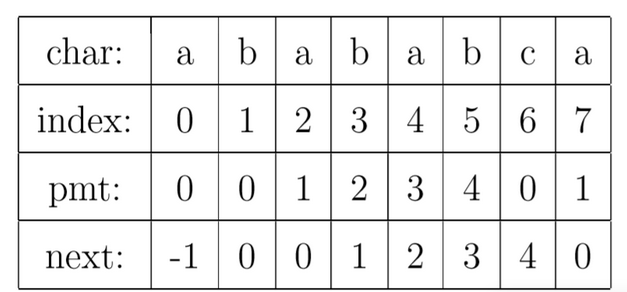
>
>   想明白next怎么计算：
>
>   前缀、后缀、要比较的数cn，idx
>
>   cn = num, cn是当前要比较的数，也就意味着[0,cn-1]中，有num个数(前缀)，和[0,idx-1]的后缀是相同的,
>    所以是++cn;

- KMP

  ```java
      public int strStr(String haystack, String needle) {
          if(needle.isEmpty()) return 0;
  
          if (haystack == null ||  needle.length() < 1 || haystack.length() < needle.length()) {
              return -1;
          }
  
          char[] h = haystack.toCharArray(); //母串
          char[] n = needle.toCharArray(); //子串
  
          int x = 0; //母串下标
          int y = 0; //子串下标
          
          //O(N)
          int[] next = getNext(n);
          while(x < h.length && y < n.length){
              if(h[x] == n[y]){
                  x++;
                  y++;
              }else if(next[y]==-1){  //y = 0;
                  x++; 
              }else{
                  y = next[y];
              }
          }
  
          return y==n.length? x-y : -1;
  
      }
  
      //只和子串有关
      public int[] getNext(char[] n){
          if(n.length==1) return new int[]{-1};
  
          int[] next = new int[n.length];
          next[0] = -1;
          next[1] = 0;
          int index = 2;
          int cn = 0;  //当前需要比较的位置，同时也是值,
          //cn = num,cn是当前要比较的数，也就意味着[0,cn-1]中，有num个数(前缀)，和[0,idx-1]的后缀是相同的,
          //所以是++cn;
          while(index < n.length){
              if(n[index-1] == n[cn]){   //注意此处是index-1,因为前一个就不包含他本身
                  //这句话一定死记硬背住
                  //不可以这样写,记住就好了！！！！！
                  // next[idx++] = next[idx-1] + 1;
                  // cn++;
                  next[index++] = ++cn;  //此处是++cn
              }else if(cn > 0){  //为什么没有等  cn=0的时候是-1
                  cn = next[cn];
              }else{
                  next[index++] = 0;  //没有前后缀是0
              }
          }
          
          return next;
      }
  ```
  
-   更好的KMP（不要看了）

    求next

    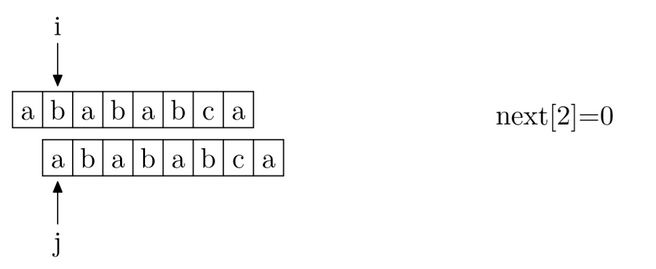

    ```java
    // N   O(N)
        public int strStr(String haystack, String needle) {
            if(needle.isEmpty()) return 0;
            
            if(haystack==null || needle.length() < 1 || haystack.length() < needle.length()) return -1;
    
            char[] h = haystack.toCharArray();
            char[] n = needle.toCharArray();
    
            //获取next数组
            int[] next = getNext(n); //next[i]  match中i之前的字符串match[0..i-1]
            int x = 0; //母串位置
            int y = 0; //子串位置
            //kmp算法
            while( x < h.length && y < n.length){
                if(h[x]==n[y]){ //如果相等，则都往后移
                    x++;
                    y++;
                }else if (next[y]==-1){ //也就是y==0了，回退得不能再回退了，则在母串中换个位置重新匹配
                    x++;
                }else{
                    y = next[y]; //不相等，子串位置回退到最大前缀的下一个
                }
            }
            //子串到头就匹配上了，初始匹配位是x-y
            //母串到头没有匹配上，说明没子串
            return y==n.length? x-y:-1;
        }
    	
    
    	////next[i]  match中i之前的字符串match[0..i-1]
        //子串为主字符串，以子串的前缀为目标字符串
    	//从子字符串的第一位(注意，不包括第0位)开始对自身进行匹配运
        // M   O(M)
        //只跟子串有关
        public int[] getNext(char[] n){
            if (n.length==1) return new int[]{-1};
    
            int[] next = new int[n.length];
    
            next[0] = -1; //人为规定
            next[1] = 0;
            int x = 1, y = 0;  //x是母串,y是子串，从第一位开始对自身做匹配
            while(x < n.length){
                if(y==-1 || n[x]==n[y]){ //由于y = next[y]，所以会有y=-1的情况;
                    x++;
                    y++;
                    if(x < n.length)
                        next[x] = y;
                }
                else{
                    y = next[y];
                }
            }
    
            return next;
        }
    ```


-   真的好难

    ```java
        public int strStr(String haystack, String needle) {
            char[] h = haystack.toCharArray();
            char[] n = needle.toCharArray();
    
            if(h.length==0 ||h.length < n.length) return -1;
            if(n.length==0) return 0;
            int idx1 = 0,idx2 = 0;
            
            int[] need = findNeed(n);
    
            while(idx1 < h.length && idx2 < n.length){
                if(h[idx1]==n[idx2]){
                    idx1++;
                    idx2++;
                }else if(need[idx2] == -1){
                    //初始没有匹配上也是这里
                    //开始匹配但不相等，也在这里
                    idx1++;
                }else{
                    idx2 = need[idx2];
                }
            }
    
            return idx2==n.length?idx1-idx2:-1;
        }
    
        public int[] findNeed(char[] n){
            if(n.length==1) return new int[]{-1};
            
            int[] need = new int[n.length];
            need[0] = -1;
            need[1] = 0;
            int idx = 2;
            int cn = 0;
            while(idx < n.length){
                if(n[cn]==n[idx-1]){
                    need[idx++] = ++cn;
                }else if(cn > 0){
                    cn = need[cn];
                }else{
                    need[idx++] = 0;
                }
            }
            return need;
        }
    ```

    

#### *[剑指 Offer 46. 把数字翻译成字符串](https://leetcode-cn.com/problems/ba-shu-zi-fan-yi-cheng-zi-fu-chuan-lcof/)

>   动态规划的下标定义

- 从左向右递归

  ```java
      public int translateNum(int num) {
          if(num==0) return 1;
          String str = String.valueOf(num);
          char[] strs = str.toCharArray();
          return dfs(strs,0);
      }
  
      //i之前的位置，如何转化已经做过决定了
  	//i...有多少种转化结果
      public int dfs(char[] nums, int i){
          if(i==nums.length)  //最后一位的下一位
              return 1;
      
          if(nums[i]=='0'){
              return dfs(nums,i+1);
          }else if(nums[i]=='1'){
              int res = dfs(nums,i+1);
              if(i+1 < nums.length){
                  res += dfs(nums,i+2);
              }
              return res;
          }else if(nums[i]=='2'){
              int res = dfs(nums,i+1);
              if(i+1<nums.length && nums[i+1] <= '5' ){
                  res += dfs(nums,i+2);
              }
              return res;
          }else{//‘3’-‘9’的情况
              return dfs(nums,i+1);
          }
      }
  ```

- 动态规划

  ```java
      //动态规划
      //滑动数组
      public int translateNum(int num) {
          if(num==0) return 1;
          String str = String.valueOf(num);
          int a = 1; //记录i-1
          int b = 1; //记录i-2
          for(int i=2;i < str.length();i++){
              String tmp = str.substring(i-2,i);
              int c = tmp.compareTo("10")>=0 && tmp.compareTo("25")<=0? a+b:a;  //compareTo返回的是前-后的值
              b=a;
              a=c;
          }
          return a;
      }
  ```

-   二刷

    ```java
        //从左向右进行递归
        public int translateNum(int num) {
            if(num==0) return 1;
    
            String str = String.valueOf(num);
            char[] strs = str.toCharArray();
            return dfs(strs,0);
        }
    
        public int dfs(char[] nums,int i){
            if(i==nums.length) return 1;
    
            if(nums[i]=='0'){
                return dfs(nums,i+1);
            }
            else if(nums[i]=='1'){
                int res = dfs(nums,i+1);//从i+1开始
                if(i+1 < nums.length){
                    res += dfs(nums,i+2);//i~i+1作为一个整体了,从下一个i+2开始
                }
                return res;
            }else if(nums[i]=='2'){
                int res = dfs(nums,i+1);
                if(i+1 < nums.length && nums[i+1] <= '5'){
                    res += dfs(nums,i+2);
                }
                return res;
            }else{
                return dfs(nums,i+1);
            }
        }
    
        // //动态规划
        // //定义：dp[i]代表以i-1为结尾的数字的翻译方案数量
        // //转移方程：
        // // 若 xi 和 xi−1组成的两位数字可以被翻译 dp[xi] = d[xi-1]+ dp[xi-2]
        // //若 xi 和 xi−1组成的两位数字不可以被翻译 dp[xi] = d[xi-1]
    
        // public int translateNum(int num) {
        //     String s = String.valueOf(num);
        //     int[] dp = new int[s.length()+1];
        //     dp[0] = 1;
        //     dp[1] = 1;
        //     for(int i = 2;i <= s.length();i++){
        //         String tmp = s.substring(i-2,i); 
        //         if(tmp.compareTo("10") >=0 && tmp.compareTo("25")<=0){
        //             dp[i] = dp[i-1] + dp[i-2];
        //         }else{
        //             dp[i] = dp[i-1];
        //         }
        //     }
    
        //     return dp[s.length()];
        // }
    ```

    ```java
        public int translateNum(int num) {
            if(num==0) return 1;
            String str = String.valueOf(num);
            char[] strs = str.toCharArray();
            return dfs(strs,0);
        }
    
        public int dfs(char[] cs,int i){
            if(i==cs.length){
                return 1;
            }
            if(i > cs.length) return 0;
    
            int res = 0;
            if(cs[i]=='1'){
                res += dfs(cs,i+1);
                res += dfs(cs,i+2);
                return res;
            }
    
            else if(cs[i]=='2'){
                res = dfs(cs,i+1);
                if(i+1 < cs.length && cs[i+1] < '6'){
                    res += dfs(cs,i+2);
                }
                return res;
            }
    
            else{
                res = dfs(cs,i+1);
                return res;
            }
        }
    ```
    
    


#### [剑指 Offer 48. 最长不含重复字符的子字符串](https://leetcode-cn.com/problems/zui-chang-bu-han-zhong-fu-zi-fu-de-zi-zi-fu-chuan-lcof/)

- 暴力

  ```java
      public int lengthOfLongestSubstring(String s) {
          if(s.isEmpty()) return 0;
          if(s.length()==1) return 1;
  
          char[] str = s.toCharArray();
          int max = Integer.MIN_VALUE;
          //控制窗口左
          for(int i=0; i < str.length;i++){
              int res = 0;
              int flag = 0;
              //控制右
              for(int j = i+1;j < str.length;j++){
                  //判断当前数是否能加入窗口
                  for(int k = j-1;k>=i;k--){
                      if(str[k]==str[j] ){
                          flag = 1;
                          break;
                      }
                  }
                  if(flag==1) {
                      break;
                  }else {
                      res++;
                  }
              }
              max = Math.max(max,res+1);
  
          }
          return max;
      }
  ```

  

- 可变滑动窗口

  ```java
      //可变滑动窗口，左开右闭！！！
      //(start,i]
      public int lengthOfLongestSubstring(String s) {
          int start = -1; //滑动窗口起始
          int max = 0;
  
          //定义hashmap，用于存放该字符最后一个索引值
          HashMap<Character,Integer> map = new HashMap<>();
  
          for(int i=0;i<s.length();i++){
              char cur = s.charAt(i);
              if(map.containsKey(cur)){
                  //取最大是因为会出现abba的情况，不取大，则start又等于0了
                  start = Math.max(map.get(cur),start);
              }
              map.put(cur,i);
              max = Math.max(max,i-start);
          }
          return max;
      }
  ```

-   滑动窗口，自己写的，可能相对比较麻烦，但是更好理解

    >   滑动窗口只要想清楚，什么时候扩窗口，什么时候缩窗口，什么时候记录结果

    ```java
        public int lengthOfLongestSubstring(String s) {
            //[left,right]
            int left = 0,right = 0;
            int len = s.length();
            int max = Integer.MIN_VALUE;
            HashMap<Character,Integer> windows = new HashMap<>();
    
            while(left < len && right < len){
                char c = s.charAt(right);
                // System.out.print("c:"+ c);
                //扩窗口
                if(!windows.containsKey(c)){
                    windows.put(c,right);
                }else{
                    //缩窗口
                    int cnt = windows.size();
                    if(cnt > max) max = cnt;
                    int i = left;
                    left = windows.get(c) + 1;
                    //删除
                    for(;i < left;i++){
                        char d = s.charAt(i);
                        // System.out.print("\ti:"+i + "\td:"+d);
                        
                        windows.remove(d);
                    }
                    //更新
                    windows.put(c,right); 
                }
                right++;
                // System.out.print("\t windows:"+ windows+"\n");
            }
    
            //存在问题，就是如果没有重复的字符的情况下，就不会记录max，所以此处要加一个判断
            max = Math.max(windows.size(),max);
    
            return max;
        }
    ```

    


#### [剑指 Offer 67. 把字符串转换成整数](https://leetcode-cn.com/problems/ba-zi-fu-chuan-zhuan-huan-cheng-zheng-shu-lcof/)

- 大数越界处理

  思路：

  - 首部空格： 删除之即可；

  - 符号位： 三种情况，即 ''+++'' , ''−-−'' , ''无符号" ；新建一个变量保存符号位，返回前判断正负即可。

  - 非数字字符： 遇到首个非数字的字符时，应立即返回。
    数字字符：
  
  - 数字字符：
  
    - 字符转数字： “此数字的 ASCII 码” 与 “ 000 的 ASCII 码” 相减即可；
            
  
    - 数字拼接： 若从左向右遍历数字，设当前位字符为 c ，当前位数字为 x ，数字结果为 res ，则数字拼接公式为：
  
      x =  c - '0';
  
      res = res *10 + x;
  
  - 大数越界处理：int合理范围是
  
    -2147483648~2147483647
  
    在判断是否越界时，不能直接用这种方式（if(res *10 + (cs[idx]-'0') > Integer.MAX_VALUE)），当输入为2147483648，系统会判定为res *10 + (cs[idx]-'0') = -2147483648, 成负的

  ```java
      public int strToInt(String str) {
          char[] cs = str.trim().toCharArray();
          if(cs.length==0) return 0;
  
          int idx = 0, sign = 1; //下标和符号位
          if(cs[0]=='-'){
              sign = -1;
              idx =1;
          }else if(cs[0]=='+'){
              idx++;
          }
          int res = 0;
          int max_int_boundary = Integer.MAX_VALUE/10;
          while(idx < cs.length){
              if(cs[idx] < '0' || cs[idx] > '9'){
                  break;
              }
              //到这的res还没有加 
              //注意这个边界条件
              //此处其实也考虑了负数
              if(res > max_int_boundary || (res==max_int_boundary && cs[idx] > '7')){
              //不能直接用这种方式，系统会判定为res *10 + (cs[idx]-'0') = -2147483648,成负的
              // if(res *10 + (cs[idx]-'0') > Integer.MAX_VALUE){
                  if(sign==1){
                      return Integer.MAX_VALUE;
                  }else{
                      return Integer.MIN_VALUE;
                  }
              }
  
              res = res *10 + (cs[idx]-'0');
              idx++;
          }
          return sign*res;
      }
  ```

#### [剑指 Offer 20. 表示数值的字符串](https://leetcode-cn.com/problems/biao-shi-shu-zhi-de-zi-fu-chuan-lcof/)

>   注意规则

- 多条件判断

  ```java
      //e后面要跟着一个整数,前面也要有整数
      //出现正负号，如果不是在首位，则必须紧挨在e后面，否则不符合
      //e后面和小数点后面不能再有e,. 
  public boolean isNumber(String s) {
          //base case
          if(s==null || s.length()==0) return false;
          //标志位
          boolean isDot = false,isE = false, isNum = false;
          //去空格，转为数组
          char[] arr = s.trim().toCharArray();
          //从左往右遍历开始判断
          for(int i = 0;i < arr.length;i++){
              char tmp = arr[i];
              //遇到了数字
              if(tmp >= '0' && tmp <= '9'){
                  isNum = true;
              //遇到了点，注意点和e不能同时出现，e只能和整数一起
              }else if(tmp == '.'){
                  if(isDot || isE) {
                      return false;
                  }
                  isDot = true;
              //出现E，则前面必须有整数，不能重复出现e
              }else if(tmp=='e'||tmp=='E'){
                  if(!isNum || isE) {
                      return false;
                  }
                  isE = true;
                  //e的后面需要一个整数，所以重置
                  isNum = false;
              }else if(tmp == '+' || tmp == '-'){
                  //出现正负号，如果不是在首位，则必须在e之后，否则不符合
                  if(i != 0 && arr[i-1] != 'e' && arr[i-1] != 'E'){
                      return false;
                  }
              //出现其他的奇怪的字符
              }else{
                  return false;
              }
          }
          //其他情况返回isNum,而不是true,比如12e的情况
          return isNum;
      }
  ```

#### **[剑指 Offer 19. 正则表达式匹配](https://leetcode-cn.com/problems/zheng-ze-biao-da-shi-pi-pei-lcof/)

>   再做一遍吧
>
>   ```java
>       //动态规划
>       //状态：dp[i][j]表示a串从[0,i]和b串从[0,j]是否匹配
>       //状态转移：从串B的最后一个字母开始
>       // 字母：dp[i][j] = a[i]==b[j] && dp[i-1][j-1] 比较相等的时候总要判断正则串是不是.
>       // . : dp[i][j] = dp[i-1][j-1]  .可以和任意字母进行匹配
>       // * : dp[i][j] = (dp[i-1][j])||(dp[i][j-2])  分为考虑前面的c和不考虑前面的C
>       //初始化：
>       //还要考虑空值，所以将状态改成dp[i][j]表示a串从[0,i-1]和b串从[0,j-1]是否匹配
>       //dp[0][0] = true;
>       //dp[0][x] =; //不能直接定义 true和 false，必须要计算出来。（比如A= '' ,B=a∗b∗c∗）
>       //dp[x][0] = false;
>       //结果
>       //dp[m][n]
>   ```
>
>   

- [动态规划](https://leetcode-cn.com/problems/zheng-ze-biao-da-shi-pi-pei-lcof/solution/zhu-xing-xiang-xi-jiang-jie-you-qian-ru-shen-by-je/)

  - 解题思路

  假设主串为 A，模式串为 B 从最后一步出发，需要关注最后进来的字符。假设 A的长度为 n ，B 的长度为 m ，关注正则表达式 B的最后一个字符是谁，它有三种可能，正常字符、∗ 和 .（点），那针对这三种情况讨论即可，如下：

      如果 B的最后一个字符是正常字符，那就是看 A[n−1]是否等于 B[m−1]B，相等则看A_{0..n-2} 与B_{0..m-2}，不等则是不能匹配，这就是子问题。
      
      如果 B的最后一个字符是.，它能匹配任意字符，直接看 A_{0..n-2}与 B_{0..m-2}
      
      如果 B 的最后一个字符是*它代表 B[m−2]=c,可以重复0次或多次，它们是一个整体 c∗
          情况一：A[n−1]是 0个 c，B最后两个字符废了，能否匹配取决于 A_{0..n-1}和 B_{0..m-3}是否匹配
          情况二：A[n−1] 是多个 c中的最后一个（这种情况必须 A[n−1]=c 或者 c=′.′），所以 A 匹配完往前挪一个，B 继续匹配，因为可以匹配多个，继续看 A_{0..n-2} 和B_{0..m-1}是否匹配。

  - 转移方程

  f[i] [j]代表 A 的前 i个和 B的前 j个能否匹配

      对于前面两个情况，可以合并成一种情况 f[i][j]=f[i−1][j−1]
      
      对于第三种情况，对于 c∗ 分为看和不看两种情况
          不看：直接砍掉正则串的后面两个， f[i][j]=f[i][j−2]
          看：正则串不动，主串前移一个，f[i][j]=f[i−1][j]

  - 初始条件

  特判：需要考虑空串空正则

      空串和空正则是匹配的，f[0][0]=true
      空串和非空正则，不能直接定义 true和 false，必须要计算出来。（比如A= '' ,B=a∗b∗c∗）
      非空串和空正则必不匹配，f[1][0]=...=f[n][0]=false
      非空串和非空正则，那肯定是需要计算的了。

  大体上可以分为空正则和非空正则两种，空正则也是比较好处理的，对非空正则我们肯定需要计算，非空正则的三种情况，前面两种可以合并到一起讨论，第三种情况是单独一种，那么也就是分为当前位置是 ∗ 和不是 ∗ 两种情况了。
  结果

  我们开数组要开 n+1 ，这样对于空串的处理十分方便。结果就是f\[n\]\[m\]
  
  - 代码
  
  ```java
      //动态规划
      //只关注最后进来的字符
      //注意区别方程和本身索引的差别
      public boolean isMatch(String s, String p) {
          int n = s.length(); 
          int m = p.length();
          //矩阵默认值为false
          boolean[][] f = new boolean[n+1][m+1];   //f[i][j]表示，s[0...i-1]和p[0...j-1]是否匹配
  
          //加等于时为了处理空串
          for(int i = 0;i <= n; i++){
              for(int j = 0;j <= m; j++){
                  //空正则
                  if(j==0){
                      f[i][j] = i==0 ;  //true
                  }else{
                      //非空正则分为两个情况，*和非*
                      if(p.charAt(j-1)!='*'){ //当正则的最后一个字符不是*时
                          if(i > 0 && (s.charAt(i-1) == p.charAt(j-1) || p.charAt(j-1)=='.')){
                              f[i][j] = f[i-1][j-1]; //结果取决于s[0..i-2]和p[0...j-2]
                          }
                      }else{  //是*
                          //不看，当没有
                          if(j >= 2){
                              f[i][j] |= f[i][j-2];   //用或等是因为f[i][j]有两种情况，只要有一种情况为true，结果就会为true
                          }
                          //看
                          if(i>=1 && j>=2 && (s.charAt(i-1)==p.charAt(j-2) || p.charAt(j-2)=='.'))
                              f[i][j] |= f[i-1][j]; 
                      }
                       
                  }
              }
          }
          //如果写成return f[n-1][m-1]，则为空串时不好处理，越界
          return f[n][m];
      }
  ```

```java
    //动态规划
    //状态：dp[i][j]表示a串从[0,i]和b串从[0,j]是否匹配
    //状态转移：从串B的最后一个字母开始
    // 字母：dp[i][j] = a[i]==b[j] && dp[i-1][j-1] 比较相等的时候总要判断正则串是不是.
    // . : dp[i][j] = dp[i-1][j-1]  .可以和任意字母进行匹配
    // * : dp[i][j] = (dp[i-1][j])||(dp[i][j-2])  分为考虑前面的c和不考虑前面的C
    //初始化：
    //还要考虑空值，所以将状态改成dp[i][j]表示a串从[0,i-1]和b串从[0,j-1]是否匹配
    //dp[0][0] = true;
    //dp[0][x] =; //不能直接定义 true和 false，必须要计算出来。（比如A= '' ,B=a∗b∗c∗）
    //dp[x][0] = false;
    //结果
    //dp[m][n]
    public boolean isMatch(String s, String p) {
        int m = s.length();
        int n = p.length();

        //默认为false
        boolean[][] dp = new boolean[m+1][n+1];
        dp[0][0] = true;

        for(int i = 0;i <= m; i++){
            for(int j = 1;j <= n;j++){
                if(p.charAt(j-1)!='*'){ //当正则的最后一个字符不是*时
                    if(i > 0 && (s.charAt(i-1)==p.charAt(j-1) || p.charAt(j-1)=='.')){
                        dp[i][j] = dp[i-1][j-1];
                    }  
                }
                else{
                    if(j-2 >= 0 ){//不看
                        dp[i][j] |= dp[i][j-2];
                        //是正则串的前一个为.
                    }
                    //是if 不是else if
                    if((i >= 1 && j >= 2) && (s.charAt(i-1)==p.charAt(j-2) || p.charAt(j-2)=='.')){
                        // System.out.println("没进来?");
                        dp[i][j] |= dp[i-1][j];
                    }
                }
            }
        }

        // for(int i = 0;i <= m ;i++){
        //     System.out.println(Arrays.toString(dp[i]));
        // }
        return dp[m][n];
    } 
```


### - BFS

#### **[542. 01 矩阵](https://leetcode-cn.com/problems/01-matrix/)(多源最短路模板)

>   为了原地使用空间，需要将没有遍历过的设置为-1
>
>   此题是bfs
>
>   每次都把动态规划给忘记了
>
>   这次还是把动态规划给忘了

- bfs

  多源最短路问题：添加超级源点，将多源最短路转为单源最短路

  （1）多次单源BFS
  通过对每个water进行BFS搜索，得到一组nearest lands，然后从中寻找max。

  （2）一次多源BFS
  在多次单源BFS中，每个water都是相互独立的，那么能否通过添加一个超级节点将所有单源节点连接起来，这样就是的问题转换成了一次单源BFS。

  注意：当添加了超级节点后，超级节点的扩散方式并不是上下左右，而是相连的都扩散出去，且距离=0。这在算法如何实现？
  只要手动完成即可，即让超级节点连接的所有节点，先都进入队列中，就完成了扩散。


  套路：超级源点不能影响结果的运算！

* **求每个位置到最近的0的距离，超级源点是1，把所有0入队列，则第一步就都会到达最近的0**

  求每个位置到最近的1的距离，超级源点是0，把所有1入队列，则第一步就都会到达最近的1

  ```java
      public int[][] updateMatrix(int[][] mat) {
          LinkedList<int[]> q = new LinkedList<>();
  
          //遍历矩阵，将0的全部由超级源点链接起来，向四周扩散
          //并标志原本的1的位置为-1，和之后的距离值区别开来
          //因为这部分是要用源空间进行保存
          for(int i = 0 ; i < mat.length;i++){
              for(int j = 0; j < mat[0].length;j++){
                  if(mat[i][j]==0){
                      q.add(new int[]{i,j});
                  }else{
                      mat[i][j] = -1;
                  }
              }
          }
  
          //进行单源最短路径的搜索
          //bfs，并记录距离，层级
          int[] x = {-1,1,0,0};
          int[] y = {0,0,-1,1};
          int step = 1;
          while(!q.isEmpty()){
              int size = q.size();  //每一轮都会变
              for(int i = 0;i < size; i++){
                  int[] cur = q.remove();
                  for(int j = 0;j < 4;j++){
                      int newx = cur[0] + x[j];
                      int newy = cur[1] + y[j];
                      //摆脱边界
                      //以及记录过的就不再进行记录 >0
                      //step为0 的情况不用处理
                      if(newx < 0|| newy < 0 || newx >= mat.length || newy >= mat[0].length  || mat[newx][newy] >= 0 ){
                          continue;
                      } 
                      mat[newx][newy] = step;
                      q.add(new int[]{newx,newy});
                  }
              }
              //下次遍历到的-1相比前一次的距离step+1
              step++;
          }
          return mat;
      }
  ```

- 动态规划

  ```java
      //动态规划
      // 状态：dp[i][j]，表示i,j位置上距离0的最小值
      // 状态转移方程：
      //     从左上到右下（往下和往右）+ 从右下到坐上（往上和往左），四个方向都搜索到了
      //     if(mat[i][j]==0) dp[i][j] = 0;
  
      //     从左上到右下（往下和往右）
  	//	   相当于是把min记录下来了
      //     if (i-1 >= 0) dp[i][j] = Math.min(dp[i][j], dp[i - 1][j] + 1);
      //     if (j-1 >= 0) dp[i][j] = Math.min(dp[i][j], dp[i][j - 1] + 1);
          
      //     从右下到坐上（往上和往左）
      //     if (i+1 < mat.length) dp[i][j] = Math.min(dp[i][j], dp[i+1][j] + 1);
      //     if (j+1 < mat[0].length) dp[i][j] = Math.min(dp[i][j], dp[i][j+1] + 1);
  
      // 初始状态：dp[i][j] = 0;
      // 结果：dp
  
      static int[][] dirs = {{-1, 0}, {1, 0}, {0, -1}, {0, 1}};
  
      public int[][] updateMatrix(int[][] matrix) {
          int m = matrix.length, n = matrix[0].length;
          // 初始化动态规划的数组，所有的距离值都设置为一个很大的数
          int[][] dist = new int[m][n];
          for (int i = 0; i < m; ++i) {
              Arrays.fill(dist[i], Integer.MAX_VALUE / 2);
          }
          // 如果 (i, j) 的元素为 0，那么距离为 0
          for (int i = 0; i < m; ++i) {
              for (int j = 0; j < n; ++j) {
                  if (matrix[i][j] == 0) {
                      dist[i][j] = 0;
                  }
              }
          }
          // 只有 水平向左移动 和 竖直向上移动，注意动态规划的计算顺序
          for (int i = 0; i < m; ++i) {
              for (int j = 0; j < n; ++j) {
                  if (i - 1 >= 0) {
                      dist[i][j] = Math.min(dist[i][j], dist[i - 1][j] + 1);
                  }
                  if (j - 1 >= 0) {
                      dist[i][j] = Math.min(dist[i][j], dist[i][j - 1] + 1);
                  }
              }
          }
          // 只有 水平向右移动 和 竖直向下移动，注意动态规划的计算顺序
          for (int i = m - 1; i >= 0; --i) {
              for (int j = n - 1; j >= 0; --j) {
                  if (i + 1 < m) {
                      dist[i][j] = Math.min(dist[i][j], dist[i + 1][j] + 1);
                  }
                  if (j + 1 < n) {
                      dist[i][j] = Math.min(dist[i][j], dist[i][j + 1] + 1);
                  }
              }
          }
          return dist;
      }
  ```

- 二刷

  ```java
  //bfs
      LinkedList<int[]> q = new LinkedList<>();
      public int[][] updateMatrix(int[][] mat) {
  
          for(int i=0;i<mat.length;i++){
              for(int j = 0;j<mat[0].length;j++){
                  //超级源点是1，把所有0都添加进去
                  if(mat[i][j]==0){
                      q.offer(new int[]{i,j});
                  }else{
                      mat[i][j] = -1;
                  }
              }
          }
          bfs(mat);
          return mat;
      }
  
      public void bfs(int[][]mat){
          int[] dx = {-1,1,-0,0};
          int[] dy = {0,0,-1,1};
  
          int depth = 1;
          while(!q.isEmpty()){
              int len = q.size();
              for(int i = 0;i<len;i++){
  
                  int[] cur = q.poll();
                  
                  for(int k=0;k < 4;k++){
                      int x = cur[0] + dx[k];
                      int y = cur[1] + dy[k];
                      if(x<0 || x>=mat.length || y<0 ||y>=mat[0].length) continue;
                      if(mat[x][y]==-1){
                          mat[x][y] = depth;
                          q.offer(new int[]{x,y});
                      }else{
                          continue;
                      }
                  }
              }
              depth++;
          }
      }
  ```

- 动态规划

  ```java
      public int[][] updateMatrix(int[][] mat) {
          int m = mat.length;
          int n = mat[0].length;
          int[][] dp = new int[m][n];
  
          for(int i = 0;i < m;i++){
              for(int j=0;j < n;j++){
                  dp[i][j] = mat[i][j]==0?0:Integer.MAX_VALUE/2;
              }
          }
          
          //左上到右下
          for(int i = 0;i < m;i++){
              for(int j=0;j < n;j++){
                  if(i-1 >= 0){
                      dp[i][j] = Math.min(dp[i-1][j]+1,dp[i][j]);
                  }
                  if(j-1>=0){
                      dp[i][j] = Math.min(dp[i][j-1]+1,dp[i][j]);
                  }
              }
          }
  
          //右上到左下
          for(int i = m-1;i>=0;i--){
              for(int j = n-1;j>=0;j--){
                  if(i+1 < m){
                      dp[i][j] = Math.min(dp[i+1][j]+1,dp[i][j]);
                  }
                  if(j+1 < n){
                      dp[i][j] = Math.min(dp[i][j+1]+1,dp[i][j]);
                  }
              }
          }
          return dp;
      }
  ```


-   三刷

    ```java
        //超级源点是1，将所有的0入队，转为单源最短路经问题
        public int[][] updateMatrix(int[][] mat) {
            Queue<int[]> q = new LinkedList<>();
            int n = mat.length;
            int m = mat[0].length;
    
            for(int i = 0;i < n;i++){
                for(int j = 0;j < m;j++){
                    if(mat[i][j]==0){
                        q.offer(new int[]{i,j});
                    }else{
                        //因为想原地使用空间
                        mat[i][j] = -1;
    
                    }
                }
            }
    
            bfs(q,mat);
    
            return mat;
        }
    
        public void bfs(Queue<int[]> q,int[][] mat){
            int[] dx = {-1,1,0,0};
            int[] dy = {0,0,-1,1};
    
            int step = 1;
            while(!q.isEmpty()){
                int len = q.size();
                for(int idx=0; idx < len ;idx++){
                    int[] num = q.poll();
                    int i = num[0];
                    int j = num[1];
    
                    for(int k = 0;k < 4;k++){
                        int x = i + dx[k];
                        int y = j + dy[k];
                        if(x < 0 || x >= mat.length || y < 0 || y >= mat[0].length || mat[x][y]==0){
                            continue;
                        }
                        //只有-1的，没有被遍历过的才会被处理
                        if(mat[x][y]==-1){
                            mat[x][y] = step;
                            q.offer(new int[] {x,y});
                        }
                        else{
                            continue;
                        }
                    }
                }
                step++;
            }
         
        }
    
    ```

    ```java
        public int[][] updateMatrix(int[][] mat) {
            //动态规划
            int n = mat.length;
            int m = mat[0].length;
    
            int[][] dp = new int[n][m];
    
            for(int i = 0;i < n;i++){
                //因为+1会变成负数。所以赋值比最大值小一点的数
                Arrays.fill(dp[i],Integer.MAX_VALUE/2);
            }
    
            for(int i = 0;i < n;i++){
                for(int j = 0;j < m;j++){
                    if(mat[i][j]==0) dp[i][j] = 0;
                }
            }
    
            //左上
            for(int i = 0;i < n;i++){
                for(int j = 0;j < m;j++){
                    if(i-1>0) dp[i][j] = Math.min(dp[i][j],dp[i-1][j]+1);
                    if(j-1>0) dp[i][j] = Math.min(dp[i][j],dp[i][j-1]+1);
                }
            }
    
            //右下
            for(int i = n-1;i >= 0;i--){
                for(int j = m-1;j >= 0;j--){
                    if(i+1 < n) dp[i][j] = Math.min(dp[i][j],dp[i+1][j]+1);
                    if(j+1 < m) dp[i][j] = Math.min(dp[i][j],dp[i][j+1]+1);
                }
            }
    
            return dp;
        }
    ```


-   四刷

    终于完整的写下来了

    ```java
        //队列
        LinkedList<int[]> q = new LinkedList<>();
        int[] dx = {-1,1,0,0};
        int[] dy = {0,0,-1,1};
    
        public int[][] updateMatrix(int[][] mat) {
            //设置超级源点1，连接所有0
            for(int i = 0;i < mat.length;i++){
                for(int j = 0;j < mat[0].length;j++){
                    if(mat[i][j]==0){
                        q.addLast(new int[]{i,j});
                    }else{
                        mat[i][j] = -1;
                    }
                }
            }
    
            bfs(mat);
    
            return mat;
    
        }
    
        public void bfs(int[][] mat){
            int step = 1;
            while(!q.isEmpty()){
                int len = q.size();
                for(int i = 0;i < len;i++){
                    int[] data = q.removeFirst();
                
                    for(int k = 0; k < 4; k++){
                        int x = data[0] + dx[k];
                        int y = data[1] + dy[k];
                        if(x < mat.length && x >= 0 && y < mat[0].length && y>=0 && mat[x][y]==-1){
                                q.addLast(new int[]{x,y});
                                mat[x][y] = step;
                        }
                    }
                }
                step++;
            }    
        }
    ```

    


# 模板归类

### 并查集

讲解：https://leetcode.cn/problems/number-of-provinces/solution/python-duo-tu-xiang-jie-bing-cha-ji-by-m-vjdr/

合并和判断是否有关系

#### [547. 省份数量](https://leetcode.cn/problems/number-of-provinces/)

```java
class UF {
    // 记录父节点
    Map<Integer,Integer> father;
    // 记录集合的数量
    int numOfSets;
    
    public UF() {
        father = new HashMap<Integer,Integer>();
        numOfSets = 0;
    }
    
    public void add(int x) {
        if (!father.containsKey(x)) {
            father.put(x, null);
            numOfSets++;
        }
    }
    
    public void merge(int x, int y) {
        int rootX = find(x);
        int rootY = find(y);
        
        if (rootX != rootY){
            father.put(rootX,rootY);
            numOfSets--;
        }
    }
    
    //迭代
    public int find(int x) {
        int root = x;
        
        while(father.get(root) != null){
            root = father.get(root);
        }
        
        while(x != root){
            int tmp = father.get(x);
            father.put(x,root);
            x = tmp;
        }
        
        return root;
    }
    
    //递归
    public int find(int x) {
        if(father.get(x)==null) return x;
        
        father.put(x,find(father.get(x)));
        return father.get(x);
    }
    
    public boolean isConnected(int x, int y) {
        return find(x) == find(y);
    }
    
    public int getNumOfSets() {
        return numOfSets;
    }
}

class Solution {
    public int findCircleNum(int[][] isConnected) {
        UF uf = new UF();
        for(int i = 0;i < isConnected.length;i++){
            uf.add(i);
            for(int j = 0;j < i;j++){
                if(isConnected[i][j] == 1){
                    uf.merge(i,j);
                }
            }
        }
        
        return uf.getNumOfSets();
    }
}
```


# 数组

### 快慢指针

### 1. 原地修改元素

#### [83. 删除排序链表中的重复元素](https://leetcode-cn.com/problems/remove-duplicates-from-sorted-list/)

```java
    public ListNode deleteDuplicates(ListNode head) {
        if(head==null) return null;

        ListNode slow = head, fast = head;
        while(fast!=null){
            //不相等则赋值
            if(slow.val!=fast.val){
                slow.next = fast;
                slow = slow.next;
            }
            fast = fast.next;
        }

        //注意把不符合条件的断开
        slow.next = null;
        return head;
        
    }
```

```java
    public ListNode deleteDuplicates(ListNode head) {
        if(head==null) return head;
        ListNode slow = head,fast = head.next;
        while(fast!=null){
            if(slow.val==fast.val){
                fast = fast.next;
            }else{
                slow.next = fast;
                slow = slow.next;
                fast = fast.next;
            }
        }
        //最后fast必为空
        slow.next = fast;
        return head;
    }
```


#### [283. 移动零](https://leetcode-cn.com/problems/move-zeroes/)

-   不交换

```java
    public void moveZeroes(int[] nums) {
        int left = 0, right = 0;
        while(right < nums.length){
            if(nums[right]!=0){
                nums[left] = nums[right];
                left++;
            }
            right++;
        }

        while(left < nums.length){
            nums[left] = 0;
            left++;
        }
    }
```

```java

        //不交换快了很多
    public void moveZeroes(int[] nums) {
        //不用cnt直接用valid也可以
        int len = nums.length;
        int valid = -1;
        int idx = 0;
        int cnt = 0;
        while(idx < len){
            if(nums[idx]==0){
                idx++;
                cnt++;
            }else{
                nums[++valid] = nums[idx++];
                // swap(nums,idx++,++valid);
            }
        }

        for(int i = len-1;i>=len-cnt;i--){
            nums[i] = 0;
        }

    }
```


-   交换

```java
    //一次快排，交换可能比较浪费时间
    public void moveZeroes(int[] nums) {
        int len = nums.length;
        int valid = -1;
        int idx = 0;
     
        while(idx < len){
            if(nums[idx]==0){
                idx++;
            }else{
                swap(nums,idx++,++valid);
            }
        }

    }

    public void swap(int[] nums,int i,int j){
        int tmp = nums[i];
        nums[i] = nums[j];
        nums[j] = tmp;
    }
```


### 2.滑动窗口

#### *[76. 最小覆盖子串](https://leetcode-cn.com/problems/minimum-window-substring/)（hashmap放子串字符词频）

>   注意包装类要用equals进行对比

```java
public String minWindow(String s, String t) {
        //思路：
        //先不断地扩大窗口，直到窗口中的字符串符合要求（包含了T中的所有字符）
        //指针缩小窗口,直到窗口中的字符串不符合要求，每次缩小窗口，我们都要更新一轮结果

        //定义变量
        HashMap<Character,Integer> need = new HashMap<>();  //总结t中我们需要的字符以及数量
        HashMap<Character,Integer> windows = new HashMap<>(); //查看窗口中对应的字符以及数量
        int valid = 0; //要求一个字符的所有数量是否在窗口内
        int left = 0, right = 0; //滑动窗口，左闭右开
        int start = 0,minlen = Integer.MAX_VALUE; //记录结果

        //初始化
        for(int idx = 0; idx < t.length(); idx++){
            need.put(t.charAt(idx),need.getOrDefault(t.charAt(idx),0) + 1);
        }

        //滑动窗口
        while(right < s.length()){
            //当前移入窗口的字符
            char c = s.charAt(right);
            //右移窗口
            right++;
            //窗口内的更新操作
            if(need.containsKey(c)){
                windows.put(c,windows.getOrDefault(c,0) + 1);

                if(windows.get(c).equals(need.get(c))){
                    valid++;
                }
            }


            //判断窗口是否要收缩
            //注意此处用的循环
            while(valid == need.size()){
                //先更新结果,在此处更新结果！！！
                if(right - left < minlen){ //因为是左闭右开，所以窗口的长度为rigth-left
                    start = left;
                    minlen = right-left;
                }

                //当前要移除窗口的元素
                char d = s.charAt(left);
                //缩小窗口
                left++;
                //窗口内的更新操作
                if(need.containsKey(d)){
                    // if(need.containsKey(d) && windows.containsKey(d)){  //其实前面保证了d一定在窗口里
                    //有效字符减少
                    if(need.get(d).equals(windows.get(d))){
                        valid--;
                    }
                    windows.put(d,windows.get(d) - 1);
                }
            }
        }

        return minlen == Integer.MAX_VALUE ? "" : s.substring(start, start + minlen);
    }
```

踩过坑以后，才知道上述方法是写的最好的

```java
public String minWindow(String s, String t) {
        if(t.length()>s.length()) return "";
        //思路：
        //先不断地扩大窗口，直到窗口中的字符串符合要求（包含了T中的所有字符）
        //指针缩小窗口,直到窗口中的字符串不符合要求，每次缩小窗口，我们都要更新一轮结果

        //定义变量
        //不能直接对need进行操作，如果字符串中包含多个A，但我们只需要1个，need的增加和减少会出错
        //所以必须要windows记录数字的次数
        HashMap<Character,Integer> need = new HashMap<>();  //总结t中我们需要的字符以及数量
        HashMap<Character,Integer> windows = new HashMap<>(); //查看窗口中对应的字符以及数量
        int valid = 0; //要求一个字符的所有数量是否在窗口内
        int left = 0, right = 0; //滑动窗口，左闭右开
        // String min = s; //记录结果，这种处理的特殊情况太多了
        int start = 0,minlen = Integer.MAX_VALUE; //记录结果

        //初始化
        for(int idx = 0; idx < t.length(); idx++){
            need.put(t.charAt(idx),need.getOrDefault(t.charAt(idx),0) + 1);
        }

        //滑动窗口
        while(right < s.length()){
            //当前移入窗口的字符
            System.out.println("begin:" + right);
            char c = s.charAt(right);
            //右移窗口
            right++;
            //窗口内的更新操作
            if(need.containsKey(c)){
                windows.put(c,windows.getOrDefault(c,0) + 1);

                if(windows.get(c).equals(need.get(c))){
                    valid++;
                }
            }


            //判断窗口是否要收缩
            //注意此处用的循环
            while(valid == need.size()){
                //先更新结果,在此处更新结果！！！
                // System.out.println("low:"+left+"\thigh:"+right + "\tvalid:"+valid + "\tneed:"+need +"\twindows:"+windows+ "\tstring:" +s.substring(left,right));
                if(right - left < minlen){ //因为是左闭右开，所以窗口的长度为rigth-left
                    start = left;
                    minlen = right-left;
                }

                //当前要移除窗口的元素
                char d = s.charAt(left);
                //缩小窗口
                left++;
                //窗口内的更新操作
                if(need.containsKey(d)){
                    //有效字符减少
                    if(need.get(d).equals(windows.get(d))){
                        valid--;
                    }
                    windows.put(d,windows.get(d) - 1);
                }
            }
        }
    
        return minlen == Integer.MAX_VALUE ? "" : s.substring(start, start + minlen);
    }
```


#### *[567. 字符串的排列](https://leetcode-cn.com/problems/permutation-in-string/)（hashmap放子串字符词频）

**由于判断是子串，代表s1中的字符必须相邻，利用窗口长度去控制就可以**

>   收缩窗口这样写也可以：
>
>   ```java
>               while(valid==need.size()){
>                   //结果更新
>                   
>                   if(right-left==t.length()){
>                       return true;
>                   }
>   ```
>
>   

```java
public boolean checkInclusion(String s1, String s2) {
        //思路：
        //先不断地扩大窗口，直到窗口中的字符串符合要求（包含了T中的所有字符）
        //指针缩小窗口,直到窗口中的字符串不符合要求，每次缩小窗口，我们都要更新一轮结果
        //由于判断是子串，代表s1中的字符必须相邻，利用窗口长度去控制就可以

        //定义变量
        HashMap<Character,Integer> need = new HashMap<>();  //总结t中我们需要的字符以及数量
        HashMap<Character,Integer> windows = new HashMap<>(); //查看窗口中对应的字符以及数量
        int valid = 0; //要求一个字符的所有数量是否在窗口内
        int left = 0, right = 0; //滑动窗口，左闭右开

        //初始化
        for(int idx = 0; idx < s1.length(); idx++){
            need.put(s1.charAt(idx),need.getOrDefault(s1.charAt(idx),0) + 1);
        }

        //滑动窗口
        while(right < s2.length()){
            //当前移入窗口的字符
            char c = s2.charAt(right);
            //右移窗口
            right++;
            //窗口内的更新操作
            if(need.containsKey(c)){
                windows.put(c,windows.getOrDefault(c,0) + 1);

                if(windows.get(c).equals(need.get(c))){
                    valid++;
                }
            }


            //判断窗口是否要收缩
            //
            while(right - left >= s1.length()){
                //先更新结果,在此处更新结果！！！
                if(valid == need.size()){ //因为是左闭右开，所以窗口的长度为rigth-left
                    return true;
                }

                //当前要移除窗口的元素
                char d = s2.charAt(left);
                //缩小窗口
                left++;
                //窗口内的更新操作
                if(need.containsKey(d)){
                    // if(need.containsKey(d) && windows.containsKey(d)){  //其实前面保证了d一定在窗口里
                    //有效字符减少
                    if(need.get(d).equals(windows.get(d))){
                        valid--;
                    }
                    windows.put(d,windows.get(d) - 1);
                }
            }
        }
        return false;
    }
```

-   注意是需要滑动窗口的

```java
    public boolean checkInclusion(String s1, String s2) {
        //本以为这题不需要滑动窗口，但是还是需要
        //s1 = "adc",s2 = "dcda"
        HashMap<Character,Integer> need = new HashMap<>();
        HashMap<Character,Integer> windows = new HashMap<>();
        int valid = 0;

        for(int i =0;i < s1.length();i++){
            char c = s1.charAt(i);
            need.put(c,need.getOrDefault(c,0)+1);
        }

        int low = 0,high = 0;
        while(high < s2.length()){
            char c = s2.charAt(high);
            high++;
            if(need.containsKey(c)){
                windows.put(c,windows.getOrDefault(c,0)+1);

                if(windows.get(c).equals(need.get(c))){
                    valid++;
                }
            }

            // while((high-low)==s1.length()){
            //     if(valid==need.size()){
            while(valid==need.size()){
                // System.out.println("low:"+low+"\thigh:"+high + "\tvalid:"+valid + "\tneed:"+need +"\twindows:"+windows+ "\tstring:" +s2.substring(low,high));
                if((high-low)==s1.length()){
                    return true;
                }

                char d = s2.charAt(low);
                low++;
                if(need.containsKey(d)){
                    //因为不能剪别人的valid
                    if(need.get(d).equals(windows.get(d))){
                        valid--;
                    }
                    windows.put(d,windows.get(d)-1);
                }
            }
        }
        return false;
    }
```


#### [438. 找到字符串中所有字母异位词](https://leetcode-cn.com/problems/find-all-anagrams-in-a-string/)（hashmap放子串字符词频）

```java
    public List<Integer> findAnagrams(String s2, String s1) {
        //思路：
        //先不断地扩大窗口，直到窗口中的字符串符合要求（包含了T中的所有字符）
        //指针缩小窗口,直到窗口中的字符串不符合要求，每次缩小窗口，我们都要更新一轮结果
        //由于判断是子串，代表s1中的字符必须相邻，利用窗口长度去控制就可以

        //定义变量
        HashMap<Character,Integer> need = new HashMap<>();  //总结t中我们需要的字符以及数量
        HashMap<Character,Integer> windows = new HashMap<>(); //查看窗口中对应的字符以及数量
        int valid = 0; //要求一个字符的所有数量是否在窗口内
        int left = 0, right = 0; //滑动窗口，左闭右开
        List<Integer> res = new ArrayList<>();

        //初始化
        for(int idx = 0; idx < s1.length(); idx++){
            need.put(s1.charAt(idx),need.getOrDefault(s1.charAt(idx),0) + 1);
        }

        //滑动窗口
        while(right < s2.length()){
            //当前移入窗口的字符
            char c = s2.charAt(right);
            //右移窗口
            right++;
            //窗口内的更新操作
            if(need.containsKey(c)){
                windows.put(c,windows.getOrDefault(c,0) + 1);

                if(windows.get(c).equals(need.get(c))){
                    valid++;
                }
            }


            //判断窗口是否要收缩
            //
            while(right - left >= s1.length()){
                //先更新结果,在此处更新结果！！！
                if(valid == need.size()){ //因为是左闭右开，所以窗口的长度为rigth-left
                    res.add(left);
                }

                //当前要移除窗口的元素
                char d = s2.charAt(left);
                //缩小窗口
                left++;
                //窗口内的更新操作
                if(need.containsKey(d)){
                    // if(need.containsKey(d) && windows.containsKey(d)){  //其实前面保证了d一定在窗口里
                    //有效字符减少
                    if(need.get(d).equals(windows.get(d))){
                        valid--;
                    }
                    windows.put(d,windows.get(d) - 1);
                }
            }
        }
        return res;
    }
```

#### *[3. 无重复字符的最长子串](https://leetcode-cn.com/problems/longest-substring-without-repeating-characters/)（hashmap存索引值）和剑指offer48一样

和普通的滑动窗口不太一样，不能直接套模板，但思考的问题差不多

hashmap存放索引值

```java
    public int lengthOfLongestSubstring(String s) {
        //思路：
        //1，左闭右开，hashmap中放的是索引值而不是单纯的次数
        //2，扩大right
        //3，left缩小窗口的时候，要注意不是单纯的left++，要判断当前left的位置和这个字符上一次出现的索引+1的大小，考虑abba和pwwkew的情况
        //4，结果在缩小窗口之后
        //5，更新添加的hashmap的位置

        //定义变量
        HashMap<Character,Integer> windows = new HashMap<>(); //记录的是上个字符的索引值
        int left = 0, right = 0; //滑动窗口，左闭右开
        int maxlen = Integer.MIN_VALUE;

        //滑动窗口
        while(right < s.length()){
            //当前移入窗口的字符
            char c = s.charAt(right);

            //右移窗口
            right++;

            //判断窗口是否要收缩
            if(windows.containsKey(c)){
                //左移窗口
                // left = windows.get(c)+1;   //这块一定要取更大的那个，而不是单纯的left++，
                //这块不是单纯的left++，移得不止一格 例子：pwwkew
                //不是单纯的windows.get(c)+1，因为存在 abba的情况，当判断到a时，该值为1，但left已经在2了
                left = Math.max(left,windows.get(c)+1);   
            }
            //更新结果
            maxlen = Math.max(right-left, maxlen);
            windows.put(c, right-1);
            

        }
        return maxlen==Integer.MIN_VALUE?0:maxlen;
    }
```

-   我tm是真不理解，调了好久，才调出来

    滑动窗口的题一定要注意什么时候扩大，什么时候缩小，什么时候记录答案

```java
    public int lengthOfLongestSubstring(String s) {
        HashMap<Character,Integer> windows = new HashMap<>();
        int low = 0,high = 0;
        int maxlen = 0;
        boolean flag = false;

        while(high < s.length()){
            //扩大窗口
            char c = s.charAt(high);
            
            high++;
            if(!windows.containsKey(c) || windows.get(c)==0){
                maxlen = Math.max(maxlen,high-low);
            }
            windows.put(c,windows.getOrDefault(c,0)+1);
            // System.out.println("low:"+low+"\thigh:"+high+"\tmaxlen:"+maxlen+"\ts:"+s.substring(low,high)+"\tc:"+c+"\twindows:"+windows);
            

            while(duplication(windows)){
                flag = true;
                char d = s.charAt(low);
                low++;
                if(windows.containsKey(d)){
                    windows.put(d,windows.get(d)-1);
                }

            }
        }
        return maxlen;
    }

    public boolean duplication(HashMap<Character,Integer> windows){
        for(char key:windows.keySet()){
            if(windows.get(key) > 1){
                return true;
            }
        }
        return false;
    }
```

-   嘿嘿，调出来了

>   //写代码前一定要想清楚再写，不然调代码好痛苦
>           //思路
>           //扩数组：无论怎样都扩窗口，不进行限制，为每个新进来的元素+1
>           //缩窗口：当窗口中新加的字符的数量不等1，则缩窗口一直到剔除重复的字符的位置
>           //记录结果：当新加入的字符没有重复时进行记录

```java
//写代码前一定要想清楚再写，不然调代码好痛苦
        //思路
        //扩数组：无论怎样都扩窗口，不进行限制，为每个新进来的元素+1
        //缩窗口：当窗口中新加的字符的数量不等1，则缩窗口一直到剔除重复的字符的位置
        //记录结果：当新加入的字符没有重复时进行记录
        HashMap<Character,Integer> window = new HashMap<>();
        int max = Integer.MIN_VALUE;

        int left = 0, right = 0;
        while(right < s.length()){
            char c = s.charAt(right);

            //扩
            if(!window.containsKey(c)){
                max = Math.max(max,right-left+1);
            }

            window.put(c,window.getOrDefault(c,0)+1);
            right++;

            //缩
            while(left < right && window.get(c)!=1){
                char d = s.charAt(left);
                //左边一直缩
                window.put(d,window.get(d)-1);
                    if(window.get(d)==0){
                        window.remove(d);
                    }  
                left++;
            }
        }
        return max==Integer.MIN_VALUE? 0:max;
    }
```


### 左右指针

### 1. 二分查找

#### [704. 二分查找](https://leetcode-cn.com/problems/binary-search/)

```java
    public int search(int[] nums, int target) {
        if(nums==null) return -1;

        int left = 0, right = nums.length-1;

        while(left<=right){
            int mid = left + ((right-left)>>1);
            if(nums[mid]==target){
                return mid;
            }else if(nums[mid] < target){
                left = mid + 1;
            }else{
                right = mid - 1;
            }
        }

        return -1;
    }
```

#### [34. 在排序数组中查找元素的第一个和最后一个位置](https://leetcode-cn.com/problems/find-first-and-last-position-of-element-in-sorted-array/)

先找左边界，再找右边界

```java
  public int[] searchRange(int[] nums, int target) {
        //处理特殊值
        if(nums==null || nums.length < 1) return new int[]{-1,-1};

        int[] res = {-1,-1};
        //左右指针
        int left = 0,right = nums.length-1;
        //先找左位置
        while(left <= right){
            int mid = left + ((right-left)>>1);
            if(nums[mid]==target){
                right = mid - 1;
            }else if(nums[mid] < target){
                left = mid + 1;
            }else{
                right = mid -1;
            }
        }

        if (left >= nums.length || nums[left] != target) {
            res[0] = -1;
        }else{
            res[0] = left;
        }

        //再找右边界
        left = 0;
        right = nums.length-1;
        while(left <= right){
            int mid = left + ((right-left)>>1);
            if(nums[mid]==target){
                left = mid + 1;
            }else if(nums[mid] < target){
                left = mid + 1;
            }else{
                right = mid -1;
            }
        }

        if (right < 0 || nums[right] != target) {
            res[1] = -1;
        }else{
            res[1] = right;
        }

        return res;
    }
```

与此题一样，仅返回值不同

#### [剑指 Offer 53 - I. 在排序数组中查找数字 I](https://leetcode-cn.com/problems/zai-pai-xu-shu-zu-zhong-cha-zhao-shu-zi-lcof/)

统计一个数字在排序数组中出现的次数。

### 2. 其他

#### [167. 两数之和 II - 输入有序数组](https://leetcode-cn.com/problems/two-sum-ii-input-array-is-sorted/)

```java
    public int[] twoSum(int[] numbers, int target) {
        int left = 0,right = numbers.length-1;
        int[] res = {-1,-1};
        while(left <= right){
            if(numbers[left] + numbers[right]==target){
                res[0] = left + 1;
                res[1] = right + 1;
                return res;
            }else if(numbers[left] + numbers[right] > target){
                right--;
            }else{
                left++;
            }
        }
        return res;
    }
}
```

#### [344. 反转字符串](https://leetcode-cn.com/problems/reverse-string/)

```java
    public void reverseString(char[] s) {
        int left = 0,right = s.length-1;
        while(left < right){
            swap(s,left++,right--);
        }
    }

    public void swap(char[]s,int i,int j){
        char t = s[i];
        s[i] =  s[j];
        s[j] = t;
    }
```

### 3. 中心扩展法

#### *[647. 回文子串](https://leetcode-cn.com/problems/palindromic-substrings/)

```java
    //中心扩展法
    //从左到右，依次以字符为中心轴进行判断，双指针
    //但是要注意偶数长度的子串的遍历，并不是以某个字符为轴对称，需要将中心点由一个扩展到2个
    //例如：ababa
    //abab这个字符串并不是某个字符的中心点，无法遍历到，则无法判断是否是回文

    public int countSubstrings(String s) {
        int count = 0;
        for(int i=0;i < s.length();i++){
            count += help(s,i,i);   //中心轴为一个字符（子串为奇数的长度）
            count += help(s,i,i+1); //中心轴为两个字符（子串为偶数的长度）
        }
        return count;
    }

    public int help(String s, int l, int r){
        int count = 0;
        while(l>=0 && r< s.length() && s.charAt(l)==s.charAt(r)){
            count++;
            l--;
            r++;
        }
        return count;
    }
```

```java
    public int countSubstrings(String s) {
        int sum = 0;
        for(int i = 0;i < s.length();i++){
            sum += help(s,i,i);
            // if(i+1 < s.length()){，在代码里也会排除掉
            sum += help(s,i,i+1);
        }

        return sum;
    }

    public int help(String s,int i,int j){
        int cnt = 0;
        
        while(i >= 0 && j <= s.length()-1 && s.charAt(i)==s.charAt(j)){
            cnt++;
            //只有相等的时候才更新i和j的值
            i--;
            j++;
            
        }
        return cnt;
    }
```


#### *[5. 最长回文子串](https://leetcode-cn.com/problems/longest-palindromic-substring/)

```java
    //中心扩展法
    //从左到右，以奇，偶为轴依次遍历子串

    public String longestPalindrome(String s) {
        String max = "";
        for(int i = 0; i < s.length(); i++){
            String oddres = palindrome(s,i,i);
            String evenres = palindrome(s,i,i+1);
            max = oddres.length() > max.length()?  oddres:max;
            max = evenres.length() > max.length()?  evenres:max;
        } 
        return max;
    }

    //双指针,由中间往两边扩
    public String palindrome(String s,int left,int right){
        while(left >= 0 && right < s.length() && s.charAt(left)==s.charAt(right)){
            left--;
            right++;
        }
        
        return s.substring(left + 1,right);
    }
```

学习一下别人简洁的写法~

```java
    public String longestPalindrome(String s) {

        String max = "";
        String tmp = "";

        for(int i = 0;i < s.length();i++){
            String s1 = help(s,i,i);
            String s2  = help(s,i,i+1);
            if(s1.length() > s2.length()){
                tmp = s1;
            }else{
                tmp = s2;
            }

            if(tmp.length()>max.length()){
                max = tmp;
            }

        }
        return max;
    }

    public String help(String s,int i,int j){

        //循环越多，本身就越长
        while(i>=0 && j <= s.length()-1 && s.charAt(i)==s.charAt(j)){
            i--;
            j++;
        }
        //跳出循环就是不符合要求的，需要减掉
        return s.substring(i+1,j);
    }
```


### 二维数组的遍历

#### [48. 旋转图像](https://leetcode-cn.com/problems/rotate-image/)

题目：给定一个 n × n 的二维矩阵 matrix 表示一个图像。请你将图像顺时针旋转 90 度。

你必须在 原地 旋转图像，这意味着你需要直接修改输入的二维矩阵。请不要 使用另一个矩阵来旋转图像。

思路：

```java
//顺时针旋转90度：
    //沿左上到右下的对角线镜像反转矩阵，使行和列发生交换
    //再对每一行进行反转
```

```java
    //顺时针旋转90度：
    //沿左上到右下的对角线镜像反转矩阵，使行和列发生交换
    //再对每一行进行反转

    //逆时针旋转90度：
    //沿右上到左下的对角线镜像反转矩阵，使行和列发生交换
    //再对每一行进行反转
    public void rotate(int[][] matrix) {
        //沿左上到右下的对角线镜像反转矩阵，使行和列发生交换
        for(int i = 0; i < matrix.length; i++){
            for(int j = i;j < matrix.length;j++){   //从对角线以后开始翻转，不然又翻转回去了
            // swap(matrix[i][j], matrix[j][i]);
            int tmp = matrix[i][j];
            matrix[i][j] = matrix[j][i];
            matrix[j][i] = tmp;
            }
        }

        //逐行翻转
        for(int i = 0; i < matrix.length ; i++){
            reverse(matrix[i]);
        }

    }

     //逐行翻转
    void reverse(int[] arr){
        int i = 0;
        int j = arr.length-1;
        while(i < j){
            // swap(arr[i++],arr[j--]);
            int tmp = arr[i];
            arr[i] = arr[j];
            arr[j] = tmp;
            i++;
            j--;
        }
    }
```

注意：java无法简单的交换两个值，需要利用数组来实现

```java
    public void rotate(int[][] matrix) {
        int m = matrix.length;
        int n = matrix[0].length;
        //沿 y = x进行翻转
        for(int i = 0;i < m;i++){
            for(int j = i;j < n;j++){
                int tmp = matrix[i][j];
                matrix[i][j] = matrix[j][i];
                matrix[j][i] = tmp;
            }
        }

        //沿轴对称进行翻转
        for(int i = 0;i < m;i++){
            for(int j = 0;j < n/2;j++){
                int tmp = matrix[i][j];
                matrix[i][j] = matrix[i][n-j-1];
                matrix[i][n-j-1] = tmp;
            }
        }
    }
```


#### [54. 螺旋矩阵](https://leetcode-cn.com/problems/spiral-matrix/)

给你一个 `m` 行 `n` 列的矩阵 `matrix` ，请按照 **顺时针螺旋顺序** ，返回矩阵中的所有元素。

```java
    public List<Integer> spiralOrder(int[][] matrix) {

        //定义上下左右四个边界
        int l = 0,r = matrix[0].length-1, t = 0, b = matrix.length-1;
        List<Integer> res = new ArrayList<>();
        
        //如果不想break,可以利用Res的长度判断
        while(true){
            for(int i = l;i <= r;i++) res.add(matrix[t][i]);
            //这个在for循环外面
            if(++t > b) break;
            for(int i = t;i <= b;i++) res.add(matrix[i][r]);
            if(--r < l) break;
            for(int i = r;i >=l ;i--) res.add(matrix[b][i]);
            if(--b < t) break;
            for(int i = b;i >=t ;i--) res.add(matrix[i][l]);
            if(++l > r) break;
        }

        return res;
    }
```

#### [59. 螺旋矩阵 II](https://leetcode-cn.com/problems/spiral-matrix-ii/)

给你一个正整数 `n` ，生成一个包含 `1` 到 `n2` 所有元素，且元素按顺时针顺序螺旋排列的 `n x n` 正方形矩阵 `matrix` 。

```java
    public int[][] generateMatrix(int n) {
        int l=0,r=n-1,t=0,b=n-1;
        int[][] mat = new int[n][n];
        int num=1,tar = n*n;
        while(num <= tar){
            for(int i=l;i<=r;i++) mat[t][i]=num++;
            t++;
            for(int i=t;i<=b;i++) mat[i][r]=num++;
            r--;
            for(int i=r;i>=l;i--) mat[b][i]=num++;
            b--;
            for(int i=b;i>=t;i--) mat[i][l]=num++;
            l++;
        }
        return mat;
    }
```


## 单调栈(去重)

#### &**[402. 移掉 K 位数字](https://leetcode-cn.com/problems/remove-k-digits/)

>   这道题要注意的点，思考的情况太多了，有必要再刷
>
>   有时候不用想清楚到底是单调栈还是单调队列，把解决方法想明白，管他是什么
>
>   思路：
>
>   保持单调递增的双端队列，不管咋样先把元素加进去，大了再删，这样统一进行处理，不然太Ran了
>
>   记得单调队列单调栈要注意，删除的时候是否要用循环
>
>   以及考虑特殊情况，比如前导0，比如相等的情况，比如本来就递增的序列

```java
    public String removeKdigits(String num, int k) {
        //利用单调栈，保持栈是升序，因为后面的数如果比栈顶小，则选择移除栈顶，符合该题逻辑
        //没说顺序不能变

        if(num.length() <= k) return "0";

        LinkedList<Character> stack = new LinkedList<Character>();
        StringBuilder res = new StringBuilder();

        for(int i = 0;i < num.length(); i++){
            while( k > 0 &&!stack.isEmpty() && stack.getLast() > num.charAt(i)){
                stack.removeLast();
                k--;
            }
            stack.addLast(num.charAt(i));
        }

        
        //使答案剩下n-k个,k现在变成多得没处理的k
        for(int i = 0;i < k; i++){
            stack.removeLast();
        }

        //处理前导0

        boolean isZero = true;
        while(!stack.isEmpty()){
            if(isZero && stack.getFirst()=='0'){
                stack.removeFirst();
                continue;
            }
            isZero =false;
            res.append(stack.removeFirst());
        }

        return res.length()==0? "0":res.toString();

    }
```

-   这个题的单调栈的使用比较灵活，特殊情况比较多

    比如要处理先导0，要处理112这种本来就单调递增的数据

```java
    public String removeKdigits(String num, int k) {

        //利用严格单调递增的栈，从左往右找到最大的K个树
        //然后把剩下的数据入栈，再利用双端栈反向弹出

        if(num.length()==k) return "0";

        LinkedList<Character> stack = new LinkedList<>();
        for(int i = 0;i < num.length();i++){
            char c = num.charAt(i);
            while(k > 0 && !stack.isEmpty() && stack.peek() > c){
                stack.pop();
                k--;
            }
            //就算k维持完了，剩下的字符会按次序入栈            
            stack.push(c);
        }


        //会有"112"这种情况，K就没有变
        while(!stack.isEmpty() && k > 0){
            stack.pop();
            k--;
        }

        // System.out.println(stack);

        StringBuilder res = new StringBuilder();
        boolean zero = true;
        while(!stack.isEmpty()){
            if(stack.getLast()=='0' && zero==true){
                stack.removeLast();
            }else{
                zero=false;
                res.append(stack.removeLast());
            }
        }

        String tmp = res.toString();
        //由于数字很大，不可以直接用Integer.parseInt("String")
        return tmp.equals("")? "0" : tmp;

    }
```

-   这道题要注意的点，思考的情况太多了，有必要再刷

```java
public String removeKdigits(String num, int k) {
        //用双向队列，
        //保持单调递增，不用严格，后面如果小于当前，会吧它删掉的
        //先进去就好了，大不了再删，用k去判断，因为会有一直单增的序列，两两比的结果就不对
        //1234
        //按照原来的思路，大于队列尾的就不加了，结果会是14，正确是12

        LinkedList<Character> q = new LinkedList<>();
        
        for(int i = 0;i < num.length(); i++){
            //此处一定要用循环
            //免除“1234567890” 9的情况
            while(k > 0 && !q.isEmpty() && q.getLast() > num.charAt(i)){
                q.removeLast();
                k--;
            }
            q.addLast(num.charAt(i));
        }

    //    System.out.println("1k"+k+"\tq:"+q);

        while(!q.isEmpty() && q.getFirst()=='0'){
            q.removeFirst();
        }

        StringBuilder res = new StringBuilder();

        while(!q.isEmpty() && k > 0){
            q.removeLast();
            k--;
        }

        // System.out.println("k"+k+"\tq:"+q);

        while(!q.isEmpty()){
            res.append(q.removeFirst());
        }

        return res.toString().isEmpty()?"0":res.toString();
    }
```


## 查找

#### *[380. O(1) 时间插入、删除和获取随机元素](https://leetcode-cn.com/problems/insert-delete-getrandom-o1/)

```java
    HashMap<Integer, Integer> map;
    List<Integer> nums;
    Random rand = new Random();


    //插入删除都在尾部进行操作
    public RandomizedSet() {
        nums = new ArrayList<Integer>();
        map = new HashMap<>(); //记录索引和元素
    }
    
    public boolean insert(int val) {
        if(map.containsKey(val)) return false;

        map.put(val,nums.size());
        nums.add(nums.size(),val);
        return true;
    }
    
    //交换到尾部进行删除
    public boolean remove(int val) {
        if(!map.containsKey(val)) return false;

        int tmp = nums.get(nums.size()-1);
        // nums.set(nums.size()-1,nums.get(map.get(val)));
        nums.set(map.get(val),tmp);

        map.put(tmp,map.get(val));

        map.remove(val);
        nums.remove(nums.size()-1);
        return true;

    }
    
    public int getRandom() {
        return nums.get(rand.nextInt(nums.size()));
    }
```

-   可以在仔细看看，数组上不用蓄水池算法

```java
    //因为删除查找也需要O(1)的时间复杂度所以需要使用hashmap(//元素 + 索引)
    HashMap<Integer,Integer> map;
    List<Integer> nums; //不要用链表 不知道长度 随机获得数据的时候麻烦 得用蓄水池算法
    Random rand =  new Random();

    public RandomizedSet() {
        map = new HashMap<>();
        nums = new ArrayList<>();
    }
    
    public boolean insert(int val) {
        if(map.containsKey(val)){
            return false;
        }

        map.put(val,nums.size());
        nums.add(val);
        return true;
    }
    
    public boolean remove(int val) {
        if(!map.containsKey(val)){
            return false;
        }
        //交换到尾部进行删除
        int tailValue = nums.get(nums.size()-1);
        int idx = map.get(val);
        // System.out.println("map:"+map+"\tidx:"+idx);
        nums.set(idx,tailValue);
        map.put(tailValue,idx);

        nums.remove(nums.size()-1);
        map.remove(val);
        return true;
    }
    
    public int getRandom() {
        return nums.get(rand.nextInt(nums.size()));
    }
```


## 前缀和

### 一维

#### [303. 区域和检索 - 数组不可变](https://leetcode-cn.com/problems/range-sum-query-immutable/)

- 不用前缀和

  ```java
      //不用前缀和
      private int[] nums;
      
      public NumArray(int[] nums) {
          this.nums = nums;
      }
      
      public int sumRange(int left, int right) {
          int sum = 0;
          for(int i = left;i<=right;i++){
              sum += nums[i];
          }
          return sum;
      }
  ```

  

- 前缀和

  ```java
      //前缀和
      private int[] preSum;
      
      public NumArray(int[] nums) {
          //搞个假头，便于计算累加和
          preSum = new int[nums.length + 1];
          preSum[0] = 0;
          for(int i=1;i < preSum.length;i++){
              preSum[i] = nums[i-1] + preSum[i-1];
          }
      }
      
      public int sumRange(int left, int right) {
          return preSum[right+1]-preSum[left];
      }
  ```

### 二维

#### [304. 二维区域和检索 - 矩阵不可变](https://leetcode-cn.com/problems/range-sum-query-2d-immutable/)

题目：给定一个二维矩阵 matrix，以下类型的多个请求：计算其子矩形范围内元素的总和，该子矩阵的 左上角 为 (row1, col1) ，右下角 为 (row2, col2) 。

思路：

类似于前缀和，我们可以把这种思想拓展到二维，即积分图（image integral）。我们可以先建立一个 intergral 矩阵，intergral[i][j] 表示以位置 (0, 0) 为左上角、位置 (i, j) 为右下角的长方形中所有数字的和。intergral[i][j] = matrix[i-1][j-1] +integral[i-1][j] + integral[i][j-1] - integral[i-1][j-1]，即当前坐标的数字 + 上面长方形的数字和 + 边长方形的数字和 - 上面长方形和左边长方形重合面积（即左上一格的长方形）中的数字和。


```java
    int[][] integral;

    public NumMatrix(int[][] matrix) {
        //动态规划求前缀和矩阵
        //状态：intergral[i][j]表示以(i-1,j-1)为右下角，(0,0)为左上角的矩阵元素的和
        //转移方程：intergral[i][j] = matrix[i-1][j-1] +integral[i-1][j] + integral[i][j-1] - integral[i-1][j-1]
        //初始：多的一行一列默认值都为0
        //结果：integral[row2+1][col2+1] - integral[row2+1][col1] -integral[row1][col2+1] + integral[row1][col1]
        integral = new int[matrix.length + 1][matrix[0].length+1];
        for(int i=1; i < integral.length;i++){
            for(int j=1;j < integral[0].length;j++){
                integral[i][j] = matrix[i-1][j-1] + integral[i-1][j] + integral[i][j-1] - integral[i-1][j-1];
            }
        }

    }
    
    public int sumRegion(int row1, int col1, int row2, int col2) {
        //要注意不能少算了一行和一列，重合的地方 笨蛋
        return integral[row2+1][col2+1] - integral[row2+1][col1] -integral[row1][col2+1] + integral[row1][col1];
    }
```

#### **[560. 和为 K 的子数组](https://leetcode-cn.com/problems/subarray-sum-equals-k/)

>   负数不可以用滑动窗口

注意优化后的方法

题目：给你一个整数数组 `nums` 和一个整数 `k` ，请你统计并返回 *该数组中和为 `k` 的子数组的个数* 。

- 麻烦的前缀和

  ```java
      public int subarraySum(int[] nums, int k) {
          //计算前缀和
          int[] preSum = new int[nums.length+1];
          preSum[0] = 0;
          int res = 0;
          for(int i = 1;i < preSum.length;i++){
              preSum[i] = nums[i-1] + preSum[i-1];
          }
  
          //遍历每个子数组的和[j,i-1]
          for(int i=1; i < preSum.length; i++ ){
              for(int j=0;j < i; j++){
                  if(preSum[i]-preSum[j]==k){
                      res++;
                  }
              }
          }
          return res;
      }
  ```

  

- 方便的前缀和

  第二层 for 循环在干嘛呢？翻译一下就是，**在计算，有几个 `j` 能够使得 `preSum[i]` 和 `preSum[j]` 的差为 `k`**。毎找到一个这样的 `j`，就把结果加一。

  我们可以把 if 语句里的条件判断移项，这样写：

  ```java
  if (preSum[j] == preSum[i] - k)
      res++;
  ```

  优化的思路是：**我直接记录下有几个 `preSum[j]` 和 `preSum[i] - k` 相等，直接更新结果，就避免了内层的 for 循环**。我们可以用哈希表，在记录前缀和的同时记录该前缀和出现的次数。

  **注意这里我们 `preSum` 记录的是前缀和, 该前缀和出现的次数的映射**。

  ```java
      //优化循环
      // for(int j=0;j < i; j++){
      //      if(preSum[i]-preSum[j]==k){
      //          res++;
          // }
      public int subarraySum(int[] nums, int k) {
          //定义前缀和，是前缀和-前缀和次数的映射
          //优化前缀和，次数
          //利用hashMap优化第二层循环
          HashMap<Integer,Integer> preSum = new HashMap<>();
  
          //初始化
          preSum.put(0,1);
  
          int res = 0,sum_i = 0;
          for(int i=0;i < nums.length;i++){
              //当前的前缀和
              sum_i += nums[i];
  
              //看存不存在互补的前缀和，preSum[j]==preSum[i]-k;
              int sum_j = sum_i - k;
              //0.
              if(preSum.containsKey(sum_j)){
                  res += preSum.get(sum_j);
              }
  			
              //1.
              //注意0和1的顺序不可以换，否则会算多
              //往HashMap中存放当前的前缀和
              preSum.put(sum_i,preSum.getOrDefault(sum_i,0)+1);
          }
          return res;
      }
  ```

-   三刷的时候踩坑了,负数不可以用滑动窗口

    ```java
    //啊啊啊啊踩坑了，题目说包含负数，所以不能用滑动窗口
        public int subarraySum(int[] nums, int k) {
            int cnt = 0; //满足的结果
            int sum = 0; //窗口内的和
            int left = 0,right = 0;
            //[)
            while(left < nums.length){
                
                System.out.println("sum:"+sum+"\tleft:"+left+"\tright:"+right);
                if(sum < k && right < nums.length){
                    int n = nums[right];
                    sum += n;
                    right++;
                }
                else{
                    int d = nums[left];
                    sum -= d;
                    left++;
                }
    
                if(sum==k){
                    cnt++;
                }
            }
    
            return cnt;
        }
    ```

-   然后这个是暴力法

    ```java
        //这种和啊什么的试试前缀和
        public int subarraySum(int[] nums, int k) {
            int sum = nums[0];
            int cnt = 0;
            if(sum==k) cnt++;
            for(int i = 1;i < nums.length;i++){
                nums[i] += sum;
                sum = nums[i];
                if(sum==k) cnt++;
                for(int j = 0;j < i;j++){
                    if(nums[i]-nums[j]==k) cnt++;
                } 
            }
    
            return cnt;
        }
    ```

-   优化：明确hashmap中存放的是什么

    ```java
    //利用HashMap简化的前缀和
        //键和值：存值和下标
        //不不：键和值：存值和次数，下标不重要
        public int subarraySum(int[] nums, int k) {
            HashMap<Integer,Integer> map = new HashMap<>();
    
            int sum = nums[0];
            map.put(nums[0],1);
            int cnt = 0;
            if(sum==k) cnt++;
            for(int i = 1;i < nums.length;i++){
                nums[i] += sum;
                sum = nums[i];
                
                if(sum==k){
                    cnt++;
                } 
                
                // for(int j = 0;j < i;j++){
                //     if(nums[i]-nums[j]==k) cnt++;
                // }
                if(map.containsKey(nums[i]-k)){
                    cnt += map.get(nums[i]-k);
                    // System.out.println("i:"+i+"\tnums[i]:"+nums[i]+"\tmap:"+map);
                } 
                map.put(nums[i],map.getOrDefault(nums[i],0)+1);
            }
    
            return cnt;
        }
    ```

    

# 链表

## 双指针

### 1. 普通双指针

#### [21. 合并两个有序链表](https://leetcode-cn.com/problems/merge-two-sorted-lists/)

- 递归

  子问题、递推关系、返回值、base case

```java
    //返回的是当前的节点
    public ListNode mergeTwoLists(ListNode list1, ListNode list2) {
        //base case
        if(list1==null){
            return list2;
        }
        if(list2==null){
            return list1;
        }


        //递推关系

        if(list1.val <= list2.val){
            list1.next = mergeTwoLists(list1.next,list2);
            return list1;
        }
        list2.next = mergeTwoLists(list1,list2.next);
        return list2;
        
    }
```


- 非递归

```java
    public ListNode mergeTwoLists(ListNode list1, ListNode list2) {
        ListNode p1 = list1;
        ListNode p2 = list2;
        ListNode dummy = new ListNode(-1); //虚拟头
        ListNode p = dummy;

        while(p1 != null && p2 != null){
            if(p1.val <= p2.val){
                p.next = p1;
                p1 = p1.next;
            }else{
                p.next = p2;
                p2 = p2.next;
            }
            p = p.next;
        }

        if(p1 != null){
            p.next = p1;
        }

        if(p2 != null){
            p.next = p2;
        }

        return dummy.next;
    }
```

#### [23. 合并K个升序链表](https://leetcode-cn.com/problems/merge-k-sorted-lists/)

```java
    public ListNode mergeKLists(ListNode[] lists) {
        if(lists.length==0) return null;
        ListNode dummy = new ListNode(-1);
        ListNode p = dummy;

        //用最小堆去代替ListNode的数组，以此来快速获取最小值
        //priorityqueue默认最小堆
        PriorityQueue<ListNode> pq = new PriorityQueue<>(lists.length, (a, b)->(a.val - b.val));

        for(ListNode list:lists){
            if(list!=null){
                pq.offer(list);
            }
        }

        //比较并链接
        while(!pq.isEmpty()){
            ListNode minp = pq.poll();
            p.next = minp;
            if(minp.next!=null){
                minp = minp.next;
                pq.offer(minp);
            }
            p = p.next;
        }

        return dummy.next;
    }
```

-   自己写的：利用堆

```java
    public ListNode mergeKLists(ListNode[] lists) {
        if(lists.length==0) return null;
        //关键在于如何快速从K个list中找到最小的
        //利用小根堆
        ListNode dummy = new ListNode(-1);
        ListNode p = dummy;

        PriorityQueue<ListNode> minHeap = new PriorityQueue<>(new Comparator<ListNode>(){
            public int compare(ListNode l1,ListNode l2){
                return l1.val-l2.val;
            }
        });

        for(int i =0;i < lists.length;i++){
            if(lists[i]!=null){
                minHeap.add(lists[i]);
            }
        }

        while(!minHeap.isEmpty()){
            ListNode cur = minHeap.remove();
            if(cur.next!=null){
                minHeap.add(cur.next);
            }
            p.next = cur;
            p = p.next;
        }
        return dummy.next;
    }
```


### 2. 快慢指针

#### [19. 删除链表的倒数第 N 个结点](https://leetcode-cn.com/problems/remove-nth-node-from-end-of-list/)

```java
    public ListNode removeNthFromEnd(ListNode head, int n) {
        ListNode dummy = new ListNode(-1);
        dummy.next = head;
        ListNode slow = head;
        ListNode fast = head;

        //先走n步
        for(int i=0;i < n;i++){
            fast = fast.next;
        }

        while(fast!=null && fast.next!=null){
            fast = fast.next;
            slow = slow.next;
        }
        if(fast!=null){
            slow.next = slow.next.next;
        }else{
            dummy.next = slow.next;
        }

        return dummy.next;
        

    }
```

#### [876. 链表的中间结点](https://leetcode-cn.com/problems/middle-of-the-linked-list/)

```java
    public ListNode middleNode(ListNode head) {
        //快慢指针，慢指针走一步，快指针走两步
        ListNode slow = head, fast = head;
        while(fast!=null && fast.next!=null){
            slow = slow.next;
            fast = fast.next.next;
        }
        return slow;
    }
```

#### [160. 相交链表](https://leetcode-cn.com/problems/intersection-of-two-linked-lists/)

- 把两个链表首尾相接，将问题转为计算这个环的起点

```java
    public ListNode getIntersectionNode(ListNode headA, ListNode headB) {
        //把两个链表首尾相接，将问题转为
        //如果链表中含有环，如何计算这个环的起点
        ListNode p = headA;
        while(p.next!=null){
            p = p.next;
        }
        p.next = headB;

        //headA作为新的链表
        ListNode slow = headA;
        ListNode fast = headA;
        while(fast!=null && fast.next!=null){
            slow = slow.next;
            fast = fast.next.next;
            if(slow==fast){
                break;
            }
        }

        //判断一下是否有环
        //无环直接返回
        if(fast==null || fast.next==null){
            p.next = null;
            return null; 
        }

        //有环
        slow = headA;
        while(slow!=fast){
            slow = slow.next;
            fast = fast.next;
        }

        p.next = null;

        return slow;
    }
```

- 浪漫相遇法

```java
    public ListNode getIntersectionNode(ListNode headA, ListNode headB) {
        ListNode p1 = headA;
        ListNode p2 = headB;
        while(p1!=p2){
            if(p1!=null){
                p1 = p1.next;
            }else{
                p1 = headB;
            }

            if(p2!=null){
                p2 = p2.next;
            }else{
                p2 = headA;
            }
        }
        //不相交的情况就是p1=p2=null
        return p1;
    }
```


## 递归

#### [24. 两两交换链表中的节点](https://leetcode-cn.com/problems/swap-nodes-in-pairs/)

```java
    //递归解法:
    //1. 返回值：交换完成后子链表的头
    //2. 递推关系：p1(head),p2(head.next)。p1连p2后面交换完成的链表的值，p2连p1
    //3. base case : 当p1或者p2为空的时候停止递归（也就是head、head.next）
    public ListNode swapPairs(ListNode head) {
        if(head==null || head.next==null){
            return head;
        }

        ListNode next = head.next;
        head.next = swapPairs(next.next);
        next.next = head;

        return next;
        
    }
```

#### [剑指 Offer 24. 反转链表](https://leetcode-cn.com/problems/fan-zhuan-lian-biao-lcof/)

题目：

定义一个函数，输入一个链表的头节点，反转该链表并输出反转后链表的头节点。

思路：

```java
//递归
//1. 返回值：反转后链表的头
//2. 递推关系：head是当前节点，node是除head以外反转好的子链的头（不再是head.next），试着1->2->3->4走下就明白了
//head.next.next = head,head.next=null
//3. base case: head==null || head.next==null(没有办法链接了)
    public ListNode reverseList(ListNode head){
        //base case
        if(head==null || head.next==null){
            return head;
        }

        //递推关系
        ListNode node = reverseList(head.next);

        //反转操作
        head.next.next = head;
        head.next = null;
		
        //返回值
        return node;
    }
```

#### 反转链表的一部分

题目：将链表的前 n 个节点反转（n <= 链表长度）

思路：

```java
//递归
//1. 返回值：反转后链表的头
//2. 递推关系：head是当前节点，node是除head以外反转好的子链的头（不再是head.next），试着1->2->3->4走下就明白了
//head.next.next = head,head.next=successor
//3. base case: n==1
    public ListNode reverseN(ListNode head,int n){
        //base case
        if(n==1){
            //记录当前head的下一个节点
            successor = head.next;
            return head;
        }

        //递推关系
        ListNode node = reverseList(head.next,n-1);

        //反转操作
        head.next.next = head;
        head.next = successor;
		
        //返回值
        return node;
    }
```

#### 反转链表的一部分

题目：

现在解决我们最开始提出的问题，给一个索引区间 `[m,n]`（索引从 1 开始），仅仅反转区间中的链表元素

思路：

如果 `m == 1`，就相当于反转链表开头的 `n` 个元素

如果 `m != 1` 怎么办？如果我们把 `head` 的索引视为 1，那么我们是想从第 `m` 个元素开始反转对吧；如果把 `head.next` 的索引视为 1 呢？那么相对于 `head.next`，反转的区间应该是从第 `m - 1` 个元素开始的；那么对于 `head.next.next` 呢……

```java
//递归
//1. 返回值：反转后链表的头
//2. 递推关系：head是当前节点，node是除head以外反转好的子链的头（不再是head.next），试着1->2->3->4走下就明白了
//head.next.next = head,head.next=successor
//3. base case: m==1的反转前n个节点的情况
    public ListNode reverseBetween(ListNode head,int m,int n){
        //base case
        if(m==1){
            //记录当前head的下一个节点
           return reserveN(head,n); 
        }

        //递推关系
        head.next = reverseBetween(head.next,m-1,n-1);
		
        //返回值
        return head;
    }
```

#### [合并两个有序链表](https://leetcode-cn.com/problems/merge-two-sorted-lists/)

题目：将两个升序链表合并为一个新的 **升序** 链表并返回。新链表是通过拼接给定的两个链表的所有节点组成的。 

思路：

```java
//递归
//1. 返回值：合并后的链的尾
//2. 递推关系：
//- p1 < p2: 返回p1; p1.next = p1.next和p2的合并的头
//- p2 < p1: 返回p2; p2.next = p2.next和p1的合并的头
//3. base case: 
//- p1==null return p2
//- p2==null return p1
    public ListNode mergeTwoLists(ListNode l1, ListNode l2) {
        if(l1==null ||l2==null){
            return l1!=null?l1:l2;
        }

        if(l1.val <= l2.val){
            l1.next = mergeTwoLists(l1.next,l2);
            return l1;
        }else{
            l2.next = mergeTwoLists(l2.next,l1);
            return l2;
        }

    }
```

#### *[234. 回文链表](https://leetcode-cn.com/problems/palindrome-linked-list/)

这递归的方法真牛逼

链表如何实现双指针，利用调用栈，利用递归参数，一个从前往后，一个从后往前。


给你一个单链表的头节点 `head` ，请你判断该链表是否为回文链表。如果是，返回 `true` ；否则，返回 `false` 。

```java
//模拟双指针实现回文
//实际上就是把链表节点放入一个栈，然后再拿出来，这时候元素顺序就是反的，只不过我们利用的是递归函数的堆栈而已
//左侧
//1. 返回值：该串的左右指针是否相等
//2. 递推：res = 之前的结果res & 当前左右指针是否相等；left = left.next;
//3. base case：right==null

ListNode left;

boolean isPalindrome(ListNode head){
	left = head;
    return traverse(head);
}

boolean traverse(ListNode right){
	if(right==null) return true;
    
    boolean res = traverse(right.next);
    //后序
    res = res && (left.val==right.val);
    left = left.next;
    
    return res;
}
```

-   四刷

```java
    ListNode left;
    public boolean isPalindrome(ListNode head) {
        left = head;
        return recur(head);
    }

    public boolean recur(ListNode right){
        if(right.next==null){
            boolean tmp = right.val==left.val;
            left = left.next;
            return tmp;
        } 
        

        boolean tmp = recur(right.next);

        if(tmp==false) return false;

        if(right.val!=left.val){
            // System.out.println("right:"+right.val+"\tleft:"+right.val);
            return false;
        }

        left = left.next;

        return true;
    }
```


# 栈

## 普通栈

#### [20. 有效的括号](https://leetcode-cn.com/problems/valid-parentheses/)

题目：给定一个只包括 '('，')'，'{'，'}'，'['，']' 的字符串 s ，判断字符串是否有效。

有效字符串需满足：

    左括号必须用相同类型的右括号闭合。
    左括号必须以正确的顺序闭合。

思路：一般是先判断完左括号，再判断右括号的情况

```java
    public boolean isValid(String s) {
        Stack<Character> stack = new Stack<>();
        for(int i = 0;i < s.length();i++){
            char c = s.charAt(i);
            if(c =='{' || c=='(' || c=='['){
                stack.add(c);
            }
            //在循环里面空的情况是，只有右边括号，或者开头是右边括号，则必不匹配
            
            else if(stack.empty()){
                return false;
            }
            else if((stack.peek()=='{'&& c=='}') || (stack.peek()=='('&& c==')') || (stack.peek()=='['&& c==']')){
                stack.pop();
            }else{
                return false;
            }
        }
        return stack.empty();
    }
```

#### [921. 使括号有效的最少添加](https://leetcode-cn.com/problems/minimum-add-to-make-parentheses-valid/)

题目：只有满足下面几点之一，括号字符串才是有效的：

    它是一个空字符串，或者
    它可以被写成 AB （A 与 B 连接）, 其中 A 和 B 都是有效字符串，或者
    它可以被写作 (A)，其中 A 是有效字符串。

给定一个括号字符串 s ，移动N次，你就可以在字符串的任何位置插入一个括号。

    例如，如果 s = "()))" ，你可以插入一个开始括号为 "(()))" 或结束括号为 "())))" 。

返回 为使结果字符串 s 有效而必须添加的最少括号数。

错误解法：

```java
    //这种解法不可以，"()))(("
    public int minAddToMakeValid(String s) {
        // if(s.isEmpty()) return 0;
        int left = 0, right = 0;
        for(int i = 0;i < s.length();i++){
            char c = s.charAt(i);
            if(c=='(') left++;
            if(c==')') right++;
        }
        return Math.abs(left-right);
    }
```

思路：

```java
    public int minAddToMakeValid(String s) {
        int res = 0; //最后的结果
        int need = 0; //需要匹配的有括号的个数

        for(int i = 0;i < s.length();i++){
            char c = s.charAt(i);
            if(c=='(') need++;
            if(c==')') need--;
            if(need==-1){ //说明右括号多了
                need=0;
                res++;
            }
        }
        return res+need; //存在“))(”的情况

    }
```

#### [1541. 平衡括号字符串的最少插入次数](https://leetcode-cn.com/problems/minimum-insertions-to-balance-a-parentheses-string/)

题目：一个左括号，匹配两个右括号

思路：

```java
    public int minInsertions(String s) {
        int res = 0; //结果
        int need = 0; //需要匹配几个右括号
        for(int i=0;i < s.length();i++){
            char c = s.charAt(i);
            if(c=='(') {
                need += 2;
                //最后，判断在遇到左括号时，要判断右括号的需求量，因为左右括号的匹配是 1:2 的。若对右括号的需求量为奇数，则只需要插入一个右括号
                if(need % 2==1){ // 判断右括号的需求量是否为奇数
                    //插入一个右括号
                    res++; //把之前的结果加进去
                    need--;
                }
            }

            if(c==')') {
                need--;
                //及时判断
                if(need==-1){ //说明右括号多了
                    res++; //需要加一个左括号
                    need = 1; //需要再加一个右括号 
                }

            }

            
        }
        return res+need;
    }
```


## 单调栈

#### 普通数据的下一个更大的元素

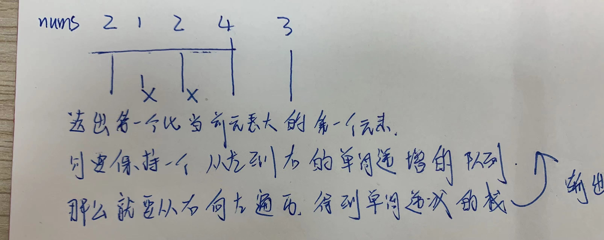

```java
    public int[] nextGreaterElements(int[] nums) {
        //如果不是循环数组
        Stack<Integer> s = new Stack<>();
        int[] res = new int[nums.length];

        for(int i = nums.length-1;i >=0;i-- ){
            while(!s.isEmpty() && nums[i] >= s.peek()){
                s.pop();
            }
            res[i] = s.isEmpty()? -1: s.peek();
            s.push(nums[i]);
        }

        return res;
    }
```


#### [503. 下一个更大元素 II](https://leetcode-cn.com/problems/next-greater-element-ii/)

题目：给定一个循环数组 nums （ nums[nums.length - 1] 的下一个元素是 nums[0] ），返回 nums 中每个元素的 下一个更大元素 。

数字 x 的 下一个更大的元素 是按数组遍历顺序，这个数字之后的第一个比它更大的数，这意味着你应该循环地搜索它的下一个更大的数。如果不存在，则输出 -1 。

思路：

1， 最简单的方式，**常用套路就是将数组长度翻倍**。

2，利用取模的方式，实现虚拟的数组长度翻倍。

```java
注意：index % n
```

```java
    public int[] nextGreaterElements(int[] temperatures) {
        int[] res = new int[temperatures.length];
        //栈中放tem
        Stack<Integer> s = new Stack<>();

        for(int i = temperatures.length*2-1;i>=0;i--){
            while(!s.empty() && s.peek() <= temperatures[ i % temperatures.length ]){
                s.pop();
            }
            res[i % temperatures.length] = s.empty()? -1 : s.peek();
            s.add(temperatures[i % temperatures.length]);
        }

        return res;
    }
```


#### [739. 每日温度](https://leetcode-cn.com/problems/daily-temperatures/)

题目：给定一个整数数组 temperatures ，表示每天的温度，返回一个数组 answer ，其中 answer[i] 是指在第 i 天之后，才会有更高的温度。如果气温在这之后都不会升高，请在该位置用 0 来代替。

思路：保持单调递减的栈，也就是保证每个栈里的数被露出来

```java
    public int[] dailyTemperatures(int[] temperatures) {
        int[] res = new int[temperatures.length];
        Stack<Integer> s = new Stack<>();

        for(int i = temperatures.length-1;i>=0;i--){
            while(!s.empty() && temperatures[s.peek()] <= temperatures[i]){
                s.pop();
            }
            res[i] = s.empty()? 0: s.peek()-i;
            s.add(i);
        }

        return res;
    }
```


# 队列

#### *[239. 滑动窗口最大值](https://leetcode-cn.com/problems/sliding-window-maximum/)（同剑指59)

题目：给你一个整数数组 nums，有一个大小为 k 的滑动窗口从数组的最左侧移动到数组的最右侧。你只可以看到在滑动窗口内的 k 个数字。滑动窗口每次只向右移动一位。

返回 滑动窗口中的最大值 。

思路：

- **队列中的元素全都是单调递增（或递减）的**
- 队列中的元素必须是窗口里的

这道题我觉得必须使用队列的滑动窗口是因为要保留次小的进行比较。因为**因为如果减少的这个数恰好是 `A`（记录的最大值），就需要遍历所有数重新找新的最值**。

```java
    public int[] maxSlidingWindow(int[] nums, int k) {
        LinkedList<Integer> dp = new LinkedList<>();
        int [] res = new int[nums.length-k+1];

        //未形成窗口前
        for(int i = 0;i < k;i++){
            while(!dp.isEmpty() && dp.getLast() < nums[i]){
                dp.removeLast();
            }
            dp.addLast(nums[i]);
        }

        res[0] = dp.getFirst();

        //形成窗口后
        for(int i = k; i< nums.length;i++){
            if(!dp.isEmpty() && dp.getFirst()==nums[i-k]){
                dp.removeFirst();
            }
            while(!dp.isEmpty() && dp.getLast() < nums[i]){
                dp.removeLast();
            }
            dp.addLast(nums[i]);
            res[i-k+1] = dp.getFirst(); 
        }
        return res;
    }
```

-   注意：形成窗口前不是只放当前元素, 同样也是保持单调递减的队列！！！！

```java
    public int[] maxSlidingWindow(int[] nums, int k) {
        //利用双端队列
        //未形成窗口前
        //注意：不是只放最大元素，同样也是保持单调递减的队列！！！！
        LinkedList<Integer> q = new LinkedList<>();
        
        // q.addLast(nums[0]);
        // for(int i =1;i < k;i++){
        //     if(nums[i] > q.getLast()){
        //         q.removeLast();
        //         q.addLast(nums[i]);
        //     }
        // }
        // // System.out.println(q);

        int[] res = new int[nums.length-k+1];
      
        for(int i = 0;i < k;i++){
            while(!q.isEmpty() && q.getLast() < nums[i]){
                q.removeLast();
            }
            q.addLast(nums[i]);
        }

        res[0] = q.getFirst();

        for(int i = k;i < nums.length;i++){
            if(!q.isEmpty() && nums[i-k]==q.getFirst()){
                q.removeFirst();
            }
            while(!q.isEmpty() && q.getLast() < nums[i]){
                q.removeLast();
            }
            q.addLast(nums[i]);
            res[i-k+1] = q.getFirst();
            // System.out.println("nums[i]:"+nums[i]);
            // System.out.println("q:"+q);
            // System.out.println("res:" + Arrays.toString(res));
            // System.out.println();
        }
        
        return res;
    }
```


# 二叉树

#### [104. 二叉树的最大深度](https://leetcode-cn.com/problems/maximum-depth-of-binary-tree/)

- 遍历 + 变量（回溯）

```java
//1，遍历二叉树 + 变量=》回溯
//先序遍历
//base case: 到达叶子节点时，返回当前的值
//递推：在进入左右子树前 depth++,出来后,depth--
//返回值：NULL，有全局变量res
    int depth;
    int res;
    public int maxDepth(TreeNode root) {
        depth = 0;
        res = 0;
        
        if(root==null) return 0;
        
        recur(root);
        return res;
    }

    public void recur(TreeNode root){
        //base case 叶子节点
        if(root==null){
            res = Math.max(res,depth);
            return;
        }

        //当前节点
        depth++;
        recur(root.left);
        recur(root.right);
        depth--;
    }
```

- 分解子问题 + 返回值（变成求左右子树的最大值）

```java
    //2，分解成更小的问题 + 返回值 等于左右子树高度的最大值
    //后序遍历
//base case:到达叶子节点，返回当前层0
//递推：Math.max(left,right)+1
//返回值：当前节点的层数（右下自上增）
    public int maxDepth(TreeNode root) {
        if(root==null) return 0;
        recur(root);

        return recur(root);
    }

    
    public int recur(TreeNode root){
        //base case
        if(root==null){
            return 0;
        }

        int left = recur(root.left);
        int right = recur(root.right);

        //递推
        return Math.max(left,right)+1;

    }
```

#### *[543. 二叉树的直径](https://leetcode-cn.com/problems/diameter-of-binary-tree/)

>   **任意一个结点，都要记录以此结点为根的直径情况：左子树高度+右子树高度**
>
>     //help返回的是以当前为根的二叉树的高度
>
>     //但是答案最后是max,因为max记录了路径
>
>     //help只用于left和right
>
>   ```java
>   int max = Integer.MIN_VALUE;
>       public int diameterOfBinaryTree(TreeNode root) {
>           if(root==null) return 0;
>           help(root);
>           return max;
>       }
>   
>       //help返回的是以当前为根的二叉树的高度
>       //但是答案最后是max,因为max记录了路径
>       //help只用于left和right
>   
>       public int help(TreeNode root) {
>           if(root==null) return 0;
>           int left = help(root.left);
>           int right = help(root.right);
>   
>           max = Math.max(max,right + left);
>           return Math.max(left,right) + 1;
>       }
>   ```
>
>   

- 分解子问题 + 返回值

```java
    //每一条二叉树的「直径」长度，就是一个节点的左右子树的最大深度之和
    //base case: 当二叉树达到叶子结点，返回0
    //递推关系：
    // int result = maxleft + maxright;
    // max = Math.max(result,max);
    //返回值：以当前节点为头的二叉树的最大高度

    int max;  //左右子树的最大深度之和
    public int diameterOfBinaryTree(TreeNode root) {
        max = 0;
        if(root==null) return 0;
        recur(root);
        return max;
    }

    //后序
    public int recur(TreeNode root){
        //base case
        if(root==null){
            return 0;
        }

        int maxleft = recur(root.left);
        int maxright = recur(root.right);

        //后序
        int result = maxleft + maxright;
        //更新最大值
        max = Math.max(result,max);

        //返回的是二叉树的高度
        return Math.max(maxleft,maxright) + 1;
    }
```

#### *[116. 填充每个节点的下一个右侧节点指针](https://leetcode-cn.com/problems/populating-next-right-pointers-in-each-node/)

>   咳咳。这个题自己做出来了，但是觉得人家的层序写的太牛逼了，好好学习一波。条件只需要i<len-1时才next赋值，时间上也快很多
>
>   递归的解法也很牛逼，看看人家的三叉树

题目：

给定一个 **完美二叉树** ，其所有叶子节点都在同一层，每个父节点都有两个子节点。二叉树定义如下：填充它的每个 next 指针，让这个指针指向其下一个右侧节点。如果找不到下一个右侧节点，则将 next 指针设置为 NULL。

初始状态下，所有 next 指针都被设置为 NULL。

解法：

- 思维一：

  - 可以，让中间虚拟出一个节点，遍历三叉树

  - 抽出一个节点。让它左右节点做如下递推

  - 遍历：好像都可以，先序吧

  ```java
      // 递归遍历：
      // 可以，让中间虚拟出一个节点，遍历三叉树
      // 抽出一个节点。让它左右节点做如下递推
      // 遍历：好像都可以，先序吧
  
      //base case: 如果到叶子节点 return 
      //递推：
      //node1,node2
      //node1.left.next = node1.right
      //node2.left.next = node2.right
      //node1.right.next = node2.left
      //返回值：无
  
      public Node connect(Node root) {
          if(root==null){
              return null;
          }
          recur(root.left,root.right);
          return root;
      }
  
      public void recur(Node p1, Node p2){
          //base case
          if(p1==null || p2==null){
              return;
          }
  
          // 将传入的两个节点穿起来
          p1.next = p2;
  
          // 连接相同父节点的两个子节点
          recur(p1.left, p1.right);
          recur(p2.left,p2.right);
          // 连接跨越父节点的两个子节点
          recur(p1.right,p2.left);
      }
  ```

  

- 思维二：不可行

- 层序遍历

  ```java
      //层序遍历
      
      public Node connect(Node root) {
          if(root==null) return root;
  
          //队列
          LinkedList<Node> q = new LinkedList<>();
          q.addLast(root);
  
          //开始层序遍历
          while(!q.isEmpty()){
              int len = q.size();
              //一层从左到右依次遍历
              for(int i=0;i < len;i++){
  
                  Node cur = q.removeFirst();
                  
                  // if(!q.isEmpty()){
                  //这个条件不对，是到最后一个节点才没有
                  if(i < len-1){
                      cur.next = q.getFirst();
                  }
  
                  if(cur.left!=null){
                      q.addLast(cur.left);
                  }
  
                  if(cur.right!=null){
                      q.addLast(cur.right);
                  }
              }
              //一层结束了
          }
          return root;
      }
  ```

-   三刷：自己写得麻烦的遍历

    先链接左右孩子之间，再连接右孩子和左孩子

    ```java
        public Node connect(Node root) {
            //层序遍历
            Deque<Node> q = new LinkedList<>();
            if(root!=null) q.offer(root);
            
            while(!q.isEmpty()){
                int len = q.size();
                Node pre = null;
                for(int i = 0;i < len;i++){
                    Node cur = q.poll();
                    if(cur.left!=null && cur.right!=null){
                        q.offer(cur.left);
                        q.offer(cur.right);
                        cur.left.next = cur.right;
                        if(pre!=null) pre.right.next = cur.left;
                    }            
                    pre = cur; 
                }
            }
            return root;
        } 
    ```

    

#### [114. 二叉树展开为链表](https://leetcode-cn.com/problems/flatten-binary-tree-to-linked-list/)

**题目**：给你二叉树的根结点 `root` ，请你将它展开为一个单链表：

- 展开后的单链表应该同样使用 `TreeNode` ，其中 `right` 子指针指向链表中下一个结点，而左子指针始终为 `null` 。
- 展开后的单链表应该与二叉树 [**先序遍历**](https://baike.baidu.com/item/先序遍历/6442839?fr=aladdin) 顺序相同。

**解法：**

- 思维一：

  返回值为null，这是希望将其原地转换

   如果有返回值，则可以利用空间构造单链表,直接存储前序遍历的结果

  ```java
      //返回值为null，这是希望将其原地转换
      //如果有返回值，则可以利用空间构造单链表,直接存储前序遍历的结果
      TreeNode dummy = new TreeNode(-1);
      dummy.right = root;
      TreeNode p = dummy;
      public TreeNode flatten(TreeNode root) {
          //base case
          if(root==null) return;
  
          //递推
          p.right = root;
          p = p.right;
  
          flatten(root.left);
          flatten(root.right);
  
          return dummy.right;
      }
  ```

  

- 思维二：（一定要把图画出来，就会很清晰了）

  没有返回值，不能通过遍历的方式解决

  - 分解子问题：对于一个节点，返回以该节点为头的二叉树被拉平的链表的头

  - 抽出一个单个节点：把他的左右子树进行拉平，也就是拼接

  - 位置：后序

    

  ```java
      //没有返回值，不能通过遍历的方式解决
      //分解子问题：对于一个节点，返回以该节点为头的二叉树被拉平的链表的头
      //抽出一个单个节点：把他的左右子树进行拉平，也就是拼接
      //位置：后序
  
  	//base case:叶子节点,return
  	//递推：把他的左右子树进行拉平，也就是拼接
  	//返回值：无，原地
      public void flatten(TreeNode root) {
          if(root==null) return;
          recur(root);
      }
  
      //对于一个节点，返回以该节点为头的二叉树被拉平的链表的头
      public TreeNode recur(TreeNode root){
          //base case
          if(root==null) return null;
  
          //递推
          TreeNode l = recur(root.left);
          TreeNode r = recur(root.right);
  
          //抽出的一个节点要做的事情
          root.left = null;
          root.right = l;
  
          TreeNode p = root; //保留当前的root
          while(p.right!=null){
              p = p.right;
          }
  
          p.right = r;
  
          return root;
      }
  ```

#### [654. 最大二叉树](https://leetcode-cn.com/problems/maximum-binary-tree/)

给定一个不重复的整数数组 nums 。 最大二叉树 可以用下面的算法从 nums 递归地构建:

    创建一个根节点，其值为 nums 中的最大值。
    递归地在最大值 左边 的 子数组前缀上 构建左子树。
    递归地在最大值 右边 的 子数组后缀上 构建右子树。

返回 nums 构建的 最大二叉树 。

思路：

```java
    //分解：先构造根，构造左子，构造右子，返回头
    //单独抽取一个节点。lm = 找到左边的最大值，root.left = lm,rm = 找到右边的最大值,root.right = rm
    //位置：先序

    //base case : 叶子结点
    public TreeNode constructMaximumBinaryTree(int[] nums) {
        return recur(nums,0,nums.length-1);
    }

    //在区间[low,high]里进行处理
    public TreeNode recur(int[] nums,int low,int high){
        if(low > high){
            return null;
        }

        //找到最大值,记录最大值的索引
        int maxindex = low;
        for(int i = low;i <= high;i++){
            if(nums[maxindex] < nums[i]){
                maxindex = i;
            }
        }

        // System.out.println(nums[maxindex] + "\t" + maxindex + "\t[" + low + "," + high + "]");

        //构造二叉树
        TreeNode root = new TreeNode(nums[maxindex]);

        root.left = recur(nums,low,maxindex-1);
        root.right = recur(nums,maxindex + 1,high);

        return root;
    }
```

#### *[652. 寻找重复的子树](https://leetcode-cn.com/problems/find-duplicate-subtrees/)

>   需要利用二叉树的序列化
>
>   这样只需要在遍历的时候进行保存就可以

题目：给定一棵二叉树 `root`，返回所有**重复的子树**。

思路：

将子树的**前序序列化**保留，以此来判断是否有重复，注意空值要填null

```java
    //分解：求子树
    //对于单个节点：把当前子树的先序遍历(序列化)放到hashmap中，已经当前所有子树存入hashmap，对比是否与当前序列有重复的，放入结果中
    //位置：后序

    //放序列，对应的次数
    HashMap<String,Integer> map; 
    List<TreeNode> ans;
    public List<TreeNode> findDuplicateSubtrees(TreeNode root) {
        map = new HashMap<>(); 
        ans = new ArrayList<>();
        recur(root);
        return ans;
    }

    //base case: root==null， 叶子节点，序列化“#”
    //递推：先加入hashmap,再判断是否重复
    //返回值：返回以当前节点为根的二叉树的前序序列化
    public String recur(TreeNode root){
        //base case
        if(root==null){
            return "#";
        }

        //先添加
        String serial = root.val + "," + recur(root.left) + "," + recur(root.right);
        map.put(serial,map.getOrDefault(serial,0)+1);

        //判断与当前序列（子树）是否有重复的
        if(map.get(serial)==2) ans.add(root);
        return serial;
    }
```

-   三刷：思路一样，但是时间很长

    因为递归套递归了

```java
    //将子树的先序遍历进行序列化，然后进行对比
    List<TreeNode> res = new LinkedList<>();
    HashMap<String,Integer> map = new HashMap<>();

    public List<TreeNode> findDuplicateSubtrees(TreeNode root) {

        if(root==null) return res;
        //自上向下
        findDuplicateSubtrees(root.left);
        findDuplicateSubtrees(root.right);

        String tmp = series(root);
        // System.out.println("root:" + root.val + "\tString:"+ tmp);
        if(map.containsKey(tmp)){
            if(map.get(tmp) < 2) res.add(root);
        }
        map.put(tmp,map.getOrDefault(tmp,0)+1);

        return res;
    }

    //以树的每一个节点为根的子树，是否有相同的子结构
    public String series(TreeNode root){
        if(root==null) return "#,";

        String res = root.val +"," + series(root.left) + series(root.right);

        return res;
    }
```

```java
//序列化结果+次数
    HashMap<String,Integer> map;
    List<TreeNode> res;
    public List<TreeNode> findDuplicateSubtrees(TreeNode root) {
        //因为求的是子树，不是子结构，所以可以用序列化的方式
        //那就前序序列化
        map = new HashMap<>();
        res = new LinkedList<>();
        recur(root);
        return res;
    }

    //每个节点为根的先序的序列化
    //但此遍历是后序遍历
    public String recur(TreeNode root){
        if(root==null) return "#";

        String serial = root.val +"," + recur(root.left) + "," + recur(root.right);
        map.put(serial,map.getOrDefault(serial,0)+1);

        if(map.get(serial)==2) res.add(root);
        return serial;
    }

```


#### [315. 计算右侧小于当前元素的个数](https://leetcode-cn.com/problems/count-of-smaller-numbers-after-self/)

```java
    private class Pair {
        int val, id;
        Pair(int val, int id) {
            // 记录数组的元素值
            this.val = val;
            // 记录元素在数组中的原始索引
            this.id = id;
        }
    }
    
    // 归并排序所用的辅助数组
    private Pair[] temp;
    // 记录每个元素后面比自己小的元素个数
    private int[] count;
    
    // 主函数
    public List<Integer> countSmaller(int[] nums) {
        int n = nums.length;
        count = new int[n];
        temp = new Pair[n];
        Pair[] arr = new Pair[n];
        // 记录元素原始的索引位置，以便在 count 数组中更新结果
        for (int i = 0; i < n; i++)
            arr[i] = new Pair(nums[i], i);
        
        // 执行归并排序，本题结果被记录在 count 数组中
        sort(arr, 0, n - 1);
        
        List<Integer> res = new LinkedList<>();
        for (int c : count) res.add(c);
        return res;
    }
    
    // 归并排序
    private void sort(Pair[] arr, int lo, int hi) {
        if (lo == hi) return;
        int mid = lo + (hi - lo) / 2;
        sort(arr, lo, mid);
        sort(arr, mid + 1, hi);
        merge(arr, lo, mid, hi);
    }
    
    // 合并两个有序数组
    private void merge(Pair[] arr, int lo, int mid, int hi) {
        for (int i = lo; i <= hi; i++) {
            temp[i] = arr[i];
        }
        
        int i = lo, j = mid + 1;
        for (int p = lo; p <= hi; p++) {
            //左边都合完了，还剩右边
            if (i == mid + 1) {
                arr[p] = temp[j++];
            //右边都合完了，还剩左边
            } else if (j == hi + 1) {
                arr[p] = temp[i++];
                // 更新 count 数组
                count[arr[p].id] += j - mid - 1;
            } else if (temp[i].val > temp[j].val) {
                arr[p] = temp[j++];
            } else {
                arr[p] = temp[i++];
                // 更新 count 数组
                count[arr[p].id] += j - mid - 1;
            }
        }
    }
```


#### [538. 把二叉搜索树转换为累加树](https://leetcode-cn.com/problems/convert-bst-to-greater-tree/)([1038. 从二叉搜索树到更大和树](https://leetcode-cn.com/problems/binary-search-tree-to-greater-sum-tree/))

题目：给出二叉 **搜索** 树的根节点，该树的节点值各不相同，请你将其转换为累加树（Greater Sum Tree），使每个节点 `node` 的新值等于原树中大于或等于 `node.val` 的值之和。


思路：

我们可以从结果观察到，右中左的顺序是在累加的，初始是最右边的元素

利用二叉搜索树的逆中序遍历是降序

```java
    //利用二叉搜索树的逆中序遍历是降序
    //我们可以从结果观察到，右中左的顺序是在累加的，初始是最右边的元素
    int sum;
    public TreeNode convertBST(TreeNode root) {
        sum = 0;
        recur(root);
        return root;
    }

    public void recur(TreeNode root){
        if(root==null) return;

        recur(root.right);
        sum += root.val;
        root.val = sum;
        recur(root.left);
    }
```

#### [1373. 二叉搜索子树的最大键值和](https://leetcode-cn.com/problems/maximum-sum-bst-in-binary-tree/)

给你一棵以 `root` 为根的 **二叉树** ，请你返回 **任意** 二叉搜索子树的最大键值和。

思路：

**当前节点需要做什么？**

1、左右子树是否是 BST。（一个树必然有BST子树，因为一个节点也算）

2、左子树的最大值和右子树的最小值。（是不是可以省略，加上自己看一下是不是BST）

3、左右子树的节点值之和。

- 先序的模板（递归套递归了）

```java
int max = 0;
public int maxSumBST(TreeNode root){
	recur(root);
    return max;
}

//遍历二叉树
public void recur(TreeNode root){
	if(root==null) return;
    
    //先序遍历
    
    //1.判断左右子树是否是BST
    if(isBST(root.left) || !isBST(root.right)){
		goto next;
    }
    //2.判断加上自己是不是BST
    if(!isBST(root)){
		goto next;
    }
    
    //3. 满足前面的条件，计算和
    int sum = findSum(root.left) + findSum(root.right) + root.val;
    max = Math.max(max,sum);
    
    
    //递归遍历左右子树
    next;
    recur(root.left);
    recur(root.right);
}

/* 计算以 root 为根的二叉树的节点和 */
int findSum(TreeNode root) {}

/* 判断以 root 为根的二叉树是否是 BST */
boolean isBST(TreeNode root) {}

```

- 后序，返回一些信息，让recur把其他辅助函数做的事情都做了

```java
class Solution {
    private int maxSum = 0;

    public int maxSumBST(TreeNode root) {
        if(root == null) {
            return 0;
        }
        recur(root);
        return maxSum;
    }

    public ReturnType recur(TreeNode root) {
        if(root == null) {
            return new ReturnType(true, Integer.MAX_VALUE, Integer.MIN_VALUE, 0);
        }
        ReturnType left = recur(root.left);
        ReturnType right = recur(root.right);
        //判断是否为BST 左右子树都是BST 并且左子树最大值小于根节点 右子树最小值大于根节点
        int val = root.val;
        if(left.isBST && right.isBST && val > left.maxVal && val < right.minVal) {
            int sum = left.sum + right.sum + root.val;
            maxSum = Math.max(sum, maxSum);
             //如果我们判断以 root 为根的二叉树是 BST，root.val一定大于left[1]吧,为什么要这样写
            //这跟我们对空节点的处理有关，我们处理空节点的时候，把它的最小值设成了正无穷，最大值设成了负无穷，如果不比较大小直接赋值的话，那么它们的父亲节点的最小值也变成正无穷了，最大值也变成负无穷了，只有和是对的
            int minVal = Math.min(left.minVal, val);
            int maxVal = Math.max(right.maxVal, val);
            // int minVal = left.minVal;
            // int maxVal = right.maxVal;
            return new ReturnType(true, minVal, maxVal, sum);
        } else {
            //不是bst 其他值无需计算
            return new ReturnType(false, 0, 0, 0);
        } 
    }

    class ReturnType {
        public boolean isBST;
        public int minVal;
        public int maxVal;
        public int sum;

        public ReturnType(boolean isBST, int minVal, int maxVal, int sum) {
            this.isBST = isBST;
            this.minVal = minVal;
            this.maxVal = maxVal;
            this.sum = sum;
        }  
    }
}
```

#### 完全二叉树

先判断是否是满二叉树，不是则按普通方法计算

```java
    public int countNodes(TreeNode root){
        TreeNode l = root,r = root;
        int hl = 0,hr = 0;
        while(l!=null){
            l = l.left;
            hl++;
        }
        while(r!=null){
            r = r.right;
            hr++;
        }
        
        // 如果左右子树的高度相同，则是一棵满二叉树
        if(hr==hl){
            return (int)Math.pow(2,hl)-1;
        }
        
        // 如果左右高度不同，则按照普通二叉树的逻辑计算
        return 1 + countNodes(root.left) + countNodes(root.right); 
    }
```

复杂度分析：O(logN*logN)

直觉感觉好像最坏情况下是 O(N*logN) 吧，因为之前的 while 需要 logN 的时间，最后要 O(N) 的时间向左右子树递归。**但这两个递归只有一个会真的递归下去，另一个一定会触发 `hl == hr` 而立即返回，不会递归下去**。因为**一棵完全二叉树的两棵子树，至少有一棵是满二叉树**。


由于完全二叉树的性质，其子树一定有一棵是满的，所以一定会触发 `hl == hr`，只消耗 O(logN) 的复杂度而不会继续递归。

综上，算法的递归深度就是树的高度 O(logN)，每次递归所花费的时间就是 while 循环，需要 O(logN)，所以总体的时间复杂度是 O(logN*logN).


#### 层序遍历建二叉树

```java
class Solution {
    //结构
    public static class TreeNode {
        public int val;
        public TreeNode left;
        public TreeNode right;

        public TreeNode(int x) {
            this.val = x;
        }
    }

//    public TreeNode createTree(int[] data,int size){
//        if(size==0) return null;
//        //队列
//        LinkedList<TreeNode> q = new LinkedList<>();
//        //入第一个节点
//        TreeNode head = new TreeNode(data[0]);
//        q.offer(head);
//
//        int idx = 1;
//        while(!q.isEmpty() && idx < size){
////            System.out.print(idx + " ");
//            TreeNode cur = q.poll();
//            //这个是你考虑的特殊情况,当前节点为-1,左右孩子也是-1，则建树的节点赋值为null，但队列中的值为TreeNode(-1)
//            if(cur.val==-1){
//                cur.left = null;
//                q.offer(new TreeNode(-1));
//                cur.right = null;
//                q.offer(new TreeNode(-1));
//                idx = idx + 2;
//            }else{
//                //左孩子
//                    //不为空
//                if(data[idx]!=-1){
//                    cur.left = new TreeNode(data[idx]);
//                    q.offer(cur.left);
//                    //为空：建树的节点赋值为null，但队列中的值为TreeNode(-1)
//                }else{
//                    cur.left = null;
//                    q.offer(new TreeNode(-1));
//                }
//                idx++;
//
//                //右孩子
//                    //不为空
//                if(data[idx]!=-1){
//                    cur.right = new TreeNode(data[idx]);
//                    q.offer(cur.right);
//                    //为空：建树的节点赋值为null，但队列中的值为TreeNode(-1)
//                }else{
//                    cur.right = null;
//                    q.offer(new TreeNode(-1));
//                }
//                idx++;
//            }
//        }
////        System.out.println();
//        return head;
//    }

    public TreeNode createTree(int[] data,int size){
        if(size==0) return null;
        //队列
        LinkedList<TreeNode> q = new LinkedList<>();
        //入第一个节点
        TreeNode head = new TreeNode(data[0]);
        q.offer(head);

        int idx = 1;
        while(!q.isEmpty() && idx < size){
//            System.out.print(idx + " ");
            TreeNode cur = q.poll();
            //这个是你考虑的特殊情况,当前节点为-1,左右孩子也是-1，则建树的节点赋值为null，但队列中的值为TreeNode(-1)
            if(cur==null){
                idx = idx + 2;
                q.offer(null);
                q.offer(null);
            }else{
                //左孩子
                if(data[idx]!=-1){
                    cur.left = new TreeNode(data[idx]);
                }
                idx++;

                //右孩子
                if(data[idx]!=-1){
                    cur.right = new TreeNode(data[idx]);
                }
                idx++;
                q.offer(cur.left);
                q.offer(cur.right);
            }
        }
//        System.out.println();
        return head;
    }

    public void preOrder(TreeNode head){
        if(head==null) return;

        System.out.print(head.val + " ");
        preOrder(head.left);
        preOrder(head.right);
    }

    public void inOrder(TreeNode head){
        if(head==null) return;

        inOrder(head.left);
        System.out.print(head.val + " ");
        inOrder(head.right);
    }

    public void postOrder(TreeNode head){
        if(head==null) return;

        postOrder(head.left);
        postOrder(head.right);
        System.out.print(head.val + " ");
    }

    public static void main(String[] args) {
        Solution tree = new Solution();
        int[] data = {9, 8, 7, 6, -1, 5, -1, 4, -1, -1, -1, -1, 3, -1};

        //建树
        TreeNode head = tree.createTree(data, data.length);

        //前序
        tree.preOrder(head);
        System.out.println();

        //中序
        tree.inOrder(head);
        System.out.println();

        //后序
        tree.postOrder(head);
        System.out.println();

    }

}
```


#### [96. 不同的二叉搜索树](https://leetcode.cn/problems/unique-binary-search-trees/)

卡特兰数：

g(n) = 求和g(i-1)*g(n-i)

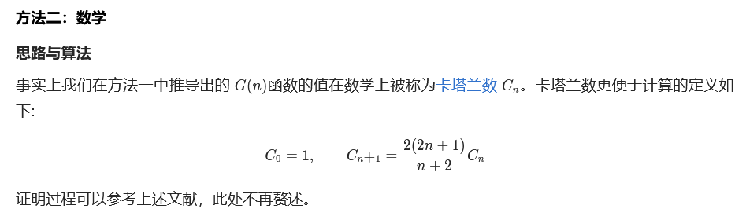

```java
 /*
    状态：
    令g(n)表示节点为n的二叉搜索树的个数
    g(n) = f(1) + f(2) + f(3) +...
    其中f表示，以1为根节点的二叉搜索树的个数

    转移方程：
    以i为根，总数是n的二叉树节点个数
    f(i) = g(i-1)*g(n-i)
    所以
    g(n) = 求和g(i-1)*g(n-i)

    初始状态：
    g(0) = 1
    g(1) = 1

    结果：
    g(n)
     */
    public int numTrees(int n) {
        int[] dp = new int[n+1];
        dp[0] = 1;
        dp[1] = 1;

        for(int i = 2;i <= n;i++){
            for(int j = 1;j <= i;j++){
                dp[i] += dp[j-1]*dp[i-j];
            }
        }

        return dp[n];
    }
```

```java
class Solution {
    public int numTrees(int n) {
        // 提示：我们在这里需要用 long 类型防止计算过程中的溢出
        long C = 1;
        for (int i = 0; i < n; ++i) {
            C = C * 2 * (2 * i + 1) / (i + 2);
        }
        return (int) C;
    }
}
```

n对括号正确匹配数目 凸多边形三角划分 出栈次序 矩阵连乘括号化：矩阵连乘： P=a1×a2×a3×……×an，依据乘法结合律，不改变其顺序，只用括号表示成对的乘积，试问有几种括号化的方案


# DFS

回溯算法其实就是我们常说的 DFS 算法，本质上就是一种暴力穷举算法。

**解决一个回溯问题，实际上就是一个决策树的遍历过程**。

#### [46. 全排列](https://leetcode-cn.com/problems/permutations/)

给定一个不含重复数字的数组 `nums` ，返回其 *所有可能的全排列* 。你可以 **按任意顺序** 返回答案。

```java
//无论变量是不是全局的，在内存空间里是一个，则就是全局共享的，就需要回溯
    //如果每一次的path和res都是新申请的空间，则不需要进行回溯
    //记录结果
    List<List<Integer>> res;
    //记录path
    LinkedList<Integer> path;
    //记录是否被used
    boolean[] used;
    public List<List<Integer>> permute(int[] nums) {
        //暴力回溯

        res = new LinkedList<>();
        path = new LinkedList<>();
        //记录已经做过的决定和当前可以做的选择
        used = new boolean[nums.length];

        backtrack(nums);

        return res;
    }

    void backtrack(int[] nums) {
        //触发的结束条件
        if(path.size()==nums.length){
            res.add(new LinkedList(path));
            return;
        }

        //排除不合法的选择
        for(int i=0;i<nums.length;i++){
            if(used[i]){
                continue;
            }

            //做选择
            path.add(nums[i]);
            used[i] = true;

            //进行下一层决策树
            backtrack(nums);

            //撤销选择
            path.removeLast();
            used[i] = false;
        }
    }
```

#### *[51. N 皇后](https://leetcode-cn.com/problems/n-queens/)

>   三刷：
>
>   刚开始先初始化一个矩阵，用'.'填充
>
>   利用String.copyValueOf(row)将二维矩阵中的一行转为字符串
>
>   这个速度要比利用string的方法快得多

```java
List<List<String>> res;

    public List<List<String>> solveNQueens(int n) {
        //把N皇后的问题抽象成从每一行开始放。
        //只用记录每一行中列的位置
        res = new LinkedList<>();
        char[][] board = new char[n][n];
        for(char[] c:board){
            Arrays.fill(c,'.');
        }
        backtrack(board,0);
        return res;
    }
    
    //row表示当前在第几行
    public void backtrack(char[][] board,int row){
        //终止条件
        if(row==board.length){
            res.add(charToList(board));
            return;
        }

        //当前的行的每一列都可以做选择，再排除掉那些不可能的列
        for(int col=0;col < board.length;col++){
            if(!isValid(board,row,col)){
                continue;
            }

            //做出选择
            board[row][col] = 'Q';
            //继续进入下一层
            backtrack(board,row+1);
            //撤销选择
            board[row][col] = '.';
        }
    }

    //把当前的矩阵转换为列表
    public List<String> charToList(char[][] board){
        List<String> list = new ArrayList<>();
        for(char[] row:board){
            list.add(String.copyValueOf(row));
        }
        return list;
    }

    //查看是否有效位
    //只用看左上 上 右上是否符合规范
    public boolean isValid(char[][] board,int row,int col){
        int n = board.length;
        //检查列是否有冲突
        for(int  i=0;i<n;i++){
            if(board[i][col]=='Q') return false;
        }

        //检查右上是否有冲突
        for(int i = row-1,j = col+1;i>=0 && j<n;i--,j++){
            if(board[i][j]=='Q') return false;
        }

        //检查左上是否有冲突
        for(int i = row-1,j = col-1;i>=0 && j>=0;i--,j--){
            if(board[i][j]=='Q') return false;
        }

        return true;
    }
```

-   四刷

```java
List<List<String>> res;
    public List<List<String>> solveNQueens(int n) {
        //建立一个二维的字符数组，并初始化
        res = new LinkedList<>();
        char[][] con = new char[n][n];
        for(int i = 0;i < con.length;i++){
            Arrays.fill(con[i],'.');
        }

        recur(con,0);
        return res;
    }

    public void recur(char[][] con,int x){
        if(x==con.length){
            res.add(transform(con));
            return;
        }

        for(int i = 0;i < con.length;i++){
            if(con[x][i]=='Q') continue;

            if(!isSafe(con,x,i)) continue;
            
            con[x][i] = 'Q';
            recur(con,x+1);
            con[x][i] = '.';
        }
    }


    //判断在当前位置是否安全
    public boolean isSafe(char[][] con, int x,int y){
        for(int i = 0;i < x;i++){
            if(con[i][y]=='Q') return false;
        }

        for(int i = x-1,j = y-1;i>=0 && j>=0;i--,j--){
            if(con[i][j]=='Q') return false;
        }

        for(int i = x-1,j = y+1; i>=0 && j<con.length;i--,j++){
            if(con[i][j]=='Q') return false;
        }

        return true;
    }

    // //将char[][] 转为List<String>，该方法速度很慢
    // public List<String> transform(char[][] con){
    //     int n = con.length;
    //     List<String> list = new LinkedList<>();
    //     String s;

    //     for(int i = 0;i < n;i++){
    //         s = "";
    //         for(int j = 0;j<n;j++){
    //             s = s + con[i][j];
    //         }
    //         list.add(s);
    //     }

    //     return list;
    // } 

	//该方法速度比较快
    public List<String> transform(char[][] board){
        List<String> list = new ArrayList<>();
        for(char[] row:board){
            list.add(String.copyValueOf(row));
        }
        return list;
    }
```


####  **[698. 划分为k个相等的子集](https://leetcode-cn.com/problems/partition-to-k-equal-sum-subsets/)

>   从桶的角度思考！
>
>   //为什么要把curSum从全局的变成参数往下传？
>                   //因为我发现，当全局的时候，开始回溯第二条路的时候，tmp = 0,会导致再在下面回溯的时候，tmp-=会为负数，所以tmp不适合作为全局的状态
>                   //放为局部的话，每次是从自己该条路径的curSUm进行curSum-=的，不会出现负数，结果也是正确的

- 优化一

    ```java
    //==============================================================================
        //DFS暴力深搜 + memo,优化
        //有些组合在此之前已经出现过了，只是装i桶和装j桶不一样 ，我们可以用memo进行备忘录，
        //在装满一个桶时记录当前 used 的状态，如果当前 used 的状态是曾经出现过的，那就不用再继续穷举，从而起到剪枝避免冗余计算的作用。
        //存储方式：把数组转为hashSet的键的方式进行存储
    
        HashMap<String, Boolean> memo = new HashMap<>();
        public boolean canPartitionKSubsets(int[] nums, int k) {
            //排除一些情况
            if(k > nums.length) return false;
            int sum = 0;
            for(int num:nums){
                sum += num;
            }
            if(sum%k!=0) return false;
    
            boolean[] used = new boolean[nums.length];
            int target = sum/k;
            
    
            return backtrack(nums,k,target,0,0,used);
    
        }
    
        //现在的k号桶正在思考是否应该把nums[i]装进来，目前k号桶已经装的数字之和是curSum
        //used表示某个数组是否已经被装到桶中
        //target是目标和
        boolean backtrack(int[] nums,int k,int target,int curSum,int idx,boolean[] used){
    
            //base case 所有桶都装满了
            if(k==0) return true;
    
            // 将 used 的状态转化成形如 [true, false, ...] 的字符串
            // 便于比较和存入 HashMap
            String state = Arrays.toString(used);
    
            //当前桶装满了
            if(curSum==target){
                //让下一个桶开始选
                // k--会出错,应该传--k
                // Boolean res =  backtrack(nums,k--,target,0,0,used);
                Boolean res =  backtrack(nums,k-1,target,0,0,used);
                //记录状态
                
                memo.put(state, res);
                //
                return res;
                
            }
    
            //如果当前状态曾今计算过，就直接返回，不要再递归穷举了
            if(memo.containsKey(state)){
                return memo.get(state);
            }
    
            //做选择
            for(int j = idx;j < nums.length;j++){
                if(used[j]) continue;
                if(nums[j] + curSum > target) continue;
    
                used[j] = true;
                curSum += nums[j]; 
                if(backtrack(nums,k,target,curSum,j+1,used)){
                    return true;
                }
                //撤销
                used[j] = false;
                curSum -= nums[j];
            }
            //穷举完都装不完当前的桶
            return false;
        }
    ```

- 优化二：

    ```java
    //==============================================================================
        //DFS暴力深搜 + memo,优化
        //有些组合在此之前已经出现过了，只是装i桶和装j桶不一样 ，我们可以用memo进行备忘录，
        //在装满一个桶时记录当前 used 的状态，如果当前 used 的状态是曾经出现过的，那就不用再继续穷举，从而起到剪枝避免冗余计算的作用。
        //存储方式：把数组转为hashSet的键的方式进行存储
        //优化2：不用数组进行存储，用位
        //用整数 used 的第 i 位（(used >> i) & 1）的 1/0 来表示 used[i] 的 true/false
    
        HashMap<Integer, Boolean> memo = new HashMap<>();
        public boolean canPartitionKSubsets(int[] nums, int k) {
            //排除一些情况
            if(k > nums.length) return false;
            int sum = 0;
            for(int num:nums){
                sum += num;
            }
            if(sum%k!=0) return false;
    
            int used = 0;
            int target = sum/k;
            
    
            return backtrack(nums,k,target,0,0,used);
    
        }
    
        //现在的k号桶正在思考是否应该把nums[i]装进来，目前k号桶已经装的数字之和是curSum
        //used表示某个数组是否已经被装到桶中
        //target是目标和
        boolean backtrack(int[] nums,int k,int target,int curSum,int idx,int used){
    
            //base case 所有桶都装满了
            if(k==0) return true;
    
            //当前桶装满了
            if(curSum==target){
                //让下一个桶开始选
                // k--会出错,应该是因为改变了k的值所以后面都应该要回溯
                // 不是 ，
                // Boolean res =  backtrack(nums,k--,target,0,0,used);
                Boolean res =  backtrack(nums,k-1,target,0,0,used);
                //记录状态
                
                memo.put(used, res);
                //
                return res;
                
            }
    
            //如果当前状态曾今计算过，就直接返回，不要再递归穷举了
            if(memo.containsKey(used)){
                return memo.get(used);
            }
    
            //做选择
            for(int j = idx;j < nums.length;j++){
                //如果是第j位为1则代表用过了
                if(((used >> j) & 1) == 1) continue;
                if(nums[j] + curSum > target) continue;
    
                used |= 1 << j;
                curSum += nums[j]; 
                if(backtrack(nums,k,target,curSum,j+1,used)){
                    return true;
                }
                //撤销
                used ^= 1 << j;
                curSum -= nums[j];
            }
            //穷举完都装不完当前的桶
            return false;
        }
    ```


-   注意hashmap

    ```java
    class Solution {
        int tmp = 0;
        boolean[] used;
        // boolean res;
        // LinkedList<Integer> path = new LinkedList<>();
        HashMap<String,Boolean> map = new HashMap<>();
        public boolean canPartitionKSubsets(int[] nums, int k) {
            int sum = 0;
            used = new boolean[nums.length];
            for(int num:nums){
                sum += num;
            }
            if(sum%k!=0) return false;
    
            sum = sum/k;
            return split(nums,0,k,sum,0);
            
    
        }
    
        //i是桶的序号，idx是球的序号
        public boolean split(int[]nums,int i,int k,int sum,int curSum){
    
            // System.out.println("1i:"+i);
            if(i == k) {
                return true;
            }
            String state = Arrays.toString(used);
    
            if(map.containsKey(state)){
                return map.get(state);
            }
            
            for(int idx = 0;idx < nums.length;idx++){
                if(used[idx]==true) continue;
    
                used[idx] = true;
                curSum += nums[idx];
                // path.add(nums[idx]);
                // System.out.println("idx:"+idx +"\tnums[idx]:"+nums[idx]+ "\tpath:"+path+"\tcurSum:"+curSum +"\tused:"+Arrays.toString(used) +"\tres:" +res);
                if(curSum < sum){
                    boolean res = split(nums,i,k,sum,curSum);
                    map.put(Arrays.toString(used),res);
                    if(res) return true;
                }else if (curSum==sum){
                    //为什么要把curSum从全局的变成参数往下传？
                    //因为我发现，当全局的时候，开始回溯第二条路的时候，tmp = 0,会导致再在下面回溯的时候，tmp-=会为负数，所以tmp不适合作为全局的状态
                    //放为局部的话，每次是从自己该条路径的curSUm进行curSum-=的，不会出现负数，结果也是正确的
                    // tmp=0;
                    // path = new LinkedList<>();
                    boolean res = split(nums,i+1,k,sum,0);
                    map.put(Arrays.toString(used),res);
                    if(res) return true;
                }else{
                    used[idx] = false;
                    curSum -= nums[idx];
                    // path.removeLast();
                    continue;
                }
                curSum -= nums[idx];
                // path.removeLast();
                used[idx] = false;  
            }
    
            return false;
        }
    
        //    //i是桶的序号，idx是球的序号
        // public void split(int[]nums,int i,int k,int sum,int curSum){
    
        //     // System.out.println("1i:"+i);
    
        //     if(res) return;
        //     if(i == k) {
        //         res = true;
        //         return;
        //     }
            
        //     for(int idx = 0;idx < nums.length;idx++){
        //         if(used[idx]) continue;
    
        //         used[idx] = true;
        //         curSum += nums[idx];
        //         // path.add(nums[idx]);
        //         // System.out.println("idx:"+idx +"\tnums[idx]:"+nums[idx]+ "\tpath:"+path+"\tcurSum:"+curSum +"\tused:"+Arrays.toString(used) +"\tres:" +res);
        //         if(curSum < sum){
        //             split(nums,i,k,sum,curSum);
        //         }else if (curSum==sum){
        //             //为什么要把curSum从全局的变成参数往下传？
        //             //因为我发现，当全局的时候，开始回溯第二条路的时候，tmp = 0,会导致再在下面回溯的时候，tmp-=会为负数，所以tmp不适合作为全局的状态
        //             //放为局部的话，每次是从自己该条路径的curSUm进行curSum-=的，不会出现负数，结果也是正确的
        //             // tmp=0;
        //             // path = new LinkedList<>();
        //             split(nums,i+1,k,sum,0);
        //         }else{
        //             used[idx] = false;
        //             curSum -= nums[idx];
        //             path.removeLast();
        //             continue;
        //         }
        //         curSum -= nums[idx];
        //         path.removeLast();
        //         used[idx] = false;  
        //     }
    
        //     // return res;
        // }
    }
    ```

    


#### [78. 子集](https://leetcode-cn.com/problems/subsets/)

给你一个整数数组 `nums` ，数组中的元素 **互不相同** 。返回该数组所有可能的子集（幂集）。

解集 **不能** 包含重复的子集。你可以按 **任意顺序** 返回解集。

```java
    List<List<Integer>> res = new LinkedList<>();
    // 记录回溯算法的递归路径
    LinkedList<Integer> track = new LinkedList<>();

    // 主函数
    public List<List<Integer>> subsets(int[] nums) {
        backtrack(nums, 0);
        return res;
    }

    // 回溯算法核心函数，遍历子集问题的回溯树
    void backtrack(int[] nums, int start) {
        //base case
    //     //nums.length==start时，将空集加入结果，不会进入循环，程序结束

        // 前序位置，每个节点的值都是一个子集
        res.add(new LinkedList<>(track));
    
        // 回溯算法标准框架
        for (int i = start; i < nums.length; i++) {
            // 做选择
            track.addLast(nums[i]);
            // 通过 start 参数控制树枝的遍历，避免产生重复的子集
            backtrack(nums, i + 1);
            // 撤销选择
            track.removeLast();
        }
    }
```


#### [90. 子集 II](https://leetcode-cn.com/problems/subsets-ii/)

给你一个整数数组 nums ，其中可能包含重复元素，请你返回该数组所有可能的子集（幂集）。

解集 不能 包含重复的子集。返回的解集中，子集可以按 任意顺序 排列。

```java
    // 主函数
    List<List<Integer>> res = new LinkedList<>();
    // 记录回溯算法的递归路径
    LinkedList<Integer> track = new LinkedList<>();

    // 主函数
    public List<List<Integer>> subsetsWithDup(int[] nums) {
        //排序：让相邻的一样的节点去剪枝
        Arrays.sort(nums);
        backtrack(nums, 0);
        return res;
    }

    // 回溯算法核心函数，遍历子集问题的回溯树
    void backtrack(int[] nums, int start) {
        //base case
    //     //nums.length==start时，将空集加入结果，不会进入循环，程序结束

        // 前序位置，每个节点的值都是一个子集
        res.add(new LinkedList<>(track));
    
        // 回溯算法标准框架
        for (int i = start; i < nums.length; i++) {
            
            // 通过 start 参数控制树枝的遍历，避免产生重复的子集
            if(i > start && nums[i]==nums[i-1]){
                continue;
            }
            // 做选择
            track.addLast(nums[i]);
            backtrack(nums, i + 1);
            // 撤销选择
            track.removeLast();
        }
    }
```


#### [77. 组合](https://leetcode-cn.com/problems/combinations/)

给定两个整数 `n` 和 `k`，返回范围 `[1, n]` 中所有可能的 `k` 个数的组合。

```java
    List<List<Integer>> res = new LinkedList<>();
    // 记录回溯算法的递归路径
    LinkedList<Integer> track = new LinkedList<>();

    // 主函数
    public List<List<Integer>> combine(int n,int k) {
        backtrack(1,n,k);
        return res;
    }

    // 回溯算法核心函数，遍历子集问题的回溯树
    void backtrack(int start, int n,int k) {
        //base case
        // 遍历到了第 k 层，收集当前节点的值
        if(track.size()==k){
            res.add(new LinkedList<>(track));
            return;
        }
    
        // 回溯算法标准框架
        for (int i = start; i <= n; i++) {
            // 做选择
            track.addLast(i);
            // 通过 start 参数控制树枝的遍历，避免产生重复的子集
            backtrack(i+1,n,k);
            // 撤销选择
            track.removeLast();
        }
    }
```


#### [40. 组合总和 II](https://leetcode-cn.com/problems/combination-sum-ii/)

给定一个候选人编号的集合 candidates 和一个目标数 target ，找出 candidates 中所有可以使数字和为 target 的组合。

candidates 中的每个数字在每个组合中只能使用 一次 。

注意：解集不能包含重复的组合。 

```java
    List<List<Integer>> res = new LinkedList<>();
    // 记录回溯算法的递归路径
    LinkedList<Integer> track = new LinkedList<>();
    int curSum = 0;

    // 主函数
    public List<List<Integer>> combinationSum2(int[] candidates, int target) {
        if(candidates.length==0) return res;
        //排序：让相邻的一样的节点去剪枝
        Arrays.sort(candidates);
        // System.out.println(Arrays.toString(candidates));
        backtrack(candidates,0,target);
        return res;
    }

    // 回溯算法核心函数，遍历子集问题的回溯树
    void backtrack(int[] candidates, int start,int target) {
        //base case
        // 
        if(curSum==target){
            res.add(new LinkedList<>(track));
            return;
        }

        //剪枝，不可
        if(curSum > target) return;

        // 回溯算法标准框架
        for (int i = start; i < candidates.length; i++) {

            if(i>start && candidates[i]==candidates[i-1]){
                continue;
            }

            // 做选择
            track.add(candidates[i]);
            curSum += candidates[i];

            // 通过 start 参数控制树枝的遍历，避免产生重复的子集
            backtrack(candidates,i+1,target);

            // 撤销选择
            track.removeLast();
            curSum -= candidates[i];
            }
        }
```

##### [39. 组合总和](https://leetcode-cn.com/problems/combination-sum/)

给你一个 无重复元素 的整数数组 candidates 和一个目标整数 target ，找出 candidates 中可以使数字和为目标数 target 的 所有 不同组合 ，并以列表形式返回。你可以按 任意顺序 返回这些组合。

candidates 中的 同一个 数字可以 无限制重复被选取 。如果至少一个数字的被选数量不同，则两种组合是不同的。 

对于给定的输入，保证和为 target 的不同组合数少于 150 个。

```java
    List<List<Integer>> res = new LinkedList<>();
    // 记录回溯算法的递归路径
    LinkedList<Integer> track = new LinkedList<>();
    int curSum = 0;

    // 主函数
    public List<List<Integer>> combinationSum(int[] candidates, int target) {
        if(candidates.length==0) return res;
        //排序：让相邻的一样的节点去剪枝
        Arrays.sort(candidates);
        // System.out.println(Arrays.toString(candidates));
        backtrack(candidates,0,target);
        return res;
    }

    // 回溯算法核心函数，遍历子集问题的回溯树
    void backtrack(int[] candidates, int start,int target) {
        //base case
        // 
        if(curSum==target){
            res.add(new LinkedList<>(track));
            return;
        }

        //base case
        if(curSum > target) return;

        // 回溯算法标准框架
        for (int i = start; i < candidates.length; i++) {

            if(i>start && candidates[i]==candidates[i-1]){
                continue;
            }

            // 做选择
            track.add(candidates[i]);
            curSum += candidates[i];

            // 通过 start 参数控制树枝的遍历，避免产生重复的子集
            backtrack(candidates,i,target);

            // 撤销选择
            track.removeLast();
            curSum -= candidates[i];
            }
        }
```


#### [47. 全排列 II](https://leetcode-cn.com/problems/permutations-ii/)

给定一个可包含重复数字的序列 `nums` ，***按任意顺序*** 返回所有不重复的全排列。

```java
    List<List<Integer>> res = new LinkedList<>();
    LinkedList<Integer> path = new LinkedList<>();
    boolean[] used;
    public List<List<Integer>> permuteUnique(int[] nums) {
        used = new boolean[nums.length];
        //排序：为剪枝做准备
        Arrays.sort(nums);
        recur(nums,0);
        return res;
    }

    public void recur(int[] nums,int s){

        //base case
        if(path.size()==nums.length){
            res.add(new LinkedList(path));
            return;
        }

        for(int i = 0; i<nums.length;i++){
            //1.used
            //2.保持相邻元素相等，且相对位置不变
            if(used[i] || i > 0 && nums[i]==nums[i-1] && !used[i-1]){
                continue;
            }

            //选择
            used[i] = true;
            path.addLast(nums[i]);

            //递归
            recur(nums,i+1);

            //撤销选择
            path.removeLast();
            used[i] = false;
        }
    }
```


#### 5.3 元素无重可复选

**标准的全排列算法利用 `used` 数组进行剪枝，避免重复使用同一个元素。如果允许重复使用元素的话，直接放飞自我，去除所有 `used` 数组的剪枝逻辑就行了**。

```java
List<List<Integer>> res = new LinkedList<>();
LinkedList<Integer> track = new LinkedList<>();

public List<List<Integer>> permuteRepeat(int[] nums) {
    backtrack(nums);
    return res;
}

// 回溯算法核心函数
void backtrack(int[] nums) {
    // base case，到达叶子节点
    if (track.size() == nums.length) {
        // 收集叶子节点上的值
        res.add(new LinkedList(track));
        return;
    }

    // 回溯算法标准框架
    for (int i = 0; i < nums.length; i++) {
        // 做选择
        track.add(nums[i]);
        // 进入下一层回溯树
        backtrack(nums);
        // 取消选择
        track.removeLast();
    }
}
```


#### [200. 岛屿数量](https://leetcode-cn.com/problems/number-of-islands/)

[FloodFill 算法](https://mp.weixin.qq.com/s/Y7snQIraCC6PRhj9ZSnlzw)

题目：

给你一个由 '1'（陆地）和 '0'（水）组成的的二维网格，请你计算网格中岛屿的数量。

岛屿总是被水包围，并且每座岛屿只能由水平方向和/或竖直方向上相邻的陆地连接形成。

此外，你可以假设该网格的四条边均被水包围。

思路：

在主函数中找到一个以1开头的节点，将结果++，然后利用dfs遍历相邻的陆地，用水把其淹了

解法：

```java
    public int numIslands(char[][] grid) {
        int res = 0;
        for(int i=0;i<grid.length;i++){
            for(int j=0;j<grid[0].length;j++){
                if(grid[i][j]=='1'){
                    res++;
                    dfs(grid,i,j);
                }
            }
        }
        return res;
    }

    //从节点(i,j)开始进行dfs遍历，把相邻节点的陆地用水淹了
    public void dfs(char[][] grid,int i,int j){

        int[] dx = {1,-1,0,0};
        int[] dy = {0,0,1,-1};
        
        //base case
        if(i < 0 || i >= grid.length || j < 0 ||j >= grid[0].length){
            return;
        }

        if(grid[i][j]=='0'){
            return;
        }

        grid[i][j]='0';

        for(int k=0;k < 4;k++){
            int x = i + dx[k];
            int y = j + dy[k];
            dfs(grid,x,y);
        }

    }
```

#### *[1254. 统计封闭岛屿的数目](https://leetcode-cn.com/problems/number-of-closed-islands/)

>   先用水把边界淹了，因为矩阵边界里为陆地的，已经不是封闭岛屿了

题目：

二维矩阵 `grid` 由 `0` （土地）和 `1` （水）组成。岛是由最大的4个方向连通的 `0` 组成的群，封闭岛是一个 `完全` 由1包围（左、上、右、下）的岛。

思路：

封闭岛的周围是水，所以矩阵的边界都不是封闭岛，需要将边界的先用水淹掉，再按上题计算就可以了

解法：

```java
    public int closedIsland(int[][] grid) {
        //先淹边界的陆地

        for(int i = 0;i< grid[0].length;i++){
            //上
            dfs(grid,0,i);
            //下
            dfs(grid,grid.length-1,i);
        }

        for(int i = 0;i < grid.length;i++){
            //左
            dfs(grid,i,0);
            //右
            dfs(grid,i,grid[0].length-1);
        }

        int res = 0;
        for(int i=0;i<grid.length;i++){
            for(int j=0;j<grid[0].length;j++){
                if(grid[i][j]==0){
                    res++;
                    dfs(grid,i,j);
                }
            }
        }
        return res;
    }

    //从节点(i,j)开始进行dfs遍历，把相邻节点的陆地用水淹了
    public void dfs(int[][] grid,int i,int j){

        int[] dx = {1,-1,0,0};
        int[] dy = {0,0,1,-1};
        
        //base case
        if(i < 0 || i >= grid.length || j < 0 ||j >= grid[0].length){
            return;
        }

        if(grid[i][j]==1){
            return;
        }

        grid[i][j]=1;

        for(int k=0;k < 4;k++){
            int x = i + dx[k];
            int y = j + dy[k];
            dfs(grid,x,y);
        }

    }
```

#### [1020. 飞地的数量](https://leetcode-cn.com/problems/number-of-enclaves/)

题目：

给你一个大小为 m x n 的二进制矩阵 grid ，其中 0 表示一个海洋单元格、1 表示一个陆地单元格。一次 移动 是指从一个陆地单元格走到另一个相邻（上、下、左、右）的陆地单元格或跨过 grid 的边界。返回网格中 无法 在任意次数的移动中离开网格边界的陆地单元格的数量

说人话就是，求封闭岛屿的面积，封闭岛屿是由0包裹的

思路：

和1254一样,就是排除完边界的以后，不用递归

解法：

```java
    public int numEnclaves(int[][] grid) {
        
        //先淹边界的陆地

        for(int i = 0;i< grid[0].length;i++){
            //上
            dfs(grid,0,i);
            //下
            dfs(grid,grid.length-1,i);
        }

        for(int i = 0;i < grid.length;i++){
            //左
            dfs(grid,i,0);
            //右
            dfs(grid,i,grid[0].length-1);
        }

        int res = 0;
        //数一下剩下的陆地不用递归
        for(int i=0;i<grid.length;i++){
            for(int j=0;j<grid[0].length;j++){
                if(grid[i][j]==1){
                    res+=1;
                    // dfs(grid,i,j);
                }
            }
        }
        return res;
    }

    //从节点(i,j)开始进行dfs遍历，把相邻节点的陆地用水淹了
    public void dfs(int[][] grid,int i,int j){

        int[] dx = {1,-1,0,0};
        int[] dy = {0,0,1,-1};
        
        //base case
        if(i < 0 || i >= grid.length || j < 0 ||j >= grid[0].length){
            return;
        }

        if(grid[i][j]==0){
            return;
        }

        grid[i][j]=0;

        for(int k=0;k < 4;k++){
            int x = i + dx[k];
            int y = j + dy[k];
            dfs(grid,x,y);
        }

    }
```

#### [695. 岛屿的最大面积](https://leetcode-cn.com/problems/max-area-of-island/)

题目：

给你一个大小为 m x n 的二进制矩阵 grid 。

岛屿 是由一些相邻的 1 (代表土地) 构成的组合，这里的「相邻」要求两个 1 必须在 水平或者竖直的四个方向上 相邻。你可以假设 grid 的四个边缘都被 0（代表水）包围着。

岛屿的面积是岛上值为 1 的单元格的数目。

计算并返回 grid 中最大的岛屿面积。如果没有岛屿，则返回面积为 0 。

思路：

**大体思路和之前完全一样，只不过 `dfs` 函数淹没岛屿的同时，还应该想办法记录这个岛屿的面积**。给 `dfs` 函数设置返回值，记录每次淹没的陆地的个数

解法：

注意避坑

```java
    public int maxAreaOfIsland(int[][] grid) {
        int max = 0;
        for(int i = 0;i < grid.length;i++){
            for(int j=0;j < grid[0].length;j++){
                if(grid[i][j]==1){
                    int res = dfs(grid,i,j);
                    max = Math.max(res,max);
                }
            }
        }
        return max;
    }

    //从节点(i,j)开始进行dfs遍历，把相邻节点的陆地用水淹了
    
    public int dfs(int[][] grid,int i,int j){

        int[] dx = {1,-1,0,0};
        int[] dy = {0,0,1,-1};
        
        //base case
        if(i < 0 || i >= grid.length || j < 0 ||j >= grid[0].length){
            return 0;
        }

        if(grid[i][j]==0){
            return 0;
        }

        //当前节点
        grid[i][j]=0;
        int res = 1; //别忘加上当前的格子

        for(int k=0;k < 4;k++){
            int x = i + dx[k];
            int y = j + dy[k];
            res += dfs(grid,x,y);
        }

        return res;
    }
```

#### *[1905. 统计子岛屿](https://leetcode-cn.com/problems/count-sub-islands/)

>   //需要先把不符合要求的子岛屿淹了，不能只是这样简单的判断，不然会有情况没排除，比如第一个示例的最后一个1，就会多算

题目：

给你两个 m x n 的二进制矩阵 grid1 和 grid2 ，它们只包含 0 （表示水域）和 1 （表示陆地）。一个 岛屿 是由 四个方向 （水平或者竖直）上相邻的 1 组成的区域。任何矩阵以外的区域都视为水域。

如果 grid2 的一个岛屿，被 grid1 的一个岛屿 完全 包含，也就是说 grid2 中该岛屿的每一个格子都被 grid1 中同一个岛屿完全包含，那么我们称 grid2 中的这个岛屿为 子岛屿 。

请你返回 grid2 中 子岛屿 的 数目 。

思路：

当岛屿 `B` 中所有陆地在岛屿 `A` 中也是陆地的时候，岛屿 `B` 是岛屿 `A` 的子岛。

**反过来说，如果岛屿 `B` 中存在一片陆地，在岛屿 `A` 的对应位置是海水，那么岛屿 `B` 就不是岛屿 `A` 的子岛**。

那么，我们只要遍历 `grid2` 中的所有岛屿，把那些不可能是子岛的岛屿排除掉，剩下的就是子岛。

解法：

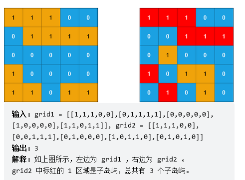

```java
    public int countSubIslands(int[][] grid1, int[][] grid2) {
        //先淹掉不符合要求的岛屿：也就是grid2中岛屿位置（1）在grid1中的是海水（0）
        for(int i = 0;i < grid2.length;i++){
            for(int j = 0;j < grid2[0].length;j++){
                if(grid1[i][j]==0 && grid2[i][j]==1){
                    dfs(grid2,i,j);
                }
            }
        }

        //再统计符合要求的子岛屿
        int res = 0;
        for(int i = 0;i < grid2.length;i++){
            for(int j = 0;j < grid2[0].length;j++){
                if(grid2[i][j]==1){
                    res++;
                    dfs(grid2,i,j);
                }
            }
        }

        return res;
    }

    public void dfs(int[][] grid,int i ,int j){
        //base case
        if(i<0 || i>=grid.length ||j<0||j>=grid[0].length){
            return;
        }

        if(grid[i][j]==0){
            return;
        }

        grid[i][j] = 0;

        int[] dx = {-1,1,0,0};
        int[] dy = {0,0,-1,1};
        for(int k=0;k<4;k++){
            int x = i + dx[k];
            int y = j + dy[k];
            dfs(grid,x,y);
        }
    }
```

#### *694.不同岛屿的数量

>   这题是把图的遍历顺序进行序列化，是把四个方向(上下左右)抽象成1,2,3,4，而不是里面的数字。选择为+（先序），撤销为负（后序）

题目：

题目还是输入一个二维矩阵，`0` 表示海水，`1` 表示陆地，这次让你计算 **不同的 (distinct)** 岛屿数量

思路:

很显然我们得想办法把二维矩阵中的「岛屿」进行转化，变成比如字符串这样的类型，然后利用 HashSet 这样的数据结构去重，最终得到不同的岛屿的个数。**首先，对于形状相同的岛屿，如果从同一起点出发，`dfs` 函数遍历的顺序肯定是一样的**。因为遍历顺序是写死在你的递归函数里面的


如果我用分别用 `1, 2, 3, 4` 代表上下左右，用 `-1, -2, -3, -4` 代表上下左右的撤销，那么可以这样表示它们的遍历顺序：

2, 4, 1, -1, -4, -2

注意：

至于为什么初始调用 `dfs` 函数时的 `dir` 参数可以随意写，这里涉及 DFS 和回溯算法的一个细微差别，前文  [图算法基础](https://labuladong.gitee.io/algo/2/20/48/) 有写，这里就不展开了

因为回溯关注的是边，而不是节点，看回溯树

解法：

```java
int numDistinctIslands(int[][] grid) {
    int m = grid.length, n = grid[0].length;
    // 记录所有岛屿的序列化结果
    HashSet<String> islands = new HashSet<>();
    for (int i = 0; i < m; i++) {
        for (int j = 0; j < n; j++) {
            if (grid[i][j] == 1) {
                // 淹掉这个岛屿，同时存储岛屿的序列化结果
                StringBuilder sb = new StringBuilder();
                // 初始的方向可以随便写，不影响正确性
                dfs(grid, i, j, sb, 666);
                islands.add(sb.toString());
            }
        }
    }
    // 不相同的岛屿数量
    return islands.size();
}

void dfs(int[][] grid, int i, int j, StringBuilder sb, int dir) {
    int m = grid.length, n = grid[0].length;
    if (i < 0 || j < 0 || i >= m || j >= n 
        || grid[i][j] == 0) {
        return;
    }
    // 前序遍历位置：进入 (i, j)
    grid[i][j] = 0;
    sb.append(dir).append(',');
    
    dfs(grid, i - 1, j, sb, 1); // 上
    dfs(grid, i + 1, j, sb, 2); // 下
    dfs(grid, i, j - 1, sb, 3); // 左
    dfs(grid, i, j + 1, sb, 4); // 右
    
    // 后序遍历位置：离开 (i, j)
    sb.append(-dir).append(',');
}

```


注意和图里的onPath的区别

这个 `onPath` 数组的操作很像  [回溯算法核心套路](https://labuladong.gitee.io/algo/4/29/105/) 中做「做选择」和「撤销选择」，区别在于位置：回溯算法的「做选择」和「撤销选择」在 for 循环里面，而对 `onPath` 数组的操作在 for 循环外面。

在 for 循环里面和外面唯一的区别就是对根节点的处理。

比如下面两种多叉树的遍历：

```

onpath
void traverse(TreeNode root) {
    if (root == null) return;
    System.out.println("enter: " + root.val);
    for (TreeNode child : root.children) {
        traverse(child);
    }
    System.out.println("leave: " + root.val);
}

回溯
void traverse(TreeNode root) {
    if (root == null) return;
    for (TreeNode child : root.children) {
        System.out.println("enter: " + child.val);
        traverse(child);
        System.out.println("leave: " + child.val);
    }
}

```

前者会正确打印所有节点的进入和离开信息，而后者唯独会少打印整棵树根节点的进入和离开信息。

**为什么回溯算法框架会用后者？因为回溯算法关注的不是节点，而是树枝**。


# 图

## 遍历

#### [797. 所有可能的路径](https://leetcode-cn.com/problems/all-paths-from-source-to-target/)


```java
//因为是无环图，所以不用visit
    // 记录所有路径
    List<List<Integer>> res = new LinkedList<>();
    // 维护递归过程中经过的路径
    LinkedList<Integer> path = new LinkedList<>();

    public List<List<Integer>> allPathsSourceTarget(int[][] graph) {
        //graph是邻接表,其长度表示有几个节点
        traverse(graph, 0);
        return res;  
    }

    //s为遍历的当前节点
    //多叉树的先序遍历
    public void traverse(int[][] graph, int s){
        //添加节点到路径
        path.addLast(s);

        //base case
        if(s==graph.length-1){
            res.add(new LinkedList<>(path));
            ////移除叶子节点(也就是题目中的n)
            /////如果此处注释掉，那么最后的removeLast也可以保证n节点的移除
            // path.removeLast();
            // return;
        }
        
        //递归每个相邻节点
        for(int v:graph[s]){
            traverse(graph,v);
        }

        //移除非叶子节点的节点(除n外的节点)
        path.removeLast();
    }
```


## 环检测

#### *[207. 课程表](https://leetcode-cn.com/problems/course-schedule/)

- DFS

  >   DFS必须先检查有没有环，也就是path，因为如果每次先检查有没有visited，就永远不会有环了
  >
  >   used在原理上也可以去掉，但是会超时，used的作用在于剪枝
  >
  >   **什么的剪枝呢，used代表以这个节点为头的路径是否走过，**
  >
  >   used==true,说明当前访问节点已被其他节点启动的 DFS 访问，无需再重复搜索，其结果的含义为true,因为false的话就不会继续dfs了
  >
  >   比如：[[2,3],[4],[2,4],[]]（从1开始）
  >
  >   path ==true，说明在本轮 DFS 搜索中节点 i 被第 2次访问，即 课程安排图有环 ，直接返回 False。
  >
  >   

  ```java
      //两个节点不重复，这么做会减少计算量，如果碰到visited被标记为true，则说明前面已经对这个节点之后的样子做出判断了，无须再进行延伸，所以减少计算量
      boolean[] visited;//（代表以这个节点为头的路径是否有判断过）
      boolean[] onPath; //记录当前路径上存在的节点（只代表一条路径）
      //有环就是当前路径上存在两个一样的节点
  
      // 记录图中是否有环
      boolean hasCycle = false;
  
      public boolean canFinish(int numCourses, int[][] prerequisites) {
          List<Integer>[] graph = buildGraph(numCourses,prerequisites);
  
          visited = new boolean[numCourses];
          onPath = new boolean[numCourses];  
  
          //因为图不是连通的，所以需要遍历每个节点
          for (int i = 0; i < numCourses; i++) {
              // 遍历图中的所有节点
              traverse(graph, i);
          }
  
          // 只要没有循环依赖可以完成所有课程
          return !hasCycle;  
      }
  
      void traverse(List<Integer>[] graph, int i){
          //base case
          if(onPath[i]==true) {
              hasCycle = true;
              return;
          }
  
          if(visited[i]==true) return;
          
          //先序代码的位置
          visited[i] = true;
          onPath[i] = true;
          for(int v : graph[i]){
              traverse(graph,v);
          }
  
          onPath[i] = false;
      }
  
      List<Integer>[] buildGraph(int numCourses, int[][] prerequisites){
          //图中共有numCourses个节点
          //二维数组，采用邻接表的方式表示图
          List<Integer>[] graph = new LinkedList[numCourses];
          
          for(int i = 0;i < numCourses;i++){
              //graph[i]中放得i节点到其他的节点的节点列表
              graph[i] = new LinkedList<>();
          }
  
          for(int[] edge:prerequisites){
              int from= edge[1],to = edge[0];
              // 添加一条从 from 指向 to 的有向边
              // 边的方向是「被依赖」关系，即修完课程 from 才能修课程 to
              graph[from].add(to);
          }
  
          return graph;
      }
  ```

- BFS

  >   是要把所有入度为0 的节点都加入进去，而不是选一个，毕竟是bfs，入度为0 的都算第一阶梯的
  
  ```java
      //bfs
      //构建入度
      int[] indegree;
      public boolean canFinish(int numCourses, int[][] prerequisites) {
          //建图 + 记录入度
          indegree = new int[numCourses];
          List<Integer>[] graph = buildGraph(numCourses,prerequisites);
  
          System.out.println(Arrays.toString(indegree));
          
          //根据入度初始化队列中的节点,找没有入度的点作为拓扑排序的起点
          Queue<Integer> q = new LinkedList<>();
          for(int i=0;i < indegree.length;i++){
              if(indegree[i]==0){
                  //节点i没有入度，即没有依赖的节点，可以直接学
                  //所以可以作为拓排序的起点，加入队列
                  q.offer(i);
              }
          }
  
          //记录遍历的节点个数,用来判断节点是否遍历完，也就是最后是不是会成环
          int cnt = 0;
  
          //两种遍历方式都可以
          //1.
          // while(!q.isEmpty()){
          //     //弹出节点cur，并把他指向的节点的入度减一
          //     cnt++;
          //     int cur = q.poll();
          //     for(int next : graph[cur]){
          //         indegree[next]--;
          //         if(indegree[next]==0){
          //             q.offer(next);
          //         } 
          //     }
          // }
  
          //2.
          while(!q.isEmpty()){
              //弹出节点cur，并把他指向的节点的入度减一
              int len = q.size();
              //每一层
              for(int i = 0;i < len;i++){
                  cnt++;
                  int cur = q.poll();
                  //操作，将所有指向节点的入度都减1
                  for(int next : graph[cur]){
                      indegree[next]--;
                      if(indegree[next]==0){
                          q.offer(next);
                      } 
                  }
              }
          }
  
          return cnt == numCourses;
      }
  
      List<Integer>[] buildGraph(int numCourses, int[][] prerequisites){
          //图中共有numCourses个节点
          //二维数组，采用邻接表的方式表示图
          List<Integer>[] graph = new LinkedList[numCourses];
          
          for(int i = 0;i < numCourses;i++){
              //graph[i]中放得i节点到其他的节点的节点列表
              graph[i] = new LinkedList<>();
          }
  
          for(int[] edge:prerequisites){
              int from= edge[1],to = edge[0];
              // 添加一条从 from 指向 to 的有向边
              // 边的方向是「被依赖」关系，即修完课程 from 才能修课程 to
              graph[from].add(to);
              // 构建入度
              indegree[to]++;
          }
  
          return graph;
      }
  ```

## 拓扑排序

#### *[210. 课程表 II](https://leetcode-cn.com/problems/course-schedule-ii/)

- DFS

  >   必须需要onpath,否则没有办法检测有无环
  >
  >   因为[[0,1],[1,0]]也可以通过
  >
  >   标志位的判断也要放在先序，准确得说是该放哪放哪，只是打印的语句有所变化

  后序逆序

  ```java
  //两个节点不重复，这么做会减少计算量，如果碰到visited被标记为true，则说明前面已经对这个节点之后的样子做出判断了，无须再进行延伸，所以减少计算量
      boolean[] visited;//（代表以这个节点为头的路径是否有判断过）
      boolean[] onPath; //记录当前路径上存在的节点（只代表一条路径）
      //有环就是当前路径上存在两个一样的节点
      // 记录后序遍历结果
      List<Integer> postorder = new ArrayList<>();
  
      // 记录图中是否有环
      boolean hasCycle = false;
  
      public int[] findOrder(int numCourses, int[][] prerequisites) {
          List<Integer>[] graph = buildGraph(numCourses,prerequisites);
  
          visited = new boolean[numCourses];
          onPath = new boolean[numCourses];
  
          //因为图不是连通的，所以需要遍历每个节点
          for (int i = 0; i < numCourses; i++) {
              // 遍历图中的所有节点
              traverse(graph, i);
          }
  
          if(hasCycle){
              return new int[]{};
          }
  
          Collections.reverse(postorder);
          int[] res = new int[numCourses];
          for(int i=0;i < numCourses;i++){
              res[i] = postorder.get(i);
          }
  
          return res;
      }
  
      void traverse(List<Integer>[] graph, int i){
          //base case
          if(onPath[i]==true) {
              hasCycle = true;
              return;
          }
  
          if(visited[i]==true) return;
          
          //先序代码的位置
          visited[i] = true;
          onPath[i] = true;
          //标志位的判断也要放在先序，准确得说是该放哪放哪，只是打印的语句有所变化
          for(int v : graph[i]){
              traverse(graph,v);
          }
  
          //后序代码的位置
          //加入当前节点，邻接表，也就是i
          postorder.add(i);
          onPath[i] = false;
      }
  
      List<Integer>[] buildGraph(int numCourses, int[][] prerequisites){
          //图中共有numCourses个节点
          //二维数组，采用邻接表的方式表示图
          List<Integer>[] graph = new LinkedList[numCourses];
          
          for(int i = 0;i < numCourses;i++){
              //graph[i]中放得i节点到其他的节点的节点列表
              graph[i] = new LinkedList<>();
          }
  
          for(int[] edge:prerequisites){
              int from= edge[1],to = edge[0];
              // 添加一条从 from 指向 to 的有向边
              // 边的方向是「被依赖」关系，即修完课程 from 才能修课程 to
              graph[from].add(to);
          }
  
          return graph;
      }
  ```

- BFS

  ```java
      //bfs
      //构建入度
      int[] indegree;
      public int[] findOrder(int numCourses, int[][] prerequisites) {
          //建图 + 记录入度
          indegree = new int[numCourses];
          List<Integer>[] graph = buildGraph(numCourses,prerequisites);
  
          
          //根据入度初始化队列中的节点,找没有入度的点作为拓扑排序的起点
          Queue<Integer> q = new LinkedList<>();
          for(int i=0;i < indegree.length;i++){
              if(indegree[i]==0){
                  //节点i没有入度，即没有依赖的节点，可以直接学
                  //所以可以作为拓排序的起点，加入队列
                  q.offer(i);
              }
          }
  
          //记录遍历的节点个数,用来判断节点是否遍历完，也就是最后是不是会成环
          int cnt = 0;
          //记录结果
          int[] res = new int[numCourses];
  
          //两种遍历方式都可以
          //1.
          // while(!q.isEmpty()){
          //     //弹出节点cur，并把他指向的节点的入度减一
          //     res[cnt++] = cur;
          //     int cur = q.poll();
          //     for(int next : graph[cur]){
          //         indegree[next]--;
          //         if(indegree[next]==0){
          //             q.offer(next);
          //         } 
          //     }
          // }
  
          //2.
          while(!q.isEmpty()){
              //弹出节点cur，并把他指向的节点的入度减一
              int len = q.size();
              //每一层
              for(int i = 0;i < len;i++){
                  
                  int cur = q.poll();
                  // 弹出节点的顺序即为拓扑排序结果
                  res[cnt++] = cur;
                  //操作，将所有指向节点的入度都减1
                  for(int next : graph[cur]){
                      indegree[next]--;
                      if(indegree[next]==0){
                          q.offer(next);
                      } 
                  }
              }
          }
  		
          //看是否有环
          return cnt==numCourses? res : new int[]{};
      }
  
      List<Integer>[] buildGraph(int numCourses, int[][] prerequisites){
          //图中共有numCourses个节点
          //二维数组，采用邻接表的方式表示图
          List<Integer>[] graph = new LinkedList[numCourses];
          
          for(int i = 0;i < numCourses;i++){
              //graph[i]中放得i节点到其他的节点的节点列表
              graph[i] = new LinkedList<>();
          }
  
          for(int[] edge:prerequisites){
              int from= edge[1],to = edge[0];
              // 添加一条从 from 指向 to 的有向边
              // 边的方向是「被依赖」关系，即修完课程 from 才能修课程 to
              graph[from].add(to);
              // 构建入度
              indegree[to]++;
          }
  
          return graph;
      }
  ```


## 二分图

#### *[785. 判断二分图](https://leetcode.cn/problems/is-graph-bipartite/)

>   dfs:
>
>   //注意这块没有被访问也不要用该used的状态，因为他会递归到下一层处理
>
>   在图的算法上，好像dfs都比bfs快

-   dfs

    ```java
    
        boolean[] visited;
        boolean[] color;
        int m;
        boolean res = true;
        public boolean isBipartite(int[][] graph) {
            m = graph.length;
            visited = new boolean[m];
            color = new boolean[m];
        
            for(int v = 0;v < m;v++){
                //visited的判断放在这是因为，travel针对visited过的情况还需要处理，还不会直接return
                if(!visited[v])
                    dfs(graph,v);
            }
    
            return res;
        }
    
        public void dfs(int[][] graph,int v){
            if(!res) return;
    
            visited[v] = true;
    
            for(int nb:graph[v]){
                //没有被访问过
                if(!visited[nb]){
                    color[nb] = !color[v];
                    dfs(graph,nb);
                //被访问过
                }else{
                    if(color[nb]==color[v]) res = false;
                }
            }
        }
    ```

    ```java
        //利用dfs判断二分图
        //说了没有环了
        boolean[] colors;
        boolean[] used;
        boolean istwo;
        public boolean isBipartite(int[][] graph) {
            colors = new boolean[graph.length];
            used = new boolean[graph.length];
            istwo = true;
            for(int i = 0;i < graph.length;i++){
                dfs(graph,i);
            }
    
            return istwo;
        }
    
        //图：path充当used
        //used是做剪枝
        public void dfs(int[][] graph,int v){
            if(!istwo) return;
    
            if(used[v]) return;
            used[v] = true;
    
            for(int nb:graph[v]){
                //没有被访问过
                if(!used[nb]){
                    //注意这块没有被访问也不要用该used的状态，因为他会递归到下一层处理
                    colors[nb] = !colors[v];
                    dfs(graph,nb);
                //被访问过
                }else{
                    if(colors[nb]==colors[v]) {
                        istwo = false;
                        return;
                    }
                }
            }
        }
    ```

    

-   bfs

    ```java
        boolean[] visited;
        boolean[] color;
        int m;
        boolean res = true;
        public boolean isBipartite(int[][] graph) {
            m = graph.length;
            visited = new boolean[m];
            color = new boolean[m];
        
            for(int v = 0;v < m;v++){
                //visited的判断放在这是因为，travel针对visited过的情况还需要处理，还不会直接return
                if(!visited[v])
                    // dfs(graph,v);
                    bfs(graph,v);
            }
    
            return res;
        }
    
        public void bfs(int[][] graph,int v){
            if(!res) return;
            Queue<Integer> q = new LinkedList<>();
            q.offer(v);
    
            while(!q.isEmpty() && res){
                int i = q.poll();
                visited[i] = true;
                for(int nb : graph[i]){
                    if(!visited[nb]){
                        color[nb] = !color[i];
                        q.offer(nb);
                    }else{
                        if(color[nb] == color[i])
                        {
                            res = false;
                            return;
                        }
                    }
                } 
            }
        }
    ```

#### [886. 可能的二分法](https://leetcode.cn/problems/possible-bipartition/)

```java
    boolean[] visited;
    boolean[] color;
    boolean res = true;
    public boolean possibleBipartition(int n, int[][] dislikes) {
        //dislike定义成相邻的边，利用二分图进行着色
        visited = new boolean[n+1];
        color = new boolean[n+1];
        List<Integer>[] graph = buildGraph(n,dislikes);

        for(int i = 1;i <= n;i++){
            if(!visited[i])
                // dfs(graph,i);
                bfs(graph,i);
        }

        return res;
    }


    // void dfs(List<Integer>[] graph,int v){
    //     if(!res) return;

    //     visited[v] = true;

    //     for(int nb:graph[v]){
    //         if(!visited[nb]){
    //             color[nb] = !color[v];
    //             dfs(graph,nb);
    //         }else{
    //             if(color[nb] == color[v])
    //                 res = false;
    //         }
    //     }
    // }

    void bfs(List<Integer>[] graph,int v){
        Queue<Integer> q = new LinkedList<>();
        q.offer(v);

        while(!q.isEmpty() && res){
            int i = q.poll();
            visited[i] = true;
            for(int nb:graph[i]){
                if(!visited[nb]){
                    color[nb] = !color[i];
                    q.offer(nb);
                }else{
                    if(color[nb] == color[i]){
                        res = false;
                        return;
                    }
                }
            }
        }
        
    }

    public List<Integer>[] buildGraph(int n,int[][] dislikes){
        List<Integer>[] graph = new LinkedList[n+1];

        //申请空间
        for(int i = 1;i <= n; i++){
            graph[i] = new LinkedList<>();
        }

        //建图
        for(int[] edge: dislikes){
            int node1 = edge[0];
            int node2 = edge[1];

            graph[node1].add(node2);
            graph[node2].add(node1);
        }

        return graph;
    }
```


# 数学

## 位运算

### **x & (x - 1) 用于消去x最后一位的1**

- **用 O(1) 时间检测整数 n 是否是 2 的幂次**

    N如果是2的幂次，则N满足两个条件：

    1.N >0

    2.N的二进制表示中只有一个1

    ```java
    2^0 = 1 = 0b0001
    2^1 = 2 = 0b0010
    2^2 = 4 = 0b0100
    ```

    因为N的二进制表示中只有一个1，所以使用N & (N - 1)将N唯一的一个1消去，应该返回0

    #### *[231. 2 的幂](https://leetcode-cn.com/problems/power-of-two/)

    如果存在一个整数 `x` 使得 `n == 2^x` ，则认为 `n` 是 2 的幂次方。

    ```java
        public boolean isPowerOfTwo(int n) {
            if(n<=0) return false;
            
            int res = n & (n-1);
            return res==0?true:false;
        }
    ```

    

- **计算在一个 32 位的整数的二进制表式,有多少个1**

    不断使用 x & (x - 1) 消去x最后一位的1，计算总共消去了多少次即可

    #### [191. 位1的个数](https://leetcode-cn.com/problems/number-of-1-bits/)

    ```java
        // you need to treat n as an unsigned value
        public int hammingWeight(int n) {
            int count = 0;
            while(n!=0){
                n = n&(n-1);
                count++;
            }
    
            return count;
        }
    ```

    


### a ^ b ^ b = a，a^0=a ，a^a=0

- **只有一个数出现一次，剩下都出现两次，找出出现一次的数**

    因为只有一个数恰好出现一个，剩下的都出现过两次，所以只要将所有的数异或起来，就可以得到唯一的那个数

    #### [136. 只出现一次的数字](https://leetcode-cn.com/problems/single-number/)

    ```java
        public int singleNumber(int[] nums) {
            int res = 0;
            for(int num:nums){
                res = num ^ res;
            }
            return res;
        }
    ```

-   [268. 丢失的数字](https://leetcode-cn.com/problems/missing-number/)

    为了容易理解，我们假设先把索引补一位，然后让每个元素和自己相等的索引相对应：

    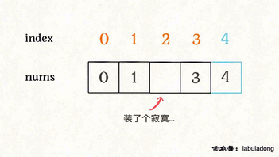

    ```java
        public int missingNumber(int[] nums) {
            int res = 0;
            res = res ^nums.length;
            for(int i = 0;i < nums.length;i++){
                res = i^nums[i]^res;
            }
            return res;
        }
    ```

    ```java
    //麻烦了    
    public int missingNumber(int[] nums) {
            //排序
            Arrays.sort(nums);
            int i;
            for(i = 0;i < nums.length;i++){
                if((nums[i] ^ i)!=0){
                    return i;
                }
            }
    
            return i;
        }
    ```

    

- **只有一个数出现一次，剩下都出现三次，找出出现一次的**

    方法一：状态机

    方法二：循环（计算模3结果，或等在一起）

    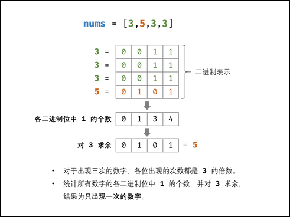

    ```java
        public int singleNumber(int[] nums) {
            int[] count = new int[32];
            //统计好每一位为1的数量
            for(int num:nums){
                for(int i =0;i<32;i++){
                    count[i] += num & 1;
                    num = num >>> 1;
                }
            }
            // System.out.println("count:" + Arrays.toString(count));
            int res = 0;
            for(int i=0;i < 32;i++){
                res <<= 1;
                // System.out.print("31-i:" + (31-i));
                // System.out.print("  count[31-i]:" + count[31-i]);
                res = res | count[31-i]%3;
                // System.out.print("    res1:" + res);
                // res <<= 1;
                // System.out.print("    res2:" + res);
                // System.out.println();
            }
    
            //不可以写成这样，因为当i= 31时，已经不能往右移了，但还是往右移了，已经越界了，再左移没用了,所以得写到前面
            //return res>>=1
            return res;
        }
    ```

    


- **只有两个数出现一次，剩下都出现两次，找出出现一次的**

    因为a!=b!=0，所以a和b必然至少有一位不一样，不妨设最右边的1不一样，按此规则进行分组，分别异或，由于其他数出现两次，就会被异或掉，分别只剩下a和b

### 异或

异或表示无进位加法，加法可表示为无进位加法和进位

- 不用加减乘除做加法

    无进位加法：异或  a

    进位：与运算后左移1  b

    （和 s ）=（非进位和 n ），（进位 c）

    当c ==0，返回n

[剑指 Offer 65. 不用加减乘除做加法](https://leetcode-cn.com/problems/bu-yong-jia-jian-cheng-chu-zuo-jia-fa-lcof/)

利用位运算：将问题分解为【无进位加法+进位】

无进位加法：异或

进位：与运算后左移1（只是进位）

（和 s ）=（非进位和 n ）+（进位 c）。即可将 s=a+b转化为：s=a+b⇒s=n+c

循环求 n和 c ，直至进位 c=0；此时 s=n，返回 n 即可

不用考虑负数，负数是一样的

- 递归

    ```java
        public int add(int a, int b) {
            if(b==0) return a;
    
            return add(a^b, (a&b) << 1);
        }
    ```

- 迭代

    ```java
        //迭代
        public int add(int a, int b) {
            while(b != 0) { // 当进位为 0 时跳出
                int c = (a & b) << 1;  // c = 进位
                a ^= b; // a = 非进位和
                b = c; // b = 进位
            }
            return a;
        }
    ```


## *阶乘

[172. 阶乘后的零](https://leetcode-cn.com/problems/factorial-trailing-zeroes/)

题目：给定一个整数 `n` ，返回 `n!` 结果中尾随零的数量。

提示 `n! = n * (n - 1) * (n - 2) * ... * 3 * 2 * 1`

解析：

两个数相乘结果末尾有 0，一定是因为两个数中有因子 2 和 5，因为 10 = 2 x 5。**问题转化为：`n!` 最多可以分解出多少个因子 2 和 5**？这个主要取决于能分解出几个因子 5，因为每个偶数都能分解出因子 2，因子 2 肯定比因子 5 多得多。**问题转化为：`n!` 最多可以分解出多少个因子 5**？

125！：

125/（5^1） = 25

125/（5^2） = 5

125/（5^3） = 1

所以最后为31个0

代码：

```java
    public int trailingZeroes(int n) {
        int res = 0;
        while(n!=0){
            res += n/5;
            n = n/5;
        }
        return res;
    }
```

```java
    public int trailingZeroes(int n) {
        int res = 0;
        int base = 5;
        while(base <= n){
            res +=n / base;
            base = base*5;
        }
        return res;
    }
```


*[793. 阶乘函数后 K 个零](https://leetcode-cn.com/problems/preimage-size-of-factorial-zeroes-function/)

分析：

一个直观地暴力解法就是穷举呗，因为随着 `n` 的增加，`n!` 肯定是递增的，`trailingZeroes(n!)` 肯定也是递增的

**对于这种具有单调性的函数，用 for 循环遍历，可以用二分查找进行降维打击**

搜索有多少个 `n` 满足 `trailingZeroes(n) == K`，其实就是在问，**满足条件的 `n` 最小是多少，最大是多少，最大值和最小值一减，就可以算出来有多少个 `n` 满足条件了**，对吧？那不就是  [二分查找](https://labuladong.gitee.io/algo/2/18/26/) 中「搜索左侧边界」和「搜索右侧边界」这两个事儿嘛？这道题目实际上给了限制，`K` 是在 `[0, 10^9]` 区间内的整数，也就是说，`trailingZeroes(n)` 的结果最多可以达到 `10^9`。

然后我们可以反推，当 `trailingZeroes(n)` 结果为 `10^9` 时，`n` 为多少？这个不需要你精确计算出来，你只要找到一个数 `hi`，使得 `trailingZeroes(hi)` 比 `10^9` 大，就可以把 `hi` 当做正无穷，作为搜索区间的上界。

刚才说了，`trailingZeroes` 函数是单调函数，那我们就可以猜，先算一下 `trailingZeroes(INT_MAX)` 的结果，比 `10^9` 小一些，那再用 `LONG_MAX` 算一下，远超 `10^9` 了，所以 `LONG_MAX` 可以作为搜索的上界。

**注意为了避免整型溢出的问题，`trailingZeroes` 函数需要把所有数据类型改成 long**：

**在区间 `[0, LONG_MAX]` 中寻找满足 `trailingZeroes(n) == K` 的左侧边界和右侧边界**。

代码：

```java
    // //利用二分法进行优化，求左右边界
    // //暴力遍历会超时
    // public int preimageSizeFZF(int k) {
    //     int cnt = 0;
    //     long tmp = k;
    //     long n = 0;
    //     while(tmp <= k){
    //         tmp = trailingZeroes(n++);
    //         if(tmp == k) cnt++;
    //         if(tmp > k) break;
    //     }
    //     return cnt;
    // }

    public int preimageSizeFZF(int k) {
        return (int)(right_bound(k)-left_bound(k)+1);
    }


    //利用二分法查找左右边界n的左右边界
    //左边界为0,右边界推演出来为Long.MAX_VALUE
    //查找左边界
    //左闭右开
    long left_bound(int target){
        long low = 0,high = Long.MAX_VALUE;
        while(low < high){
            long mid = low +(high-low)/2;
            if(trailingZeroes(mid) < target){
                low = mid + 1;
            }else if(trailingZeroes(mid) > target){
                high = mid;
            }else{
                high = mid;
            }
        } 
        return low;
    }

    //查找右边界
    long right_bound(int target){
        long low = 0,high = Long.MAX_VALUE;
        while(low < high){
            long mid = low +(high-low)/2;
            if(trailingZeroes(mid) < target){
                low = mid + 1;
            }else if(trailingZeroes(mid) > target){
                high = mid;
            }else{
                low = mid + 1;
            }
        } 
        return low-1;
    }

    long trailingZeroes(long n) {
        long res = 0;
        while(n!=0){
            res += n/5;
            n = n/5;
        }
        return res;
    }
```

```java
    public int preimageSizeFZF(int k) {
        //**在区间 `[0, LONG_MAX]` 中寻找满足 `trailingZeroes(n) == K` 的左侧边界和右侧边界**。
        return (int)(right_bound(k)-left_bound(k)+1);
    }

    //利用二分法查找左右边界n的左右边界
    //左边界为0,右边界推演出来为Long.MAX_VALUE
    //查找左边界
    //左闭右闭
    long left_bound(int target){
        long low = 0,high = Long.MAX_VALUE;
        while(low <= high){
            long mid = low + (high-low)/2;
            if(trailingZeroes(mid) < target){
                low = mid + 1;
            }else if(trailingZeroes(mid) > target){
                high = mid-1;
            }else{
                high = mid-1;
            }
        }
        return low;
    }

        //查找右边界
    long right_bound(int target){
        long low = 0,high = Long.MAX_VALUE;
        while(low <= high){
            long mid = low +(high-low)/2;
            if(trailingZeroes(mid) < target){
                low = mid + 1;
            }else if(trailingZeroes(mid) > target){
                high = mid - 1;
            }else{
                low = mid + 1;
            }
        } 
        return high;
    }

    long trailingZeroes(long n) {
        long res = 0;
        while(n!=0){
            res += n/5;
            n = n/5;
        }
        return res;
    }
```


## **素数判断

 [204. 计数质数](https://leetcode-cn.com/problems/count-primes/)

定义：如果一个数如果只能被 1 和它本身整除，那么这个数就是素数。

解析：

```java
12 = 2 × 6
12 = 3 × 4
12 = sqrt(12) × sqrt(12)
12 = 4 × 3
12 = 6 × 2
```

如果在 `[2,sqrt(n)]` 这个区间之内没有发现可整除因子，就可以直接断定 `n` 是素数

筛选法:素数的倍数一定不是素数

冗余：

比如 `n = 25`，`i = 5` 时算法会标记 5 × 2 = 10，5 × 3 = 15 等等数字，但是这两个数字已经被 `i = 2` 和 `i = 3` 的 2 × 5 和 3 × 5 标记了。

我们可以稍微优化一下，让 `j` 从 `i` 的平方开始遍历，而不是从 `2 * i` 开始

```java
    public int countPrimes(int n) {
        boolean[] flag  = new boolean[n];
        Arrays.fill(flag,true);

        for(int i = 2;i*i <n;i++){
            if(flag[i]){
                //如果i是素数，则它的倍数一定不是
                for(int j = i*i;j < n;j+=i){
                    flag[j] = false;
                }
            }
        }

        //计算结果,记得从2开始
        int count = 0;
        for(int i = 2;i<n;i++){
            if(flag[i]){
                count++;
            }
        }

        return count;
    }
```

```java
    public int countPrimes(int n) {
        boolean[] flag = new boolean[n];
        Arrays.fill(flag,true);

        for(int i = 2;i < Math.sqrt(n);i++){
            if(flag[i]){
                for(int j = 2*i;j < n;j += i)
                {
                    flag[j] = false;
                }
            }
        }

        int cnt = 0;
        for(int i=2;i < n; i++){
            if(flag[i]) cnt++;
        }

        return cnt;
    }
```

```java
    public int countPrimes(int n) {
        //从i*i开始，标记质数的倍数，以为质数的倍数都不是质数
        boolean[] flag = new boolean[n];
        Arrays.fill(flag,true);

        for(int i = 2;i < Math.sqrt(n);i++){
            if(flag[i]){
                for(int j = i; j*i < n; j++){
                    flag[i*j] = false;
                }
            }
        }

        int cnt = 0;
        for(int i = 2;i < n; i++){
            if(flag[i]) cnt++;
        }
        
        return cnt;
    }
```


## **超级次方

 [372. 超级次方](https://leetcode-cn.com/problems/super-pow/)

>   //返回的是a,b,len的计算结果

题目：你的任务是计算 `a^b` 对 `1337` 取模，`a` 是一个正整数，`b` 是一个非常大的正整数且会以数组形式给出。

难点：

**一是如何处理用数组表示的指数**？

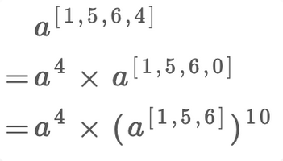


**二是如何得到求模之后的结果**？

```java
(a * b) % k = (a % k)(b % k) % k
```

**三是如何高效进行幂运算**？

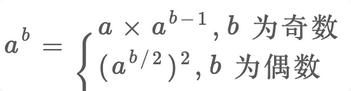

代码：

```java
    public int superPow(int a, int[] b) {
        if(a==1) return 1;
        int len = b.length;
        return superRecur(a,b,len-1);
    }

    //拆分
    public int superRecur(int a,int[] b,int idx){
        if(idx == -1) return 1;
        int x1 = myPow(a,b[idx]);

        int x2 = myPow(superRecur(a,b,idx-1),10);

        return (x1*x2)%1337;
    }

    //快速幂,b是幂
	//注意此处求余，只要是a的地方都求余
    public int myPow(int a,int b){
        int res = 1;
        a = a%1337;
        while(b != 0){
            if((b&1)==1){
                res*= a%1337;
            }
            //base每次向左移，幂逐位取
            a = a*a%1337;
            b = b>>1;
        }

        return res%1337;
    }
```

```java
//不考虑大数的情况
    public int superPow(int a, int[] b) {
        if(a==1) return 1;
        int len = b.length;
        return superRecur(a,b,len-1);
    }

    //返回的是a,b,len的计算结果
    int superRecur(int a,int[] b,int idx){
        if(idx==-1) return 1;
        int x1 = myPow(a,b[idx]);
        int x2 = myPow(superRecur(a,b,idx-1),10);

        return x1*x2;
    }
    
    //快速幂
    public int myPow(int base,int power){
        int res = 1;
        while(power!=0){
            if((power & 1)==1){
                res = res * base;
            }
            base = base * base;
            power = power >> 1;
        }

        return res;
    }
```

```java
    //这样写会超时
    //要递归调用
    // public int superPow(int a, int[] b) {
    //     int res = 1;
    //     for(int i = b.length-1,j=1;i>=0;i--){
    //         res *= myPower(a,b[i]*j);
    //         j = j*10;
    //     }

    //     return res;
    // }

    //递归
    int k = 1337;
    public int superPow(int a, int[] b) {
        if(a==1) return 1;
        int len = b.length;
        return mySuper(a, b, len-1);
    }

    public int mySuper(int a, int[] b, int idx){
        if(idx < 0) return 1;
        int x1 = myPower(a,b[idx]);
        
        int x2 = myPower(mySuper(a,b,idx-1),10);

        //分解底数：变成了 2^123 = 2^3 * (2^12)^10
        //因为要相乘，所以还要除余
        return (x1*x2)%k;
    }

    //哪些地方该除余k呢
    //首先看哪些地方会大于k，比如这里的res，base
    //则所有的res ,base都应该是除余的结果
    public int myPower(int base,int power){
        int res = 1;
        
        base = base%k;
        while(power!=0){
            if((power & 1)==1){
                res = (res*base)%k;
            }
            base = (base*base)%k;
            power = power >> 1;
        }

        return res;
    }
```


## 同时寻找缺失和重复的元素

 [645. 错误的集合](https://leetcode-cn.com/problems/set-mismatch/)

```java
    public int[] findErrorNums(int[] nums) {
        //排序
        Arrays.sort(nums);
        // System.out.println(Arrays.toString(nums));

        int pre = 0;
        int[] res = new int[2];
        for(int i=0;i<nums.length;i++){
            //重复的数字,相邻
            if(nums[i]==pre){
                res[0] = nums[i];
            //缺失的元素，相差大于1
            }else if(nums[i]-pre > 1){
                res[1] = pre+1;
            }
            pre = nums[i];

            //如果缺失的是最后一个元素
            if(nums[nums.length-1]!=nums.length){
                res[1] = nums.length;
            }
        }
        return res;
    }
```


## 随机抽取元素

**蓄水池抽样算法**

若 `nums` 并不是在初始化时完全给出，而是持续以「流」的形式给出，且数据流的很长，不便进行预处理的话，我们只能使用「蓄水池抽样」的方式求解。

 [382. 链表随机节点](https://leetcode-cn.com/problems/linked-list-random-node/)

题目：

给你一个单链表，随机选择链表的一个节点，并返回相应的节点值。每个节点 **被选中的概率一样** 。

思路：

从前往后处理每个样本，每个样本成为答案的概率为1/i, 其中 i为样本编号（编号从 1开始），最终可以确保每个样本成为答案的概率均为 1/n,（其中 n 为样本总数）。

证明:

容易证明该做法的正确性，假设最终成为答案的样本编号为 k，那么 k成为答案的充要条件为**「在遍历到 k 时被选中」并且「遍历大于 k的所有元素时，均没有被选择（没有覆盖 k）」**。

对应事件概率为：

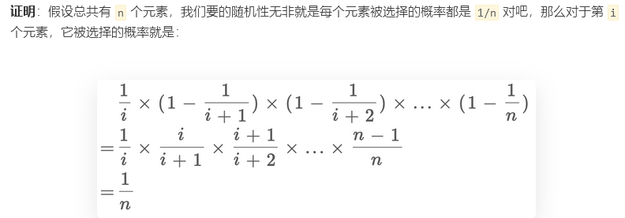

因此，在每一次 getRandom 时，从前往后处理每个节点，同时记录当前节点的编号，当处理到节点 k 时，在 [0,k)范围内进行随机，若随机到结果为 0（发生概率为 1/k），则将节点 k的值存入答案，最后一次覆盖答案的节点即为本次抽样结果。


代码：

```java
class Solution {
    ListNode head;

    public Solution(ListNode head) {
        this.head = head;
    }
    
    public int getRandom() {
        //随机数
        Random r = new Random();
        int cnt = 0, res = 0;
        ListNode cur = this.head;
        while(cur!=null){
            // 生成一个 [0, cnt) 之间的整数
            // 这个整数等于 0 的概率就是 1/cnt
            cnt++;
            if(r.nextInt(cnt)==0){
                res = cur.val;
            }
            cur = cur.next;
        }
        return res;
    }
}
```

题目：

```java
/* 返回链表中 k 个随机节点的值 */
int[] getRandom(ListNode head, int k) {
    Random r = new Random();
    int[] res = new int[k];
    ListNode p = head;

    // 前 k 个元素先默认选上
    for (int j = 0; j < k && p != null; j++) {
        res[j] = p.val;
        p = p.next;
    }

    int i = k;
    // while 循环遍历链表
    while (p != null) {
        // 生成一个 [0, i) 之间的整数
        int j = r.nextInt(++i);
        // 这个整数小于 k 的概率就是 k/i
        if (j < k) {
            res[j] = p.val;
        }
        p = p.next;
    }
    return res;
}
```

 [398. 随机数索引](https://leetcode-cn.com/problems/random-pick-index/)

题目：
给你一个可能含有 **重复元素** 的整数数组 `nums` ，请你随机输出给定的目标数字 `target` 的索引。你可以假设给定的数字一定存在于数组中。

代码：

```java
class Solution {

    int[] nums;

    public Solution(int[] nums) {
        this.nums = nums;
    }
    
    public int pick(int target) {
        Random r = new Random();
        int cnt = 0, res = 0;
        for(int i = 0; i < nums.length;i++){
            if(nums[i]==target){
                cnt++;
                if(r.nextInt(cnt)==0) res = i;
            }
        }
        return res;
    }
}
```


## 脑筋急转弯

[292. Nim 游戏](https://leetcode-cn.com/problems/nim-game/)

代码：

```java
    public boolean canWinNim(int n) {
        return n % 4 != 0;
    }
```


 [877. 石子游戏](https://leetcode-cn.com/problems/stone-game/)

思路：**先手只需要计算好奇偶数位总和谁大，则必赢**

```tex
奇偶数对

我们设数组总长度为n，并且已知n%2 == 0：

    当先手取第一位时，剩下的位置是 2～n， 后手能取的位置为2或n，都为偶数位置。 后手取后总长度变为n-2，产生递归。
    当先手取最后一位时，.......，后手只能取1或n-1，都为奇数位置。 后手取......递归。

不难看出，先手取的位置必定限制了后手能取的位置，即： 先手取首位后手只能取偶数位，先手取末位后手只能取奇数位。 因此先手只需要计算好奇偶数位总和，则必赢
```

代码：

```java
//先手足够聪明 必赢
boolean stoneGame(int[] piles) {
    return true;
}
```


 [319. 灯泡开关](https://leetcode-cn.com/problems/bulb-switcher/)

思路：

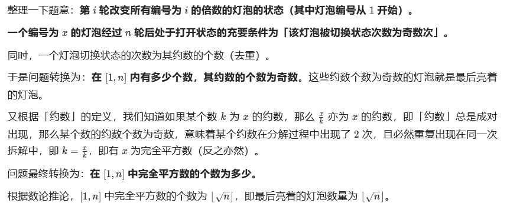

代码：

```java
    public int bulbSwitch(int n) {
        return (int)Math.sqrt(n);
    }
```


## 洗牌算法

**前提：产生的结果必须有 n! 种可能，否则就是错误的。**

```java
// 得到一个在闭区间 [min, max] 内的随机整数
int randInt(int min, int max);

void shuffle(int[] arr) {
    int n = arr.length();
    for (int i = 0 ; i < n; i++) {
        int rand = randInt(i, n - 1);
        swap(arr[i], arr[rand]);
    }
}
```


# 贪心

## 区间调度（最大不相交子集）

```java
public int intervalSchedule(int[][] intvs) {
    if (intvs.length == 0) return 0;
    // 按 end 升序排序
    Arrays.sort(intvs, new Comparator<int[]>() {
        public int compare(int[] a, int[] b) {
            return a[1] - b[1];
        }
    });
    // 至少有一个区间不相交
    int count = 1;
    // 排序后，第一个区间就是 x
    int x_end = intvs[0][1];
    for (int[] interval : intvs) {
        int start = interval[0];
        if (start >= x_end) {
            // 找到下一个选择的区间了
            count++;
            x_end = interval[1];
        }
    }
    return count;
}

```

#### *[435. 无重叠区间](https://leetcode-cn.com/problems/non-overlapping-intervals/)

```java
    public int eraseOverlapIntervals(int[][] intervals) {
        if(intervals.length==0) return 0;

        //按end进行排序
        //容易发生溢出
        Arrays.sort(intervals,new Comparator<int[]>(){
            public int compare(int a[],int b[]){
                return a[1]-b[1];
            }
        });

        int count = 0;
        int x_end = intervals[0][1];
        for(int[] interval:intervals){
            int s = interval[0];
            if(s < x_end){
                count++;
            }else{
                //大于的时候更新
                x_end = interval[1];
            }
        }

        return count-1;
    }
```

#### *[452. 用最少数量的箭引爆气球](https://leetcode-cn.com/problems/minimum-number-of-arrows-to-burst-balloons/)

这个问题和区间调度算法一模一样！如果最多有 `n` 个不重叠的区间，那么就至少需要 `n` 个箭头穿透所有区间。只是有一点不一样，在 `intervalSchedule` 算法中，如果两个区间的边界触碰，不算重叠；而按照这道题目的描述，箭头如果碰到气球的边界气球也会爆炸，所以说相当于区间的边界触碰也算重叠。

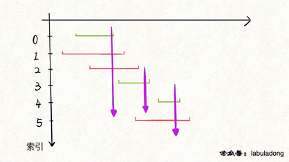

```java
    public int findMinArrowShots(int[][] intervals) {
        if(intervals.length==0) return 0;

        //按end进行排序
        //直接return a[1]-b[1];会发生溢出
        Arrays.sort(intervals, new Comparator<int[]>() {
            public int compare(int[] point1, int[] point2) {
                if (point1[1] > point2[1]) {
                    return 1;
                } else if (point1[1] < point2[1]) {
                    return -1;
                } else {
                    return 0;
                }
            }
        });
       
    //    System.out.print(Arrays.deepToString(intervals));

       int count = 1;
       int x_end = intervals[0][1];
       for(int[] interval:intervals){
            int s = interval[0];
            //计算最大的不重叠子区间的个数，注意边界
            if(s > x_end){
                count++;
                x_end = interval[1];
            }
        }

        return count;
    }
```


## 区间问题（不是贪心）

技巧：

**1、排序**。常见的排序方法就是按照区间起点排序，或者先按照起点升序排序，若起点相同，则按照终点降序排序。当然，如果你非要按照终点排序，无非对称操作，本质都是一样的。

**2、画图**。就是说不要偷懒，勤动手，两个区间的相对位置到底有几种可能，不同的相对位置我们的代码应该怎么去处理

### 区间覆盖

#### [1288. 删除被覆盖区间](https://leetcode-cn.com/problems/remove-covered-intervals/)

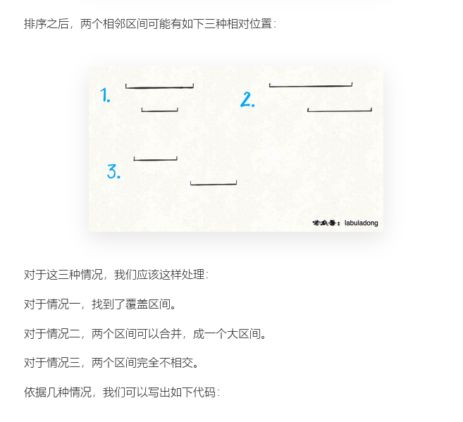

```java
int removeCoveredIntervals(int[][] intvs) {
    // 按照起点升序排列，起点相同时降序排列
    Arrays.sort(intvs, (a, b) -> {
        if (a[0] == b[0]) {
            return b[1] - a[1];
        }
        return a[0] - b[0]; 
    });

    // 记录合并区间的起点和终点
    int left = intvs[0][0];
    int right = intvs[0][1];
    
    int res = 0;
    for (int i = 1; i < intvs.length; i++) {
        int[] intv = intvs[i];
        // 情况一，找到覆盖区间
        if (left <= intv[0] && right >= intv[1]) {
            res++;
        }
        // 情况二，找到相交区间，合并
        if (right >= intv[0] && right <= intv[1]) {
            right = intv[1];
        }
        // 情况三，完全不相交，更新起点和终点
        if (right < intv[0]) {
            left = intv[0];
            right = intv[1];
        }
    }
    
    return intvs.length - res;
}

```

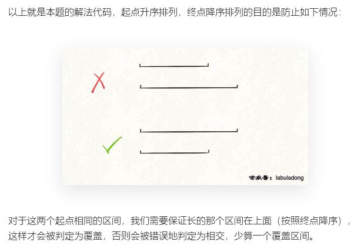

解法：

```java
    public int removeCoveredIntervals(int[][] intervals) {
        //起点按照升序排列，起点相同，则终点按降序
        Arrays.sort(intervals,(a,b)->{
            if(a[0]==b[0]){
                return b[1]-a[1];
            }else{
                return a[0]-b[0];
            }
        });

        //删除没有被覆盖的区间
        int left = intervals[0][0];
        int right = intervals[0][1];
        int count = 1;
        for(int i = 1;i<intervals.length;i++){
            int[] cur = intervals[i];
            //非覆盖区间
            if(right < cur[1]){
                ++count;
                right = cur[1];
            }
        }
        return count;
    }
```

-   二刷:自己写的

```java
    //删除完全被覆盖的区间
    public int removeCoveredIntervals(int[][] intervals) {
        //按开端进行排序
        //开端相同，按结尾逆序
        Arrays.sort(intervals,new Comparator<int[]>(){
            public int compare(int[] e1, int[]e2){
                if(e1[0] != e2[0]) return e1[0]-e2[0];
                else return e2[1]-e1[1];   
            }
        });

        int cnt = 0;
        int preEnd = intervals[0][1];
        for(int[] point:intervals){
            // System.out.println(Arrays.toString(point));
            int e = point[1];
            if(e <= preEnd){
                cnt++;
            }else{
                preEnd = point[1];
            }
        }
        return intervals.length-cnt+1;
    }
```


### 区间合并

#### [56. 合并区间](https://leetcode-cn.com/problems/merge-intervals/)

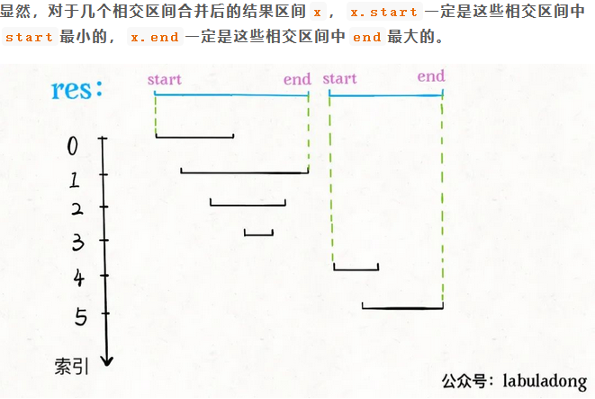

```java
    public int[][] merge(int[][] intervals) {
        if(intervals.length==0) return new int[0][2];

        Arrays.sort(intervals,new Comparator<int[]>(){
            public int compare(int[] a,int[] b){
                return a[0]-b[0];
            }
        });

        List<int[]> res = new ArrayList<int[]>();
        for(int i = 0;i<intervals.length;i++){
            int left = intervals[i][0];
            int right = intervals[i][1];
            //不相交
            if(res.size()==0 || res.get(res.size()-1)[1]<left){
                res.add(new int[]{left,right});
            }else{ //相交
                res.get(res.size()-1)[1] = Math.max(res.get(res.size()-1)[1],right);
            }
        }

        return res.toArray(new int[res.size()][]);
    }
```

-   二刷：自己写的，就是速度慢，但是理清楚了为什么不能end排序

```java
 // public int[][] merge(int[][] intervals) {
    //     //先按end进行升序
    //     Arrays.sort(intervals,new Comparator<int[]>(){
    //         public int compare(int[] e1,int[] e2){
    //             return e1[1]-e2[1];
    //         }
    //     });

    //     LinkedList<int[]> result = new LinkedList<>();
    //     result.add(intervals[0]);
    //     for(int[] interval:intervals){
    //         int s = interval[0];
    //         int[] pre = result.getLast();
    //         //更新
    //         if(s <= pre[1]){
    //             result.removeLast();
    //             result.add(new int[]{Math.min(s,pre[0]),interval[1]});
    //         }else{//添加
    //             result.add(interval);
    //         }
    //     }

    //     int[][] ans = new int[result.size()][2];
    //     for(int i = 0;i < result.size();i++){
    //         ans[i] = result.get(i); 
    //     }

    //     return ans;
    // }

    //按end排序会有问题，如果隔几个比当前大的空间则前面的也都加到result中了
    //问题用例：[[2,3],[4,5],[6,7],[8,9],[1,10]]
    //输出：[[2,3],[4,5],[6,7],[1,10]]
    //预期结果：[[1,10]]

    public int[][] merge(int[][] intervals) {
        //先按start进行升序
        Arrays.sort(intervals,new Comparator<int[]>(){
            public int compare(int[] e1,int[] e2){
                return e1[0]-e2[0];
            }
        });

        LinkedList<int[]> result = new LinkedList<>();
        result.add(intervals[0]);
        for(int[] interval:intervals){
            int[] pre = result.getLast();
            //更新
            if(interval[0] <= pre[1] && interval[1] > pre[1]){
                result.removeLast();
                result.add(new int[]{pre[0],interval[1]});
            }else if (interval[0] > pre[1]){//添加
                result.add(interval);
            }
        }

        int[][] ans = new int[result.size()][2];
        for(int i = 0;i < result.size();i++){
            ans[i] = result.get(i); 
        }

        return ans;
    }
```


### 区间交集

#### *[间列表的交集](https://leetcode-cn.com/problems/interval-list-intersections/)

首先，**对于两个区间**，我们用`[a1,a2]`和`[b1,b2]`表示在`A`和`B`中的两个区间，那么什么情况下这两个区间**没有交集**呢：

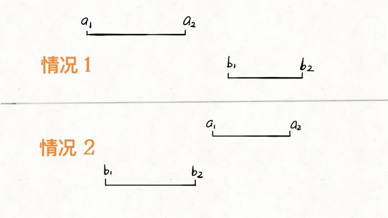

只有这两种情况，写成代码的条件判断就是这样：

```
if b2 < a1 or a2 < b1:
    [a1,a2] 和 [b1,b2] 无交集
```

那么，什么情况下，两个区间存在交集呢？根据命题的否定，上面逻辑的否命题就是存在交集的条件：

```
# 不等号取反，or 也要变成 and
if b2 >= a1 and a2 >= b1:
    [a1,a2] 和 [b1,b2] 存在交集
```

接下来，两个区间存在交集的情况有哪些呢？穷举出来：

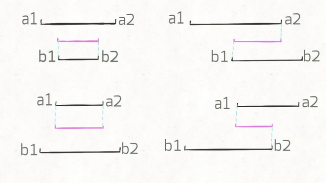

我们惊奇地发现，交集区间是有规律的！如果交集区间是`[c1,c2]`，那么`c1=max(a1,b1)`，`c2=min(a2,b2)`！这一点就是寻找交集的核心，我们把代码更进一步：

```
while i < len(A) and j < len(B):
    a1, a2 = A[i][0], A[i][1]
    b1, b2 = B[j][0], B[j][1]
    if b2 >= a1 and a2 >= b1:
        res.append([max(a1, b1), min(a2, b2)])
    # ...
```

最后一步，我们的指针`i`和`j`肯定要前进（递增）的，什么时候应该前进呢？

是否前进，只取决于`a2`和`b2`的大小关系：

```
while i < len(A) and j < len(B):
    # ...
    if b2 < a2:
        j += 1
    else:
        i += 1
```

解法：

```java
    public int[][] intervalIntersection(int[][] firstList, int[][] secondList) {
        int i =0,j = 0;
        List<int[]> res = new ArrayList<>();

        //题目说已经排好序了，所以不用继续排序了
        while(i < firstList.length && j < secondList.length){
            int a1 = firstList[i][0],a2 = firstList[i][1];
            int b1 = secondList[j][0],b2 = secondList[j][1];
            int c1 = Math.max(a1,b1);
            int c2 = Math.min(a2,b2);
            //如果这个区间成立
            if(c1 <= c2){
                res.add(new int[]{c1,c2});
            }
        
            //指针前进
            if(a2 < b2){
                i++;
            }else{
                j++;
            }
        }

        return res.toArray(new int[res.size()][]);
    }
```

```java
    public int[][] intervalIntersection(int[][] firstList, int[][] secondList) {
        int i =0,j = 0;
        List<int[]> res = new ArrayList<>();

        //题目说已经排好序了，所以不用继续排序了
        while(i < firstList.length && j < secondList.length){
            int a1 = firstList[i][0],a2 = firstList[i][1];
            int b1 = secondList[j][0],b2 = secondList[j][1];
            //两个区间存在交集
            ////此处是且的关系，判断有交集的条件
            if(b1 <= a2  && a1 <= b2){
                int c1 = Math.max(a1,b1);
                int c2 = Math.min(a2,b2);
                res.add(new int[]{c1,c2});
            }
            //指针前进
            ////要确保这个区间过去，所以不是a1
            if(b2 < a2){
                j++;
            }else{
                i++;
            }
        }

        return res.toArray(new int[res.size()][]);
    }
```


# 分治算法

###  **[241. 为运算表达式设计优先级](https://leetcode-cn.com/problems/different-ways-to-add-parentheses/)

>   //这个判断实在是太巧妙了，不用计算数的位数
>           if(res.isEmpty()){
>               res.add(Integer.valueOf(expression));
>           }

思路：

1，分：先看单层嵌套里的括号添加方法，按**运算符**进行分割为左右两个部分

2，治：按运算符进行计算

对特殊情况进行了备忘录优化

```
1 + 1 + 1 + 1 + 1
(1 + 1) + (1 + 1 + 1)
(1 + 1 + 1) + (1 + 1)
```

```java
    //返回当前表达式，只单层嵌套的可能的计算结果
    //增加备忘录进行优化,当前表达式+结果
    HashMap<String,List<Integer>> memo = new HashMap<>();
    public List<Integer> diffWaysToCompute(String expression) {

        if(memo.containsKey(expression)) return memo.get(expression);
        //本次表达式的返回结果
        List<Integer> res = new LinkedList<>();
        for(int i=0;i < expression.length();i++){
            char c = expression.charAt(i);
            //如果是运算符就进行分割
            //分
            if(c=='+' || c=='-' || c=='*'){
                List<Integer> left =  diffWaysToCompute(expression.substring(0,i));
                List<Integer> right =  diffWaysToCompute(expression.substring(i+1,expression.length()));
                //治
                for(int l:left){
                    for(int r:right){
                        if(c=='+') res.add(l+r);
                        else if(c=='-') res.add(l-r);
                        else if(c=='*') res.add(l*r);
                    }
                }
            }
        }

        //base case
        //说明表达式里没有一个运算符了,就是一个数的时候，即为答案
        if(res.isEmpty()){
            res.add(Integer.parseInt(expression));
        }

        memo.put(expression,res);
        return res;
    }
```

```java
    //表达式返回的所有单层的括号的结果
    HashMap<String,List<Integer>> memo = new HashMap<>();
    public List<Integer> diffWaysToCompute(String expression) {
        if(memo.containsKey(expression)) return memo.get(expression);
        List<Integer> res = new LinkedList<>();
        for(int i = 0;i < expression.length();i++){
            char c = expression.charAt(i);

            if(c=='+' || c=='-' || c=='*'){
            List<Integer> left = diffWaysToCompute(expression.substring(0,i));
            List<Integer> right = diffWaysToCompute(expression.substring(i+1,expression.length()));
            if(c=='+'){
                for(int l:left){
                    for(int r:right){
                        res.add(l + r);
                    }
                }
            }
            else if(c=='-'){
                for(int l:left){
                    for(int r:right){
                        res.add(l - r);
                    }
                }
            }
            else if(c=='*'){
                for(int l:left){
                    for(int r:right){
                        res.add(l * r);
                        }
                    }
                }
            }
        }

        //这个判断实在是太巧妙了，不用计算数的位数
        if(res.isEmpty()){
            res.add(Integer.valueOf(expression));
        }

        memo.put(expression,res);
        return res;
    }
```


# 牛客101

## 链表

### 判断是否有环

```java
import java.util.*;
/**
 * Definition for singly-linked list.
 * class ListNode {
 *     int val;
 *     ListNode next;
 *     ListNode(int x) {
 *         val = x;
 *         next = null;
 *     }
 * }
 */
public class Solution {
    //hashmap
    public boolean hasCycle(ListNode head) {
        HashSet<ListNode> nodes = new HashSet<>();
        
        ListNode cur = head;
        while(cur!=null){
            if(nodes.contains(cur)) return true;
            nodes.add(cur);
            cur = cur.next;
        }
        return false;
    }
    
//     // 快慢指针
//     public boolean hasCycle(ListNode head) {
//         ListNode slow = head,fast = head;
//         while(slow!=null && fast!=null  && fast.next!=null){
//             slow = slow.next;
//             fast = fast.next.next;
//             if(fast==slow) return true;
//         }
        
//         return false;
//     }
}
```


### 每k个一反转

```java
import java.util.*;

/*
 * public class ListNode {
 *   int val;
 *   ListNode next = null;
 * }
 */

public class Solution {
    /**
     * 
     * @param head ListNode类 
     * @param k int整型 
     * @return ListNode类
     */
    ////迭代
//     public ListNode reverseKGroup (ListNode head, int k) {
//         // write code here
//         if(head==null || k-2 < 0) return head;
//         //最后的头
//         ListNode newHead = new ListNode(-1);
//         newHead.next = head;
//         ListNode cur = head;
//         //目前小段的头的前一个
//         ListNode curHead = newHead;

//         int cnt = 0;
//         while(cur!=null && cur.next!=null){

//             if(cnt == 0){
//                 boolean res = checkK(cur,k);
//                 if(!res){
//                     return newHead.next;
//                 }
//             }

//             if(cnt < k){
//                 ListNode tmp = cur.next;
//                 cur.next = tmp.next;
//                 tmp.next = curHead.next;
//                 curHead.next = tmp;
//                 if(cnt==k-2) {
//                     curHead = cur;
//                     cur = cur.next;
//                     cnt = 0;
//                     continue;
//                 }
//                 cnt++;
//             }

//         }

//         return newHead.next;

//     }
    
//     public boolean checkK(ListNode head, int k){
//         ListNode cur = head;
//         for(int i = 0;i < k;i++){
//             if(cur==null) return false;
//             cur = cur.next;
//         }
//         return true;
//     }
    
    //递归
    
    public ListNode reverseKGroup (ListNode head, int k) {
        ListNode tail = head;
   
        for(int i = 0;i < k;i++){
            if(tail==null) return head;
            tail = tail.next;
        }
//         if(tail!=null)
//         System.out.println(tail.val);
        
        ListNode pre = null;
        ListNode cur = head;
        while(cur!=tail){
            ListNode tmp = cur.next;
            cur.next = pre;
            pre = cur;
            cur = tmp;
        }
    
        head.next = reverseKGroup(tail,k);
        
        return pre;
    }
}
```


### 判断链表是否有环

算法：

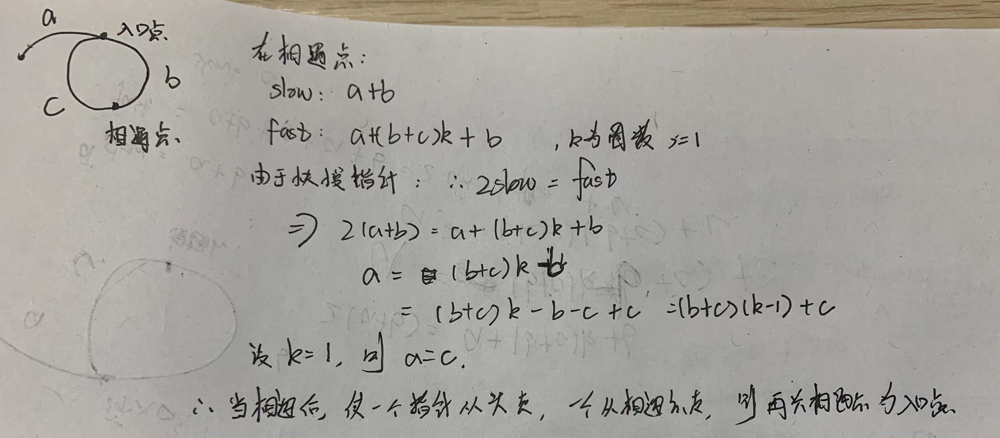

```java
import java.util.*;
/*
 public class ListNode {
    int val;
    ListNode next = null;

    ListNode(int val) {
        this.val = val;
    }
}
*/
public class Solution {

    public ListNode EntryNodeOfLoop(ListNode pHead) {
        ListNode slow = pHead,fast = pHead;
        
        while(fast!=null && fast.next!=null){
            slow = slow.next;
            fast = fast.next.next;
            //代表有环
            if(slow == fast){
//                 fast = pHead;
                break;
            }
        }
        
        //无环
        if(fast==null || fast.next==null) return null;
        
        fast = pHead;
        //还是这样写比较好，不然当a = 0的时候，按照我原来的写法就会出错（slow!=null && fast!=null）
        while(slow!=fast){
            slow = slow.next;
            fast = fast.next;
        }
        
        //无环
        return slow;
    }
}
```

### 两个链表的第一个公共节点

```java
public class Solution {
    public ListNode FindFirstCommonNode(ListNode pHead1, ListNode pHead2) {
        ListNode p1 = pHead1,p2 = pHead2;
        if(p1==null || p2==null) return null;
        while(p1!=p2){
            p1 = p1.next;
            p2 = p2.next;
            if(p1==p2) return p1;
            if(p1==null) p1 = pHead2;
            if(p2==null) p2 = pHead1;
            
        }
        return p1;
    }
}
```

### 删除倒数第n个节点

```java
    public ListNode removeNthFromEnd (ListNode head, int n) {
        // write code here
        ListNode dummy = new ListNode(-1);
        dummy.next = head;
        ListNode fast = dummy,slow = dummy;
        
        for(int i = 0;i < n;i++){
            fast = fast.next;
        }
        
        while(fast.next!=null){
            slow = slow.next;
            fast = fast.next;
        }
        
        slow.next = slow.next.next;
        return dummy.next;
    }
```


### *删除链表中所有重复节点

>   1,1,2,2,3,4
>
>   1,1,2,3,3,4
>
>   在cur==最后一个1时，先让pre.next = cur, 但是这个pre是否有效得看下一步，也就是看看cur.val?=cur.next.val，如果不等则，说明pre有效，则pre = pre.next;
>
>   不要固定思维认为pre.next = cur和pre = pre.next是原子操作，或者相等！

```java
public ListNode deleteDuplicates (ListNode head) {
        // write code here
        ListNode dummy = new ListNode(0);
        dummy.next = head;
        
        ListNode pre = dummy;
        ListNode cur = head;
        
        while(cur!=null && cur.next!=null){
            if(cur.val==cur.next.val){
                int same = cur.val;
                while(cur!=null && cur.val==same){
                    cur =cur.next;
                }
                pre.next = cur;
            }else{
                pre = cur;
                cur = cur.next;
            }
        }
        return dummy.next;
       
    }
```


## 二分查找/排序

### [BM22比较版本号](https://www.nowcoder.com/practice/2b317e02f14247a49ffdbdba315459e7?tpId=295&tqId=1024572&ru=/exam/oj&qru=/ta/format-top101/question-ranking&sourceUrl=%2Fexam%2Foj)

```java
public int compare (String version1, String version2) {
        int n1 = version1.length();
        int n2 = version2.length();
        long num1 = 0,num2 = 0;
        int i = 0, j = 0;
        //为什么要用或而不是和
        //1.1 1.1.1
        //太巧妙了这题写的，看似简单，这个num1=0和跳过.，其实简化了很多逻辑
        w    21hile(i < n1 || j < n2){
            num1 = 0;
            while(i < n1 && version1.charAt(i)!='.'){
                num1 = num1*10 + version1.charAt(i)-'0';
                i++;
            }
            i++;
            num2 = 0;
            while(j < n2 && version2.charAt(j)!='.'){
                num2 = num2*10 + version2.charAt(j)-'0';
                j++;
            }
            j++;
            
            if(num1 < num2) return -1;
            else if (num1 > num2) return 1;
        }
        return 0;
    }
```


# 企业刷题

## 蔚来

### [NC45 实现二叉树先序，中序和后序遍历](https://www.nowcoder.com/practice/a9fec6c46a684ad5a3abd4e365a9d362?tpId=117&&tqId=37819&&companyId=961&rp=1&ru=/company/home/code/961&qru=/ta/job-code-high/question-ranking)

```java
public class Solution {
    /**
     * 
     * @param root TreeNode类 the root of binary tree
     * @return int整型二维数组
     */
    List<Integer> pre = new ArrayList<>();
    List<Integer> in = new ArrayList<>();
    List<Integer> post = new ArrayList<>();
    
    public int[][] threeOrders (TreeNode root) {
        if(root==null) return new int[3][0];
        // write code here
        preOrder(root);
        inOrder(root);
        postOrder(root);
        int[][] res = new int[3][pre.size()];
        
        res[0] = deal(pre);
        res[1] = deal(in);
        res[2] = deal(post);
        return res;
    }
    
    public void preOrder(TreeNode root){
        if(root==null) return;
        
        pre.add(root.val);
        preOrder(root.left);
        preOrder(root.right);
    }
    
    public void inOrder(TreeNode root){
        if(root==null) return;
        
        inOrder(root.left);
        in.add(root.val);
        inOrder(root.right);
    }
    
    public void postOrder(TreeNode root){
        if(root==null) return;
        
        postOrder(root.left);
        postOrder(root.right);
        post.add(root.val);
    }
    
    public int[] deal(List<Integer> list){
        int[] res = new int[list.size()];
        
        for(int i = 0;i < list.size();i++){
            
            res[i] = list.get(i);
        }
        return res;
    }
}
```


### [NC60判断一棵二叉树是否为搜索二叉树和完全二叉树](https://www.nowcoder.com/practice/f31fc6d3caf24e7f8b4deb5cd9b5fa97?tpId=117&&tqId=37822&&companyId=961&rp=1&ru=/company/home/code/961&qru=/ta/job-code-high/question-ranking)

```java
public class Solution {
    /**
     * 
     * @param root TreeNode类 the root
     * @return bool布尔型一维数组
     */
    //判断中序是否是升序
    //
    TreeNode pre;
    boolean[] res;
    public boolean[] judgeIt (TreeNode root) {
        // write code here
        pre = null;
        res = new boolean[2];
        Arrays.fill(res,true);
        
        judgeBST(root);
        judgeCom(root);
        return res;
        
    }
    
    public void judgeBST(TreeNode root){
        if(root==null) return;
        
        judgeBST(root.left);
        if(pre!=null && pre.val > root.val){
            res[0] = false;
            return;
        }
        pre = root;
        judgeBST(root.right);
    }
    
//     //首先判断是否是满二叉树，不是则按普通方法计算
//     //满二叉树是左右子树的高度相同
//     boolean isB = false;
//     public int judgeCom(TreeNode root){
//         if(root==null) return 0;
        
//         int left = judgeCom(root.left);
//         if(isB && left > 0 ) {
//             res[1] = false;
//             return -1;
//         }
//         int right = judgeCom(root.right);
//         if(left < right) {
//             res[1] = false;
//             return -1;
//         }
//         if(left != 0 && right==0) isB = true;
        
//         return Math.max(left,right)+1;     
//     }
    
    //利用宽度优先遍历
    public void judgeCom(TreeNode root){
        LinkedList<TreeNode> q = new LinkedList<>();
        if(root!=null)
            q.addLast(root);
        boolean leaf = false;
        while(!q.isEmpty()){
            TreeNode cur = q.removeFirst();
            
            if(leaf && (cur.left!=null || cur.right!=null)){
                res[1] = false;
                return;
            }
            
            if(cur.left==null && cur.right!=null){
                res[1] = false;
                return;
            }
            
            if(cur.left!=null) {
                q.addLast(cur.left);
            }
            if(cur.right!=null){
                q.addLast(cur.right);
            }
            
            //只要右边为空了就设置未true
            if(cur.right==null){
                leaf = true;
            }
        }
    }
    
}
```


## 华为


### 目录

递归：LeetCode70、112、509
分治：LeetCode23、169、240
单调栈：LeetCode84、85、739、503
并查集：LeetCode547、200、684
滑动窗口：LeetCode209、3、1004、1208
前缀和：LeetCode724、560、437、1248
差分：LeetCode1094、121、122
拓扑排序：LeetCode210
~~字符串：LeetCode5、20、43、93~~
二分查找：LeetCode33、34
BFS：LeetCode127、139、130、529、815
DFS&回溯：：~~LeetCode934~~、685、1102、531、533、~~113~~、332、~~337~~
动态规划：LeetCode213、123、62、63、361、1230
贪心算法：LeetCode55、435、621、452
字典树：LeetCode820、208、648


### 字符串

#### [5. 最长回文子串](https://leetcode.cn/problems/longest-palindromic-substring/)

```java
    int max = 0;
    String res = "";
    public String longestPalindrome(String s) {
        
        for(int i = 0;i < s.length();i++){
            center(s,i,i);
            center(s,i,i+1);
        }

        return res;
    } 

    public void center(String s, int start, int end){
        while(start >= 0 && end <= s.length()-1 && s.charAt(start) == s.charAt(end)){
            start--;
            end++;
        }
        int len = end-start-1;
        if(len > max){
            max = len;
            res = s.substring(start+1,end);
        }
    }
```


#### [20. 有效的括号](https://leetcode.cn/problems/valid-parentheses/)

```java
    public boolean isValid(String s) {

        LinkedList<Character> stack = new LinkedList<>();

        for(int i = 0;i < s.length();i++ ){
            char c = s.charAt(i);
            if(c == '(' || c=='[' || c=='{'){
                stack.addLast(c);
            }else{
                if(!stack.isEmpty()){
                    char base = stack.getLast();
                    if(base=='(' && c==')'){
                        stack.removeLast();
                    }else if (base=='[' && c==']'){
                        stack.removeLast();
                    }else if(base=='{' && c=='}'){
                        stack.removeLast();
                    }else{
                        stack.addLast(c);
                    }
                }else{
                    stack.addLast(c);
                }
            }

        }

        return  stack.isEmpty();
    }
```


#### *[43. 字符串相乘](https://leetcode.cn/problems/multiply-strings/)

给定两个以字符串形式表示的非负整数 num1 和 num2，返回 num1 和 num2 的乘积，它们的乘积也表示为字符串形式。

注意：不能使用任何内置的 BigInteger 库或直接将输入转换为整数。

```java
    //模拟字符串的乘法
    public String multiply(String num1, String num2) {
        if(num1.equals("0") || num2.equals("0") ) return "0";

        String res = "0";

        //n2的每一位去乘
        for(int i = num2.length()-1;i>=0;i--){
            //tmp记录这一步的乘法的结果
            StringBuilder tmp = new StringBuilder();
            //进位
            int carry = 0;

            //低位补0
            for(int j = 0;j < num2.length()-1-i; j++){
                tmp.append(0);
            } 
            int n2 = num2.charAt(i)-'0';

            //进位
            

            //要考虑idx<0 , 但还有进位的情况
            for(int j = num1.length()-1;j >= 0 || carry!=0 ;j--){
                int n1 = j < 0 ? 0:num1.charAt(j)-'0';
                int m = (n1*n2 + carry) % 10;
                carry = (n1*n2 + carry) /10;
                tmp.append(m);
            }
            //这道题比较巧妙的点，就在于利用stringbuilder对字符串append补0开始，然后不断的反转
            res = addString(res,tmp.reverse().toString());
        }
        return res;
    }

    //模拟字符串的加法
    public String addString(String res,String num){
        StringBuilder sum = new StringBuilder();
        int idx1 = res.length()-1;
        int idx2 = num.length()-1;
        int carry = 0;
        //要考虑idx<0 , 但还有进位的情况
        while(idx2 >= 0 || idx1 >= 0 ||carry!=0){
            //存在 123
            //   234
            //也就是一个串走完了 另一个串还存在的情况
            int n1 = idx1 < 0 ? 0:res.charAt(idx1)-'0';
            int n2 = idx2 < 0 ? 0:num.charAt(idx2)-'0';

            int s = (n1 + n2 + carry)%10;
            carry =  (n1 + n2 + carry)/10;
            sum.append(s);
            idx2--;
            idx1--;
        }
        return sum.reverse().toString();
    }
```


#### *[93. 复原 IP 地址](https://leetcode.cn/problems/restore-ip-addresses/)

```java
 List<String> res = new LinkedList<>();
    LinkedList<String> path = new LinkedList<>();
    public List<String> restoreIpAddresses(String s) {
        if(s.length() < 4 && s.length() > 16) return res;

        dfs(s,0);
        // System.out.println(res);

        return res;
    }

    //s是字符串不变，i是字符串的下标，0-i的字符串都是
    public void dfs(String s,int i){
//        System.out.println(s.length() +"\t"+ i);
        if(s.length()==i && path.size()==4){
//            System.out.println("????");
            StringBuilder tmp = new StringBuilder();
            for(int k = 0;k < 3;k++){
                tmp.append(path.get(k));
                tmp.append(".");
            }
            tmp.append(path.get(3));
            res.add(tmp.toString());
            return;
        }

        if(i < s.length() && path.size()>=4){
//            System.out.println("jainlema");
            return;
        }

        //增量p的长度
        for(int len = 1;len <= 3 && i + len-1 < s.length();len++){
            if(len!=1 && s.charAt(i)=='0') continue;
            String t = s.substring(i,i + len);
            int num = Integer.parseInt(t);
            if(num > 255) continue;
            path.add(num+"");
//            System.out.println(path);
            dfs(s,i + len);
            path.removeLast();
//            System.out.println();
        }

    }
```


### DFS

#### [934. 最短的桥](https://leetcode.cn/problems/shortest-bridge/)

```java
    LinkedList<int[]>  q = new LinkedList<>();
    int[] dx = {-1,1,0,0};
    int[] dy = {0,0,-1,1};
    int min = Integer.MAX_VALUE;

    public int shortestBridge(int[][] grid) {
        //先用DFS找到第一个岛，加入队列中，并置为2
        //然后对队列中的每个节点进行BFS，
        int[] start = new int[2];
        //找到第一个岛
        for(int i = 0;i < grid.length;i++){
            for(int j = 0;j < grid[0].length;j++){
                if(grid[i][j]==1){
                    start[0] = i;
                    start[1] = j;
                    break;
                } 
            }
        }

        dfs(grid,start[0],start[1]);
        // Iterator<int[]> iterator = q.iterator();
        // while(iterator.hasNext()){
        //     System.out.println(Arrays.toString(iterator.next()));
        // }
        // System.out.println(Arrays.deepToString(grid));

        return bfs(grid);

    }

    //能进来的都是=1的
    //=2表示遍历过了
    public void dfs(int[][] grid,int i, int j) {
        q.addLast(new int[]{i,j});
        grid[i][j] = 2;

        for(int k = 0;k < 4;k++){
            int x = i + dx[k];
            int y = j + dy[k];

            if(y >= 0 && y < grid.length && x >= 0 && x < grid.length && grid[x][y]==1){
                dfs(grid,x,y);
            }
        }
    }

    public int bfs(int[][] grid){
        int step = 0;
        while(!q.isEmpty()){
            int len = q.size();
            for(int m = 0;m < len;m++){
                int[] point = q.removeFirst();
                int i = point[0];
                int j = point[1];

                for(int k = 0;k < 4;k++){
                    int x = i + dx[k];
                    int y = j + dy[k];

                    if(x>=0 && x< grid.length && y>=0 && y<grid[0].length && grid[x][y]!=2){
                        if(grid[x][y]==0){
                            q.addLast(new int[]{x,y});
                            grid[x][y]=2;
                        }else if(grid[x][y]==1){
                            return step;
                        }
                        
                    }
                }
            }
            step++;
        }
        return 0;
    }
```


#### [113. 路径总和 II](https://leetcode.cn/problems/path-sum-ii/)

```java
    List<List<Integer>> res = new LinkedList<>();
    LinkedList<Integer> path = new LinkedList<>();
    int sum = 0;

    public List<List<Integer>> pathSum(TreeNode root, int targetSum) {
        dfs(root,targetSum);
        return res;
    }

    public void dfs(TreeNode root, int targetSum){
        if(root==null) return;

        //因为有负数，所以不能这样剪枝
        // if(sum > targetSum){
        //     return;
        // }

        path.add(root.val);
        sum += root.val;

        if(root.left==null && root.right==null){
            if(sum==targetSum){
                res.add(new LinkedList<>(path));
            }
        }

        dfs(root.left,targetSum);
        dfs(root.right,targetSum);
        sum -= root.val;
        path.removeLast();
    }
```


#### [337. 打家劫舍 III](https://leetcode.cn/problems/house-robber-iii/)【树形dp】

-   暴力

```java
    //树形dp问题——暴力
    //分析过程：
    //4 个孙子偷的钱 + 爷爷的钱 VS 两个儿子偷的钱 哪个组合钱多，就当做当前节点能偷的最大钱数。【返回值】
    //需要考虑三层

    public int rob(TreeNode root) {
        if(root==null) return 0;

        int money = root.val;
        if(root.left!=null)
            money += (rob(root.left.left) + rob(root.left.right));
        if(root.right!=null)
            money += (rob(root.right.left) + rob(root.right.right));
    
        return Math.max(money,rob(root.left)+rob(root.right));
    }
```


-   暴力+memo

```java
 //方法一有很多重复的子结构，所以需要memo,每个节点不止遍历了一遍
    //HashMap<TreeNode,int>

    HashMap<TreeNode,Integer> memo = new HashMap<>();

    public int rob(TreeNode root) {
        if(root==null) return 0;

        if(memo.containsKey(root)) return memo.get(root);

        int money = root.val;
        if(root.left!=null)
            money += (rob(root.left.left) + rob(root.left.right));
        if(root.right!=null)
            money += (rob(root.right.left) + rob(root.right.right));
    
        memo.put(root,Math.max(money,rob(root.left)+rob(root.right)));
        return memo.get(root);
    }
```


-   一个节点保留两个状态

```java
 //方法三：
    //方法二是一个节点保留一个状态，就是最大值
    //状态：现在一个节点保留两个状态，偷或者不偷的状态下获取到的最大值
    //      只考虑两层，考虑到儿子
    //转移方程：
    //当前节点选择不偷：当前节点能偷到的最大值 = 左孩子偷到的钱的最大值 + 右孩子偷到钱的最大值
    //当前节点选择偷：当前节点能偷到的最大值 = 当前节点的值 + 左孩子选择不偷偷到的钱的最大值 + 右孩子选择不偷偷到钱的最大值
    //结果就是:
    //Math.max(x,y)
    class state{
        TreeNode n;
        int add = 0;
        int not = 0;

        state(TreeNode root){
            this.n = root;
        }
    }

    public int rob(TreeNode root){
        state res = recur(root);
        return Math.max(res.add,res.not);
    }


    //二叉树的后序遍历

    public state recur(TreeNode root) {
        state node = new state(root);

        if(root==null) return node;
        
        state left = recur(root.left);
        state right = recur(root.right);
        
        node.add = node.n.val + left.not + right.not;
        //注意：不偷当前的时候，你左右孩子偷不偷无所谓
        node.not = Math.max(left.add,left.not) + Math.max(right.add,right.not);

        return node;
    }
```


## 字节

### 二叉树

#### [剑指 Offer II 047. 二叉树剪枝](https://leetcode.cn/problems/pOCWxh/)

```java
class Solution {
    // public TreeNode pruneTree(TreeNode root) {
    //     if(root==null) return null;
    //      
    //     TreeNode left = pruneTree(root.left);
    //     TreeNode right = pruneTree(root.right);
    //      
    //     if(root.left==null && root.right==null && root.val == 0){
    //      这样只是把root的引用置空了，但堆里的对象还在，root.left还是指向那个对象的实体
    //         root = null;
    //         return null;
    //     }
    //     return root;
    // }

    public TreeNode pruneTree(TreeNode root) {
        if(root==null) return null;
        root.left = pruneTree(root.left);
        root.right = pruneTree(root.right);

        if(root.left==null && root.right==null && root.val == 0){
            return null;
        }
        return root;
    }
}
```


#### [144. 二叉树的前序遍历](https://leetcode.cn/problems/binary-tree-preorder-traversal/)

```java
 public List<Integer> preorderTraversal(TreeNode root) {
        LinkedList<TreeNode> s = new LinkedList<>();
        List<Integer> res = new LinkedList<>();
        if(root==null) return res;

        s.addLast(root);
        while(!s.isEmpty()){
            TreeNode cur = s.removeLast();
            res.add(cur.val);
            if(cur.right!=null) s.addLast(cur.right);
            if(cur.left!=null) s.addLast(cur.left);
        }

        return res;
    }
```

#### [145. 二叉树的后序遍历](https://leetcode.cn/problems/binary-tree-postorder-traversal/)

```java
     public List<Integer> postorderTraversal(TreeNode root) {
        List<Integer> res = new LinkedList<>();
        LinkedList<TreeNode> s1 = new LinkedList<>();
        LinkedList<TreeNode> s2 = new LinkedList<>();

        if(root==null) return res;
       
       s1.addLast(root);
       while(!s1.isEmpty()){
           TreeNode cur = s1.removeLast();
           s2.addLast(cur);
           if(cur.left!=null) s1.addLast(cur.left);
           if(cur.right!=null) s1.addLast(cur.right);
       }

       while(!s2.isEmpty()){
           res.add(s2.removeLast().val);
       }

        return res;
    }
```

#### [94. 二叉树的中序遍历](https://leetcode.cn/problems/binary-tree-inorder-traversal/)

```java
    public List<Integer> inorderTraversal(TreeNode root) {
        List<Integer> res = new LinkedList<>();

        if(root==null) return res;

        LinkedList<TreeNode> s = new LinkedList<>();
        TreeNode cur = root;

        while(!s.isEmpty() || cur!=null){
            while(cur!=null){
                s.addLast(cur);
                cur = cur.left;
            }
            TreeNode node = s.removeLast();
            res.add(node.val);
            cur = node.right;
        }

        return res;
    }
```

#### [662. 二叉树最大宽度](https://leetcode.cn/problems/maximum-width-of-binary-tree/)

```java
    //记录每一层的第一个元素！用最后一个节点减
    //不管节点是否为空，序号都要增加,所以空节点也要入队列
    //只是空节点不处理
    class Node{
        TreeNode p;
        int depth;
        int seq;

        Node(TreeNode p,int depth,int seq){
            this.p = p;
            this.depth = depth;
            this.seq = seq;
        }

    }

    public int widthOfBinaryTree(TreeNode root) {
        LinkedList<Node> q = new LinkedList<>();
        if(root!=null) q.addLast(new Node(root,0,0));
        int max = 0;
        int depth = 0;
        while(!q.isEmpty()){
            int len = q.size();
            int left = 0;
            for(int i = 0;i < len;i++){
                Node cur = q.removeFirst();
                if(cur.p!=null){
                    q.addLast(new Node(cur.p.left,cur.depth+1,2*cur.seq));
                    q.addLast(new Node(cur.p.right,cur.depth+1,2*cur.seq+1));

                    if(cur.depth!=depth){
                        left = cur.seq;
                        depth = cur.depth;
                    }
                    max = Math.max(cur.seq-left+1,max);
                }
            }
        }

        return max;
    }
```

#### [剑指 Offer II 046. 二叉树的右侧视图](https://leetcode.cn/problems/WNC0Lk/)

```java
    public List<Integer> rightSideView(TreeNode root) {
        HashMap<Integer,TreeNode> map = new HashMap<>();

        LinkedList<TreeNode> q = new LinkedList<>();
        if(root!=null) q.addLast(root);
        int depth = 0;
        while(!q.isEmpty()){
            int len =q.size();
            for(int i = 0;i <len;i++){
                TreeNode cur = q.removeFirst();
                map.put(depth,cur);
                if(cur.left!=null) q.addLast(cur.left);
                if(cur.right!=null) q.addLast(cur.right);
            }
            depth++;
        }

        List<Integer> res = new LinkedList<>();

        for(int i = 0;i < map.size();i++){
            res.add(map.get(i).val);
        }

        return res;
    }
```

#### [剑指 Offer 07. 重建二叉树](https://leetcode.cn/problems/zhong-jian-er-cha-shu-lcof/)

```java
    public TreeNode buildTree(int[] preorder, int[] inorder) {
        HashMap<Integer,Integer> inMap = new HashMap<>();

        for(int i = 0;i < inorder.length;i++){
            inMap.put(inorder[i],i);
        }

        TreeNode root = createTree(preorder,inMap,0,preorder.length-1,0,inMap.size()-1);
        return root;

    }

    public TreeNode createTree(int[] preorder,HashMap<Integer,Integer> inMap,int pl,int pr,int il,int ir){
        if(pl > pr) return null;

        TreeNode root = new TreeNode(preorder[pl]);
        int idx = inMap.get(preorder[pl]);
        int leftlen = idx - il; 
        root.left = createTree(preorder,inMap,pl+1,pl + leftlen,il,idx-1);
        root.right = createTree(preorder,inMap,pl + leftlen+1,pr,idx+1,ir);

        return root;
    }
```

#### [236. 二叉树的最近公共祖先](https://leetcode.cn/problems/lowest-common-ancestor-of-a-binary-tree/)

```java
    public TreeNode lowestCommonAncestor(TreeNode root, TreeNode p, TreeNode q) {
        if(root==null) return null;

        if(root == p || root==q) return root;

        TreeNode left = lowestCommonAncestor(root.left,p,q);
        TreeNode right = lowestCommonAncestor(root.right,p,q);

        if(left==null) return right;
        else if (right==null) return left;
        else return root;
    }
```

#### [103. 二叉树的锯齿形层序遍历](https://leetcode.cn/problems/binary-tree-zigzag-level-order-traversal/)

```java
    public List<List<Integer>> zigzagLevelOrder(TreeNode root) {
        List<List<Integer>> res = new LinkedList<>();

        LinkedList<TreeNode> q = new LinkedList<>();
        if(root!=null) q.addLast(root);
        while(!q.isEmpty()){
            int len = q.size();
            List<Integer> path = new LinkedList<>();
            for(int i = 0;i < len;i++){
                TreeNode cur = q.removeFirst();
                path.add(cur.val);
                if(cur.left!=null) q.addLast(cur.left);
                if(cur.right!=null) q.addLast(cur.right);
            }
            if(res.size()%2==1){
                Collections.reverse(path);
            }
            res.add(path);
        }

        return res;
        
    }
```

#### 左叶到右叶的最短路

```java
    int min = Integer.MIN_VALUE;
    // int min = Integer.MAX_VALUE;
    public int maxPathSum(TreeNode root) {
        // return recur(root);
        recur(root);
        return min;
    }

    public int recur(TreeNode root){
        if(root==null) return -1;
        
        int left = recur(root.left);
        // System.out.println(root.val + "\tleft:" + left);
        int right = recur(root.right);
        // System.out.println(root.val + "\tright:" + right);


        min = Math.max(left + right,min);

        if(left==-1 && right==-1) {
            return 1;
        }
        else if(left==-1) {
            return right + 1;
        }
        else if(right==-1) {
            return left + 1;
        }
        else {
            return Math.min(left,right) + 1; 
        }
    }
```

#### [1104. 二叉树寻路](https://leetcode.cn/problems/path-in-zigzag-labelled-binary-tree/)

先考虑不为之字形的情况，得出结果

再对结果进行处理，找到需要调换的行的数，找到其对应的对称的节点

关键变量是, 当层的最开始的值：left = 2^i,当层的最后一个值： right = 2*left-1

对称的节点的值为: right-node+left

#### [109. 有序链表转换二叉搜索树](https://leetcode.cn/problems/convert-sorted-list-to-binary-search-tree/)

```java
   public TreeNode sortedListToBST(ListNode head) {
        return recur(head,null);
    }

    public TreeNode recur(ListNode left,ListNode right){
        if(left==right) return null;

        ListNode mid = get(left,right);
        TreeNode root = new TreeNode(mid.val);
        root.left = recur(left,mid);
        root.right = recur(mid.next,right);
        return root;
    }

    public ListNode get(ListNode left,ListNode right){
        ListNode slow = left;
        ListNode fast = left;
        while(fast!=right && fast.next!=right){
            fast = fast.next.next;
            slow = slow.next;
        }
        return slow;

    }
```


### 堆和栈

#### [剑指 Offer II 076. 数组中的第 k 大的数字](https://leetcode.cn/problems/xx4gT2/)

```java
    public int findKthLargest(int[] nums, int k) {
        //维护k的小根堆
        PriorityQueue<Integer> heap = new PriorityQueue<>(new Comparator<Integer>() {
            public int compare(Integer o1, Integer o2) {
                return o1-o2;
            }
        });

        for(int i = 0;i < k; i++){
            heap.add(nums[i]);
        }

        for(int i = k;i < nums.length;i++){
            if(nums[i] > heap.peek()){
                heap.remove(heap.peek());
                heap.add(nums[i]);
            }
        }

        return heap.peek();
    }
```


#### [面试题 16.25. LRU 缓存](https://leetcode.cn/problems/lru-cache-lcci/)

思想就是：

LRU : 只要使用过，则删除旧的节点，将它放到尾部

所以数据结构应该是链表，如果是双向链表更好，方便删除

由于如果不存在要返回-1，则使用HashMap

所以数据结构应该是双向链表 + HashMap

=》LinkedHashMap

旧的数组放在头，新的数据放在尾

```java
class LRUCache {
    LinkedHashMap<Integer,Integer> lru;
    int capacity;

    public LRUCache(int capacity) {
        this.lru = new LinkedHashMap<>();
        this.capacity = capacity;
    }
    
    public int get(int key) {
        if(!lru.containsKey(key)) return  -1;

        Integer val = lru.remove(key);
        lru.put(key,val);
        return val;
    }
    
    public void put(int key, int value) {
        if(lru.containsKey(key)){
            lru.remove(key);
            lru.put(key,value);
            return;
        }

        lru.put(key,value);

        if(lru.size() > capacity ){
            //删除头
            lru.remove(lru.entrySet().iterator().next().getKey());
        }
    }
}
```


自定义双向链表+HashMap

```java
class LRUCache {
    //定义双向链表
    public class ListNode{
        int key;
        int val;
        ListNode next;
        ListNode pre;

        ListNode(int key,int val){
            this.key = key;
            this.val = val;
            next = null;
            pre = null;
        }
    }

    int capacity;
    ListNode head;
    ListNode tail;
    HashMap<Integer,ListNode> map;

    public LRUCache(int capacity) {
        map = new HashMap<>();
        head = new ListNode(-1,-1);
        tail = new ListNode(-1,-1);
        this.capacity = capacity;
        head.next = tail;
        tail.pre = head;
    }
    
    public int get(int key) {
        if(!map.containsKey(key)) return -1;
        
        ListNode node = map.get(key);
        node.pre.next = node.next;
        node.next.pre = node.pre;
        moveTotail(node);
        return node.val;
    }

    public void moveTotail(ListNode node){
        tail.pre.next = node;
        node.pre = tail.pre;
        node.next = tail;
        tail.pre = node;
    }
    
    public void put(int key, int value) {
        if(map.containsKey(key)) {
            ListNode node = map.get(key);
            node.pre.next = node.next;
            node.next.pre = node.pre;
            moveTotail(node);
            //可能会存在更新的情况
            node.val = value;
            map.get(key).val = value;
            return;
        }else{
            ListNode node = new ListNode(key,value);
            moveTotail(node);
            map.put(key,node);
        }
        if(map.size() > capacity){
            map.remove(head.next.key);
            head.next = head.next.next;
            head.next.pre = head;
        }
    }
}
```


### 数组

大多跟排序，算法相关

#### [剑指 Offer 39. 数组中出现次数超过一半的数字](https://leetcode.cn/problems/shu-zu-zhong-chu-xian-ci-shu-chao-guo-yi-ban-de-shu-zi-lcof/)

```java
    public int majorityElement(int[] nums) {
        // Arrays.sort(nums);
        // return nums[nums.length/2];

        int cnt = 1;
        int base = nums[0];
        for(int i = 1;i < nums.length; i++){
            if(nums[i]==base){
                cnt++;
            }else{
                cnt--;
            }
            if(cnt==0){
                i++;
                base = nums[i];
                cnt = 1;
            }
        }
        return base;
    }
```

#### [283. 移动零](https://leetcode.cn/problems/move-zeroes/)

```java
    public void moveZeroes(int[] nums) {
        int n = 0,idx = 0;
        while(idx < nums.length){
            if(nums[idx]!=0){
                nums[n++] = nums[idx++];
            }else{
                idx++;
            }
        }

        while(n < nums.length){
            nums[n++] = 0;
        }
    }
```

#### [33. 搜索旋转排序数组](https://leetcode.cn/problems/search-in-rotated-sorted-array/)

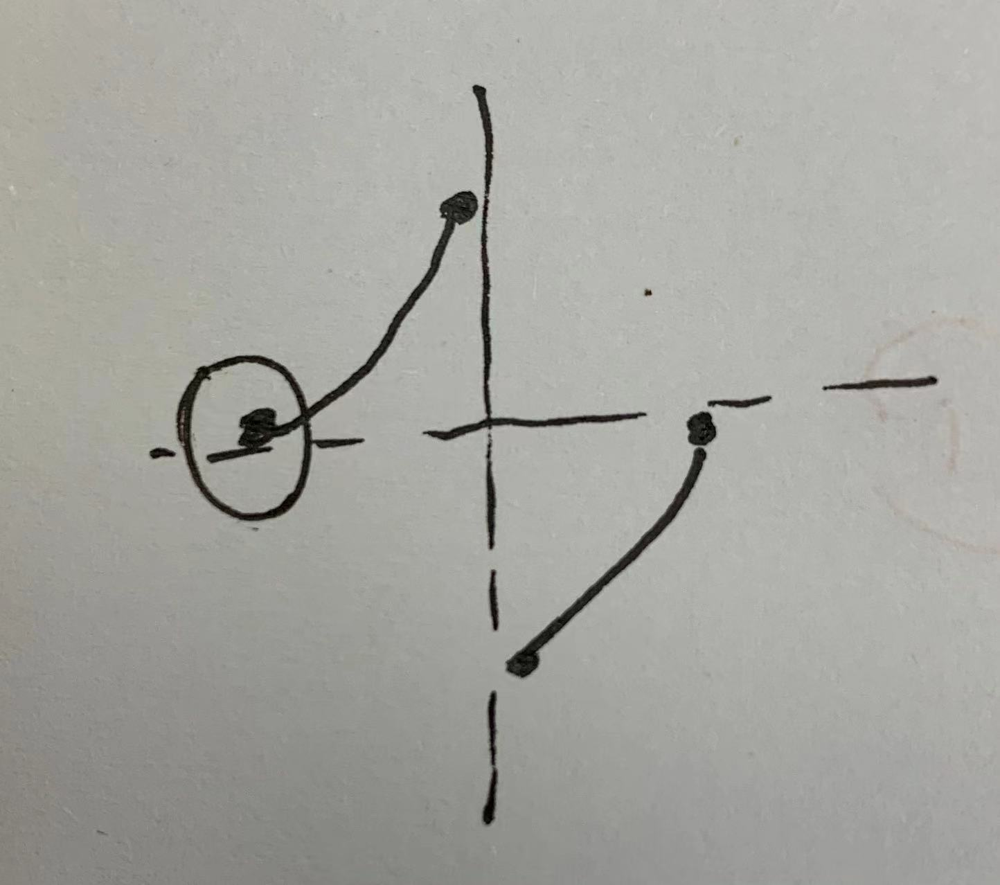

先判断mid在左边还是右边

再判断target在左边还是右边，然后进行low和high的变化

```java
    public int search(int[] nums, int target) {
        int low = 0, high = nums.length-1;
        int mid = 0;
        while(low <= high){
            mid = low + (high-low)/2;
            if(nums[mid]==target) return mid;

            //先判断mid在左段还是在右段
            //mid在左段
            if(nums[mid] >= nums[low]){
                //再判断target在左段还是在右段
                //target在左段
                if(target >= nums[low] && target < nums[mid]){
                    high = mid - 1;
                }else{
                    //target在右段或者target大
                    low = mid + 1;
                }
            }else{
                //mid在右段
                //target在右段
                if(target < nums[low] && target > nums[mid]){
                    low = mid + 1;
                }else{
                    //target在右段或者target大
                    high = mid - 1;
                }
            }
        }

        return -1;
    }
```

#### [88. 合并两个有序数组](https://leetcode.cn/problems/merge-sorted-array/)

```java
   public void merge(int[] nums1, int m, int[] nums2, int n) {
        int p1 = m-1;
        int p2 = n-1;
        int idx = m+n-1;

        if(p1 < 0){
            for(int i = 0;i < n;i++){
                nums1[i] = nums2[i];
            }
        }

        while(p1 >=0 && p2 >= 0){
            if(nums1[p1] <= nums2[p2]){
                nums1[idx] = nums2[p2];
                p2--;
            }else{
                nums1[idx] = nums1[p1];
                p1--;
            }
            idx--;
        }

        while(idx >= 0 && p2 >= 0){
            nums1[idx--] = nums2[p2--];
        }
    }
```

#### [31. 下一个排列](https://leetcode.cn/problems/next-permutation/)

```java
    public void nextPermutation(int[] nums) {
        
        //交换，必然是后面较大的和前面较小的进行交换，并且相差越小越少
        //从低位，找到第一个正序对(i,i+1)，从（i+1,len-1）降序找到比nums[i]大的第一个数交换（则j+1为最大值）
        //（i+1）之后的进行排序,i+1~len-1为降序,改为升序，双指针
        ///特殊情况：整体逆序，则对整个数组进行逆序

        //从后往前找到第一个正序对 
        int len = nums.length;
        int i = len-2;
        int j = len-1;

        for(;i>=0 && nums[i] >= nums[i+1];i--);

        if(i>=0) {
            for(;j >= i+1 && nums[j] <= nums[i];j--);
            swap(nums,i,j);
        }
        reverse(nums,i+1,len-1);
    }

    public void reverse(int[]nums,int i,int j){
        while(i < j){
            swap(nums,i++,j--);
        }

    }

    public void swap(int[]nums,int i,int j){
        int tmp = nums[i];
        nums[i] = nums[j];
        nums[j] = tmp;
    }
```


### 链表

#### 反转链表

迭代：断链

```java
    public ListNode reverseList(ListNode head) {
        //迭代
        ListNode pre = null;
        ListNode cur = head;
        ListNode tmp;
        while(cur!=null){
            tmp = cur.next;
            cur.next = pre;
            pre = cur;
            cur = tmp;
        }
        return pre;
    }

    public ListNode reverseList(ListNode head) {
        //递归
        if(head==null || head.next ==null) return head;

        ListNode node = reverseList(head.next);

        head.next.next = head;
        head.next = null;

        return node;
    }
```


#### 进阶

```java
 public ListNode reverseBetween(ListNode head, int left, int right) {
        //迭代
        ListNode dummy = new ListNode(-1);
        dummy.next = head;
        //反转前第一个节点，反转前的最后一个节点s反转后的第一个节点，反转后的最后一个节点
        ListNode ps = dummy,pe,s = head,e;
        ListNode cur = head;
        int idx = 1;
        while(idx < left && cur!=null){
            ps = cur;
            cur = cur.next;
            s = cur;
            idx++;
        }
  
        ListNode pre = null,tmp;
        while(idx <= right){
            tmp = cur.next;
            cur.next = pre;
            pre = cur;
            cur = tmp;
            idx++;
        }
       
        ps.next = pre;
        s.next = cur;

        return dummy.next;
    }
```


#### ***[82. 删除排序链表中的重复元素 II](https://leetcode.cn/problems/remove-duplicates-from-sorted-list-ii/)

```java
    public ListNode deleteDuplicates(ListNode head) {
        ListNode dummy = new ListNode(-1);

        dummy.next = head;
        ListNode pre = dummy;
        ListNode cur = head;

        //原理应该是：pre->cur->cur.next中间都不应该相隔元素
        //主要区别两种情况
        //{1,2,2,3,4}
        //2!=3，但要删除2。此时pre = 1, pre.next != 2, cur为第二个2 => pre.next!=cur
        //3!=4，保留3。此时pre = 1,pre.next = 3,cur = 3,=> pre.next==cur
        while(cur!=null){
            //跳过当前重复节点，使得cur指向当前重复元素的最后一个位置
            while( cur!=null &&cur.next!=null && cur.val==cur.next.val){
                cur = cur.next;
            }  
            //1->2->2->3->3->4->5，pre = 4,cur = 5
            //*判断pre是否移动，如果pre和cur之间没有重复节点，pre后移
            if(pre.next==cur){
                pre = pre.next;
            }else{
                //1->2->2->3->3->4->5，pre = 1,cur = 2
                //pre和cur之间有重复元素，pre.next进行变化，但pre不动（）
                pre.next = cur.next;
            }
            cur = cur.next;
        }

        return dummy.next;
    }
```


#### *链表每k一反转

利用递归搞快快

```java
    public ListNode reverseKGroup(ListNode head, int k) {
        ListNode tail = head;
        
        for(int i = 0;i < k;i++){
            if(tail==null) return head;
            tail = tail.next;
        }

        ListNode pre = null;
        ListNode cur = head;
        while(cur!=tail){
            ListNode tmp = cur.next;
            cur.next = pre;
            pre = cur;
            cur = tmp;
        }
        
        head.next = reverseKGroup(tail,k);

        return pre;
    }
```


#### 链表快排

```java
    //如果可以交换值，实现快速排序
    //相当于链表是躯壳，躯壳不变，只变内部的值和数组一样！
    public ListNode sortList(ListNode head) {
        quickSort(head,null);
        return head;
    }

    public void quickSort(ListNode head,ListNode end){
        if(head==end) return;

        //包前不包后
        ListNode mid = partition(head,end);
        quickSort(head,mid);
        quickSort(mid.next,end);
    }

    //[)
    public ListNode partition(ListNode head,ListNode end){
        ListNode piovt = head;
        ListNode less = head;
        ListNode cur = head.next;

        while(cur!=end){
            if(cur.val < piovt.val){
                less = less.next;

                int tmp = cur.val;
                cur.val = less.val;
                less.val = tmp;
            }
            cur = cur.next;
        }

        //无序情况下才交换
        if(less!=head){
            // less = less.next;
            int tmp = head.val;
            head.val = less.val;
            less.val = tmp;
        }
        
        return less;
    }
```


#### [86. 分隔链表](https://leetcode.cn/problems/partition-list/)

```java
//一次快排的partition,但不太一样
    public ListNode partition(ListNode head, int x) {
        ListNode small = new ListNode(-1);
        ListNode big = new ListNode(-1);
        ListNode cur = head;
        ListNode sp = small, bp = big;
        ListNode node = head;
        while(cur!=null){
            if(cur.val < x){
                sp.next = cur;
                sp = sp.next;
            // }else if(cur.val==x){
            //     node = cur;
            }else{
                bp.next = cur;
                bp = bp.next;
            }
            cur = cur.next;
        }

        // sp.next = node;
        // node.next = big.next;
        sp.next = big.next;
        bp.next = null;
        return small.next;
    }

```

#### [61. 旋转链表](https://leetcode.cn/problems/rotate-list/)

能跑是能跑，超时了

```java
    public ListNode rotateRight(ListNode head, int k) {
        if(head==null || head.next==null || k==0) return head;
        
        ListNode fast = head,slow = head;
        for(int i = 0;i < k;i++){
            if(fast==null){
                fast = head;
            }
            fast = fast.next;   
            if(fast==null){
                fast = head;
            }
        }
        // System.out.println("slow.val:"+slow.val+"\tfast.val:"+fast.val);
        while(fast!=null && fast.next!=null){
            slow = slow.next;
            fast = fast.next;
        }
        // System.out.println("slow.val:"+slow.val+"\tfast.val:"+fast.val);
        if(slow==fast) return head;
        
        ListNode newHead = slow.next;
        slow.next = null;
        fast.next = head;
        return newHead;
    }
```


先首位相连，确定长度，然后找到最后一个。

我们首先计算出链表的长度 n，并找到该链表的末尾节点，将其与头节点相连。这样就得到了闭合为环的链表。

然后我们找到新链表的最后一个节点，将当前闭合为环的链表断开，即可得到我们所需要的结果。

特别地，当链表长度不大于 1，或者 k 为 n的倍数时，新链表将与原链表相同，我们无需进行任何处理。

```java
    public ListNode rotateRight(ListNode head, int k) {
        if(head==null || k==0) return head;
        ListNode cur = head;
        int cnt = 1;
        while(cur.next!=null){
            cur = cur.next;
            cnt++;
        }
    
        int n = k % cnt;
        if(n == 0) {
            return head;
        } 

        //形成环
        cur.next = head;

        cur = head;
        for(int i = 0;i < cnt-n-1;i++){
            cur = cur.next;
        }        

        ListNode newHead = cur.next;
        cur.next = null;
        return newHead;
    }
```

#### [剑指 Offer 24. 反转链表](https://leetcode.cn/problems/fan-zhuan-lian-biao-lcof/)

```java
public ListNode reverseList(ListNode head) {
        //迭代
        ListNode pre = null;
        ListNode cur = head;
        ListNode tmp;
        while(cur!=null){
            tmp = cur.next;
            cur.next = pre;
            pre = cur;
            cur = tmp;
        }
        return pre;
    }

    public ListNode reverseList(ListNode head) {
        //递归
        if(head==null || head.next ==null) return head;

        ListNode node = reverseList(head.next);

        head.next.next = head;
        head.next = null;

        return node;
    }
```

#### [143. 重排链表](https://leetcode.cn/problems/reorder-list/)

```java
    //快慢指针找到中点
    //将后半部分的链表进行反转
    //l1和l2重新链接
    public void reorderList(ListNode head) {

        if(head.next==null) return;
        
        ListNode node1 = head;
        ListNode node2 = head;
        ListNode slow = head,fast = head.next;
        while(fast!=null && fast.next!=null){
            // System.out.println(cur1.val+"\t"+cur2.val);
            slow = slow.next;
            fast = fast.next.next;    
        }


        node2 = slow.next;
        slow.next = null;
        node2 = reverseList(node2);

        // ListNode test = node2;
        // while(test!=null){
        //     System.out.print(test.val + " ");
        //     test = test.next;
        // }

        while(node1!=null && node2!=null){
            ListNode tmp1 = node1.next;
            node1.next = node2;
            node1 = tmp1;
            
            ListNode tmp2 = node2.next;
            node2.next = node1;
            node2 = tmp2;
            
        }

    }

    public ListNode reverseList(ListNode head){
        ListNode cur = head,pre = null;
        while(cur!=null){
            ListNode tmp = cur.next;
            cur.next = pre;
            pre = cur;
            cur = tmp;
        }

        return pre;
    }
```

#### [92. 反转链表 II](https://leetcode.cn/problems/reverse-linked-list-ii/)

```java
 public ListNode reverseBetween(ListNode head, int left, int right) {
        ListNode dummy = new ListNode(-1);
        dummy.next = head;
        ListNode node1 = dummy,node2 = dummy,node3 = dummy,node4 = dummy,cur = dummy;

        for(int i = 1;i < left;i++){
            cur = cur.next;
        }
        node1 = cur;
        node2 = cur.next;

        cur = cur.next;
        for(int i = left;i < right;i++){
            cur = cur.next;
        }
        node3 = cur;
        node4 = cur.next;

        // System.out.println(node1.val+"\t"+node2.val+"\t"+node3.val+"\t"+node4.val);
        cur = node2;
        ListNode pre = null;
        while(cur!=node4){
            ListNode tmp = cur.next;
            cur.next = pre;
            pre = cur;
            cur = tmp;
        }

        node1.next = node3;
        node2.next = node4;
        return dummy.next;

    }
```

#### [剑指 Offer II 022. 链表中环的入口节点](https://leetcode.cn/problems/c32eOV/)

```java
 public ListNode detectCycle(ListNode head) {
        if(head==null || head.next==null) return null;

        ListNode slow = head,fast = slow.next;
        while(fast!=null && fast.next!=null && slow!=fast){
            slow = slow.next;
            fast = fast.next.next;
        }
        if(fast==null || fast.next==null) return null;

        slow = head;
        fast = fast.next;
        while(slow!=fast){
            slow = slow.next;
            fast = fast.next;
        } 
        return fast;
    }
```

#### [面试题 02.07. 链表相交](https://leetcode.cn/problems/intersection-of-two-linked-lists-lcci/)

```java
public ListNode getIntersectionNode(ListNode headA, ListNode headB) {
        ListNode cur1 = headA,cur2 = headB;
        while(cur1!=cur2){
            if(cur1==null) {
                cur1 = headB;
            }else{
                cur1 = cur1.next;
            }
            
            if(cur2==null) {
                cur2 = headA;
            }else{
                cur2 = cur2.next;
            }
        }
        return cur1;
    }
```

#### [剑指 Offer II 078. 合并排序链表](https://leetcode.cn/problems/vvXgSW/)

优先队列

```java
 public ListNode mergeKLists(ListNode[] lists) {
        PriorityQueue<ListNode> heap = new PriorityQueue<>(new Comparator<ListNode>(){
            public int compare(ListNode node1,ListNode node2){
                return node1.val-node2.val;
            }
        });

        for(int i = 0;i < lists.length;i++){
            if(lists[i]!=null)
                heap.offer(lists[i]);
        }
        
        if(heap.isEmpty()) return null;

        ListNode head = heap.poll();
        if(head.next!=null) heap.offer(head.next);
        ListNode cur = head;
        while(!heap.isEmpty()){
            ListNode node = heap.poll();
            cur.next = node;
            cur = cur.next;
            if(node.next!=null)
                heap.offer(node.next);
        }


        return head;
    }
```


### 字符串

涉及动态优化 dfs

#### [300. 最长递增子序列](https://leetcode.cn/problems/longest-increasing-subsequence/)

```java
    public int lengthOfLIS(int[] nums) {
        //状态：dp[i]表示以i为结尾的最长递增子序列长度
        //状态转移：dp[i]为0~i-1的里小于nums[i]的值 + 1的最大值
        //初始值：dp[i] = 1
        //结果：max(dp[i])
        int[] dp = new int[nums.length];
        Arrays.fill(dp,1);
        for(int i = 0;i < nums.length;i++){
            for(int j = i-1;j >= 0;j-- ){
                if(nums[i] > nums[j]){
                    dp[i] = Math.max(dp[i],dp[j] + 1);
                }   
            }
        }

        // System.out.print(Arrays.toString(dp));
        return Arrays.stream(dp).max().getAsInt();
    }
```


#### [128. 最长连续序列](https://leetcode.cn/problems/longest-consecutive-sequence/)

利用hashset

巧妙的是，x,x+1...x+y一定比x+1,...x+y要长

所以当判断x+1时，x存在时，就可以把这次判断跳过

```java
    public int longestConsecutive(int[] nums) {
        //利用hashset
        HashSet<Integer> hs = new HashSet<>();

        for(int i = 0;i < nums.length;i++){
            hs.add(nums[i]);
        }
        int start=0,end=0;
        int max = 0;
        for(int i = 0;i < nums.length;i++){
            start = nums[i];
            //跳过
            if(hs.contains(start-1)) continue;
            
            end = start + 1;
            while(hs.contains(end)){
                end++;
            }
            max = Math.max(end-start,max);

        }
        return max;
    }
```

#### [14. 最长公共前缀](https://leetcode.cn/problems/longest-common-prefix/)

```java
    public String longestCommonPrefix(String[] strs) {
        int i = 0,j = 0,k = 0;
        while(i < strs[0].length()){
            char c = strs[0].charAt(i);
            for(int idx = 0;idx < strs.length; idx++){
                String str = strs[idx];
                if(i >= str.length() || c != str.charAt(i)){
                    return strs[0].substring(0,i); 
                }
            }
            i++;
        }
        return i==strs[0].length()? strs[0] : "";
        
    }
```


#### [674. 最长连续递增序列](https://leetcode.cn/problems/longest-continuous-increasing-subsequence/)

```java
    public int findLengthOfLCIS(int[] nums) {
        //dp[i]表示以i结果的序列的最长的连续递增的子序列
        //if(nums[i] > nums[i-1]) dp[i] = dp[i-1] + 1;
        //初始化：dp[i] = 1
        //结果maxdp
        int[] dp = new int[nums.length];
        Arrays.fill(dp,1);
        for(int i = 1;i < nums.length;i++){
            if(nums[i] > nums[i-1]){
                dp[i] = dp[i-1] + 1;
            }
        }
        return Arrays.stream(dp).max().getAsInt();
    }
```


#### [3. 无重复字符的最长子串](https://leetcode.cn/problems/longest-substring-without-repeating-characters/)

```java
    public int lengthOfLongestSubstring(String s) {
        HashSet<Character> window = new HashSet<>();
        int left = 0,right = 0;
        int max = 0;
        while(right < s.length()){
            char c = s.charAt(right);
            while(window.contains(c)){
                char d = s.charAt(left);
                window.remove(d);
                left++;
            }
            window.add(c);
            max = Math.max(max,right-left+1);
            right++;
        }
        return max;
    }
```


#### [5. 最长回文子串](https://leetcode.cn/problems/longest-palindromic-substring/)

```java
    public String longestPalindrome(String s) {
        StringBuilder res = new StringBuilder();

        for(int i = 0; i < s.length();i++){
            String a = help(s,i,i);
            String b = help(s,i,i+1);
            if(a.length() > b.length()) {
                if(res.length() < a.length()) res = new StringBuilder(a);
            }else{
                if(res.length() < b.length()) res = new StringBuilder(b);
            }
        }

        return res.toString();
    }

    public String help(String s, int left, int right){
        while(left >= 0 && right <= s.length()-1  && s.charAt(left)==s.charAt(right)){
            left--;
            right++;
        }

        return s.substring(left+1,right);
    }
```


### DFS

#### [216. 组合总和 III](https://leetcode.cn/problems/combination-sum-iii/)

```java
    LinkedList<Integer> path = new LinkedList<>();
    List<List<Integer>> res = new LinkedList<>();

    public List<List<Integer>> combinationSum3(int k, int n) {
        dfs(k,n,1);
        return res;
    }

    public void dfs(int k, int n, int start){
        if(path.size() == k){
            if(sum()==n){
                res.add(new LinkedList<Integer>(path));
            }
            return;
        }

        for(int i = start;i <=9 ;i++ ){
            path.add(i);

            dfs(k,n,i+1);

            path.removeLast();
        }
    }

    public int sum(){
        int res = 0;
        Iterator iter = path.iterator();
        while(iter.hasNext()){
            res += (int)iter.next();
        }

        return res;
    }
```


#### [22. 括号生成](https://leetcode.cn/problems/generate-parentheses/)

```java
    List<String> res = new LinkedList<>();
    StringBuilder path = new StringBuilder();
    public List<String> generateParenthesis(int n) {
        help(n,n);
        return res;
    }

    public void help(int left, int right){
        if(left > right || left < 0 || right < 0) return;

        if(left==right && left==0){
            res.add(new StringBuilder(path).toString());
        } 

        path.append("(");
        help(left-1,right);
        path.deleteCharAt(path.length()-1);

        path.append(")");
        help(left,right-1);
        path.deleteCharAt(path.length()-1);
    }
```


#### [46. 全排列](https://leetcode.cn/problems/permutations/)

```java
    List<List<Integer>> res = new LinkedList<>();
    LinkedList<Integer> path = new LinkedList<>();
    boolean[] used;

    public List<List<Integer>> permute(int[] nums) {
        used = new boolean[nums.length];
        dfs(nums);
        return res;
        
    }

    public void dfs(int[] nums){
        if(path.size()==nums.length){
            res.add(new LinkedList<>(path));
        }

        for(int i = 0;i < nums.length;i++){
            if(used[i]) continue;

            used[i] = true;
            path.add(nums[i]);

            dfs(nums);

            path.removeLast();
            used[i] = false;
        }
    }
```


#### 子集

```java
    LinkedList<Integer> path = new LinkedList<>();
    List<List<Integer>> res = new LinkedList<>();

    public List<List<Integer>> subsets(int[] nums) {
        dfs(nums,0);
        return res;
    }

    public void dfs(int[] nums,int start){
        // if(start==nums.length+1) return;

        res.add(new LinkedList<>(path));

        for(int i = start;i < nums.length;i++){
            path.addLast(nums[i]);
            dfs(nums,i+1);
            path.removeLast();
        }
    }
```


#### [678. 有效的括号字符串](https://leetcode.cn/problems/valid-parenthesis-string/)

双栈法

```java
   public boolean checkValidString(String s) {
        //双栈法，一个左括号栈，一个星号栈
        LinkedList<Integer> s1 = new LinkedList<>();
        LinkedList<Integer> s2 = new LinkedList<>();

        for(int i = 0;i < s.length();i++){
            char c = s.charAt(i);
            if(c=='(') s1.addLast(i);
            else if(c=='*') s2.addLast(i);
            else{
                //右括号
                if(!s1.isEmpty()) s1.removeLast();
                else if(s1.isEmpty() && !s2.isEmpty()) s2.removeLast();
                else if(s1.isEmpty() && s2.isEmpty()) return false;
            }
        }    

        // System.out.println("s1:"+s1+"\ts2:"+s2);
        // System.out.println(s1.size());
        // System.out.println(s2.size());
        // //如果栈中还有元素，则可以把*作为右括号的一部分,直接用长度判断
        // //不可以这样判断，因为左括号必须在右括号的左边
        // //所以栈里应该加索引，而不是元素，没有意义
        // if(s1.isEmpty()) return true;
        // else if(s1.size() <= s2.size()) return true;
        // return false;

        while(!s1.isEmpty() && !s2.isEmpty()){
            int left = s1.removeLast();
            int right = s2.removeLast();
            if(left > right) return false;
        }

        return s1.isEmpty();

    }
```


dp

又复杂又慢

```java
   public boolean checkValidString(String s) {
        //dp
        //状态：dp[i][j]表示在[i,j]内是否为有效的括号
        //状态转移：dp[i+1][j-1]=true && (s[i]="*" && s[j]="*" ||...)
        // dp[i,k]=true && dp[k+1,j] => dp[i][j] = true
        //初始值：s[i][i] = "*" dp[i][i] = true,else false
        //结果：dp[0][n-1]
        int len = s.length();
        boolean[][] dp = new boolean[len][len];
        for(int i = 0;i<len;i++){
            if(s.charAt(i)=='*') dp[i][i] = true;
        }

        for(int i =1; i < len;i++){
            char c1 = s.charAt(i-1);
            char c2 = s.charAt(i);
            dp[i-1][i] = (c1=='(' || c1=='*') && (c2==')' || c2=='*');
        }

        //dp
        for(int i = len-3;i>=0;i--){ //len-1~len-2判断过了
            char c1 = s.charAt(i);
            for(int j = i + 2;j < len;j++){ //长度为3开始判断
                char c2 = s.charAt(j);
                if((c1=='(' || c1=='*') && (c2==')' || c2=='*')){
                    dp[i][j] = dp[i+1][j-1];
                }
                //如果未否，就考虑第二次情况
                for(int k = i;k < j && !dp[i][j];k++){
                    dp[i][j] = dp[i][k] && dp[k+1][j];
                }
            }
        }
        return dp[0][len-1];
    }
```


#### 题：

给一个数N，比如N=23132，然后给一个数组，比如A={2, 3, 9}，然后求由A组成的小于N的最大整数

暴力回溯吧，其他方法我想不出来了，模了一晚上了

```java
static int max = Integer.MIN_VALUE;
    static StringBuilder num = new StringBuilder();
    public static void main(String[] args) {
        int n = 11111;
        int[] nums = {1,4,5};
        String n1 = String.valueOf(n);
        dfs(nums,n1,0);
        System.out.println(max);
    }

    //全排列 + 剪枝
    public static void dfs(int[] nums,String n1,int depth){
        if(depth > n1.length()) return;

        if(num.length()!=0 && Integer.valueOf(num.toString()) >= Integer.valueOf(n1)){
            return;
        }

        if(num.length()!=0 && Integer.valueOf(num.toString()) > max){
            max = Integer.valueOf(num.toString());
        }


        for(int i = 0;i < nums.length;i++){
            num.append(nums[i]);

            dfs(nums,n1,depth+1);

            num.deleteCharAt(num.length()-1);
        }
    }
```


#### [129. 求根节点到叶节点数字之和](https://leetcode.cn/problems/sum-root-to-leaf-numbers/)

```java
 List<String> nums = new LinkedList<>();
    StringBuilder path = new StringBuilder();

    public int sumNumbers(TreeNode root) {    

        help(root);
        // System.out.println(nums);  
        int res = 0;
        Iterator<String> iter = nums.iterator();
        while(iter.hasNext()){
            String num = iter.next();
            res += Integer.parseInt(num);
        }
        return res;  
    }


    public void help(TreeNode root) {
        if(root==null){
            return;
        }

        path.append(root.val+"");

        if(root.left==null && root.right==null){
            nums.add(new StringBuilder(path).toString());
            // System.out.println(path);
        }

        
        help(root.left);
        help(root.right);
        path.deleteCharAt(path.length()-1);
        
    }
```


#### [124. 二叉树中的最大路径和](https://leetcode.cn/problems/binary-tree-maximum-path-sum/)

```java
    int max = Integer.MIN_VALUE;
    public int maxPathSum(TreeNode root) {
        help(root);
        return max;
    }

    //返回页内节点的贡献
    //三种选择
    public int help(TreeNode root){
        if(root==null) return 0;

        int left = help(root.left);
        int right = help(root.right);

        max = Math.max(max,root.val+left+right);
        
        //如果贡献为负，则扔掉不要了
        return Math.max(Math.max(left,right),0) + root.val < 0? 0:Math.max(Math.max(left,right),0) + root.val;
    }
```


#### [200. 岛屿数量](https://leetcode.cn/problems/number-of-islands/)

```java
    //为什么bfs会超时呢
    //为什么bfs会比dfs慢呢
    //为什么为什么
    int[] dx = {-1,1,0,0};
    int[] dy = {0,0,-1,1};
    public int numIslands(char[][] grid) {
        //利用bfs
        int res = 0;
        for(int i = 0;i < grid.length;i++){
            for(int j = 0;j < grid[0].length;j++){
                if(grid[i][j]=='1'){
                    // System.out.println("enter?");
                    // bfs(grid,i,j);
                    dfs(grid,i,j);
                    res++;
                }
            }
        }

        return res;
    }

    public void bfs(char[][] grid,int i,int j){
        LinkedList<int[]> q = new LinkedList<>();
        q.addLast(new int[]{i,j});
        while(!q.isEmpty()){
            int[] cur = q.removeFirst();
            grid[cur[0]][cur[1]] = '0';
            for(int k = 0; k < 4;k++){
                int x = dx[k] + cur[0];
                int y = dy[k] + cur[1];
                if(x < 0 || x >= grid.length || x >= grid.length || y < 0 ||y >= grid[0].length || grid[x][y]=='0') continue;
                q.addLast(new int[]{x,y});
            }
        } 
    }

    public void dfs(char[][]grid, int i,int j){
        if(i < 0 || i >= grid.length || i >= grid.length || j < 0 ||j >= grid[0].length || grid[i][j]=='0') return;

        grid[i][j] = '0';

        for(int k = 0; k < 4;k++){
            int x = dx[k] + i;
            int y = dy[k] + j;
            dfs(grid,x,y);
        }

    }
```


#### *[4. 寻找两个正序数组的中位数](https://leetcode.cn/problems/median-of-two-sorted-arrays/)

比较难，转为求第k小的数

除了思路，需要考虑的边界和条件也很多

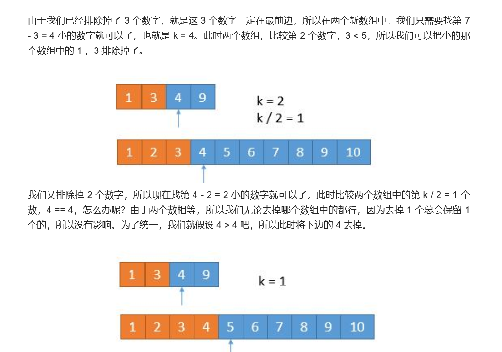

```java
    public double findMedianSortedArrays(int[] nums1, int[] nums2) {
        //如果利用排序后再返回中位数，则时间复杂度为O(m+n)
        //一般看到log，要想到二分
        //此题最巧妙的思路是，可以将中位数转为求第k小的值的问题，每次二分，排除所求第k小的一半的数字
        //初始k = m+n+1/2
        int n = nums1.length;
        int m = nums2.length;
        int left = (n + m + 1)/2;
        int right = (n + m + 2)/2;
        //求第k（left,right）小的数，从1开始
        //把偶数和奇数的情况合并了，如果是奇数，则会求两次相同的k
        return (getKth(nums1,0,n-1,nums2,0,m-1,left) + getKth(nums1,0,n-1,nums2,0,m-1,right))*0.5;
    }

    private int getKth(int[] nums1,int start1,int end1,int[] nums2,int start2,int end2,int k){
        int len1 = end1-start1 + 1;
        int len2 = end2-start2 + 1;
        //让len1的长度小于len2,这样可以保证有数组空了，一定是len1
        if(len1 > len2) return getKth(nums2,start2,end2,nums1,start1,end1,k);
        if(len1 == 0 ) return nums2[start2 + k - 1];
        if(k==1) return Math.min(nums1[start1],nums2[start2]);

        int i = start1 + Math.min(len1,k/2) - 1;
        int j = start2 + Math.min(len2,k/2) - 1;

        if(nums1[i] > nums2[j]){
            return getKth(nums1,start1,end1,nums2,j + 1,end2,k-(j-start2+1));
        }else{//遇到相等，统一去下面
            return getKth(nums1,i+1,end1,nums2,start2,end2,k-(i-start1+1));
        }

    }
```


#### [797. 所有可能的路径](https://leetcode.cn/problems/all-paths-from-source-to-target/)

```java
   LinkedList<Integer> path = new LinkedList<>();
    List<List<Integer>> res = new LinkedList<>();

    public List<List<Integer>> allPathsSourceTarget(int[][] graph) {
        dfs(graph,0);
        return res;
    }

    //图，节点
    public void dfs(int[][] graph,int idx){
        if(path.size() > graph.length) return;

        path.add(idx);

        if(idx == graph.length-1){
            res.add(new LinkedList<Integer>(path));
            path.removeLast();
            return;
        }

        for(int i = 0;i < graph[idx].length;i++){
            dfs(graph,graph[idx][i]); 
        }

        path.removeLast();
    }
```


#### [207. 课程表](https://leetcode.cn/problems/course-schedule/)

dfs:

```java
    boolean[] used;  //一次尝试中的
    boolean[] judge;  //因为不连通，但判断一下每个点之前是否判断过，全局的
    //没有考虑memo，因为这个是先序
    // boolean res = true;
    public boolean canFinish(int numCourses, int[][] prerequisites) {
        List<Integer>[] graph = buildGraph(numCourses,prerequisites);
        judge = new boolean[numCourses];

        for(int i= 0;i < numCourses;i++){
            used = new boolean[numCourses];
            boolean ans = dfs(graph,i);
            // System.out.println(ans);
            if(!ans) return false;
            // if(!res) return false;
        }

        return true;
    }

    //图，点
    // public void dfs(List<Integer>[] graph,int start){
    //     if(used[start]) {
    //         res = false;
    //         return;
    //     }

    //     used[start] = true;
    //     // path.add(start);
    //     for(int i = 0;i < graph[start].size(); i++){
    //         dfs(graph,graph[start].get(i));
    //     }
    //     // path.removeLast();
    //     used[start] = false;

    //     // return true;
    // }

    public boolean dfs(List<Integer>[] graph,int start){

        if(used[start]) {
            // res = false;
            return false;
        }

        if(judge[start]){
            return true;
        }
        judge[start] = true;

        used[start] = true;
        // path.add(start);
        for(int i = 0;i < graph[start].size(); i++){
            if(!dfs(graph,graph[start].get(i))) return false;
        }
        // path.removeLast();
        used[start] = false;

        return true;
    }

    public List<Integer>[] buildGraph(int numCourses,int[][] prerequisites){
        List<Integer>[] graph = new LinkedList[numCourses];
        for(int i = 0;i < numCourses;i++){
            graph[i] = new LinkedList<>();
        }

        for(int[] edge: prerequisites){
            int from = edge[0];
            int to = edge[1];
            graph[from].add(to);
        }

        return graph;
    }
```


bfs:

注意：bfs不用used，因为当你入度>0，必然会遍历好几次这个节点，也无法深入下去，确定某一条里面有无遍历过的节点！因为它是一个点的所有可能同时判断！

```java
    int[] degree;

    public boolean canFinish(int numCourses, int[][] prerequisites) {

        degree = new int[numCourses];

        List<Integer>[] graph = buildGraph(numCourses,prerequisites);
        return bfs(graph);
    }

    public boolean bfs(List<Integer>[] graph){
        LinkedList<Integer> q = new LinkedList<>();
        
        for(int i = 0;i < graph.length;i++){
            if(degree[i]==0){
                q.addLast(i);
            }
        }

        int cnt = 0;
        while(!q.isEmpty()){
            cnt++;
            int s = q.removeFirst();
            for(int i = 0;i < graph[s].size();i++){
                degree[graph[s].get(i)]--;
                if(degree[graph[s].get(i)]==0) 
                    q.addLast(graph[s].get(i));
            }
        }

        return cnt==graph.length;
    }


    public List<Integer>[] buildGraph(int numCourses,int[][] prerequisites){
        List<Integer>[] graph = new LinkedList[numCourses];
        for(int i = 0;i < numCourses;i++){
            graph[i] = new LinkedList<>();
        }

        for(int[] edge: prerequisites){
            int from = edge[0];
            int to = edge[1];
            graph[from].add(to);
            degree[to]++;
        }

        return graph;
    }
```


### BFS

#### [752. 打开转盘锁](https://leetcode.cn/problems/open-the-lock/)

将used的添加放在加入队列前，是因为很有可能在加入时就有重复的，就重复加入了

```java
    //bfs,一次遍历4位的所有的可能，是八种
    //最短的是bfs
    public int openLock(String[] deadends, String target) {
        HashSet<String> dead = new HashSet<>();
        HashSet<String> used = new HashSet<>();
        LinkedList<String> q = new LinkedList<>();
        
        for(String str:deadends){
            dead.add(str);
        }
        q.addLast("0000");
        used.add("0000");
        int cnt = 0;
        while(!q.isEmpty()){
            int len = q.size();
            for(int i = 0;i < len;i++){
                String cur = q.removeFirst();
                //将used的添加放在加入队列前，是因为很有可能在加入时就有重复的，就重复加入了
                // System.out.println(cur);
                // used.add(cur);
                //处理死锁
                if(dead.contains(cur)) continue;
                //处理结束
                if(target.equals(cur)) {
                    return cnt;
                }
                for(int j = 0;j < 4;j++){
                    String str1 = plus(cur,j);
                    
                    if(!used.contains(str1)) {
                        q.addLast(str1);
                        used.add(str1);
                    }
                    
                }
                for(int j = 0;j < 4;j++){
                    String str2 = minus(cur,j);
                    if(!used.contains(str2)) {
                        q.addLast(str2);
                        used.add(str2);
                    }
                }
            }
            cnt++;
        }

        return -1;
    }

    public String plus(String s,int i){
        char[] tmp = s.toCharArray();
        if(tmp[i]=='9') tmp[i] = '0';
        else tmp[i] = (char)(tmp[i]+1);
        return new String(tmp);
    }

    public String minus(String s,int i){
        char[] tmp = s.toCharArray();
        if(tmp[i]=='0') tmp[i] = '9';
        else tmp[i] = (char)(tmp[i]-1);
        return new String(tmp);
    }
```


### 动态规划

#### [42. 接雨水](https://leetcode.cn/problems/trapping-rain-water/)

关键思路：只有在低洼处才会形成雨水

暴力：也就是从当前位置的元素i来看，找到左边界比当前位置大的元素，找到右边界比当前位置大的元素，取左右两边的最小值作为接到的雨水的高度，在减去目前的位置的高度，累加

动态规划：

存储元素两边的最大值

从左往右遍历数组，找出左边的最大值

从右往左遍历数组，找出右边的最大值

再遍历一遍，求左右两边最小值-当前的值

```java
    public int trap(int[] height) {

        //利用数组记录左右两边的值

        int[] left = new int[height.length];
        int[] right = new int[height.length];

        left[0] = height[0];
        for(int i = 1;i < height.length;i++) {
            left[i] = Math.max(left[i-1],height[i]);
        }

        right[height.length-1] =  height[height.length-1];
        for(int i = height.length-2;i >=0;i--){
            right[i] = Math.max(right[i+1],height[i]);
        }

        //遍历
        int res = 0;
        for(int i = 0;i < height.length;i++){
            res += Math.min(right[i],left[i])-height[i];
        }

        return res;
    }
```

#### [322. 零钱兑换](https://leetcode.cn/problems/coin-change/)

```java
    public int coinChange(int[] coins, int amount) {
        //状态：amount或者说和的大小，coins是选择，状态普遍是由选择决定的
        //dp[i]表示凑成i所需最小的硬币数
        //dp[0] = 0
        //dp[i] = Math.min(dp[i-coins])+1
        int[] dp = new int[amount + 1];
        Arrays.fill(dp,amount+1);
        dp[0] = 0;
        for(int i = 1;i <= amount;i++){
            for(int j = 0;j < coins.length;j++){
                if(i-coins[j] >= 0){
                    dp[i] = Math.min(dp[i],dp[i-coins[j]] + 1);
                }
            }
        }

        return dp[amount]==amount+1?-1:dp[amount];
    }
```


### 模拟

#### [2. 两数相加](https://leetcode.cn/problems/add-two-numbers/)

```java
    public ListNode addTwoNumbers(ListNode l1, ListNode l2) {
        ListNode dummy = new ListNode(-1);
        int carry = 0;
        ListNode cur1 = l1, cur2 = l2, cur3 = dummy;

        while(cur1!=null || cur2!=null || carry != 0){
            int sum = 0;
            if(cur1!=null){
                sum = cur1.val; 
                cur1 = cur1.next;
            }
            if(cur2!=null){
                sum += cur2.val;
                cur2 = cur2.next;
            }
            sum += carry;
            int num = sum % 10;
            carry = sum / 10;
            ListNode cur = new ListNode(num);
            cur3.next = cur;
            cur3 = cur3.next;
        }

        return dummy.next;
    }
```


#### [7. 整数反转](https://leetcode.cn/problems/reverse-integer/)

```java
    public int reverse(int x) {
        String num1 = String.valueOf(x);
        int p1 = 0,p2 = num1.length()-1;
        char[] num2 = num1.toCharArray();
        if(x < 0){
            p1 = 1;
        }
        
        while(p1 < p2){
            swap(num2,p1,p2);
            p1++;
            p2--;
        }

        String min = Integer.MIN_VALUE + "";
        String max = Integer.MAX_VALUE + "";
        char[] min1 = min.toCharArray();
        char[] max1 = max.toCharArray();

        // System.out.println("res:" + new String(num2));
        // System.out.println("min:"+ new String(min1));
        // System.out.println("max:"+ new String(max1));
        if(min1.length==num2.length && x < 0){
            for(int i = 1;i < min1.length;i++){
                if(num2[i] > min1[i]) return 0;

                if(num2[i] < min1[i]) break;
            }
        }

        if(max1.length==num2.length && x > 0){
            for(int i = 0;i < max1.length;i++){
                if(num2[i] > max1[i]) return 0;

                if(num2[i] < max1[i]) break;
            }
        }

        return Integer.parseInt(new String(num2));
    }

    public void swap(char[] nums,int i,int j){
        char tmp = nums[i];
        nums[i] = nums[j];
        nums[j] = tmp;
    }
```


#### [415. 字符串相加](https://leetcode.cn/problems/add-strings/)

```java
    //模拟加法
    public String addStrings(String num1, String num2) {
        int idx1 = num1.length()-1;
        int idx2 = num2.length()-1;
        int carry = 0;
        StringBuilder res = new StringBuilder();

        while(idx1 >= 0 || idx2 >= 0 || carry!=0){
            int n1 = 0,n2 = 0;
            if(idx1>=0)
                n1 = num1.charAt(idx1)-'0';
            else
                n1 = 0;
            if(idx2>=0)  
                n2 = num2.charAt(idx2)-'0';
            else 
                n2 = 0;
            int sum = n1 + n2 + carry;
            int n3 = sum % 10;
            carry = sum/10;
            idx1--;
            idx2--;

            res.append(n3);
        }

        return res.reverse().toString();
    }
```


## 科大讯飞

#### 字符串处理

将abaaac=>ab3ac

```java
package test;

import java.util.LinkedList;
import java.util.Scanner;

public class Main {
    public static void main(String[] args) {
        Scanner scanner = new Scanner(System.in);
        String str = scanner.nextLine();
        LinkedList<Character> s = new LinkedList<>();

        for(int i = 0;i < str.length();i++){
            char c = str.charAt(i);
            s.addLast(c);
        }

        char pre = ' ';
        int cnt = 1;
        StringBuilder res = new StringBuilder();
        while(!s.isEmpty()){
            char c = s.removeFirst();
//            System.out.println(c+"\t"+pre+"\t"+cnt);
            if(c!=pre){
                if(cnt!=1)
                    res.append(cnt);
                if(pre!=' ')
                    res.append(pre);
                cnt = 1;
                pre = c;
            }else{
                cnt++;
            }

            if(s.isEmpty()){
                if(cnt!=1)
                    res.append(cnt);
                res.append(c);

            }
        }
        System.out.println(res);
    }


}
```


## 最右

#### [面试题 04.12. 求和路径](https://leetcode.cn/problems/paths-with-sum-lcci/)

```java
    public int pathSum(TreeNode root, int sum) {
        if(root==null) return 0;
        return recur(root,0,sum) + pathSum(root.left,sum) + pathSum(root.right,sum);
    }

    // public int recur(TreeNode root,int sum){
    //     if(root==null) return 0;

    //     // //有负数，不能这么剪枝
    //     // if(sum < 0 ) return 0;

    //     int ans = sum == root.val?1:0; 
    //     sum -= root.val;

    //     int left = recur(root.left,sum);
    //     int right = recur(root.right,sum);

    //     return left+right+ans;
    // }

    public int recur(TreeNode root,int sum, int target){
        if(root==null) return 0;

        sum = sum + root.val;
        int res = 0;
        if(sum==target){
            res++;
        }

        res += recur(root.left,sum,target);
        res += recur(root.right,sum,target);

        return res;
    }
```

#### [剑指 Offer 34. 二叉树中和为某一值的路径](https://leetcode.cn/problems/er-cha-shu-zhong-he-wei-mou-yi-zhi-de-lu-jing-lcof/)

```java
    List<List<Integer>> res = new LinkedList<>();
    int sum = 0;
    LinkedList<Integer> path = new LinkedList<>();
    public List<List<Integer>> pathSum(TreeNode root, int target) {
        dfs(root,target);
        return res;
    }

    public void dfs(TreeNode root, int target){
        if(root==null) return;
    
        sum += root.val;
        path.addLast(root.val);

        if(sum==target){
            res.add(new LinkedList<Integer>(path));
            sum-=root.val;
            path.removeLast();
            return; 
        }

        dfs(root.left,target);
        dfs(root.right,target);
        sum-=root.val;
        path.removeLast();
    }
```


## 京东

#### [剑指 Offer 41. 数据流中的中位数](https://leetcode.cn/problems/shu-ju-liu-zhong-de-zhong-wei-shu-lcof/)

```java
class MedianFinder {

    PriorityQueue<Integer> maxHeap;
    PriorityQueue<Integer> minHeap;

    /** initialize your data structure here. */
    public MedianFinder() {
        maxHeap = new PriorityQueue<>(new Comparator<Integer>(){
            public int compare(Integer a,Integer b){
                return  b-a;
            }
        });

        minHeap = new PriorityQueue<>(new Comparator<Integer>(){
            public int compare(Integer a,Integer b){
                return a-b;
            }
        });
    }
    
    public void addNum(int num) {
        int size1 = this.maxHeap.size();
        int size2 = this.minHeap.size();
        if((size1+size2)%2==0){
            this.minHeap.offer(num);
            this.maxHeap.offer(this.minHeap.poll());
        }else{
            this.maxHeap.offer(num);
            this.minHeap.offer(this.maxHeap.poll());
        }
    }
    
    public double findMedian() {
        int size1 = this.maxHeap.size();
        int size2 = this.minHeap.size();
        // System.out.println(size1+size2);
        if((size1+size2)%2==0){
            return (this.maxHeap.peek()+this.minHeap.peek())/2.0;
        }else{
            return this.maxHeap.peek();
        }
    }
}
```

#### [4. 寻找两个正序数组的中位数](https://leetcode.cn/problems/median-of-two-sorted-arrays/)

```java
class Solution {
    public double findMedianSortedArrays(int[] nums1, int[] nums2) {
        //如果利用排序后再返回中位数，则时间复杂度为O(m+n)
        //一般看到log，要想到二分
        //此题最巧妙的思路是，可以将中位数转为求第k小的值的问题，每次二分，排除所求第k小的一半的数字
        //初始k = m+n+1/2
        int n = nums1.length;
        int m = nums2.length;
        int left = (n + m + 1)/2;
        int right = (n + m + 2)/2;
        //求第k（left,right）小的数，从1开始
        //把偶数和奇数的情况合并了，如果是奇数，则会求两次相同的k
        return (getKth(nums1,0,n-1,nums2,0,m-1,left) + getKth(nums1,0,n-1,nums2,0,m-1,right))*0.5;
    }

    private int getKth(int[] nums1,int start1,int end1,int[] nums2,int start2,int end2,int k){
        int len1 = end1-start1 + 1;
        int len2 = end2-start2 + 1;
        //让len1的长度小于len2,这样可以保证有数组空了，一定是len1
        if(len1 > len2) return getKth(nums2,start2,end2,nums1,start1,end1,k);
        if(len1 == 0 ) return nums2[start2 + k - 1];
        if(k==1) return Math.min(nums1[start1],nums2[start2]);

        int i = start1 + Math.min(len1,k/2) - 1;
        int j = start2 + Math.min(len2,k/2) - 1;

        if(nums1[i] > nums2[j]){
            return getKth(nums1,start1,end1,nums2,j + 1,end2,k-(j-start2+1));
        }else{//遇到相等，统一去下面
            return getKth(nums1,i+1,end1,nums2,start2,end2,k-(i-start1+1));
        }

    }
}
```


# 100

#### [17. 电话号码的字母组合](https://leetcode.cn/problems/letter-combinations-of-a-phone-number/)

```java
    HashMap<Character,char[]> map;
    List<String> res = new ArrayList<>();
    StringBuilder path = new StringBuilder();
    public List<String> letterCombinations(String digits) {
        if(digits.length()==0) return res;
        map = new HashMap<>();
        map.put('2',new char[]{'a','b','c'});
        map.put('3',new char[]{'d','e','f'});
        map.put('4',new char[]{'g','h','i'});
        map.put('5',new char[]{'j','k','l'});
        map.put('6',new char[]{'m','n','o'});
        map.put('7',new char[]{'p','q','r','s'});
        map.put('8',new char[]{'t','u','v'});
        map.put('9',new char[]{'w','x','y','z'});

        dfs(digits,0);

        return res;
    }

    public void dfs(String digits,int i){
        if(path.length()==digits.length()){
            res.add(path.toString());
            return;
        }

        char c = digits.charAt(i);
        for(int idx = 0;idx < map.get(c).length;idx++){
            path.append(map.get(c)[idx]);
            dfs(digits,i+1);
            path.deleteCharAt(path.length()-1);
        }

    }
```


#### [11. 盛最多水的容器](https://leetcode.cn/problems/container-with-most-water/)

分析：分析收缩的两种情况


```java
    public int maxArea(int[] height) {
        int left = 0;
        int right = height.length-1;
        int max = 0;
        while(left < right){
            int tmp = (right-left)*Math.min(height[left],height[right]);
            if(height[left] < height[right]){
                left++;
            }else{
                right--;
            }
            max = Math.max(max,tmp);
        }
        return max;
    }
```


#### [49. 字母异位词分组](https://leetcode.cn/problems/group-anagrams/)

不同异位词的字母排序是一样的

```java
    public List<List<String>> groupAnagrams(String[] strs) {
        HashMap<String,List<String>> map = new HashMap<>();

        for(int i = 0;i < strs.length;i++){
            String cur = strs[i];
            char[] cs = cur.toCharArray();
            Arrays.sort(cs);
            String key = new String(cs);

            List<String> list = map.getOrDefault(key,new ArrayList<>());
            list.add(cur);
            map.put(key,list);
        }

        return new ArrayList<List<String>>(map.values());
    }
```


#### [剑指 Offer 47. 礼物的最大价值](https://leetcode.cn/problems/li-wu-de-zui-da-jie-zhi-lcof/)

复习,dfs,先序，后序（带memo），动态规划，遍历的动态规划

```java
class Solution {
    // //dfs 先序
    // int max = 0;
    // int sum = 0;
    // public int maxValue(int[][] grid) {
    //     dfs(grid,0,0);
    //     return max;
    // }

    //
    // public void dfs(int[][] grid,int i,int j){
    //     if(i >= grid.length ||j>=grid[0].length) return;

    //     sum += grid[i][j];

    //     if(i==grid.length-1 && j ==grid[0].length-1){
    //         max =Math.max(sum,max);
    //     }

    //     dfs(grid,i+1,j);
    //     dfs(grid,i,j+1);

    //     sum -= grid[i][j];
    // }


    // //后序：只有后序可以加memo,应该不是吧，只要有返回状态就可以
    // //可以加memo:完全相同的子状态
    // int[][] memo;
    // public int maxValue(int[][] grid) {
    //     memo  = new int[grid.length][grid[0].length];
    //     for(int i = 0;i < memo.length;i++){
    //         Arrays.fill(memo[i],-1);
    //     }
    //     return recur(grid,0,0);
    // }

    // public int recur(int[][] grid,int i,int j){
    //     if(i >= grid.length ||j>=grid[0].length) return 0;

    //     if(memo[i][j]!=-1) return memo[i][j];

    //     int left = recur(grid,i+1,j);
    //     int right = recur(grid,i,j+1);

    //     memo[i][j] = Math.max(left,right) + grid[i][j];
    //     return memo[i][j];
    // }


    // //动态规划：
    // /*
    // 状态：dp[i][j]表示在i,j时可以拿到的礼物的最大值
    // 转移：
    // dp[i][j] = Math.max(dp[i-1][j],dp[i][j-1]) + grid[i][j];
    // 初始值：
    // dp[0][0]=grid[0][0];
    // 结果：
    // dp[m-1][n-1]
    // */
    // public int maxValue(int[][] grid) {
    //     int[][] dp = new int[grid.length][grid[0].length];
    //     dp[0][0] = grid[0][0];

    //     for(int i = 1;i < grid.length;i++){
    //         dp[i][0]= dp[i-1][0] + grid[i][0];
    //     }

    //     for(int i = 1;i < grid[0].length;i++){
    //         dp[0][i] = dp[0][i-1] + grid[0][i];
    //     }

    //     for(int i = 1;i < grid.length;i++){
    //         for(int j = 1;j < grid[0].length;j++){
    //             dp[i][j] = Math.max(dp[i-1][j],dp[i][j-1]) + grid[i][j];
    //         }
    //     }

    //     return dp[grid.length-1][grid[0].length-1];
    // }


        //动态规划：加一行一列，让计算可以不这么麻烦
    /*
    状态：dp[i][j]表示在i,j时可以拿到的礼物的最大值
    转移：
    dp[i][j] = Math.max(dp[i-1][j],dp[i][j-1]) + grid[i-1][j-1];
    初始值：
    0
    结果：
    dp[m][n]
    */
    public int maxValue(int[][] grid) {
        int[][] dp = new int[grid.length+1][grid[0].length+1];
    
        for(int i = 1;i <= grid.length;i++){
            for(int j = 1;j <= grid[0].length;j++){
                dp[i][j] = Math.max(dp[i-1][j],dp[i][j-1]) + grid[i-1][j-1];
            }
        }

        return dp[grid.length][grid[0].length];
    }
}
```


#### [62. 不同路径](https://leetcode.cn/problems/unique-paths/)

```java
    /*
    动态规划：
    状态：dp[i][j]表示当前i,j上有多少条路径
    转移：
    dp[i][j] = dp[i-1][j] + dp[i][j-1]
    初始化：
    dp[0][j] = 1,j!=0
    dp[i][n] = 1,
    结果：

     */
    public int uniquePaths(int m, int n) {
        int[][] dp = new int[m][n];

        dp[0][0] = 1;

        for(int i = 1;i < m;i++){
            dp[i][0]= 1;
        }

        for(int i = 1;i < n;i++){
            dp[0][i] = 1;
        }

        for(int i = 1;i < m;i++){
            for(int j = 1;j < n;j++){
                dp[i][j] = dp[i-1][j] + dp[i][j-1];
            }
        }

        return dp[m-1][n-1];
    }
```


#### [55. 跳跃游戏](https://leetcode.cn/problems/jump-game/)

dp解法不如贪心

```java
    public boolean canJump(int[] nums) {
        boolean[] dp = new boolean[nums.length];
        dp[0] = true;

        for(int i = 1;i < nums.length;i++){
            for(int j = i-1; j >=0 ;j--){
                dp[i] |= dp[j] && (j + nums[j] >= i);
                if(dp[i]) break;
            }
        }

        return dp[nums.length-1];
    }
```

感觉像贪心

```java
//k记录的是当前可以跳到的最大值
    //当前位置是i,看[0,i-1]内有无能到达i的，也就是看他们能达到的最远距离是否大于等于i

    public boolean canJump(int[] nums) {
        int k = 0;
        for(int i = 0;i < nums.length;i++){
            if(i > k) return false;
            k = Math.max(k,i + nums[i]);
        }

        return true;
    }
```


#### [101. 对称二叉树](https://leetcode.cn/problems/symmetric-tree/)

```java
public boolean isSymmetric(TreeNode root) {
        if(root==null) return true;

        return recur(root.left,root.right);
    }

    public boolean recur(TreeNode left,TreeNode right){
        if(left==null && right==null) return true;

        if(left==null || right==null) return false;

        if(left.val!=right.val) return false;

        return recur(left.left,right.right) && recur(left.right,right.left);
    }
```


#### [79. 单词搜索](https://leetcode.cn/problems/word-search/)

```java
boolean flag = false;
    boolean[][] used;
    int[] dx = {-1,1,0,0};
    int[] dy = {0,0,-1,1};
    public boolean exist(char[][] board, String word) {
        used = new boolean[board.length][board[0].length];

        for(int i = 0;i < board.length;i++){
            for(int j = 0;j < board[0].length;j++){
                if(board[i][j]==word.charAt(0)){
                    dfs(board,word,i,j,0);
                }
            }
        }

        return flag;
    }

    
    public void dfs(char[][] board, String word,int i,int j,int idx){
        if(idx==word.length()){
            flag = true;
            return;
        }

        if(i<0 || i>=board.length || j<0 || j>= board[0].length|| used[i][j] || board[i][j]!=word.charAt(idx)) return;

        used[i][j] = true;

        for(int k = 0;k < 4;k++){
            int x = dx[k] + i;
            int y = dy[k] + j;
            dfs(board,word,x,y,idx+1);
        }

        used[i][j] = false;
    }
```


#### [139. 单词拆分](https://leetcode.cn/problems/word-break/)

我想成单词拼接了，这样超时了

```java
    boolean flag;
    StringBuilder res = new StringBuilder();
    StringBuilder path = new StringBuilder();
 
    public boolean wordBreak(String s, List<String> wordDict) {
        dfs(s,wordDict,0);
        return flag;
    }

    public void dfs(String s, List<String> wordDict,int idx){
        // System.out.println(path.toString()+"\t" +idx);

         if(s.equals(path.toString())){
            flag = true;
            return;
        }

        if(s.indexOf(path.toString())==-1) return;

        for(int i = 0;i < wordDict.size();i++){
            int preIdx = path.length();
            int curLen = wordDict.get(i).length();
            path.append(wordDict.get(i));

            dfs(s,wordDict,i+1);

            path.delete(preIdx,preIdx + curLen);
        }
    }
```

emmm

不好说

```java
    HashSet<String> set = new HashSet<>();
    int[] memo;

    public boolean wordBreak(String s, List<String> wordDict) {
        memo = new int[s.length()];
        for(int i = 0;i < wordDict.size();i++){
            set.add(wordDict.get(i));
        }    
        return recur(s,0);
    }

    //不改变s的长度
    //只是遍历分割的位置
    //判断分割的前面是否包含，不递归
    //递归后面的
    public boolean recur(String s,int start){
        if(start == s.length()){
            return true;
        }

        if(memo[start]!=0){
            return memo[start]==1? true:false;
        }
        for(int i = start;i < s.length();i++){
            if(set.contains(s.substring(start,i+1)) && recur(s,i+1)){
                memo[start] = 1;
                return true;
            }
        }
        memo[start] = 2;
        return false;
    }
```

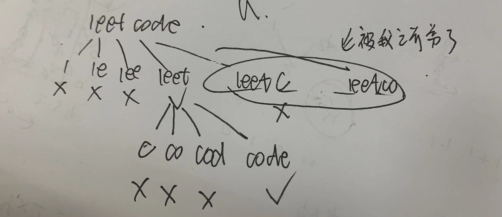


#### [155. 最小栈](https://leetcode.cn/problems/min-stack/)

排序，递减的栈，

要注意等于的情况，也要减

```java
class MinStack {

    LinkedList<Integer> s1;
    LinkedList<Integer> s2;

    public MinStack() {
        s1 = new LinkedList<>();//正常
        s2 = new LinkedList<>();//最小栈
    }
    
    public void push(int val) {
        s1.addLast(val);
        //等于也要入
        if(s2.isEmpty() || s2.getLast() >= val){
            s2.addLast(val);
        } 
    }
    
    public void pop() {
        int v = s1.removeLast();
        if(v==s2.getLast()){
            s2.removeLast();
        }

    }
    
    public int top() {
        return s1.getLast();
    }
    
    public int getMin() {
        return s2.getLast();
    }
}
```

#### *[152. 乘积最大子数组](https://leetcode.cn/problems/maximum-product-subarray/)

```java
    //错误解法，没有考虑负数*负数，会变成整数的情况
    public int maxProduct(int[] nums) {
        int[] dp = new int[nums.length];
        dp[0] = nums[0];
        int max = nums[0];
        for(int i = 1;i < nums.length;i++){
            dp[i] = nums[i];
            dp[i] = Math.max(dp[i-1]*nums[i],dp[i]);
            max = Math.max(max,dp[i]);
            
        }
        return max;
    }
```

正确解法

测试用例：[2,-5,-2,-4,3]

```java
//由于负数*负数为正数
    //需要考虑最小值*负数可能就为最大值了
    //所以dp方程不是 dp[i] = Math.max(dp[i-1]*nums[i],dp[i]);
    /*
    max[i] = Math.max(max[i-1]*nums[i],nums[i],min[i-1]*nums[i]);
    min[i] = Math.max(min[i-1]*nums[i],nums[i],max[i-1]*nums[i]);
    结果是 max中最大值
    */
    public int maxProduct(int[] nums) {
        int[] max = new int[nums.length];
        int[] min = new int[nums.length];
        max[0] = nums[0];
        min[0] = nums[0];
        int res = nums[0];
        for(int i = 1;i < nums.length;i++){
            max[i] = nums[i];
            min[i] = nums[i];
            max[i] = Math.max(max[i-1]*nums[i],Math.max(max[i],min[i-1]*nums[i]));
            min[i] = Math.min(min[i-1]*nums[i],Math.min(min[i],max[i-1]*nums[i]));
            res = Math.max(res,max[i]);
            
        }
        return res;
    }
```


#### [169. 多数元素](https://leetcode.cn/problems/majority-element/)

```java
    //排序求中位数
    //利用摩尔投票，是众数+1，不是-1，那么和一定大于0
    //
    public int majorityElement(int[] nums) {
        HashMap<Integer,Integer> map = new HashMap<>();
        for(int i = 0;i < nums.length;i++){
            map.put(nums[i],map.getOrDefault(nums[i],0)+1);
            if(map.get(nums[i]) > Math.floor(nums.length/2)){
                return nums[i];
            }
        }

        return -1;
    }
```


#### *[221. 最大正方形](https://leetcode.cn/problems/maximal-square/)

```java
    /*暴力
    1. 以当前为1的位置(x,y)作为矩阵的左上角
    2. min(x,y)确定最大可能的边长 maxlen
    3. 判断矩阵中是否都为1（不断往外扩）,不断更新maxlen,max
        3.1可以先判断(x+1,y+1)是否是1
        3.2再判断x+1行是否都是1，y+1列是否都是1

    */
    public int maximalSquare(char[][] matrix) {
        int max = 0;
        if(matrix.length==0 || matrix[0].length==0) return 0;
        for(int i = 0;i < matrix.length;i++){
            for(int j = 0;j < matrix[0].length;j++){
                if(matrix[i][j]=='0') continue;
                //防止 [["0","1"],["1","0"]]
                //为1事，最小为1
                max = Math.max(max,1);
                //当前的可能最大
                int maxlen = Math.min(matrix.length-i,matrix[0].length-j);
                //遍历步数，如果当前的有问题，则直接break就好
                //为了遍历方便，设置一个flag，因为有两层循环，break只能跳出当前的，需要再设置一个标志
                for(int k = 1;k < maxlen;k++){
                    boolean flag = true;
                    if(matrix[i+k][j+k]=='0'){
                        break;
                    }
                    //判断当前新增的列是否均为1,行
                    for(int m = 0;m < k;m++){
                        if(matrix[i + k][j + m]=='0' || matrix[i+m][j+k]=='0'){
                            flag=false;
                            break;
                        }
                    }
                    //flag为真的情况下，此行列是满足要求，进行更新
                    if(flag){
                        max = Math.max(max,k + 1);
                    }else{
                        break;
                    }
                }
                
            }
        }
        return max*max;
    }
```


太牛逼了不愧是dp

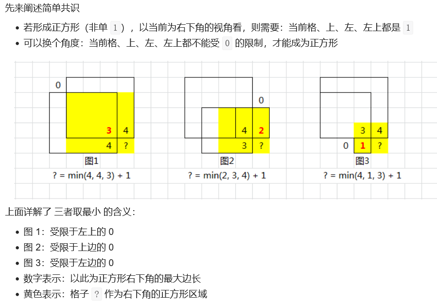

```java
    /*
    动态规划：
    状态：dp[i][j]表示，以i,j为满足条件的右下角的矩阵的最大的边长
    转移方程： dp[i][j] = Math.min(dp[i-1][j],dp[i][j-1],dp[i-1][j-1])+1
    结果：max(dp[i][j])
    初始化：
    */
    public int maximalSquare(char[][] matrix) {
        int[][] dp = new int[matrix.length+1][matrix[0].length+1];
        
        int max = 0;
        for(int i = 1;i <= matrix.length;i++){
            for(int j = 1;j <= matrix[0].length;j++){
                if(matrix[i-1][j-1]=='0') continue;
                dp[i][j] = Math.min(Math.min(dp[i-1][j],dp[i][j-1]),dp[i-1][j-1]) + 1;
                max = Math.max(dp[i][j],max);
            }
        }
        return max*max;
    }
```

#### *[238. 除自身以外数组的乘积](https://leetcode.cn/problems/product-of-array-except-self/)

前，后，下三角，上三角，复用

x为答案

y是原来的数据

```java
    public int[] productExceptSelf(int[] nums) {
        int[] b = new int[nums.length];
        b[0] = 1;
        //先计算下三角区
        for(int i = 1;i < nums.length;i++){
            b[i] = b[i-1]*nums[i-1];
        }

        //再计算上三角区
        int tmp = 1;
        for(int i = nums.length-2;i>=0;i--){
            tmp = tmp*nums[i+1];
            b[i] = b[i]*tmp;
        }

        return b;

    }
```

#### [240. 搜索二维矩阵 II](https://leetcode.cn/problems/search-a-2d-matrix-ii/)

```java
    public boolean searchMatrix(int[][] matrix, int target) {
        //从右上角开始，因为这样，小就i++,大就j--，只有两个方向的遍历
        int  i = 0, j = matrix[0].length-1;
        while(i < matrix.length && j>=0){
            if(matrix[i][j] == target) return true;

            if(matrix[i][j] < target){
                i++;
            }
            if(i >= matrix.length) return false;

            if(matrix[i][j] > target){
                j--;
            }
        }
        return false;
    }
```

#### *[287. 寻找重复数](https://leetcode.cn/problems/find-the-duplicate-number/)

位运算

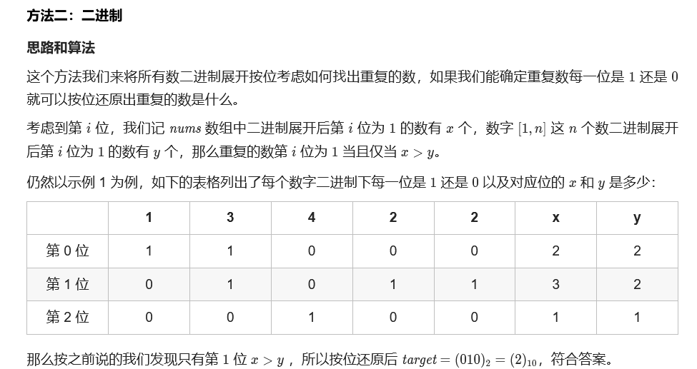

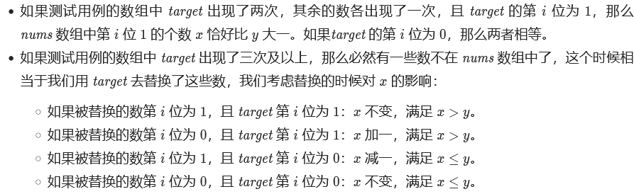

```java
 public int findDuplicate(int[] nums) {
        int n = nums.length-1;
        int ans = 0;
        
        //统计每一位
        for(int i = 0;i <= 31;i++ ){
            int cur = 0,base = 0;
            //遍历每一个数字
            for(int j=0;j < nums.length;j++){
                //不变nums，而变1的位置
                if((nums[j] & (1 << i))!=0){
                    cur += 1;
                }
                if(j>=1 && ((j & (1 << i))!=0)){
                    base += 1;
                }
            }
            if(cur > base){
                ans |= 1 << i;
            }
        }
        return ans;
    }
```


快慢指针

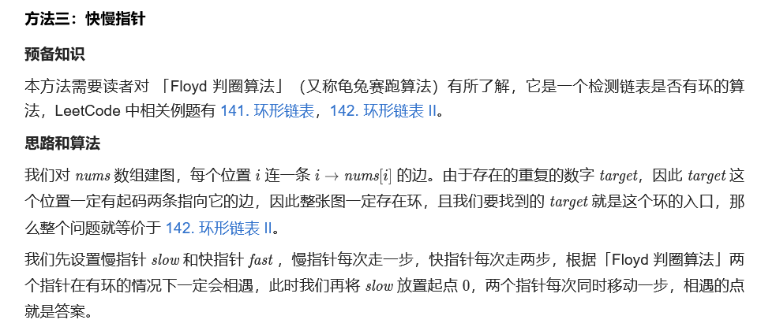

由于存在重复的数字target，因此target 这个位置一定有起码两条指向它的边，因此整张图一定存在环

```java
class Solution {
    //建一个图，i-> nums[i]的映射
    //如果nums[i]重复，则必然存在环
    public int findDuplicate(int[] nums) {
        int slow = 0,fast =0;
        do{
            slow = nums[slow];
            fast = nums[nums[fast]];
        }while(slow!=fast);

        slow = 0;
        while(slow!=fast){
            slow = nums[slow];
            fast = nums[fast];
        }
        return slow;
    }
}
```

#### [338. 比特位计数](https://leetcode.cn/problems/counting-bits/)

```java
    public int[] countBits(int n) {
        int[] res = new int[n+1]; 
        for(int num = 0;num <= n;num++){
            int max_bit = 31;
            //先计算最高位应该是多少，可以减少一部分时间复杂度
            //但是要注意等于0时，不加max_bit>=0会造成死循环
            while(max_bit>=0 && (num & (1 << max_bit))==0){
                max_bit-=1;
            }
            // System.out.println(max_bit);
            for(int j = 0;j <=max_bit;j++){
                if((num & (1 << j))!=0){
                    res[num]++;
                }
            }
        }
        return res;
    }
```

#### [448. 找到所有数组中消失的数字](https://leetcode.cn/problems/find-all-numbers-disappeared-in-an-array/)

```java
    //原地修改，每遇到一次则增加n，需要利用取模来还原出本身的数
//没有遇到的数，肯定小于n
    //注意，0统计数字1的个数，以此类推

    public List<Integer> findDisappearedNumbers(int[] nums) {
        List<Integer> res=  new ArrayList<>();
        int n = nums.length;
        for(int num:nums){
            //还原为原来的数
            num = num % n ;
            // System.out.println(num);
            if(num==0) nums[n-1]+=n;
            else 
            nums[num-1] += n;
        }

        for(int i = 0;i < nums.length;i++){
            if(nums[i]<=n){
                res.add(i+1);
            }
        }
        return res;
    }
```

#### [461. 汉明距离](https://leetcode.cn/problems/hamming-distance/)

```java
    public int hammingDistance(int x, int y) {
        int num = x^y;
        int cnt = 0;
        for(int i = 0;i < 32;i++){
            if((num & (1 << i))!=0){
                cnt++;
            }
        }
        return cnt;
    }
```


总结：

异或 ^：相异为1，相同为0

或||：有一个为1则为1

与&：意思一样，不具备短路

与&&：具备短路

<<优先级高于& 

0与任何数异或等于其本身


#### [406. 根据身高重建队列](https://leetcode.cn/problems/queue-reconstruction-by-height/)

```java
class Solution {
    /*
    整体思路是：因为第二个数表示大于等于当前数的个数，所以
        排序：按第一个数降序，则前面的数就是比当前数大于等于的个数了
             按第二个数升序，为了保证正确性以及减少插入的次数
             5,2肯定在5,3的前面。
    */
    public int[][] reconstructQueue(int[][] people) {
        Arrays.sort(people,new Comparator<int[]>(){
            public int compare(int[] a, int[] b){
                if(a[0]!=b[0]) return b[0]-a[0];
                else return a[1]-b[1];
            }
        });

        ArrayList<int[]> res = new ArrayList<>();
        for(int i = 0;i < people.length;i++){
            int cnt = people[i][1];
            int n = res.size();
            while(cnt < n){
                n--;
            }
            res.add(n,people[i]);
        }

        int[][] ans =new int[people.length][2];
        for(int i = 0;i < res.size();i++){
            ans[i][0] = res.get(i)[0];
            ans[i][1] = res.get(i)[1];
        }

        return ans;
    }
}
```

#### *[437. 路径总和 III](https://leetcode.cn/problems/path-sum-iii/)

利用前缀和+树形遍历

前缀和：和，次数！

前缀和就充当前缀和的作用，不要ran

```java
class Solution {
    public int pathSum(TreeNode root, int targetSum) {
        map = new HashMap<>();
        map.put(0l,1);
        int cnt = dfs(root,targetSum,0);
        return cnt;
    }   

    static HashMap<Long,Integer> map = new HashMap<>();

    //返回到当前节点满足要求的路径数
    public int dfs(TreeNode root,long targetSum,long curSum){
        if(root==null) return 0;

        // System.out.println(map);
        int cnt = 0;
        curSum += root.val;
        //将原来的判断合为这句话
        //前缀和就充当前缀和作用，不要ran
        cnt = map.getOrDefault(curSum-targetSum,0);

        map.put(curSum,map.getOrDefault(curSum,0)+1);
        

        cnt += dfs(root.left,targetSum,curSum);
        cnt += dfs(root.right,targetSum,curSum);

        map.put(curSum,map.getOrDefault(curSum,0)-1);

        return cnt;
    }
}
```

#### *[581. 最短无序连续子数组](https://leetcode.cn/problems/shortest-unsorted-continuous-subarray/)

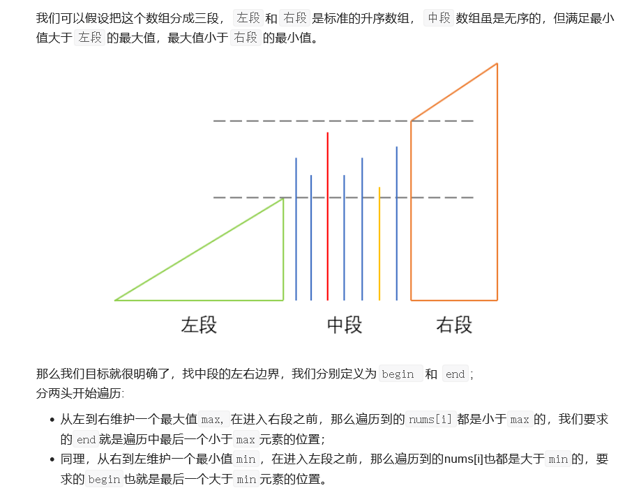

```java
class Solution {
    // public int findUnsortedSubarray(int[] nums) {
    //     ///1 3 2 2 2过不了,不能光记录下标，要记录最大最小
    //     if(nums.length < 2) return 0;
    //     ArrayList<Integer> list = new ArrayList<>();

    //     for(int i = 1;i < nums.length;i++){
    //         if(nums[i] < nums[i-1]){
    //             list.add(i);        
    //         }
    //     }
    //     if(list.size()==0) return 0;
    //     if(list.size()==1) return 2;

    //     int res = list.get(list.size()-1)-list.get(0)+2;
    //     return res;
    // }

    public int findUnsortedSubarray(int[] nums) {
        //左边 min = nums[i]
        //右边 max = nums[i] 
        if(nums.length < 2) return 0;
        int max = Integer.MIN_VALUE,min = Integer.MAX_VALUE;
        int begin = 0,end = 0;

        //从左到右找最大值
        //确认中段end
        for(int i = 0;i < nums.length;i++){
            max = Math.max(max,nums[i]);
            if(max > nums[i]){
                end = i;
            }
        }

        //从右到左找最小值
        //确认中段begin
        for(int i = nums.length-1;i >=0;i--){
            min = Math.min(min,nums[i]);
            if(min < nums[i]){
                begin = i;
            }
        }

        if(begin==0 && end==0 ) return 0;
        int res = end-begin+1;
        return res;
    }
}
```

#### [617. 合并二叉树](https://leetcode.cn/problems/merge-two-binary-trees/)

```java
class Solution {
    public TreeNode mergeTrees(TreeNode root1, TreeNode root2) {
        if(root1==null && root2==null){
            return null;
        }
        int val = 0;
        TreeNode node;
        if(root1==null && root2!=null){
            val = root2.val;
            node = new TreeNode(val,mergeTrees(null,root2.left),mergeTrees(null,root2.right));
        }
        else if(root1!=null && root2==null){
            val = root1.val;
            node = new TreeNode(val,mergeTrees(root1.left,null),mergeTrees(root1.right,null));
        }else{
            val = root1.val + root2.val;
            node = new TreeNode(val,mergeTrees(root1.left,root2.left),mergeTrees(root1.right,root2.right));
        }
        return node;
    }
}
```

#### *[621. 任务调度器](https://leetcode.cn/problems/task-scheduler/)

桶思想

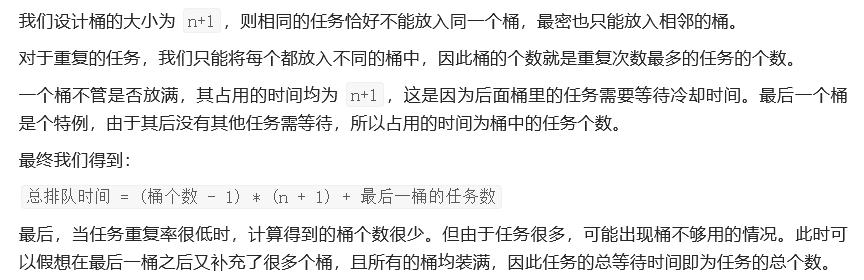

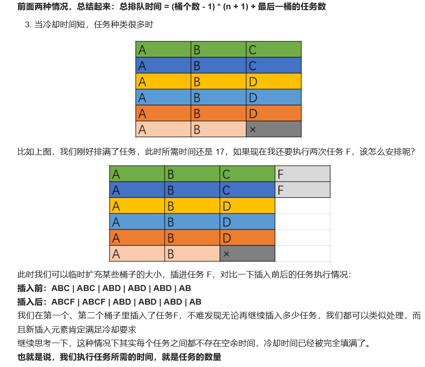

```java
    public int leastInterval(char[] tasks, int n) {
        int[] dp = new int[26];
        int maxCount = 0,max = 0;
        for(char task: tasks){
            dp[task-'A']++;
            max = Math.max(dp[task-'A'],max);
        }
        //计算最大桶的数量
        for(int i = 0;i < 26;i++){
            if(dp[i]==max){
                maxCount++;
            }
        }
        int ans1 = (max-1)*(n+1) + maxCount;
        return Math.max(ans1,tasks.length);
    }
```

#### *[399. 除法求值](https://leetcode.cn/problems/evaluate-division/)

利用并查集，并更新values

```java
/*
    利用hashmap给每个节点进行相应的编号，为了方便并查集使用数组表示，因为有weight要进行对应
     */

    public double[] calcEquation(List<List<String>> equations, double[] values, List<List<String>> queries) {
        int equationsSize = equations.size();
        UF uf = new UF(2 * equationsSize);
        //1.预处理，将变量的值和id进行映射，使得并查集的底层使用数组实现，方便对应
        Map<String, Integer> map = new HashMap<>(2 * equationsSize);
        int id = 0;
        for (int i = 0; i < equationsSize; i++) {
            List<String> equation = equations.get(i);
            String var1 = equation.get(0);
            String var2 = equation.get(1);

            if (!map.containsKey(var1)) {
                map.put(var1, id);
                id++;
            }

            if (!map.containsKey(var2)) {
                map.put(var2, id);
                id++;
            }

            uf.merge(map.get(var1), map.get(var2), values[i]);

        }

        //2. 做查询
        int queriesSize = queries.size();
        double[] res = new double[queriesSize];
        for (int i = 0; i < queriesSize; i++) {
            String var1 = queries.get(i).get(0);
            String var2 = queries.get(i).get(1);

            Integer idx1 = map.get(var1);
            Integer idx2 = map.get(var2);

            if (idx1 == null || idx2 == null) {
                res[i] = -1.0d;
            } else {
                res[i] = uf.isConnected(idx1,idx2);
            }
        }

        return res;
    }


    //并查集
    class UF{
        //1. 定义数据结构并初始化
        //这块没有用hashMap因为还有权值，不好映射
        int[] parent;
        double[] weight;

        UF(int n){
            this.parent = new int[n];
            this.weight = new double[n];
            //初始化
            for(int i = 0;i < n;i++){
                parent[i] = i;
                weight[i] = 1.0d;
            }
        }

        //2. 合并两个节点 merge（动态更新，合并两个节点,以及父节点之间的权重）
        public void merge(int x,int y,double value){
            int root1 = find(x);
            int root2 = find(y);

            if(root1!=root2){
                parent[root1] = root2;
                weight[root1] = weight[y]*value/weight[x];
            }
        }

        //3. 找到某个节点的parent,并压缩路径，递归写法
        public int find(int x){]
            if(x!=parent[x]){
                int origin = parent[x];
                parent[x] = find(origin);
                weight[x]*=weight[origin];
            }
            return parent[x];
        }

        //4. 判断两个几点是否为一个集合(已经更新完毕，看两个点是否是一个集合)
        public double isConnected(int x,int y){
            int root1 = find(x);
            int root2 = find(y);
            if(root1==root2){
                return weight[x]/weight[y];
            }else{
                return -1.0d;
            }
        }
    }
```

