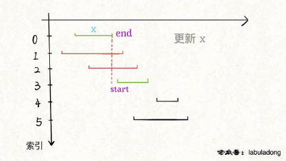
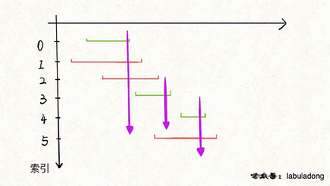
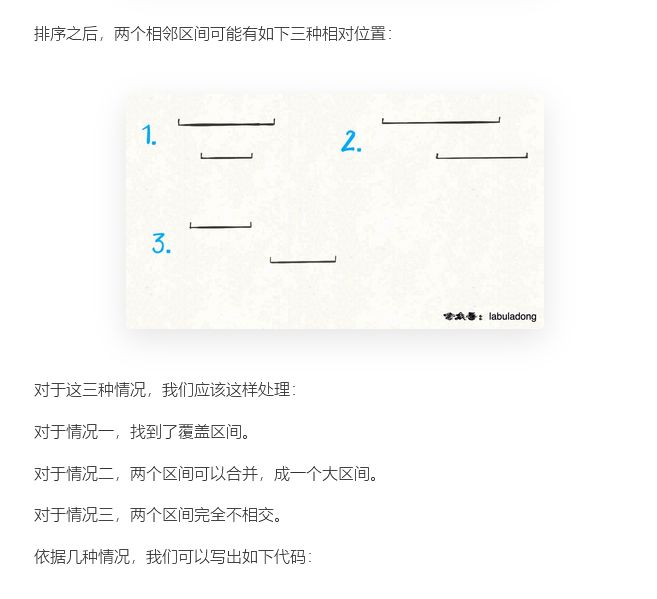
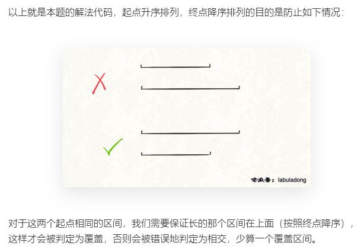
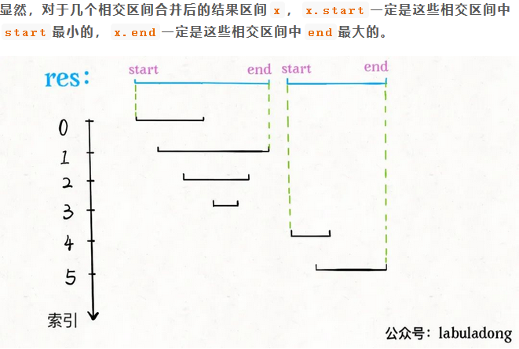
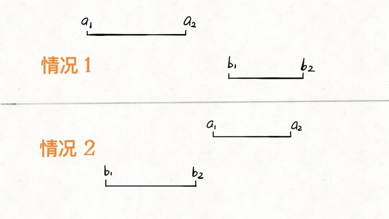
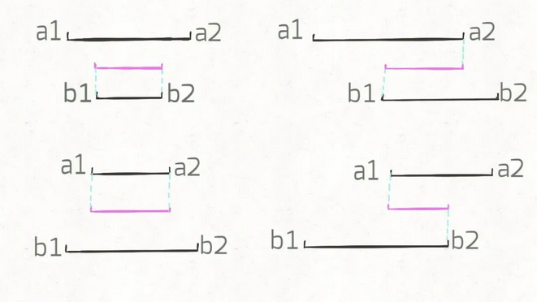

# 贪心

贪心算法可以认为是动态规划算法的一个特例，相比动态规划，使用贪心算法需要满足更多的条件（贪心选择性质），但是效率比动态规划要高。

贪心选择性质：每一步都做出一个局部最优的选择，最终的结果就是全局最优。这是一种特殊性质，其实只有一部分问题拥有这个性质。

## 区间调度（最大不相交子集）

思路：

1、从区间集合 `intvs` 中选择一个区间 `x`，这个 `x` 是在当前所有区间中**结束最早的**（`end` 最小）。

2、把所有与 `x` 区间相交的区间从区间集合 `intvs` 中删除。

3、重复步骤 1 和 2，直到 `intvs` 为空为止。之前选出的那些 `x` 就是最大不相交子集。

**由于我们事先排了序**，不难发现所有与 `x` 相交的区间必然会与 `x` 的 `end` 相交；如果一个区间不想与 `x` 的 `end` 相交，它的 `start` 必须要大于（或等于）`x` 的 `end`：



代码：

```java
public int intervalSchedule(int[][] intvs) {
    if (intvs.length == 0) return 0;
    // 按 end 升序排序
    Arrays.sort(intvs, new Comparator<int[]>() {
        public int compare(int[] a, int[] b) {
            return a[1] - b[1];
        }
    });
    // 至少有一个区间不相交
    int count = 1;
    // 排序后，第一个区间就是 x
    int x_end = intvs[0][1];
    for (int[] interval : intvs) {
        int start = interval[0];
        if (start >= x_end) {
            // 找到下一个选择的区间了
            count++;
            x_end = interval[1];
        }
    }
    return count;
}

```

#### *[435. 无重叠区间](https://leetcode-cn.com/problems/non-overlapping-intervals/)

>   不需要使用额外空间

```java
    public int eraseOverlapIntervals(int[][] intervals) {
        if(intervals.length==0) return 0;

        //按end进行排序
        //容易发生溢出
        Arrays.sort(intervals,new Comparator<int[]>(){
            public int compare(int a[],int b[]){
                return a[1]-b[1];
            }
        });

        int count = 0;
        int x_end = intervals[0][1];
        for(int[] interval:intervals){
            int s = interval[0];
            if(s < x_end){
                //减得是当前的区间，所以也不更新x_end
                count++;
            }else{
                //大于的时候更新
                x_end = interval[1];
            }
        }
		//把自身的第一个减掉
        return count-1;
    }
```

#### [452. 用最少数量的箭引爆气球](https://leetcode-cn.com/problems/minimum-number-of-arrows-to-burst-balloons/)

这个问题和区间调度算法一模一样！如果最多有 `n` 个不重叠的区间，那么就至少需要 `n` 个箭头穿透所有区间。只是有一点不一样，在 `intervalSchedule` 算法中，如果两个区间的边界触碰，不算重叠；而按照这道题目的描述，箭头如果碰到气球的边界气球也会爆炸，所以说相当于区间的边界触碰也算重叠。



```java
    public int findMinArrowShots(int[][] intervals) {
        if(intervals.length==0) return 0;

        //按end进行排序
        //直接return a[1]-b[1];会发生溢出
        Arrays.sort(intervals, new Comparator<int[]>() {
            public int compare(int[] point1, int[] point2) {
                if (point1[1] > point2[1]) {
                    return 1;
                } else if (point1[1] < point2[1]) {
                    return -1;
                } else {
                    return 0;
                }
            }
        });
       
    //    System.out.print(Arrays.deepToString(intervals));

       int count = 1;
       int x_end = intervals[0][1];
       for(int[] interval:intervals){
            int s = interval[0];
            //计算最大的不重叠子区间的个数，注意边界
            if(s > x_end){
                count++;
                x_end = interval[1];
            }
        }

        return count;
    }
```


## 区间问题（不是贪心）

技巧：

**1、排序**。常见的排序方法就是按照区间起点排序，或者先按照起点升序排序，若起点相同，则按照终点降序排序。当然，如果你非要按照终点排序，无非对称操作，本质都是一样的。

**2、画图**。就是说不要偷懒，勤动手，两个区间的相对位置到底有几种可能，不同的相对位置我们的代码应该怎么去处理

### 区间覆盖

#### [1288. 删除被覆盖区间](https://leetcode-cn.com/problems/remove-covered-intervals/)



```java
int removeCoveredIntervals(int[][] intvs) {
    // 按照起点升序排列，起点相同时降序排列
    Arrays.sort(intvs, (a, b) -> {
        if (a[0] == b[0]) {
            return b[1] - a[1];
        }
        return a[0] - b[0]; 
    });

    // 记录合并区间的起点和终点
    int left = intvs[0][0];
    int right = intvs[0][1];
    
    int res = 0;
    for (int i = 1; i < intvs.length; i++) {
        int[] intv = intvs[i];
        // 情况一，找到覆盖区间
        if (left <= intv[0] && right >= intv[1]) {
            res++;
        }
        // 情况二，找到相交区间，合并
        if (right >= intv[0] && right <= intv[1]) {
            right = intv[1];
        }
        // 情况三，完全不相交，更新起点和终点
        if (right < intv[0]) {
            left = intv[0];
            right = intv[1];
        }
    }
    
    return intvs.length - res;
}

```



解法：

```java
    public int removeCoveredIntervals(int[][] intervals) {
        //起点按照升序排列，起点相同，则终点按降序
        Arrays.sort(intervals,(a,b)->{
            if(a[0]==b[0]){
                return b[1]-a[1];
            }else{
                return a[0]-b[0];
            }
        });

        //删除没有被覆盖的区间
        int left = intervals[0][0];
        int right = intervals[0][1];
        int count = 1;
        for(int i = 1;i<intervals.length;i++){
            int[] cur = intervals[i];
            //非覆盖区间
            if(right < cur[1]){
                ++count;
                right = cur[1];
            }
        }
        return count;
    }
```


### 区间合并

#### [56. 合并区间](https://leetcode-cn.com/problems/merge-intervals/)



```java
    public int[][] merge(int[][] intervals) {
        if(intervals.length==0) return new int[0][2];

        Arrays.sort(intervals,new Comparator<int[]>(){
            public int compare(int[] a,int[] b){
                return a[0]-b[0];
            }
        });

        List<int[]> res = new ArrayList<int[]>();
        for(int i = 0;i<intervals.length;i++){
            int left = intervals[i][0];
            int right = intervals[i][1];
            //不相交
            if(res.size()==0 || res.get(res.size()-1)[1]<left){
                res.add(new int[]{left,right});
            }else{ //相交
                res.get(res.size()-1)[1] = Math.max(res.get(res.size()-1)[1],right);
            }
        }

        return res.toArray(new int[res.size()][]);
    }
```


### 区间交集

#### [间列表的交集](https://leetcode-cn.com/problems/interval-list-intersections/)

首先，**对于两个区间**，我们用`[a1,a2]`和`[b1,b2]`表示在`A`和`B`中的两个区间，那么什么情况下这两个区间**没有交集**呢：



只有这两种情况，写成代码的条件判断就是这样：

```
if b2 < a1 or a2 < b1:
    [a1,a2] 和 [b1,b2] 无交集
```

那么，什么情况下，两个区间存在交集呢？根据命题的否定，上面逻辑的否命题就是存在交集的条件：

```
# 不等号取反，or 也要变成 and
if b2 >= a1 and a2 >= b1:
    [a1,a2] 和 [b1,b2] 存在交集
```

接下来，两个区间存在交集的情况有哪些呢？穷举出来：



我们惊奇地发现，交集区间是有规律的！如果交集区间是`[c1,c2]`，那么`c1=max(a1,b1)`，`c2=min(a2,b2)`！这一点就是寻找交集的核心，我们把代码更进一步：

```
while i < len(A) and j < len(B):
    a1, a2 = A[i][0], A[i][1]
    b1, b2 = B[j][0], B[j][1]
    if b2 >= a1 and a2 >= b1:
        res.append([max(a1, b1), min(a2, b2)])
    # ...
```

最后一步，我们的指针`i`和`j`肯定要前进（递增）的，什么时候应该前进呢？

是否前进，只取决于`a2`和`b2`的大小关系：

```
while i < len(A) and j < len(B):
    # ...
    if b2 < a2:
        j += 1
    else:
        i += 1
```

解法：

```java
    public int[][] intervalIntersection(int[][] firstList, int[][] secondList) {
        int i =0,j = 0;
        List<int[]> res = new ArrayList<>();

        //题目说已经排好序了，所以不用继续排序了
        while(i < firstList.length && j < secondList.length){
            int a1 = firstList[i][0],a2 = firstList[i][1];
            int b1 = secondList[j][0],b2 = secondList[j][1];
            int c1 = Math.max(a1,b1);
            int c2 = Math.min(a2,b2);
            //如果这个区间成立
            if(c1 <= c2){
                res.add(new int[]{c1,c2});
            }
        
            //指针前进
            if(a2 < b2){
                i++;
            }else{
                j++;
            }
        }

        return res.toArray(new int[res.size()][]);
    }
```

```java
    public int[][] intervalIntersection(int[][] firstList, int[][] secondList) {
        int i =0,j = 0;
        List<int[]> res = new ArrayList<>();

        //题目说已经排好序了，所以不用继续排序了
        while(i < firstList.length && j < secondList.length){
            int a1 = firstList[i][0],a2 = firstList[i][1];
            int b1 = secondList[j][0],b2 = secondList[j][1];
            //两个区间存在交集
            if(b1 <= a2  && a1 <= b2){
                int c1 = Math.max(a1,b1);
                int c2 = Math.min(a2,b2);
                res.add(new int[]{c1,c2});
            }
            //指针前进
            if(b2 < a2){
                j++;
            }else{
                i++;
            }
        }

        return res.toArray(new int[res.size()][]);
    }
```


## 总结

**第一个场景**，假设现在只有一个会议室，还有若干会议，你如何将**尽可能多**的会议安排到这个会议室里？

这个问题需要将这些会议（区间）按结束时间（**右端点**）排序，然后进行处理，详见前文  [贪心算法做时间管理](https://labuladong.gitee.io/algo/3/27/99/)。

**第二个场景**，给你若干较短的视频片段，和一个较长的视频片段，请你从较短的片段中尽可能少地挑出一些片段，拼接出较长的这个片段。

这个问题需要将这些视频片段（区间）按开始时间（左端点）排序，然后进行处理，详见前文  [剪视频剪出一个贪心算法](https://labuladong.gitee.io/algo/3/27/101/)。

**第三个场景**，给你若干区间，其中可能有些区间比较短，被其他区间完全覆盖住了，请你删除这些被覆盖的区间。

这个问题需要将这些区间按左端点排序，然后就能找到并删除那些被完全覆盖的区间了，详见前文  [删除覆盖区间](https://labuladong.gitee.io/algo/4/31/124/)。

**第四个场景**，给你若干区间，请你将所有有重叠部分的区间进行合并。

这个问题需要将这些区间按左端点排序，方便找出存在重叠的区间，详见前文  [合并重叠区间](https://labuladong.gitee.io/algo/4/31/124/)。

**第五个场景**，有两个部门同时预约了同一个会议室的若干时间段，请你计算会议室的冲突时段。

这个问题就是给你两组区间列表，请你找出这两组区间的交集，这需要你将这些区间按左端点排序，详见前文  [区间交集问题](https://labuladong.gitee.io/algo/4/31/124/)。

**第六个场景**，假设现在只有一个会议室，还有若干会议，如何安排会议才能使这个会议室的**闲置时间最少**？

这个问题需要动动脑筋，说白了这就是个 0-1 背包问题的变形：

会议室可以看做一个背包，每个会议可以看做一个物品，**物品的价值就是会议的时长**，请问你如何选择物品（会议）才能最大化背包中的价值（会议室的使用时长）？

当然，这里背包的**约束**不是一个最大重量，而是各个**物品（会议）不能互相冲突**。把各个会议按照**结束时间**进行排序，然后参考前文  [0-1 背包问题详解](https://labuladong.gitee.io/algo/3/25/82/) 的思路即可解决
