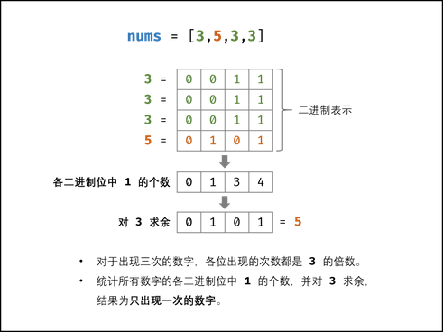
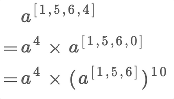
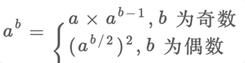
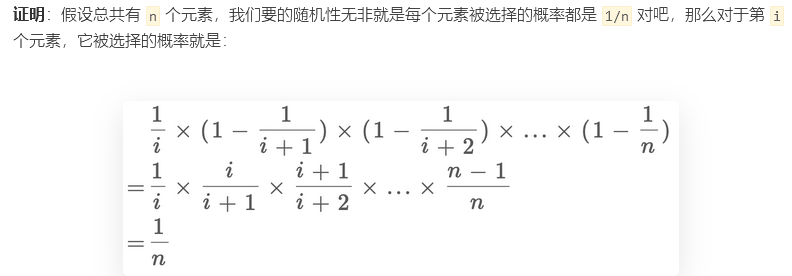

# 数学

## 位运算

### **x & (x - 1) 用于消去x最后一位的1**

- **用 O(1) 时间检测整数 n 是否是 2 的幂次**

    N如果是2的幂次，则N满足两个条件：

    1.N >0

    2.N的二进制表示中只有一个1

    ```java
    2^0 = 1 = 0b0001
    2^1 = 2 = 0b0010
    2^2 = 4 = 0b0100
    ```

    因为N的二进制表示中只有一个1，所以使用N & (N - 1)将N唯一的一个1消去，应该返回0

    #### [231. 2 的幂](https://leetcode-cn.com/problems/power-of-two/)

    如果存在一个整数 `x` 使得 `n == 2x` ，则认为 `n` 是 2 的幂次方。

    ```java
        public boolean isPowerOfTwo(int n) {
            if(n<=0) return false;
            
            int res = n & (n-1);
            return res==0?true:false;
        }
    ```

    

    

- **计算在一个 32 位的整数的二进制表式,有多少个1**

    不断使用 x & (x - 1) 消去x最后一位的1，计算总共消去了多少次即可

    #### [191. 位1的个数](https://leetcode-cn.com/problems/number-of-1-bits/)

    ```java
        // you need to treat n as an unsigned value
        public int hammingWeight(int n) {
            int count = 0;
            while(n!=0){
                n = n&(n-1);
                count++;
            }
    
            return count;
        }
    ```

    

- **如果要将整数A转换为B，需要改变多少个bit位**

    将A和B进行异或，相同位为1，不同位为0，则转成了上题

- **使用二进制进行子集枚举**

    - **给定一个含不同整数的集合，返回其所有的子集**

        思路就是使用一个正整数二进制表示的第i位是1还是0，代表集合的第i个数取或者不取

        所以从0到2^n-1总共2^n个整数，正好对应集合的2^n个子集

        ```text
        S = {1,2,3}
        N bit Combination
        0 000 {}
        1 001 {1}
        2 010 {2}
        3 011 {1,2}
        4 100 {3}
        5 101 {1,3}
        6 110 {2,3}
        7 111 {1,2,3}
        ```

### a ^ b ^ b = a，a^0=a ，a^a=0

- **只有一个数出现一次，剩下都出现两次，找出出现一次的数**

    因为只有一个数恰好出现一个，剩下的都出现过两次，所以只要将所有的数异或起来，就可以得到唯一的那个数

    #### [136. 只出现一次的数字](https://leetcode-cn.com/problems/single-number/)

    ```java
        public int singleNumber(int[] nums) {
            int res = 0;
            for(int num:nums){
                res = num ^ res;
            }
            return res;
        }
    ```

-   [268. 丢失的数字](https://leetcode-cn.com/problems/missing-number/)

    为了容易理解，我们假设先把索引补一位，然后让每个元素和自己相等的索引相对应：

    

    ```java
        public int missingNumber(int[] nums) {
            int res = 0;
            res = res ^nums.length;
            for(int i = 0;i < nums.length;i++){
                res = i^nums[i]^res;
            }
            return res;
        }
    ```

    

- **只有一个数出现一次，剩下都出现三次，找出出现一次的**

    方法一：状态机

    方法二：循环（计算模3结果，或等在一起）

    

    ```java
        public int singleNumber(int[] nums) {
            int[] count = new int[32];
            //统计好每一位为1的数量
            for(int num:nums){
                for(int i =0;i<32;i++){
                    count[i] += num & 1;
                    num = num >>> 1;
                }
            }
            // System.out.println("count:" + Arrays.toString(count));
            int res = 0;
            for(int i=0;i < 32;i++){
                res <<= 1;
                // System.out.print("31-i:" + (31-i));
                // System.out.print("  count[31-i]:" + count[31-i]);
                res = res | count[31-i]%3;
                // System.out.print("    res1:" + res);
                // res <<= 1;
                // System.out.print("    res2:" + res);
                // System.out.println();
            }
    
            //不可以写成这样，因为当i= 31时，已经不能往右移了，但还是往右移了，已经越界了，再左移没用了,所以得写到前面
            //return res>>=1
            return res;
        }
    ```

    


- **只有两个数出现一次，剩下都出现两次，找出出现一次的**

    因为a!=b!=0，所以a和b必然至少有一位不一样，不妨设最右边的1不一样，按此规则进行分组，分别异或，由于其他数出现两次，就会被异或掉，分别只剩下a和b

### 异或

异或表示无进位加法，加法可表示为无进位加法和进位

- 不用加减乘除做加法

    无进位加法：异或  a

    进位：与运算后左移1  b

    （和 s ）=（非进位和 n ），（进位 c）

    当c ==0，返回n

[剑指 Offer 65. 不用加减乘除做加法](https://leetcode-cn.com/problems/bu-yong-jia-jian-cheng-chu-zuo-jia-fa-lcof/)

利用位运算：将问题分解为【无进位加法+进位】

无进位加法：异或

进位：与运算后左移1（只是进位）

（和 s ）=（非进位和 n ）+（进位 c）。即可将 s=a+b转化为：s=a+b⇒s=n+c

循环求 n和 c ，直至进位 c=0；此时 s=n，返回 n 即可

不用考虑负数，负数是一样的

- 递归

    ```java
        public int add(int a, int b) {
            if(b==0) return a;
    
            return add(a^b, (a&b) << 1);
        }
    ```

- 迭代

    ```java
        //迭代
        public int add(int a, int b) {
            while(b != 0) { // 当进位为 0 时跳出
                int c = (a & b) << 1;  // c = 进位
                a ^= b; // a = 非进位和
                b = c; // b = 进位
            }
            return a;
        }
    ```


## 阶乘

[172. 阶乘后的零](https://leetcode-cn.com/problems/factorial-trailing-zeroes/)

题目：给定一个整数 `n` ，返回 `n!` 结果中尾随零的数量。

提示 `n! = n * (n - 1) * (n - 2) * ... * 3 * 2 * 1`

解析：

两个数相乘结果末尾有 0，一定是因为两个数中有因子 2 和 5，因为 10 = 2 x 5。**问题转化为：`n!` 最多可以分解出多少个因子 2 和 5**？这个主要取决于能分解出几个因子 5，因为每个偶数都能分解出因子 2，因子 2 肯定比因子 5 多得多。**问题转化为：`n!` 最多可以分解出多少个因子 5**？

125！：

125/（5^1） = 25

125/（5^2） = 5

125/（5^3） = 1

所以最后为31个0

代码：

```java
    public int trailingZeroes(int n) {
        int res = 0;
        while(n!=0){
            res += n/5;
            n = n/5;
        }
        return res;
    }
```


[793. 阶乘函数后 K 个零](https://leetcode-cn.com/problems/preimage-size-of-factorial-zeroes-function/)

分析：

一个直观地暴力解法就是穷举呗，因为随着 `n` 的增加，`n!` 肯定是递增的，`trailingZeroes(n!)` 肯定也是递增的

**对于这种具有单调性的函数，用 for 循环遍历，可以用二分查找进行降维打击**

搜索有多少个 `n` 满足 `trailingZeroes(n) == K`，其实就是在问，**满足条件的 `n` 最小是多少，最大是多少，最大值和最小值一减，就可以算出来有多少个 `n` 满足条件了**，对吧？那不就是  [二分查找](https://labuladong.gitee.io/algo/2/18/26/) 中「搜索左侧边界」和「搜索右侧边界」这两个事儿嘛？这道题目实际上给了限制，`K` 是在 `[0, 10^9]` 区间内的整数，也就是说，`trailingZeroes(n)` 的结果最多可以达到 `10^9`。

然后我们可以反推，当 `trailingZeroes(n)` 结果为 `10^9` 时，`n` 为多少？这个不需要你精确计算出来，你只要找到一个数 `hi`，使得 `trailingZeroes(hi)` 比 `10^9` 大，就可以把 `hi` 当做正无穷，作为搜索区间的上界。

刚才说了，`trailingZeroes` 函数是单调函数，那我们就可以猜，先算一下 `trailingZeroes(INT_MAX)` 的结果，比 `10^9` 小一些，那再用 `LONG_MAX` 算一下，远超 `10^9` 了，所以 `LONG_MAX` 可以作为搜索的上界。

**注意为了避免整型溢出的问题，`trailingZeroes` 函数需要把所有数据类型改成 long**：

**在区间 `[0, LONG_MAX]` 中寻找满足 `trailingZeroes(n) == K` 的左侧边界和右侧边界**。

代码：

```java
    // //利用二分法进行优化，求左右边界
    // //暴力遍历会超时
    // public int preimageSizeFZF(int k) {
    //     int cnt = 0;
    //     long tmp = k;
    //     long n = 0;
    //     while(tmp <= k){
    //         tmp = trailingZeroes(n++);
    //         if(tmp == k) cnt++;
    //         if(tmp > k) break;
    //     }
    //     return cnt;
    // }

    public int preimageSizeFZF(int k) {
        return (int)(right_bound(k)-left_bound(k)+1);
    }


    //利用二分法查找左右边界n的左右边界
    //左边界为0,右边界推演出来为Long.MAX_VALUE
    //查找左边界
    //左闭右开
    long left_bound(int target){
        long low = 0,high = Long.MAX_VALUE;
        while(low < high){
            long mid = low +(high-low)/2;
            if(trailingZeroes(mid) < target){
                low = mid + 1;
            }else if(trailingZeroes(mid) > target){
                high = mid;
            }else{
                high = mid;
            }
        } 
        return low;
    }

    //查找右边界
    long right_bound(int target){
        long low = 0,high = Long.MAX_VALUE;
        while(low < high){
            long mid = low +(high-low)/2;
            if(trailingZeroes(mid) < target){
                low = mid + 1;
            }else if(trailingZeroes(mid) > target){
                high = mid;
            }else{
                low = mid + 1;
            }
        } 
        return low-1;
    }

    long trailingZeroes(long n) {
        long res = 0;
        while(n!=0){
            res += n/5;
            n = n/5;
        }
        return res;
    }
```

## 素数判断

 [204. 计数质数](https://leetcode-cn.com/problems/count-primes/)

定义：如果一个数如果只能被 1 和它本身整除，那么这个数就是素数。

解析：

```java
12 = 2 × 6
12 = 3 × 4
12 = sqrt(12) × sqrt(12)
12 = 4 × 3
12 = 6 × 2
```

如果在 `[2,sqrt(n)]` 这个区间之内没有发现可整除因子，就可以直接断定 `n` 是素数

筛选法:素数的倍数一定不是素数

冗余：

比如 `n = 25`，`i = 5` 时算法会标记 5 × 2 = 10，5 × 3 = 15 等等数字，但是这两个数字已经被 `i = 2` 和 `i = 3` 的 2 × 5 和 3 × 5 标记了。

我们可以稍微优化一下，让 `j` 从 `i` 的平方开始遍历，而不是从 `2 * i` 开始

```java
    public int countPrimes(int n) {
        boolean[] flag  = new boolean[n];
        Arrays.fill(flag,true);

        for(int i = 2;i*i <n;i++){
            if(flag[i]){
                //如果i是素数，则它的倍数一定不是
                for(int j = i*i;j < n;j+=i){
                    flag[j] = false;
                }
            }
        }

        //计算结果,记得从2开始
        int count = 0;
        for(int i = 2;i<n;i++){
            if(flag[i]){
                count++;
            }
        }

        return count;
    }
```


## 超级次方

 [372. 超级次方](https://leetcode-cn.com/problems/super-pow/)

题目：你的任务是计算 `ab` 对 `1337` 取模，`a` 是一个正整数，`b` 是一个非常大的正整数且会以数组形式给出。

难点：

**一是如何处理用数组表示的指数**？




**二是如何得到求模之后的结果**？

```java
(a * b) % k = (a % k)(b % k) % k
```

**三是如何高效进行幂运算**？



代码：

```java
    public int superPow(int a, int[] b) {
        if(a==1) return 1;
        int len = b.length;
        return superRecur(a,b,len-1);
    }

    //拆分
    public int superRecur(int a,int[] b,int idx){
        if(idx == -1) return 1;
        int x1 = myPow(a,b[idx]);

        int x2 = myPow(superRecur(a,b,idx-1),10);

        return (x1*x2)%1337;
    }

    //快速幂,b是幂
	//注意此处求余，只要是a的地方都求余
    public int myPow(int a,int b){
        int res = 1;
        a = a%1337;
        while(b != 0){
            if((b&1)==1){
                res*= a%1337;
            }
            //base每次向左移，幂逐位取
            a = a*a%1337;
            b = b>>1;
        }

        return res%1337;
    }
```


## 同时寻找缺失和重复的元素

 [645. 错误的集合](https://leetcode-cn.com/problems/set-mismatch/)

```java
    public int[] findErrorNums(int[] nums) {
        //排序
        Arrays.sort(nums);
        // System.out.println(Arrays.toString(nums));

        int pre = 0;
        int[] res = new int[2];
        for(int i=0;i<nums.length;i++){
            //重复的数字,相邻
            if(nums[i]==pre){
                res[0] = nums[i];
            //缺失的元素，相差大于1
            }else if(nums[i]-pre > 1){
                res[1] = pre+1;
            }
            pre = nums[i];

            //如果缺失的是最后一个元素
            if(nums[nums.length-1]!=nums.length){
                res[1] = nums.length;
            }
        }
        return res;
    }
```


## 随机抽取元素

**蓄水池抽样算法**

若 `nums` 并不是在初始化时完全给出，而是持续以「流」的形式给出，且数据流的很长，不便进行预处理的话，我们只能使用「蓄水池抽样」的方式求解。

 [382. 链表随机节点](https://leetcode-cn.com/problems/linked-list-random-node/)

题目：

给你一个单链表，随机选择链表的一个节点，并返回相应的节点值。每个节点 **被选中的概率一样** 。

思路：

**当遇到第 `i` 个元素时，应该有 `1/i` 的概率选择该元素，`1 - 1/i` 的概率保持原有的选择**。



第 `i` 个元素被选择的概率是 `1/i`，不选择`i+1`的元素，以此类推，相乘就是第 `i` 个元素最终被选中的概率，就是 `1/n`。

代码：

```java
class Solution {
    ListNode head;

    public Solution(ListNode head) {
        this.head = head;
    }
    
    public int getRandom() {
        //随机数
        Random r = new Random();
        int cnt = 0, res = 0;
        ListNode cur = this.head;
        while(cur!=null){
            // 生成一个 [0, cnt) 之间的整数
            // 这个整数等于 0 的概率就是 1/cnt
            cnt++;
            if(r.nextInt(cnt)==0){
                res = cur.val;
            }
            cur = cur.next;
        }
        return res;
    }
}
```

题目：

```java
/* 返回链表中 k 个随机节点的值 */
int[] getRandom(ListNode head, int k) {
    Random r = new Random();
    int[] res = new int[k];
    ListNode p = head;

    // 前 k 个元素先默认选上
    for (int j = 0; j < k && p != null; j++) {
        res[j] = p.val;
        p = p.next;
    }

    int i = k;
    // while 循环遍历链表
    while (p != null) {
        // 生成一个 [0, i) 之间的整数
        int j = r.nextInt(++i);
        // 这个整数小于 k 的概率就是 k/i
        if (j < k) {
            res[j] = p.val;
        }
        p = p.next;
    }
    return res;
}
```


 [398. 随机数索引](https://leetcode-cn.com/problems/random-pick-index/)

题目：
给你一个可能含有 **重复元素** 的整数数组 `nums` ，请你随机输出给定的目标数字 `target` 的索引。你可以假设给定的数字一定存在于数组中。

代码：

```java
class Solution {

    int[] nums;

    public Solution(int[] nums) {
        this.nums = nums;
    }
    
    public int pick(int target) {
        Random r = new Random();
        int cnt = 0, res = 0;
        for(int i = 0; i < nums.length;i++){
            if(nums[i]==target){
                cnt++;
                if(r.nextInt(cnt)==0) res = i;
            }
        }
        return res;
    }
}
```


## 脑筋急转弯

[292. Nim 游戏](https://leetcode-cn.com/problems/nim-game/)

思路：

你和你的朋友面前有一堆石子，你们轮流拿，一次至少拿一颗，最多拿三颗，谁拿走最后一颗石子谁获胜。

假设你们都很聪明，由你第一个开始拿，请你写一个算法，输入一个正整数 `n`，返回你是否能赢（true 或 false）。

比如现在有 4 颗石子，算法应该返回 false。因为无论你拿 1 颗 2 颗还是 3 颗，对方都能一次性拿完，拿走最后一颗石子，所以你一定会输。

首先，这道题肯定可以使用动态规划，因为显然原问题存在子问题，且子问题存在重复。但是因为你们都很聪明，涉及到你和对手的博弈，动态规划会比较复杂。

**我们解决这种问题的思路一般都是反着思考**：

如果我能赢，那么最后轮到我取石子的时候必须要剩下 1~3 颗石子，这样我才能一把拿完。

如何营造这样的一个局面呢？显然，如果对手拿的时候只剩 4 颗石子，那么无论他怎么拿，总会剩下 1~3 颗石子，我就能赢。

如何逼迫对手面对 4 颗石子呢？要想办法，让我选择的时候还有 5~7 颗石子，这样的话我就有把握让对方不得不面对 4 颗石子。

如何营造 5~7 颗石子的局面呢？让对手面对 8 颗石子，无论他怎么拿，都会给我剩下 5~7 颗，我就能赢。

这样一直循环下去，我们发现只要踩到 4 的倍数，就落入了圈套，永远逃不出 4 的倍数，而且一定会输。所以这道题的解法非常简单：

代码：

```java
    public boolean canWinNim(int n) {
        return n % 4 != 0;
    }
```


 [877. 石子游戏](https://leetcode-cn.com/problems/stone-game/)

思路：

一是石头总共有偶数堆，石头的总数是奇数。这两个看似增加游戏公平性的条件，反而使该游戏成为了一个割韭菜游戏。我们以 `piles=[2, 1, 9, 5]` 讲解，假设这四堆石头从左到右的索引分别是 1，2，3，4。

如果我们把这四堆石头按索引的奇偶分为两组，即第 1、3 堆和第 2、4 堆，那么这两组石头的数量一定不同，也就是说一堆多一堆少。因为石头的总数是奇数，不能被平分。

而作为第一个拿石头的人，你可以控制自己拿到所有偶数堆，或者所有的奇数堆。

你最开始可以选择第 1 堆或第 4 堆。如果你想要偶数堆，你就拿第 4 堆，这样留给对手的选择只有第 1、3 堆，他不管怎么拿，第 2  堆又会暴露出来，你就可以拿。同理，如果你想拿奇数堆，你就拿第 1 堆，留给对手的只有第 2、4 堆，他不管怎么拿，第 3 堆又给你暴露出来了。

也就是说，你可以在第一步就观察好，奇数堆的石头总数多，还是偶数堆的石头总数多，然后步步为营，就一切尽在掌控之中了

代码：

```java
//先手足够聪明 必赢
boolean stoneGame(int[] piles) {
    return true;
}
```


 [319. 灯泡开关](https://leetcode-cn.com/problems/bulb-switcher/)

思路：

灯泡原本是关的，只有对当前灯泡的操作次数为奇数次，灯泡最后的状态才是开。

当前灯泡的操作次数：因子的个数

>   我们假设只有 6 盏灯，而且我们只看第 6 盏灯。需要进行 6 轮操作对吧，请问对于第 6 盏灯，会被按下几次开关呢？这不难得出，第 1 轮会被按，第 2 轮，第 3 轮，第 6 轮都会被按。
>
>   为什么第 1、2、3、6 轮会被按呢？因为 `6=1*6=2*3`

只有当因子重复时，比如16 = 4*4，则必然第四轮只能按一下，所以最后是开的。

>   就假设现在总共有 16 盏灯，我们求 16 的平方根，等于 4，这就说明最后会有 4 盏灯亮着，它们分别是第 `1*1=1` 盏、第 `2*2=4` 盏、第 `3*3=9` 盏和第 `4*4=16` 盏。

代码：

```java
    public int bulbSwitch(int n) {
        return (int)Math.sqrt(n);
    }
```


## 洗牌算法

**前提：产生的结果必须有 n! 种可能，否则就是错误的。**

```java

// 得到一个在闭区间 [min, max] 内的随机整数
int randInt(int min, int max);

void shuffle(int[] arr) {
    int n = arr.length();
    for (int i = 0 ; i < n; i++) {
        int rand = randInt(i, n - 1);
        swap(arr[i], arr[rand]);
    }
}
```

