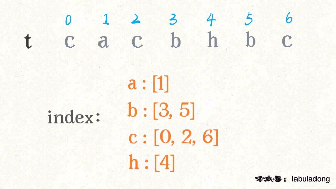

# 分治算法

1、不要思考整体，而是把目光聚焦局部，只看一个运算符。

2、明确递归函数的定义是什么，相信并且利用好函数的定义。


 [241. 为运算表达式设计优先级](https://leetcode-cn.com/problems/different-ways-to-add-parentheses/)

分析：

```java
1 + 2 * 3 - 4 * 5
```

递归：一次递归就可以嵌套一层，所以我们当前只考虑不让括号嵌套的结果

```
(1) + (2 * 3 - 4 * 5)
(1 + 2) * (3 - 4 * 5)
(1 + 2 * 3) - (4 * 5)
(1 + 2 * 3 - 4) * (5)
```

针对：

```java
(1 + 2 * 3) - (4 * 5)
```

【分】

`1 + 2 * 3` 可以有两种加括号的方式，分别是：

```
(1) + (2 * 3) = 7
(1 + 2) * (3) = 9
```

或者我们可以写成这种形式：

```
1 + 2 * 3 = [9, 7]
```

 `4 * 5` 当然只有一种加括号方式，就是 `4 * 5 = [20]`

【治】

通过上述结果推导出 `(1 + 2 * 3) - (4 * 5)` 的加括号方式

```
9 - 20 = -11
7 - 20 = -13
```


函数定义：

```java
定义：计算算式 input 所有可能的运算结果
```


代码：

```java
    //返回当前表达式，只单层嵌套的可能的计算结果
    //增加备忘录进行优化,当前表达式+结果
    HashMap<String,List<Integer>> memo = new HashMap<>();
    public List<Integer> diffWaysToCompute(String expression) {

        if(memo.containsKey(expression)) return memo.get(expression);
        //本次表达式的返回结果
        List<Integer> res = new LinkedList<>();
        for(int i=0;i < expression.length();i++){
            char c = expression.charAt(i);
            //如果是运算符就进行分割
            //分
            if(c=='+' || c=='-' || c=='*'){
                List<Integer> left =  diffWaysToCompute(expression.substring(0,i));
                List<Integer> right =  diffWaysToCompute(expression.substring(i+1,expression.length()));
                //治
                for(int l:left){
                    for(int r:right){
                        if(c=='+') res.add(l+r);
                        else if(c=='-') res.add(l-r);
                        else if(c=='*') res.add(l*r);
                    }
                }
            }
        }

        //base case
        //说明表达式里没有一个运算符了,就是一个数的时候，即为答案
        if(res.isEmpty()){
            res.add(Integer.parseInt(expression));
        }

        memo.put(expression,res);
        return res;
    }
```


# 二分查找判定子序列

 [392. 判断子序列](https://leetcode-cn.com/problems/is-subsequence/)

-   双指针

    ```java
        public boolean isSubsequence(String s, String t) {
            int i=0,j=0;
            while(i < s.length() && j < t.length()){
                if(s.charAt(i)==t.charAt(j)){
                    i++;
                }
                j++;
            }
            return i==s.length();
        }
    ```

    

-   二分

    分思路主要是对 `t` 进行预处理，用一个字典 `index` 将每个字符出现的索引位置按顺序存储下来

    

    按照之前的解法，我们需要 `j` 线性前进扫描字符 “c”，但借助 `index` 中记录的信息，**可以二分搜索 `index[c]` 中比 j 大的那个索引**，在上图的例子中，就是在 `[0,2,6]` 中搜索比 4 大的那个索引。

    如何用二分查找计算那个恰好比 4 大的索引呢？答案是，寻找左侧边界的二分搜索就可以做到。

​		对于搜索**左侧边界**的二分查找，有一个特殊性质：

​		当 `val` 不存在时，得到的索引恰好是比 `val` 大的最小元素索引

```java
    //二分法
    public boolean isSubsequence(String s, String t) {
        int m = s.length(),n = t.length();
        ArrayList<Integer>[] index = new ArrayList[256];
        //对t进行处理
        //按256个序列，将对应字符的索引按顺序依次加入
        for(int i=0;i<n;i++){
            char c = t.charAt(i);
            if(index[c]==null){
                index[c] = new ArrayList<>();
            }
            index[c].add(i);
        }

        //t的指针
        //当 val 不存在时，得到的索引恰好是比 val 大的最小元素索引。
        int j = 0;
        for(int i = 0;i < m;i++){
            char c = s.charAt(i);
            //就没有字符
            if(index[c]==null) return false;
            //pos是index[c]区间中的位置
            int pos = left_bound(index[c],j);
            //二分区间上没有字符c 比如[0,1,3]上找4
            if(pos==index[c].size()) return false;
            //在t中的位置
            j = index[c].get(pos) + 1;
        }

        return true;
    }

    //返回左边tar
    public int left_bound(ArrayList<Integer> arr,int tar){
        int low = 0,high = arr.size();
        int idx = 0;
        while(low < high){
            int mid = low + (high-low)/2;
            if(arr.get(mid) < tar) low = mid + 1;
            else high = mid;
        }
        return low;
    }
```

