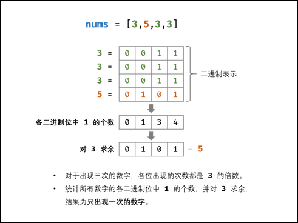

# 基础知识

### 数据类型

1. 基本数据类型大小

   10^5 = 100000

| 类型  | 范围                                     |                         | 字节 |
| ----- | ---------------------------------------- | ----------------------- | ---- |
| byte  | -128~127                                 | -2的7次方到2的7次方-1   | 1    |
| short | -32768~32767                             | -2的15次方到2的15次方-1 | 2    |
| int   | -2147483648~2147483647                   | -2的31次方到2的31次方-1 | 4    |
| long  | -9223372036854774808~9223372036854774807 | -2的63次方到2的63次方-1 | 8    |

3. Integer和int的比较问题
   - 如果Integer类型的两个数相等，如果范围在-128~127（默认），那么用“==”返回true，其余的范围会false，因为会变成地址比较。
   - 两个基本类型int进行相等比较，直接用==即可。
   - 一个基本类型int和一个包装类型Integer比较，用==也可，比较时候，Integer类型做了拆箱操作
   - Integer类型比较大小，要么调用Integer.intValue()转为基本类型用“==”比较，要么直接用equals比较

5. 计算机数字存储：利用补码

   正数的补码是原码自身；

   负数的补码是原码取反+1；（相当于模了）【也可以从右向左第一个1及后面0不变，其他取反】

   -8 表示为：

   原码：10001000 (最高位为符号位)

   补码：11111000

   假设当前时针指向8点，而准确时间是6点，调整时间可有以下两种拨法：一种是倒拨2小时，即8-2=6；另一种是顺拨10小时，8+10=12+6=6，即8-2=8+10=8+12-2(mod 12)．在12为模的系统里，加10和减2效果是一样的，因此凡是减2运算，都可以用加10来代替。

6. 无进位加法：异或

   进位：与运算后左移1（不是进位加法，只是进位）

   计算机中只有加法，所以将负数表述为补码就可以进行加法运算了
   
   

7. 异或运算：无进位相加

   * 0 ∧ N = N，N ∧ N = 0
   * 满足交换律,结合律
   * 同一批数异或结果相同，无论先后


## 大数

1. 大数越界： 随着 n增大, f(n) 会超过 Int32 甚至 Int64 的取值范围，导致最终的返回值错误。

   求余运算规则： 设正整数 x, y, p，求余符号为⊙ ，则有 (x + y) ⊙  p = (x ⊙  p + y ⊙  p) ⊙ p。
   解析： 根据以上规则，可推出 f(n) ⊙  p = [f(n-1)⊙ p + f(n-2)⊙ p] ⊙ p，从而可以在循环过程中每次计算 sum=(a+b)⊙1000000007 ，此操作与最终返回前取余等价

2. 大数：大数的表示应用字符串 String 类型

3. java中可使用BigInteger类来处理大数

   BigInteger不是基本数据类型之一，它其实更像String,是Java里的一个类，然而它的初始化方式却没有String那么方便可以直接赋值，而是跟其他自定义的类一样，要调用它的构造器进行初始化。

   常用方法如下：
   

   ```java
   BigInteger abs()  返回大整数的绝对值
   BigInteger add(BigInteger val) 返回两个大整数的和
   BigInteger and(BigInteger val)  返回两个大整数的按位与的结果
   BigInteger andNot(BigInteger val) 返回两个大整数与非的结果
   BigInteger divide(BigInteger val)  返回两个大整数的商
   double doubleValue()   返回大整数的double类型的值
   float floatValue()   返回大整数的float类型的值
   BigInteger gcd(BigInteger val)  返回大整数的最大公约数
   int intValue() 返回大整数的整型值
   long longValue() 返回大整数的long型值
   BigInteger max(BigInteger val) 返回两个大整数的最大者
   BigInteger min(BigInteger val) 返回两个大整数的最小者
   BigInteger mod(BigInteger val) 用当前大整数对val求模
   BigInteger multiply(BigInteger val) 返回两个大整数的积
   BigInteger negate() 返回当前大整数的相反数
   BigInteger not() 返回当前大整数的非
   BigInteger or(BigInteger val) 返回两个大整数的按位或
   BigInteger pow(int exponent) 返回当前大整数的exponent次方
   BigInteger remainder(BigInteger val) 返回当前大整数除以val的余数
   BigInteger leftShift(int n) 将当前大整数左移n位后返回
   BigInteger rightShift(int n) 将当前大整数右移n位后返回
   BigInteger subtract(BigInteger val)返回两个大整数相减的结果
   byte[] toByteArray(BigInteger val)将大整数转换成二进制反码保存在byte数组中
   String toString() 将当前大整数转换成十进制的字符串形式
   BigInteger xor(BigInteger val) 返回两个大整数的异或
   ```

   

### 位运算


#### 1.  基础运算

1. 与运算

   将这2个数的二进制进行与操作， 只有当2个数对应的位都为1，该位运算结果为1，否则运算结果为0。即：1&1=1；1&0=0；0&0=0

2. 或运算

   将这2个数的二进制进行或操作， 只要2个数对应的位有一个为1，该位运算结果为1，否则运算结果为0。即：1|1=1;1|0=1;0|0=0

3. 取反

   就是将一个整数中位为1的变成0，位为0的变成1。即：~1=0;~0=1

4. 异或

   将这2个数的二进制进行异或操作， 只要2个数对应的位相同，该位运算结果为0，否则运算结果为1。即：1^1=0;1^0=1;0^0=0

5. 左移

   将一个数左移N位相当于将一个数**乘以2^N**

   将一个运算对象的各二进制位全部左移若干位（左边的二进制位丢弃，右边补0

   将12向左移动2位如何计算呢？12的二进制为00001100，那么左移动2位为：00110000

6. 右移

   将一个数右移N位相当于将一个数**除以2^N**

   将一个数的各二进制位全部右移若干位，正数左补0，负数左补1，右边丢弃

   将一个数a向右移动n位记为：a>>n。比如将12向右移动2位如何计算呢？12的二进制为00001100，那么右移动2位为：00000011，即3。 即12>>2为3

7. 无符号右移

   不管正负标志位为0还是1，将该数的二进制码整体右移，左边部分总是以0填充，右边部分舍弃

   -5用二进制表示1111 1011，红色为该数标志位

   -5>>2: 1111 1011-------------->11     1    11110。

   11为标志位

   -5>>>2: 1111 1011-------------->00   1    11110。

   00为补充的0

8. 总结基础运算
   - 按位与&：两位全为1，结果为1
      按位
   - 或|：两位有一个为1，结果为1
      按位
   - 异或^：两位一个为0，一个为1，结果为1
   - 按位取反：0->1，1->0
   - << 左移运算，向左进行移位操作，高位丢弃，低位补 0，如
   ```text
   int a = 8;
   a << 3;
   移位前：0000 0000 0000 0000 0000 0000 0000 1000
   移位后：0000 0000 0000 0000 0000 0000 0100 0000
   ```

   - \>>右移运算，向右进行移位操作，对无符号数，高位补 0，对于有符号数，高位补符号位，如
   ```text
    unsigned int a = 8;
    a >> 3;
    移位前：0000 0000 0000 0000 0000 0000 0000 1000
    移位后：0000 0000 0000 0000 0000 0000 0000 0001
   
    int a = -8;
    a >> 3;
    移位前：1111 1111 1111 1111 1111 1111 1111 1000
    移位前：1111 1111 1111 1111 1111 1111 1111 1111
   ```

   
#### 2. 一些操作

   - 消除最右边的第一个1（与）

     a & (a – 1) 

     

     `n - 1` 一定可以消除最后一个 1，同时把其后的 0 都变成 1，这样再和 `n` 做一次 `&` 运算，就可以仅仅把最后一个 1 变成 0 了。

   - 异或性质

     a^0=a  
     a^a=0

   - 翻转指定位（异或）

     比如将数 X=1010 1110 的低4位进行翻转，只需要另找一个数Y，令Y的低4位为1，其余位为0，即Y=0000 1111，然后将X与Y进行异或运算（X^Y=1010 0001）即可得到。

   - 消除最低位（取反）

     使a的最低位为0，可以表示为：a & ~1。~1的值为 1111 1111 1111 1110，再按"与"运算，最低位一定为0

   - 如果两个不同长度的数据进行位运算时，系统会将二者按右端对齐，然后进行位运算

   - 位运算实现乘除法

     数 a 向右移一位，相当于将 a 除以 2；数 a 向左移一位，相当于将 a 乘以 2

    ```text
      int a = 2;
      a >> 1; ---> 1
      a << 1; ---> 4
    ```

   - 位运算交换（注意a和b不能一样）
   
     位操作交换两数可以不需要第三个临时变量，虽然普通操作也可以做到，但是没有其效率高，最好不要用

    ```text
    //普通操作
    void swap(int &a, int &b) {
      a = a + b;
      b = a - b;
      a = a - b;
    }
       
    //位与操作
    void swap(int &a, int &b) {
      a ^= b;
      b ^= a;
      a ^= b;
    }
    ```

   - 判断奇偶数

```java
  //偶数
   0 == (a & 1)
```
- 交换符号

  交换符号将正数变成负数，负数变成正数

```text
int reversal(int a) {
  return ~a + 1;
}
```

​	整数取反加1，正好变成其对应的负数(补码表示)；负数取反加一，则变为其原码，即正数

   - 位操作求绝对值

   整数的绝对值是其本身，**负数的绝对值正好可以对其进行取反加一求得**，即我们首先判断其符号位（整数右移 31 位得到 0，负数右移 31 位得到 -1,即 0xffffffff），然后根据符号进行相应的操作

    int abs(int a) {
      int i = a >> 31;
      return i == 0 ? a : (~a + 1);
    }

   上面的操作可以进行优化，可以将 i == 0 的条件判断语句去掉。我们都知道符号位 i 只有两种情况，即 i = 0 为正，i = -1 为负。对于任何数与 0 异或都会保持不变，与 -1 即 0xffffffff 进行异或就相当于对此数进行取反,因此可以将上面三目元算符转换为((a^i)-i)，即整数时 a 与 0 异或得到本身，再减去 0，负数时与 0xffffffff 异或将 a 进行取反，然后在加上 1，即减去 i(i =-1) 
	

```text
int abs2(int a) {
  int i = a >> 31;
  return ((a^i) - i);
}
```

- 位操作高低位交换

  给定一个 16 位的无符号整数，将其高 8 位与低 8 位进行交换，求出交换后的值，如：

```text
    34520的二进制表示：
    10000110 11011000
    
    将其高8位与低8位进行交换，得到一个新的二进制数：
    11011000 10000110
    其十进制为55430
```

   从上面移位操作我们可以知道，只要将无符号数 a>>8 即可得到其高 8 位移到低 8 位，高位补 0；将 a<<8 即可将 低 8 位移到高 8 位，低 8 位补 0，然后将 a>>8 和 a<<8 进行或操作既可求得交换后的结果。

```text
  unsigned short a = 34520;
  a = (a >> 8) | (a << 8);
```

-   利用或操作 `|` 和空格将英文字符转换为小写

    ```java
    ('a' | ' ') = 'a'
    ('A' | ' ') = 'a'
    ```

-   利用与操作 `&` 和下划线将英文字符转换为大写

    ```java
    ('b' & '_') = 'B'
    ('B' & '_') = 'B'
    ```

-   利用异或操作 `^` 和空格进行英文字符大小写互换

    ```java
    ('d' ^ ' ') = 'D'
    ('D' ^ ' ') = 'd'
    ```

-   判断两个数是否异号

    ```java
    int x = -1, y = 2;
    boolean f = ((x ^ y) < 0); // true
    
    int x = 3, y = 2;
    boolean f = ((x ^ y) < 0); // false
    ```

    这个技巧还是很实用的，利用的是补码编码的符号位。可能想利用乘积或者商来判断两个数是否异号，但是这种处理方式可能造成溢出，从而出现错误。


 #### 3. 题目（技巧）

- **x & (x - 1) 用于消去x最后一位的1**

  - **用 O(1) 时间检测整数 n 是否是 2 的幂次**

    N如果是2的幂次，则N满足两个条件：

    1.N >0

    2.N的二进制表示中只有一个1

    ```java
    2^0 = 1 = 0b0001
    2^1 = 2 = 0b0010
    2^2 = 4 = 0b0100
    ```

    因为N的二进制表示中只有一个1，所以使用N & (N - 1)将N唯一的一个1消去，应该返回0

    #### [231. 2 的幂](https://leetcode-cn.com/problems/power-of-two/)

    如果存在一个整数 `x` 使得 `n == 2x` ，则认为 `n` 是 2 的幂次方。

    ```java
        public boolean isPowerOfTwo(int n) {
            if(n<=0) return false;
            
            int res = n & (n-1);
            return res==0?true:false;
        }
    ```

    

    

  - **计算在一个 32 位的整数的二进制表式,有多少个1**

    不断使用 x & (x - 1) 消去x最后一位的1，计算总共消去了多少次即可

    #### [191. 位1的个数](https://leetcode-cn.com/problems/number-of-1-bits/)

    ```java
        // you need to treat n as an unsigned value
        public int hammingWeight(int n) {
            int count = 0;
            while(n!=0){
                n = n&(n-1);
                count++;
            }
    
            return count;
        }
    ```

    

  - **如果要将整数A转换为B，需要改变多少个bit位**

    将A和B进行异或，相同位为1，不同位为0，则转成了上题

- **使用二进制进行子集枚举**

  - **给定一个含不同整数的集合，返回其所有的子集**

    思路就是使用一个正整数二进制表示的第i位是1还是0，代表集合的第i个数取或者不取

    所以从0到2^n-1总共2^n个整数，正好对应集合的2^n个子集

    ```text
    S = {1,2,3}
    N bit Combination
    0 000 {}
    1 001 {1}
    2 010 {2}
    3 011 {1,2}
    4 100 {3}
    5 101 {1,3}
    6 110 {2,3}
    7 111 {1,2,3}
    ```

- a ^ b ^ b = a

  a^0=a 
  a^a=0

  - **只有一个数出现一次，剩下都出现两次，找出出现一次的数**

    因为只有一个数恰好出现一个，剩下的都出现过两次，所以只要将所有的数异或起来，就可以得到唯一的那个数

    #### [136. 只出现一次的数字](https://leetcode-cn.com/problems/single-number/)

    ```java
        public int singleNumber(int[] nums) {
            int res = 0;
            for(int num:nums){
                res = num ^ res;
            }
            return res;
        }
    ```

  -   [268. 丢失的数字](https://leetcode-cn.com/problems/missing-number/)

      为了容易理解，我们假设先把索引补一位，然后让每个元素和自己相等的索引相对应：

      

      ```java
          public int missingNumber(int[] nums) {
              int res = 0;
              res = res ^nums.length;
              for(int i = 0;i < nums.length;i++){
                  res = i^nums[i]^res;
              }
              return res;
          }
      ```

      

  - **只有一个数出现一次，剩下都出现三次，找出出现一次的**

       方法一：状态机

       方法二：循环（计算模3结果，或等在一起）

       

       ```java
           public int singleNumber(int[] nums) {
               int[] count = new int[32];
               //统计好每一位为1的数量
               for(int num:nums){
                   for(int i =0;i<32;i++){
                       count[i] += num & 1;
                       num = num >>> 1;
                   }
               }
               // System.out.println("count:" + Arrays.toString(count));
               int res = 0;
               for(int i=0;i < 32;i++){
                   res <<= 1;
                   // System.out.print("31-i:" + (31-i));
                   // System.out.print("  count[31-i]:" + count[31-i]);
                   res = res | count[31-i]%3;
                   // System.out.print("    res1:" + res);
                   // res <<= 1;
                   // System.out.print("    res2:" + res);
                   // System.out.println();
               }
       
               //不可以写成这样，因为当i= 31时，已经不能往右移了，但还是往右移了，已经越界了，再左移没用了,所以得写到前面
               //return res>>=1
               return res;
           }
       ```

       

  

  - **只有两个数出现一次，剩下都出现两次，找出出现一次的**

       因为a!=b!=0，所以a和b必然至少有一位不一样，不妨设最右边的1不一样，按此规则进行分组，分别异或，由于其他数出现两次，就会被异或掉，分别只剩下a和b

- 异或表示无进位加法，加法可表示为无进位加法+进位

  - 不用加减乘除做加法

    无进位加法：异或  a

    进位：与运算后左移1  b

    （和 s ）=（非进位和 n ），（进位 c）
    
    当c ==0，返回n
    
    
    
    


### 二叉树

- 满二叉树

  一棵深度为k，且有2^k-1个节点的树是满二叉树。

  1)        如果一颗树深度为h，最大层数为k，且深度与最大层数相同，即k=h;

  2)        它的叶子数是： 2^(h-1)   N+1/2;（N为节点个数）

  3)        第k层的结点数是： 2^(k-1)

  4)        总结点数是： 2^k-1 (2的k次方减一)

  5)        总节点数一定是奇数。

  6)        树高：h=log2(n+1)。

- 完全二叉树

  若设二叉树的深度为h，除第 h 层外，其它各层 (1～h-1) 的结点数都达到最大个数，第h 层所有的结点都连续集中在最左边，这就是完全二叉树。

  1)    深度为k的完全二叉树，至少有2^(k-1)个节点，至多有2^k-1个节点。

  2)    树高h=log2n + 1。

  