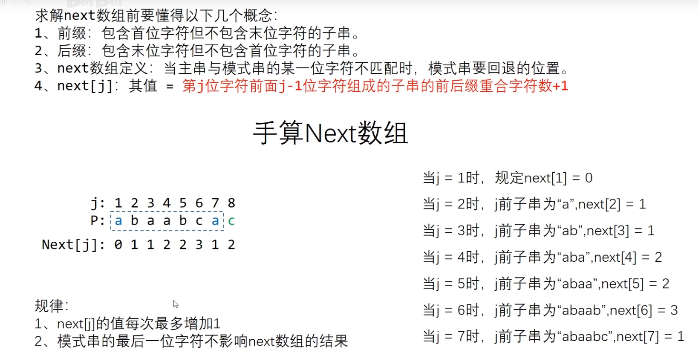
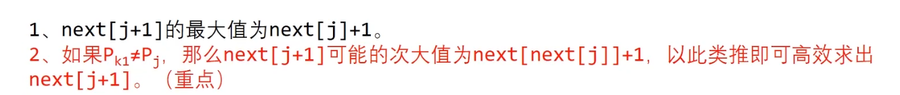
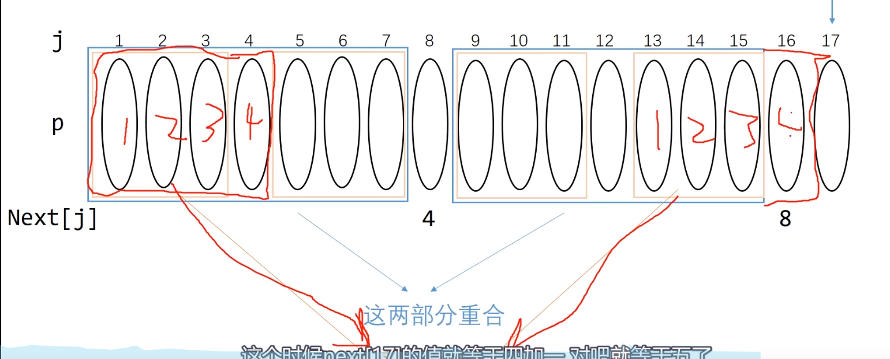
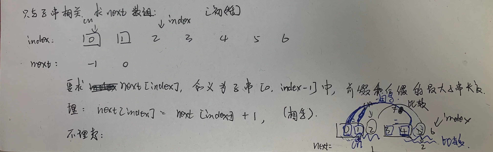
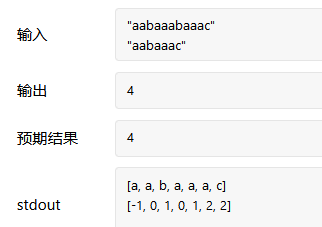
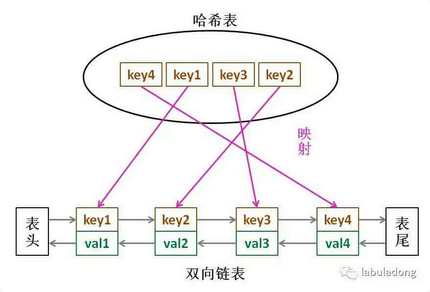
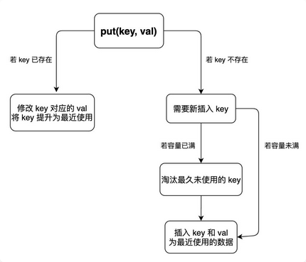
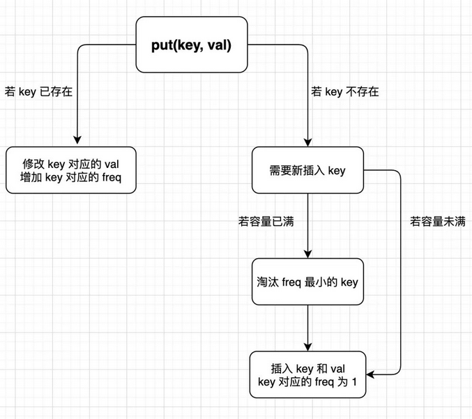
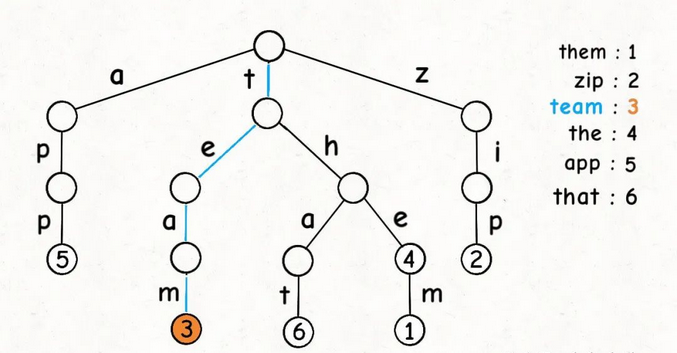

# 算法与数据结构

## KMP

求子串在父串的位置。

### 暴力解法(O(M*N))

```java
    public int strStr(String haystack, String needle) {
        if(needle.isEmpty()) return 0;
        int len1 = haystack.length(),len2 = needle.length();
        char[] h= haystack.toCharArray(), n = needle.toCharArray();

        //开始循环
        for(int i = 0;i <= len1-len2;i++){
            int a = i, b =0;
            while(b < len2 && h[a]==n[b]){
                a++;
                b++;
            }
            if(b==len2) return i;
        }
        return -1;
    }
```


### KMP逻辑理解

根据**str2（子串）**，求最长前缀和后缀的相等的最大长度next 

- 例子：

  abbabbk

  处于k时，在k之前的前缀和后缀，不能取到整体

  | 缀数 |  1   | 2    | 3       | 4    | 5     |
  | ---- | :--: | ---- | ------- | ---- | ----- |
  | 前缀 |  a   | ab   | **abb** | abba | abbab |
  | 后缀 |  b   | bb   | **abb** | babb | bbabb |

  所以k的答案是3

  0位置规定为-1,1位置因为不能取整体是0

- KMP整体算法逻辑

  

  证明蓝色字的第二点：

  

  整体走一个例子：

  

  

  时间复杂度分析：

  

- 如何求next数组

  

  时间复杂度及代码细节：

  

- 逻辑

  因为 KMP 利用**已匹配部分**中**相同的「前缀」和「后缀」**来加速下一次的匹配。
  
  因为 KMP 的**原串指针不会进行回溯**（没有朴素匹配中回到下一个「发起点」的过程）。
  
  对于匹配串的任意一个位置而言，由该位置发起的下一个匹配点位置其实与原串无关。
  
- 代码

  next[y]表示，pmt[y-1]，PMT表示字符串的前缀集合和后缀集合的交集中最长元素的长度
  
  ```java
      public int strStr(String haystack, String needle) {
          if(needle.isEmpty()) return 0;
  
          if (haystack == null ||  needle.length() < 1 || haystack.length() < needle.length()) {
              return -1;
          }
          
  
          char[] h = haystack.toCharArray(); //母串
          char[] n = needle.toCharArray(); //子串
  
          int x = 0; //母串下标
          int y = 0; //子串下标
          
          //O(N)
          int[] next = getNext(n);
          while(x < h.length && y < n.length){
              if(h[x] == n[y]){
                  x++;
                  y++;
              }else if(next[y]==-1){  //y = 0;
                  x++; 
              }else{
                  y = next[y];
              }
          }
  
          return y==n.length? x-y : -1;
  
      }
  
      //只和子串有关
      public int[] getNext(char[] n){
          if(n.length==1) return new int[]{-1};
  
          int[] next = new int[n.length];
          next[0] = -1;
          next[1] = 0;
          int index = 2;
          int cn = 0;  //当前需要比较的位置，同时也是值
          while(index < n.length){
              if(n[index-1] == n[cn]){   //注意此处是index-1,因为前一个就不包含他本身
                  next[index++] = ++cn;  //此处是++cn
              }else if(cn > 0){  //为什么没有等  cn=0的时候是-1
                  cn = next[cn];
              }else{
                  next[index++] = 0;  //没有前后缀是0
              }
          }
          
          return next;
      }
  ```

-   更好的KMP算法

    参考：https://www.zhihu.com/question/21923021/answer/281346746

    ```java
        // N   O(N)
        public int strStr(String haystack, String needle) {
            if(needle.isEmpty()) return 0;
            
            if(haystack==null || needle.length() < 1 || haystack.length() < needle.length()) return -1;
    
            char[] h = haystack.toCharArray();
            char[] n = needle.toCharArray();
    
            //获取next数组
            int[] next = getNext(n); //next[i]  match中i之前的字符串match[0..i-1]
            int x = 0; //母串位置
            int y = 0; //子串位置
            //kmp算法
            while( x < h.length && y < n.length){
                if(h[x]==n[y]){ //如果相等，则都往后移
                    x++;
                    y++;
                }else if (next[y]==-1){ //也就是y==0了，回退得不能再回退了，则在母串中换个位置重新匹配
                    x++;
                }else{
                    y = next[y]; //不相等，子串位置回退到最大前缀的下一个
                }
            }
            //子串到头就匹配上了，初始匹配位是x-y
            //母串到头没有匹配上，说明没子串
            return y==n.length? x-y:-1;
        }
    
    
        //子串为主字符串，以子串的前缀为目标字符串
        // M   O(M)
        //只跟子串有关
        public int[] getNext(char[] n){
            if (n.length==1) return new int[]{-1};
    
            int[] next = new int[n.length];
    
            next[0] = -1; //人为规定
            next[1] = 0;
            int x = 1, y = 0; 
            while(x < n.length){
                if(y==-1 || n[x]==n[y]){ //y = next[y];
                    x++;
                    y++;
                    if(x < n.length)
                        next[x] = y;
                }
                else{
                    y = next[y];
                }
            }
    
            return next;
        }
    ```


-   如何求next数组

    注意前缀和后缀的比较是否相等的意思不是说回文的意思！！！！！，都是从左往右进行比较，这样就懂了！
    
    比如abaab，的最长子串是ab，而并不是回文的0
    
    



​	




```java
    public int strStr(String haystack, String needle) {
        if(needle.isEmpty()) return 0;

        if (haystack == null ||  needle.length() < 1 || haystack.length() < needle.length()) {
            return -1;
        }
        

        char[] h = haystack.toCharArray(); //母串
        char[] n = needle.toCharArray(); //子串

        int x = 0; //母串下标
        int y = 0; //子串下标
        
        //O(N)
        int[] next = getNext(n);
        while(x < h.length && y < n.length){
            if(h[x] == n[y]){
                x++;
                y++;
            }else if(next[y]==-1){  //y = 0;
                x++; 
            }else{
                y = next[y];
            }
        }

        return y==n.length? x-y : -1;

    }

    //只和子串有关
    public int[] getNext(char[] n){
        if(n.length==1) return new int[]{-1};

        int[] next = new int[n.length];
        next[0] = -1;
        next[1] = 0;
        int index = 2;
        int cn = 0;  //当前需要比较的位置，同时也是值,
        //cn = num,cn是当前要比较的数，也就意味着[0,cn-1]中，有num个数(前缀)，和[0,idx-1]的后缀是相同的,
        //所以是++cn;
        while(index < n.length){
            if(n[index-1] == n[cn]){   //注意此处是index-1,因为前一个就不包含他本身
                //这句话一定死记硬背住
                //不可以这样写,记住就好了！！！！！
                // next[idx++] = next[idx-1] + 1;
                // cn++;
                next[index++] = ++cn;  //此处是++cn
            }else if(cn > 0){  //为什么没有等  cn=0的时候是-1
                cn = next[cn];
            }else{
                next[index++] = 0;  //没有前后缀是0
            }
        }
        
        return next;
    }
```



## BFS模板

- 不用记录level

  ```java
  while queue 不空：
      cur = queue.pop()
      for 节点 in cur的所有相邻节点：
          if 该节点有效且未访问过：
              queue.push(该节点)
  ```

- 记录level

  这里增加了 level 表示当前遍历到二叉树中的哪一层了，也可以理解为在一个图中，现在已经走了多少步了

  ```java
  level = 0
  while queue 不空：
      size = queue.size()
      while (size --) {
          cur = queue.pop()
          for 节点 in cur的所有相邻节点：
              if 该节点有效且未被访问过：
                  queue.push(该节点)
      }
      level ++;
  ```

- 多源bfs(graph) 和单源（tree）

  对于 「Tree 的 BFS」 （典型的「单源 BFS」） 大家都已经轻车熟路了：

      首先把 root 节点入队，再一层一层无脑遍历就行了。

  对于 「图 的 BFS」 （「多源 BFS」） 做法其实也是一样，与 「Tree 的 BFS」的区别注意以下两条

      Tree 只有 1 个 root，而图可以有多个源点，所以首先需要把多个源点都入队；
      Tree 是有向的因此不需要标识是否访问过，而对于无向图来说，必须得标志是否访问过哦！并且为了防止某个节点多次入队，需要在其入队之前就将其设置成已访问


# 数据结构

## LRU

**按照使用时间定义策略**

LRU 算法就是一种缓存淘汰策略,LRU 的全称是 Least Recently Used，也就是说我们认为**最近使用过的数据应该是是「有用的」**，很久都没用过的数据应该是无用的，内存满了就优先删那些很久没用过的数据。

LRU 缓存算法的核心数据结构就是哈希链表，双向链表和哈希表的结合体。哈希表查找快，但是数据无固定顺序；链表有顺序之分，插入删除快，但是查找慢。



1、如果我们每次默认从链表尾部添加元素，那么显然越靠尾部的元素就是最近使用的，越靠头部的元素就是最久未使用的。

2、对于某一个 `key`，我们可以通过哈希表快速定位到链表中的节点，从而取得对应 `val`。

3、链表显然是支持在任意位置快速插入和删除的，改改指针就行。只不过传统的链表无法按照索引快速访问某一个位置的元素，而这里借助哈希表，可以通过 `key` 快速映射到任意一个链表节点，然后进行插入和删除。



```java
class LRUCache {
    int cap;
    //Cache缓存结构：双向哈希链表
    LinkedHashMap<Integer,Integer> cache = new LinkedHashMap<>();
    
    //构造函数
    public LRUCache(int capacity) {
        this.cap = capacity;
    }
    
    //获取元素
    public int get(int key) {
        //如果不存在
        if(!cache.containsKey(key)){
            return -1;
        }

        //如果存在则返回，并设为最近使用
        makeRecently(key);
        return cache.get(key);
    }
    
    //插入元素
    public void put(int key, int value) {
        if(cache.containsKey(key)){
            //修改值
            cache.put(key,value);
            //设置为最近使用
            makeRecently(key);
            return;
        }

        //容量够
        if(cache.size() < this.cap){
            cache.put(key,value);
        }else{
            //容量不够则先删除
            //找链表的头部
            int oldestKey = cache.keySet().iterator().next();
            cache.remove(oldestKey);
            cache.put(key,value);
        }

    }


    //将key提升为最近使用
    private void makeRecently(int key){
        int val = cache.get(key);
        cache.remove(key);
        cache.put(key,val);
    }

}
```


## LFU

**按使用频率定义策略**

LFU 算法是淘汰访问频次最低的数据，如果访问频次最低的数据有多条，需要淘汰最旧的数据。

**操作解析**

`get(key)` 方法会去缓存中查询键 `key`，如果 `key` 存在，则返回 `key` 对应的 `val`，否则返回 -1。

`put(key, value)` 方法插入或修改缓存。如果 `key` 已存在，则将它对应的值改为 `val`；如果 `key` 不存在，则插入键值对 `(key, val)`。

当缓存达到容量 `capacity` 时，则应该在插入新的键值对之前，删除使用频次（后文用 `freq` 表示）最低的键值对。如果 `freq` 最低的键值对有多个，则删除其中最旧的那个。

put操作



```java
class LFUCache {
    //注意所有变量的同步

    //key 和 value的映射
    HashMap<Integer,Integer> KV;
    //快速操作Key对应的fre，+-
    HashMap<Integer,Integer> KF;
    //需要快速查找到fre最小的，且内部有序的元素
    HashMap<Integer,LinkedHashSet<Integer>> FKs; 
    //记录最小的fre
    int minFreq;
    //容量
    int cap;

    public LFUCache(int capacity) {
        
        KV = new HashMap<>();
        KF = new HashMap<>();
        FKs = new HashMap<>();

        this.cap = capacity;
        this.minFreq = 0;

    }
    

    public int get(int key) {
        if(!KV.containsKey(key)){
            return -1;
        }
        //存在
        increaseFreq(key);
        return KV.get(key);
    }
    
    public void put(int key, int value) {
        if(this.cap<=0) return;
        
        //包含则更新
        if(KV.containsKey(key)){
            KV.put(key,value);
            increaseFreq(key);
            return;
        }

        //不包含则添加
        //容量不够，删除缓存
        if( KV.size() >= this.cap ){
            removeMinFreqKey(key);
        }

        //添加
        KV.put(key,value);
        KF.put(key,1);
        //插入FK
        FKs.putIfAbsent(1,new LinkedHashSet<>());
        FKs.get(1).add(key);
        this.minFreq = 1;
    }

    // 增加 key 对应的 freq,已存在的key
    private void increaseFreq(int key){
        int freq = KF.get(key);
        KF.put(key,freq + 1);
        // 将 key 从 freq 对应的列表中删除
        FKs.get(freq).remove(key);
        //添加
        FKs.putIfAbsent(freq + 1, new LinkedHashSet<>());
        FKs.get(freq + 1).add(key);
        //如果freq对应的列表空了，移除这个freq，上面只是移除了元素
        if(FKs.get(freq).isEmpty()){
            FKs.remove(freq);
            //更新minFreq,只有列表完全空了，才说明是所有minFreq都不存在了
            if(freq == this.minFreq){
                this.minFreq++;
            }
        }
        
    }

    // 删除元素
    private void removeMinFreqKey(int key){
        LinkedHashSet<Integer> keyList = FKs.get(this.minFreq);
        int deleteKey = keyList.iterator().next();
        keyList.remove(deleteKey);

        if(keyList.isEmpty()){
            FKs.remove(this.minFreq);
            //此处不用更新minFreq，因为删除缓存必伴随新元素的添加，则minFreq必为1
        }

        KV.remove(deleteKey);
        KF.remove(deleteKey);
    }
}
```


## 前缀树Tire

**`TrieNode`节点本身只存储`val`字段，并没有一个字段来存储字符，字符是通过子节点在父节点的`children`数组中的索引确定的**。

**Trie 树用「树枝」存储字符串（键），用「节点」存储字符串（键）对应的数据（值）。所以我在图中把字符标在树枝，键对应的值`val`标在节点上**



 [208. 实现 Trie (前缀树)](https://leetcode-cn.com/problems/implement-trie-prefix-tree/)

```java
class Trie {
    private class Node{
        int pass;
        int end;
        Node[] nexts; 

        Node(){
            pass = 0;
            end = 0;
            nexts = new Node[26];
        }
    }

    Node root;

    public Trie() {
        root = new Node();    
    }
    
    public void insert(String word) {
        if(word==null) return;

        char[] str = word.toCharArray();
        Node node = root;
        node.pass++;

        for(int i = 0;i < str.length;i++){
            int index = str[i]-'a';
            if(node.nexts[index] == null){
                node.nexts[index] = new Node();
            }
            node = node.nexts[index];
            node.pass++;
        }
        node.end++;
    }
    
    public boolean search(String word) {
        if(word==null) return true;

        char[] str = word.toCharArray();
        Node node = root;
        for(int i = 0;i < str.length;i++){
            int index = str[i]-'a';
            if(node.nexts[index]==null){
                return false;
            }
            node = node.nexts[index];
        }
        return node.end > 0? true:false;
    }
    
    public boolean startsWith(String prefix) {
        if(prefix==null) return true;

        char[] str = prefix.toCharArray();
        Node node = root;
        for(int i = 0;i < str.length;i++){
            int index = str[i]-'a';
            if(node.nexts[index]==null){
                return false;
            }
            node = node.nexts[index];
        }
        return true;
    }
}
```


## 并查集

```java
class UF{
    HashMap<Integer,Integer> father;

    UF(){
        father = new HashMap<>();
    }

    void add(int x){
        if(father.containsKey(x))
            father.put(x,null);
    }

    void merger(int x,int y){
        int r1 = find(x);
        int r2 = find(y);

        if(r1!=r2){
            father.put(r1,r2);
        }
    }

    int find(int x){
        int root = x;
        while(father.get(root)!=null){
            root = father.get(root);
        }

        while(father.get(x)!=null){
            int tmp = father.get(x);
            father.put(x,root);
            x = tmp;
        }

        return root;
    }

    boolean isConnected(int x,int y){
        int r1 = find(x);
        int r2 = find(y);

        return r1==r2;
    }

}
```

